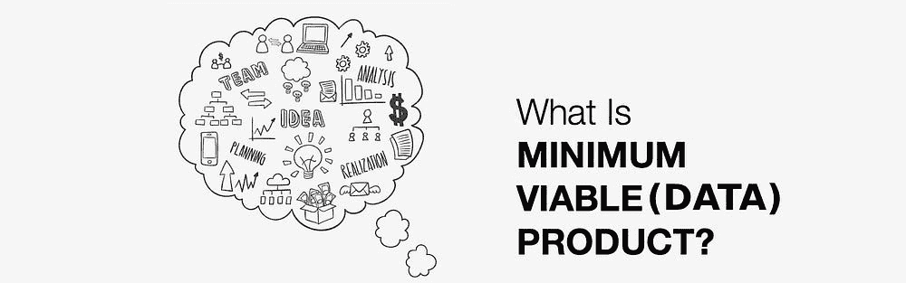
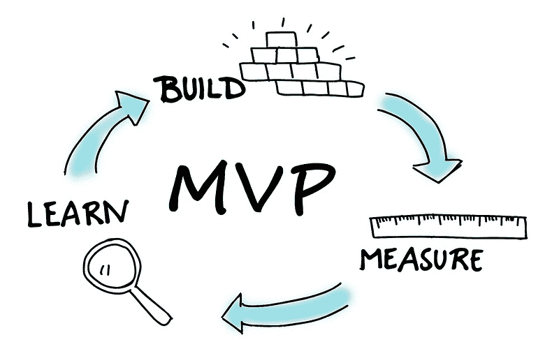
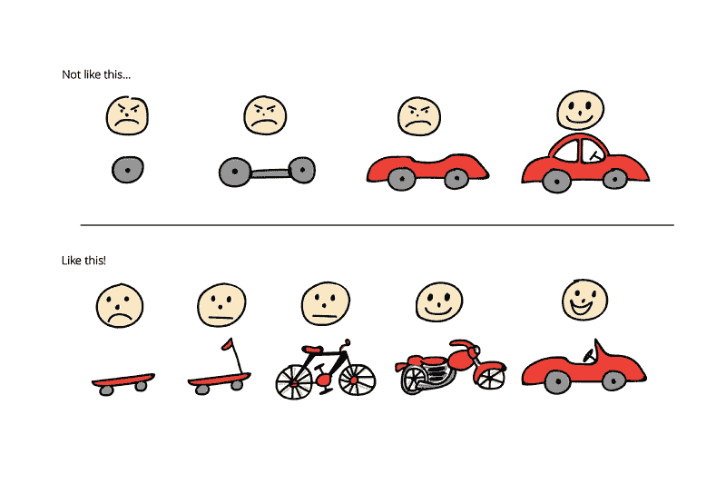
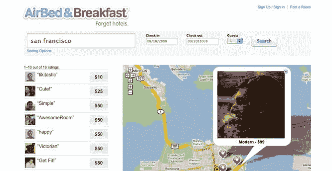
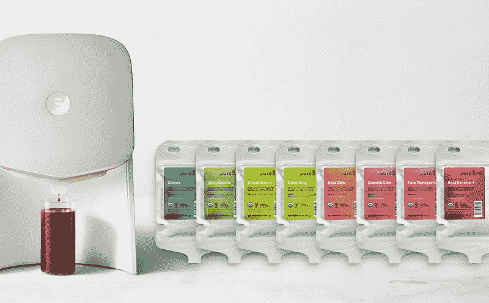
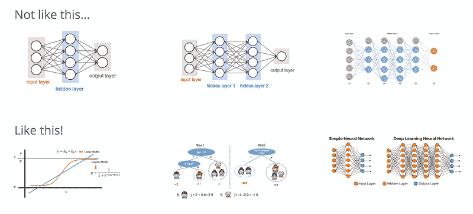
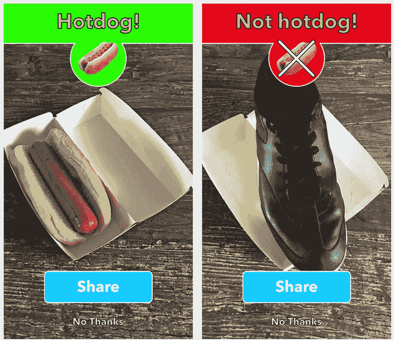
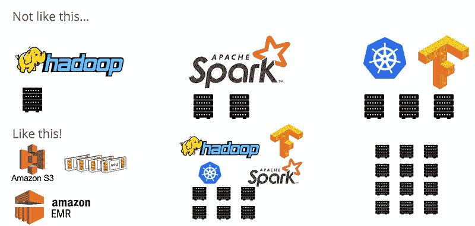
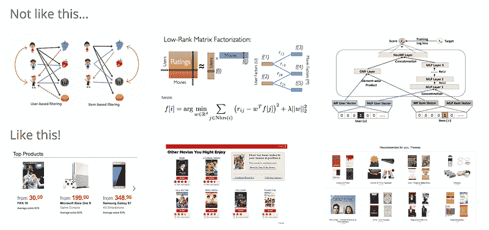
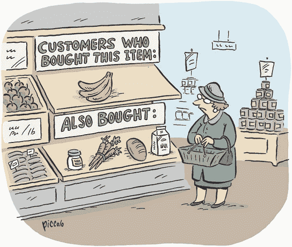

# 什么是最小可行（数据）产品？

> 原文：[`www.kdnuggets.com/2018/07/minimum-viable-data-product.html`](https://www.kdnuggets.com/2018/07/minimum-viable-data-product.html)

 评论

**由 [Dat Tran](https://twitter.com/datitran), Idealo**。

几个月前，我离开了 Pivotal，加入了 [idealo.de](https://www.idealo.de/)（欧洲领先的价格比较网站之一，也是德国电子商务市场最大的门户之一），帮助他们将机器学习（ML）整合到他们的产品中。除了像建立数据科学团队、搭建基础设施和处理许多行政事务这样的常规任务，我还需要定义 ML 驱动的产品路线图。与此相关的是为机器学习产品定义一个最小可行产品（MVP）。然而，我在 idealo 工作时以及在 Pivotal 时常常面临的问题是，究竟什么才是一个好的 MVP？在这篇文章中，我将深入探讨一个优秀的机器学习产品 MVP 的不同维度，并分享我迄今为止获得的经验。

### 什么是 MVP？

在 Pivotal Labs，我接触到了由 [Eric Ries](https://medium.com/@ericries) 推广的精益创业思维。精益创业本质上是当前产品开发的最前沿方法论。其核心理念是通过不断整合客户反馈迭代地构建产品或服务，从而降低产品/服务失败的风险（build-measure-learn）。

构建-测量-学习概念的一个重要组成部分是 MVP，它本质上是“一种新产品的版本，允许团队以最少的努力收集关于客户的最大量的验证学习”。一个众所周知的例子是验证移动性是否会成功（见下图）。

我们基本上从最小的努力开始测试想法。在这种情况下，我们只需用两个轮子和一个板子。然后我们将它推向市场，通过反馈不断改进我们的产品，逐渐增加更多复杂性。最终，我们得到了一个整合了消费者反馈的汽车。一个著名的例子是 Airbnb。2007 年，布赖恩·切斯基（Brian Chesky）和乔·盖比亚（Joe Gebbia）想要创业，但也负担不起旧金山的租金。与此同时，一个设计会议将要在他们的城市举办。他们决定将自己的地方租给找不到附近酒店的会议参与者。他们所做的是拍摄他们公寓的照片，将其在线发布在一个简单的网站上（见下图），很快他们就有了三个支付住宿费的客人。这次小测试给了他们宝贵的见解，让他们知道人们愿意付费住在别人家里而不是酒店，而且不仅仅是最近的大学毕业生愿意报名。之后他们创办了 Airbnb，后来的故事大家都知道了（如果你想阅读更多成功的 MVP 故事，请查看这个[链接](https://speckyboy.com/successful-minimum-viable-products/)）。

相对而言，另一种方法是从轮子到车架逐步构建汽车，而不进行一次发货。然而，这种方法成本非常高。最终，我们可能会推出一个客户不需要的产品。例如，以 Juicero 为例。他们从投资者那里筹集了 1.2 亿美元，用于创建一个设计精良的榨汁机，并在经过一段时间的开发后以非常高的价格发布（最初定价为$699，随后降至$399）。除了机器，你还可以购买价格为$5-$7 的装满原料水果和蔬菜的果汁包。也许你们中的一些人知道，这家公司已经关闭，因为他们没有意识到并不需要一个高价的榨汁机来挤出果汁包。他们没有真正理解客户。一次简单的用户研究会让他们意识到，挤出果汁包并不需要昂贵的机器，两只健康的手就足够了。

### **MVP 概念如何与机器学习产品相关？**

MVP 概念也可以应用于机器学习，因为最终机器学习也是整体产品或最终产品的一部分。在这方面，我认为有三个重要维度：

1.  **最小可行模型**

机器学习产品的重要部分是建模本身。假设我们有一个分类问题，我们希望将一些数据分类到预定义的类别中，比如[热狗与非热狗](https://medium.com/@timanglade/how-hbos-silicon-valley-built-not-hotdog-with-mobile-tensorflow-keras-react-native-ef03260747f3)！

解决这个分类问题的一个可能方法是使用一个具有隐藏层的神经网络。接下来，我们将训练和评估模型。然后根据结果，我们可能希望继续改进模型。接着我们会添加另一个隐藏层，然后再进行相同的建模操作。根据结果，我们可能会添加更多的隐藏层。这种方法比较直接，实际上是解决热狗与非热狗问题的最佳方案，因为不需要特征工程（我们可以直接使用原始图像作为输入数据）。然而，对于大多数分类问题，除非它们是像计算机视觉或自然语言理解中那样的专业问题，否则这并不是解决此类问题的最佳方法。深度学习的主要缺点通常是其可解释性。根据你使用的网络类型，通常很难解释神经网络的结果。此外，你可能花费大量时间来调整神经网络的参数，而模型性能的提升往往微乎其微。

### **从简单开始，建立基准…**

对于大多数分类问题，更合理的方法是从像逻辑回归这样的线性模型开始。虽然在许多实际应用中，线性假设是不现实的，但逻辑回归表现得相当不错，并且作为一个好的基准模型也很有用。它的主要优点还包括可解释性，并且你可以免费获得条件概率，这在许多情况下非常方便。

然后，为了改进模型并放宽线性假设，你可以使用基于树的模型。在这种情况下，有两大类方法：袋装和提升。在内部，两者都使用决策树，但训练方式不同。最后，当所有选项都用尽且你希望继续改进模型时，我们可以利用深度学习技术。

1.  **最低可行平台**

在我在 Pivotal Labs 工作期间，我参与了很多项目，帮助财富 500 强公司启动他们的数据之旅。他们共有的一个特点是，很多这些项目都开始于对基础设施的巨大投资。他们花费大量资金购买大数据平台，即所谓的“数据湖”。然后在购买之后，他们开始将数据加载到数据湖中，却没有考虑潜在的使用案例。之后，他们听说了 Apache Spark，并将其添加到这一层中。现在，由于人工智能成为了下一个热门领域，他们也开始购买 GPU，并在其上部署深度学习框架，如 TensorFlow。拥有所有（酷）工具在一个地方听起来不错，对吧？然而，最大的问题是，在将所有数据放入数据湖后，这些数据往往不适合特定的使用案例。他们要么没有收集到正确的数据，要么数据本身并不存在，无法支持潜在的使用案例。

### **利用云计算来启动你的“数据”计划……**

更合理的方法是首先解决问题，而不是考虑硬件/软件。通过这种方法，他们可以尽早了解到解决问题所需的数据，并且能够对数据错误进行补救。此外，我见过的很多机器学习问题仍然可以在本地机器上现实地解决。他们并不一定需要对基础设施进行如此巨大的投资。如果数据确实很大，他们可以使用 AWS 或 Google Cloud 等云服务提供商，这样可以很容易地启动 Spark 集群。如果他们遇到深度学习问题，也有很多选项。他们可以使用已经提到的云服务提供商，或者像 [FloydHub](https://www.floydhub.com/) 这样的服务，它为云上的深度学习模型训练和部署提供了平台即服务（PaaS）。

1.  **最小可行（数据）产品**

我想讨论的最后一点是数据产品本身。基本上，数据产品有很多例子，例如聊天机器人、垃圾邮件检测器等——这个列表很长（查看 [Neal Lathia](https://medium.com/@neal_lathia)的精彩文章，了解更多机器学习产品的例子）。但在这种情况下，我将专注于推荐服务，因为我现在在电子商务领域工作。

启动推荐服务的一种方式是使用简单的相似度算法，然后继续使用矩阵分解技术。最后，我们也可以尝试更复杂的模型，如深度学习方法（例如，深度结构语义模型）。然而，这种方法并不真正推荐。推荐可以有多种形式。例如，你朋友给出的推荐也是推荐，或者最受欢迎的前 100 个产品也是推荐。并不是所有我们使用的复杂算法都会带来成功，但必须进行测试。事实上，不要害怕在没有机器学习的情况下启动你的推荐服务。

### **做正确的事情…**

所以正确的方法是首先建立 A/B 测试框架和评估指标（例如，跳出率或点击率），然后从简单的方法开始，如顶级产品。然后，在测试用户是否真的倾向于点击这些推荐（有时他们需要先适应，尤其是如果这是一个新产品功能），以及最终可能也会购买这些推荐的商品之后，我们可以尝试更复杂的方法，如协同过滤技术。例如，我们可以基于购买了此项商品的用户也对那些商品感兴趣，或查看了此项商品的用户也对那些商品感兴趣来创建推荐。对于“用户谁…此商品也对那些商品感兴趣”的选项，种类繁多。

**总结**

在本文中，我表达了我对机器学习产品中 MVP 的个人观点。本质上，这就是从小做起，然后迭代。此外，为了更清晰地理解我所说的机器学习产品 MVP，我讨论了我认为对好的 MVP 数据产品至关重要的三个主要维度：

+   最小可行模型，

+   最小可行平台，

+   和最小可行（数据）产品。

希望在你下一个机器学习项目中，你也能记住这三个维度。如果你觉得这篇文章有用，请与朋友分享。关注我在 Medium 上的账号（[Dat Tran](https://medium.com/@datitran)）或在 Twitter 上的账号（[@datitran](https://twitter.com/datitran)），以便了解我的最新工作。感谢阅读！

[原文](https://medium.com/idealo-tech-blog/what-is-minimum-viable-data-product-49269e338d85)。已获授权转载。

**相关：**

+   [来自 Airbnb 房源数据挖掘的见解](https://www.kdnuggets.com/2017/08/insights-data-mining-airbnb.html)

+   [新手和初级数据科学家的建议](https://www.kdnuggets.com/2017/11/chang-advice-new-junior-data-scientists.html)

+   [数据湖的意义](https://www.kdnuggets.com/2018/06/why-data-lake-matters.html)

* * *

## 我们的三大课程推荐

 1\. [谷歌网络安全证书](https://www.kdnuggets.com/google-cybersecurity) - 快速进入网络安全职业生涯。

 2\. [谷歌数据分析专业证书](https://www.kdnuggets.com/google-data-analytics) - 提升您的数据分析能力

 3\. [谷歌 IT 支持专业证书](https://www.kdnuggets.com/google-itsupport) - 支持您组织的 IT

* * *

### 更多相关话题

+   [数据科学基础：您需要了解的 10 个必备技能…](https://www.kdnuggets.com/2020/10/data-science-minimum-10-essential-skills.html)

+   [扩展您的网络数据驱动产品时应了解的事项](https://www.kdnuggets.com/2023/08/things-know-scaling-web-datadriven-product.html)

+   [介绍 Objectiv：开源产品分析基础设施](https://www.kdnuggets.com/2022/06/objectiv-introducing-objectiv-opensource-product-analytics-infrastructure.html)

+   [数据科学职位标题导航：数据分析师 vs. 数据科学家…](https://www.kdnuggets.com/navigating-data-science-job-titles-data-analyst-vs-data-scientist-vs-data-engineer)

+   [数据科学家、数据工程师及其他数据职业解析](https://www.kdnuggets.com/2021/05/data-scientist-data-engineer-data-careers-explained.html)

+   [数据科学家 vs 数据分析师 vs 数据工程师](https://www.kdnuggets.com/2022/01/data-scientist-data-analyst-data-engineer.html)
