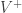

# 使用 Python 矿掘 Twitter 数据 第六部分：情感分析基础

> 原文：[`www.kdnuggets.com/2016/07/mining-twitter-data-python-part-6.html`](https://www.kdnuggets.com/2016/07/mining-twitter-data-python-part-6.html)

**作者：Marco Bonzanini，独立数据科学顾问。**

[情感分析](https://www.kdnuggets.com/2018/08/emotion-sentiment-analysis-practitioners-guide-nlp-5.html) 是文本分析的一个有趣应用。虽然这个术语通常与 [文档情感分类](https://marcobonzanini.com/2015/01/19/sentiment-analysis-with-python-and-scikit-learn/) 相关联，但广义上讲，它指的是将文本分析方法应用于识别和提取文本源中主观材料的一系列问题。

* * *

## 我们的三大课程推荐

 1\. [谷歌网络安全证书](https://www.kdnuggets.com/google-cybersecurity) - 快速进入网络安全职业。

 2\. [谷歌数据分析专业证书](https://www.kdnuggets.com/google-data-analytics) - 提升您的数据分析技能

 3\. [谷歌 IT 支持专业证书](https://www.kdnuggets.com/google-itsupport) - 支持您的组织的 IT 需求

* * *

本文继续讲解使用 Python 矿掘 Twitter 数据的系列，描述了一种简单的情感分析方法，并将其应用于橄榄球数据集（见 第四部分）。


### 一种简单的情感分析方法

我们在本文讨论的技术是从 Peter Turney 在其论文 [“赞成还是反对？语义取向应用于无监督的评论分类”](http://arxiv.org/abs/cs/0212032) 中提出的传统方法发展而来的。从那时起，情感分析领域做了大量工作，但这种方法仍然具有有趣的教育价值。特别是，它直观、易于理解和测试，而且最重要的是 *无监督*，因此不需要任何标注数据进行训练。

首先，我们将一个词的 *语义取向* (SO) 定义为其与积极和消极词汇关联的差异。实际上，我们想要计算一个词与 *好* 和 *坏* 等术语的“接近程度”。所选择的“接近度”度量是 [点互信息](https://en.wikipedia.org/wiki/Pointwise_mutual_information) (PMI)，计算方法如下（t1 和 t2 是术语）：

 = \log\Bigl(\frac{P(t_1 \wedge t_2)}{P(t_1) \cdot P(t_2)}\Bigr)")

在 Turney 的论文中，词汇的 SO 是通过与*excellent*和*poor*进行比较计算的，但当然我们可以扩展正面和负面术语的词汇表。使用和正面词汇的词汇表以及用于负面词汇，术语 t 的语义取向定义如下：

 = \sum_{t' \in V^{+}}\mbox{PMI}(t, t') - \sum_{t' \in V^{-}}\mbox{PMI}(t, t')")

我们可以建立自己的一组正面和负面术语，或者使用在线提供的众多资源之一，例如[Bing Liu 的意见词典](http://www.cs.uic.edu/~liub/FBS/sentiment-analysis.html#lexicon)。

### 计算术语概率

为了计算")（观察到术语*t*的概率）和")（观察到术语*t1*和*t2*同时出现的概率），我们可以重用一些之前的代码来计算[术语频率](https://marcobonzanini.com/2015/03/17/mining-twitter-data-with-python-part-3-term-frequencies/)和[术语共现](https://marcobonzanini.com/2015/03/23/mining-twitter-data-with-python-part-4-rugby-and-term-co-occurrences/)。给定文档集（推文）*D*，我们将术语的文档频率（DF）定义为术语出现的文档数量。相同的定义可以应用于共现术语。因此，我们可以定义我们的概率为：

 = \frac{\mbox{DF}(t)}{|D|}\\ P(t_1 \wedge t_2) = \frac{\mbox{DF}(t_1 \wedge t_2)}{|D|}")

在之前的文章中，单一术语的文档频率存储在字典`count_single`和`count_stop_single`中（后者不存储停用词），而共现的文档频率存储在共现矩阵`com`中。

这就是我们计算概率的方法：

```py
# n_docs is the total n. of tweets
p_t = {}
p_t_com = defaultdict(lambda : defaultdict(int))

for term, n in count_stop_single.items():
    p_t[term] = n / n_docs
    for t2 in com[term]:
        p_t_com[term][t2] = com[term][t2] / n_docs

```

### 计算语义取向

给定两个正面和负面术语的词汇表：

```py
positive_vocab = [
    'good', 'nice', 'great', 'awesome', 'outstanding',
    'fantastic', 'terrific', ':)', ':-)', 'like', 'love',
    # shall we also include game-specific terms?
    # 'triumph', 'triumphal', 'triumphant', 'victory', etc.
]
negative_vocab = [
    'bad', 'terrible', 'crap', 'useless', 'hate', ':(', ':-(',
    # 'defeat', etc.
]

```

我们可以计算每对术语的 PMI，然后计算如上所述的语义取向：

```py
pmi = defaultdict(lambda : defaultdict(int))
for t1 in p_t:
    for t2 in com[t1]:
        denom = p_t[t1] * p_t[t2]
        pmi[t1][t2] = math.log2(p_t_com[t1][t2] / denom)

semantic_orientation = {}
for term, n in p_t.items():
    positive_assoc = sum(pmi[term][tx] for tx in positive_vocab)
    negative_assoc = sum(pmi[term][tx] for tx in negative_vocab)
    semantic_orientation[term] = positive_assoc - negative_assoc

```

如果术语经常与正面（负面）词汇中的术语相关联，则该术语的语义取向将为正（负）值。对于中性术语，值将为零，例如正面和负面 PMI 平衡，或更有可能的是，术语从未与正面/负面词汇中的其他术语一起出现。

我们可以打印出一些术语的语义取向：

```py
semantic_sorted = sorted(semantic_orientation.items(), 
                         key=operator.itemgetter(1), 
                         reverse=True)
top_pos = semantic_sorted[:10]
top_neg = semantic_sorted[-10:]

print(top_pos)
print(top_neg)
print("ITA v WAL: %f" % semantic_orientation['#itavwal'])
print("SCO v IRE: %f" % semantic_orientation['#scovire'])
print("ENG v FRA: %f" % semantic_orientation['#engvfra'])
print("#ITA: %f" % semantic_orientation['#ita'])
print("#FRA: %f" % semantic_orientation['#fra'])
print("#SCO: %f" % semantic_orientation['#sco'])
print("#ENG: %f" % semantic_orientation['#eng'])
print("#WAL: %f" % semantic_orientation['#wal'])
print("#IRE: %f" % semantic_orientation['#ire'])

```

不同的词汇表会产生不同的分数。使用[来自 Bing Liu 的意见词典](http://www.cs.uic.edu/~liub/FBS/sentiment-analysis.html#lexicon)，我们可以观察到在 Rugby 数据集上的结果：

```py
# the top positive terms
[('fantastic', 91.39950482011552), ('@dai_bach', 90.48767241244532), ('hoping', 80.50247748725415), ('#it', 71.28333427277785), ('days', 67.4394844955977), ('@nigelrefowens', 64.86112716005566), ('afternoon', 64.05064208341855), ('breathtaking', 62.86591435212975), ('#wal', 60.07283361352875), ('annual', 58.95378954406133)]
# the top negative terms
[('#england', -74.83306534609066), ('6', -76.0687215594536), ('#itavwal', -78.4558633116863), ('@rbs_6_nations', -80.89363516601993), ("can't", -81.75379628180468), ('like', -83.9319149443813), ('10', -85.93073078165587), ('italy', -86.94465165178258), ('#engvfra', -113.26188957010228), ('ball', -161.82146824640125)]
# Matches
ITA v WAL: -78.455863
SCO v IRE: -73.487661
ENG v FRA: -113.261890
# Individual team
#ITA: 53.033824
#FRA: 14.099372
#SCO: 4.426723
#ENG: -0.462845
#WAL: 60.072834
#IRE: 19.231722
```

### 一些局限性

基于 PMI 的方法被介绍为简单而直观，但当然也有一些局限性。语义分数是基于术语计算的，这意味着没有“实体”或“概念”或“事件”的概念。例如，将所有对球队名称的引用进行聚合和归一化，例如*#ita*、*Italy*和*Italia*，应该都对同一实体的语义倾向产生贡献。此外，单个球队的意见是否也会影响对一场比赛的整体意见？

一些自然语言的方面也未被此方法捕捉，尤其是修饰语和否定词：我们如何处理像*not bad*（这与*bad*正好相反）或*very good*（这比*good*更强烈）的短语？

### 摘要

本文继续介绍使用 Python 挖掘 Twitter 数据的教程，引入了一种简单的情感分析方法，基于计算语义倾向分数，该分数告诉我们一个术语更接近于正面还是负面词汇。这种方法的直觉非常简单，可以使用点对点互信息作为关联度量来实现。这种方法当然有一些局限性，但它是熟悉情感分析的良好起点。

**简介： [Marco Bonzanini](https://twitter.com/marcobonzanini)** 是一名驻伦敦的数据科学家。他活跃于 PyData 社区，喜欢从事文本分析和数据挖掘应用。他是《[Mastering Social Media Mining with Python](https://www.amazon.com/Mastering-Social-Media-Mining-Python-ebook/dp/B01BFD2Z2Q)》（Packt Publishing, 2016 年 7 月）的作者。

[原文](https://marcobonzanini.com/2015/05/17/mining-twitter-data-with-python-part-6-sentiment-analysis-basics/)。经许可转载。

**相关**：

+   使用 Python 挖掘 Twitter 数据第三部分：术语频率

+   使用 Python 挖掘 Twitter 数据第四部分：橄榄球和术语共现

+   使用 Python 挖掘 Twitter 数据第五部分：数据可视化基础

### 相关主题

+   [回归基础，第二部分：梯度下降](https://www.kdnuggets.com/2023/03/back-basics-part-dos-gradient-descent.html)

+   [Python 中的情感分析：超越词袋模型](https://www.kdnuggets.com/sentiment-analysis-in-python-going-beyond-bag-of-words)

+   [如何收集客户情感分析的数据](https://www.kdnuggets.com/2022/12/collect-data-customer-sentiment-analysis.html)

+   [使用同态加密对加密数据进行情感分析](https://www.kdnuggets.com/2022/12/zama-sentiment-analysis-encrypted-data-homomorphic-encryption.html)

+   [如何使用 Hugging Face Transformers 微调 BERT 进行情感分析](https://www.kdnuggets.com/how-to-fine-tune-bert-sentiment-analysis-hugging-face-transformers)

+   [Python 基础：语法、数据类型和控制结构](https://www.kdnuggets.com/python-basics-syntax-data-types-and-control-structures)
