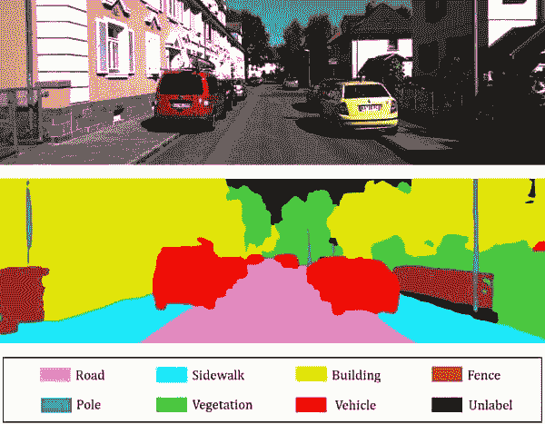

# 关于语义分割注释的误解

> 原文：[`www.kdnuggets.com/2022/01/misconceptions-semantic-segmentation-annotation.html`](https://www.kdnuggets.com/2022/01/misconceptions-semantic-segmentation-annotation.html)

**语义分割**是一个计算机视觉问题，涉及将图像中相关的元素归入同一类别。

* * *

## 我们的三大课程推荐

 1\. [谷歌网络安全证书](https://www.kdnuggets.com/google-cybersecurity) - 快速开启网络安全职业生涯。

 2\. [谷歌数据分析专业证书](https://www.kdnuggets.com/google-data-analytics) - 提升你的数据分析能力

 3\. [谷歌 IT 支持专业证书](https://www.kdnuggets.com/google-itsupport) - 支持你的组织进行 IT 管理

* * *

语义分割涉及三个步骤：

**分类：** 识别并分类图片中的特定对象。

**定位：** 查找物体并围绕其绘制边界框。

**分割：** 使用分割掩码将局部图片中的像素进行分组的过程。

语义分割有几种子类型，但它们都源于从两个类别中选择一对参数：数据的维度和输出注释的粒度。

## ****维度****

数据源中的维度数量称为此。普通相机照片是 2D 对象的一个例子，因为它只有两个维度：高度和宽度。3D 数据是 2D 数据的一种变体，增加了一个“深度”组件。Lidar 和雷达扫描是两种传感器数据。当多个连续的 3D 对象沿时间轴层叠时，会创建一个 4D 表示，通常称为电影。

我们根据数据的维度使用不同形式的语义分割来创建分割掩码。在 2D 分割的情况下，使用两种方法之一：基于像素或基于多边形的着色。由于像素是此模型中最小的基本组成部分，每个像素都被分配到一个注释类别中。这导致在 3D 中进行基于点的分割，每个 3D 点都会被标记。如果提供了足够的点，可以从单个物体中提取分割网格。

## **粒度**

结果标注的精确度称为粒度。基于类别和实例感知分割是最常见的两种类型。在第一个例子中，特定类别的分割掩模涵盖了所有表示该类别成员的区域。在第二种情况下，为每个选择类别的独特物体构建了不同的分割掩模，从而能够区分不同的实例（例如分开两辆不同的车）。

## 在机器学习中，哪种语义分割更有用？

为了最大限度地发挥[语义分割](https://www.cogitotech.com/blog/what-is-semantic-image-segmentation-types)的效果，应该使用实例感知子类型。以下是一些原因。

**格式非常灵活**

有了分割的数据，你可以训练和实验各种机器学习模型，包括分类、检测、定位、图像生成、前景/背景分离、手写识别、内容修改等。因此，它被广泛应用于各种行业，包括自动驾驶、时尚、电影制作和后期制作、农业等。

**精确度无与伦比**

分割掩模最为精确，因为它们只覆盖真实物体的位置。另一方面，边界框经常包括或与邻近区域连接。这是因为非刚性物体在其他非刚性物体内或上面。

**一个标注两个标注**

尽管分割掩模更为精确，许多程序仍然使用边界框。幸运的是，可以始终通过分割掩模来估计周围的边界框。这就是你如何全面覆盖所有基础！

*尽管有这些优点，使用语义分割作为标注类型也有显著的缺点。*

## 第一部分是最困难的

**1\. 手动标注既困难又耗时**

手动制作语义掩模是一项耗时且困难的任务。当面对不规则形状或物体边界不易察觉的区域时，标注者必须准确跟随每个物体的轮廓（见下图）。没有专业工具的情况下标注单帧容易出错、不一致，且可能需要超过 30 分钟。

**2\. 完全自动化的方法无法提供高质量的结果**

如果我们可以只训练一个神经网络进行语义分割，然后获得所有标注而无需做任何事情，那不是很好吗？

原因在于我们对质量的认知与准确度的评估之间存在不一致。分割掩模是通过物体轮廓生成的，质量由正确检测到的区域百分比来确定。

**3\. 纠正错误需要很长时间**

上述每种方式中的错误可能都很昂贵。修正一个不完美的分割掩膜需要修正 N 个额外的掩膜，其中 N 是邻近掩膜的数量（稍后我们会回到这个问题）。调整掩膜所需的时间与从头创建掩膜的时间相同。因此，完全自动化的分割输出也无法通过人工调整来完成。唯一防止这个问题的方法是使用专门的标注软件和经过充分培训的标注员。

**4\. 语义分割标注成本**

正如你可能看到的，创建分割掩膜需要使用特定的标注员、设备和自动化技术。这大大提高了价格，通常是标注基本边界框成本的几倍，并迅速耗尽预算。

**Gaurav Sharma** 在人工智能和机器学习领域工作了超过六年。Gaurav 是一名自由技术作家，为 [Cogito Tech LLC](https://www.cogitotech.com/)、[Anolytics.ai](https://www.anolytics.ai/) 及其他提供训练数据给 AI 业务的著名数据标注公司工作。

### 更多相关话题

+   [边界框深度学习：视频标注的未来](https://www.kdnuggets.com/2022/07/bounding-box-deep-learning-future-video-annotation.html)

+   [快速指南：如何找到合适的标注人才](https://www.kdnuggets.com/2022/04/quick-guide-find-right-minds-annotation.html)

+   [闭源与开源图像标注](https://www.kdnuggets.com/closed-source-vs-open-source-image-annotation)

+   [语义层的力量：数据工程师指南](https://www.kdnuggets.com/2023/10/cube-power-of-a-semantic-layer-a-data-engineers-guide)

+   [语义层：AI 驱动数据体验的支柱](https://www.kdnuggets.com/2023/10/cube-semantic-layer-backbone-aipowered-data-experiences)

+   [语义向量搜索如何改变客户支持互动](https://www.kdnuggets.com/how-semantic-vector-search-transforms-customer-support-interactions)
