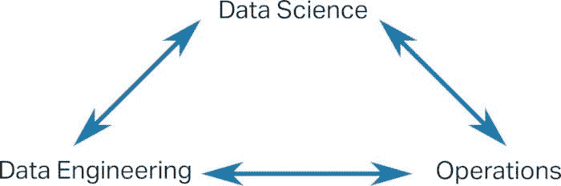

# 数据科学家缺失的团队

> 原文：[`www.kdnuggets.com/2020/11/missing-teams-data-scientists.html`](https://www.kdnuggets.com/2020/11/missing-teams-data-scientists.html)

评论

**由 [Jesse Anderson](https://www.jesse-anderson.com)，大数据学院常务董事**。

当公司相信他们仅需数据科学家来完成大数据项目时，数据科学团队受到的影响最大。数据科学家们感受到了其他两个缺失团队的压力。

* * *

## 我们的前 3 个课程推荐

 1\. [谷歌网络安全证书](https://www.kdnuggets.com/google-cybersecurity) - 快速进入网络安全职业生涯。

 2\. [谷歌数据分析专业证书](https://www.kdnuggets.com/google-data-analytics) - 提升您的数据分析技能

 3\. [谷歌 IT 支持专业证书](https://www.kdnuggets.com/google-itsupport) - 支持您的组织的 IT 需求

* * *

让我们讨论一下数据科学家如何受到影响，其他缺失的团队，以及数据科学家如何开始为这些缺失的团队发声。

### 对数据科学家的影响

当数据科学团队是唯一的数据团队时，数据科学家们被期望能兼任多种角色，并且在每个角色上都做到精通。过多的工作意味着数据科学家们将花费大量时间在[边缘工作](https://www.techrepublic.com/article/why-its-your-fault-your-data-scientists-keep-quitting/)，而在实际的数据科学上投入的时间很少。

问题的根源在于公司及数据科学团队对数据团队的误解。他们已经认为只需要数据科学家。

对数据科学家本身的影响是有害的。我观察到数据科学家在花费大量时间处理除数据科学外的其他事务后，会在 3-6 个月内辞职。离职会造成双输的局面，数据科学家需要寻找新职位，公司则需要从招聘和培训流程重新开始。这种情况本可以通过所有数据团队的共同存在来完全避免。

### 什么是数据团队？

成功完成大数据项目更多的是一种团队运动。这需要具备多种技能的人，这些技能并不局限于单个人或单一团队。成功需要三个数据团队的共同努力。这些团队分别是数据工程、运维和数据科学。

每一个团队对项目的成功或失败都同样重要。各团队之间应该有高带宽的连接。这应是一个共生关系，而非对抗关系。

### 正确的数据工程

有时候，公司名义上拥有所有的数据团队，但实际上仅仅是名义上的团队。这些名义上的团队产生了数据工程师不真正需要的错觉。让我们讨论一下何时会发生这种情况。

**错误的数据工程师**

数据工程师的头衔可以包含两种非常不同的技能集。公司可能没有意识到这种差异，仍然聘用错误的数据工程师。

数据工程师的一个定义是一个专注于 SQL 的人。这个人通常来自 GUI 基础的 ETL 程序、DBA 或数据仓库背景。另一种数据工程师的定义，即我所指的，是专注于大数据的软件工程师。这类人拥有扎实的软件工程背景。

如你所见，这两种定义的技能集非常不同。这是 HR 或管理层可能没有理解的区别。由完全专注于 SQL 的数据工程师组成的团队对数据科学家几乎没有价值，甚至可能妨碍他们。由拥有软件工程背景的数据工程师组成的团队将大有裨益，并能够承担数据科学家缺乏的复杂软件工程任务。

**糟糕的数据工程业绩记录**

数据工程和数据科学之间的另一个常见问题可能是糟糕业绩记录的认知。数据工程或 IT 部门是好项目夭折的地方。结果，数据科学家会尽一切力量把他们的项目从数据工程师手中保护出来。

数据科学家经常抱怨数据工程师的[过度工程化解决方案](https://medium.com/better-programming/overengineering-why-we-do-it-and-10-ways-to-tackle-it-460663d35ff3)。在数据科学家看来，数据工程师在实施过多的流程或做法。数据工程师应该在过多的流程和不足的进展之间找到一个平衡点，与数据科学家协同工作。

糟糕的业绩记录可以归因于数据工程团队由原始的数据工程师组成。这些数据工程师缺乏做出正确技术决策和推动进展的经验和知识。双方可能都有一些成长上的不足需要修复。

### 提倡

我们往往专注于数据科学的技术方面，比如选择正确的模型或技术。我们较少关注可能导致我们表现不佳或完全失败的组织问题。在只有数据科学家的组织中，他们有责任倡导组织变革，以获得数据工程和运营团队。

我们可能需要对自己和团队保持一定的诚实，承认我们并不是[适合做所有事情的最佳团队](https://www.kdnuggets.com/2018/12/why-shouldnt-data-science-generalist.html)。从这种诚实的自我审视开始，我们可以逐渐看到我们最需要帮助的地方。这可能是意识到我们选择了错误的工具，或者我们的处理时间过长。我们可能会发现自己厌倦了 24/7 随时待命，或者模型的可靠性低到企业无法再使用。整体的认识是，我们缺乏改善和解决这些问题的核心能力。这并不是我们不聪明的体现，而是一个人或团队不能被期望做到所有事情。

在我们的诚实审视之后，我们可以向管理层提出有力的论证，说明为何我们需要其他团队。我们将能够提供具体的例子，说明投资将带来怎样的回报。例如，我发现数据科学家在软件工程任务上的效率比数据工程师低 80%。通过仅仅增加数据工程师，整个数据科学团队可能会变得更加高效。

数据科学家的工作并不会在管理层相信他们需要数据工程和运营后就结束，因为还会有增长期和更多工作。你将遇到未知的未知问题和新团队开始揭示的技术债务。各方的努力是必需的，以沟通并形成共生关系。这些努力是值得的，投资将带来丰厚的回报。

如果你希望避免成为刻板印象，组建一个新团队或修复现有团队，我邀请你阅读我最新的书籍[*数据团队*](https://www.datateams.io)。这本书涵盖了管理数据团队的正确方法。

**个人简介：[杰西·安德森](https://www.linkedin.com/in/jessetanderson/)** 是一名数据工程师、创意工程师和大数据研究所的董事总经理。他与从初创公司到财富 100 强公司等各类公司合作，涉及大数据领域。这包括对 Apache Kafka、Apache Hadoop 和 Apache Spark 等前沿技术的培训。他已经教授了超过 30,000 人掌握成为数据工程师的技能。

他被广泛认为是该领域的专家，并因其创新的教学方法而受到认可。杰西的作品已在 Apress、O’Reilly 和 Pragmatic Programmers 上发表，并被《华尔街日报》、CNN、BBC、NPR、Engadget 和 Wired 等权威媒体报道。

**相关内容：**

+   [构建成熟的机器学习团队](https://www.kdnuggets.com/2020/03/mature-machine-learning-team.html)

+   [如何让敏捷团队适应大数据分析](https://www.kdnuggets.com/2019/10/agile-team-big-data-analytics.html)

+   [如何构建颠覆性数据科学团队：10 大最佳实践](https://www.kdnuggets.com/2019/07/disruptive-data-science-teams-best-practices.html)

### 更多相关主题

+   [管理数据科学团队的 5 个技巧](https://www.kdnuggets.com/5-tips-for-managing-data-science-teams)

+   [人工智能中的人员管理：构建高效能的 AI 团队](https://www.kdnuggets.com/2022/03/people-management-ai-building-highvelocity-ai-teams.html)

+   [使用 Pandas fillna() 输入缺失数据的最佳方法](https://www.kdnuggets.com/2023/02/optimal-way-input-missing-data-pandas-fillna.html)

+   [如何识别时间序列数据集中的缺失数据](https://www.kdnuggets.com/how-to-identify-missing-data-in-timeseries-datasets)

+   [如何使用 Pandas 中的插值技术处理缺失数据](https://www.kdnuggets.com/how-to-deal-with-missing-data-using-interpolation-techniques-in-pandas)

+   [NumPy 中的掩码数组以处理缺失数据](https://www.kdnuggets.com/masked-arrays-in-numpy-to-handle-missing-data)
