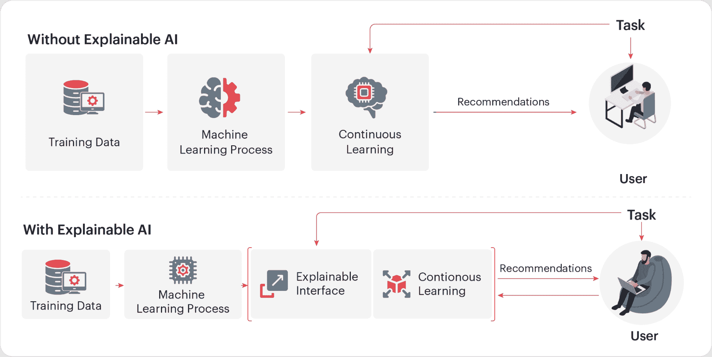
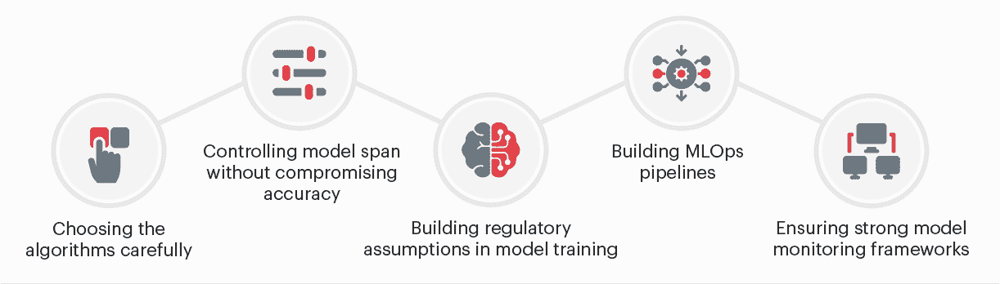

# 机器学习模型解释性如何加速金融服务的 AI 采用之旅

> 原文：[`www.kdnuggets.com/2022/07/ml-model-explainability-accelerates-ai-adoption-journey-financial-services.html`](https://www.kdnuggets.com/2022/07/ml-model-explainability-accelerates-ai-adoption-journey-financial-services.html)

金融服务公司越来越多地使用人工智能来改进其运营操作，以及业务相关任务，包括分配信用评分、识别欺诈、优化投资组合和支持创新。AI 提高了这些操作中人类工作的速度、精确度和效率，并且可以自动化目前由人工完成的数据管理任务。然而，随着 AI 的进步，新挑战也随之而来。

真实的问题是透明度：当人们不理解或只有少数人理解 AI 模型背后的推理时，AI 算法可能会无意中引入偏见或失败。

* * *

## 我们的前三个课程推荐

 1\. [Google 网络安全证书](https://www.kdnuggets.com/google-cybersecurity) - 快速进入网络安全职业生涯。

 2\. [Google 数据分析专业证书](https://www.kdnuggets.com/google-data-analytics) - 提升你的数据分析水平

 3\. [Google IT 支持专业证书](https://www.kdnuggets.com/google-itsupport) - 支持你的组织的 IT

* * *

现今，分析领导者常常目睹领导层在部署黑箱 AI 驱动解决方案时的犹豫。这加快了对行业中机器学习模型解释性的需求。事实上，根据 Gartner 的数据，到 2025 年，30% 的政府和大型企业 AI 产品及服务采购合同将要求使用可解释和道德的 AI。

尽管当前金融服务中的 AI 仅限于流程自动化和营销等任务，但未来它可能会变得复杂并不断发展，使得黑箱模型方法具有风险。黑箱 AI 无法提供解释性和透明度，使得利益相关者对模型失败的原因或如何做出特定决策感到困惑。为应对这一挑战，银行和金融机构正在探索各种应用中的 AI 模型解释性。

# 什么是可解释的 AI？

可解释的人工智能模型允许利益相关者理解模型驱动决策的主要驱动因素，并解释人工智能和机器学习模型做出的决策。事实上，欧洲 GDPR 规定，自动化决策的存在应提供关于涉及逻辑的有意义信息。可解释的模型必须能够解释其理由，描述其优缺点，并传达对未来行为的理解，从而克服无法解释为何以及如何达到特定决策点的黑箱人工智能的挑战。

可解释的人工智能克服了信任问题和由于设计者偏见、错误的训练数据或缺乏适当的业务背景而可能出现的偏见。它使机器学习算法变得透明、稳健和负责任。通过为决策分配理由代码并使其对用户可见，解决这些问题。利益相关者可以审查这些代码，以解释决策并验证结果。好的可解释人工智能必须具有高度的可扩展性、易于理解、高度个性化，并根据用例和国家遵守监管和隐私要求。

图：黑箱人工智能与可解释人工智能模型的工作原理

# 为什么可解释的人工智能对金融机构至关重要？

金融机构遵循严格的监管政策，任何不正确的决定都可能花费数百万美元并损害消费者信任。因此，金融公司必须对人工智能模型进行严格、动态的模型风险管理和验证。银行必须确保所提出的人工智能解决方案可以根据用例提供所需的透明度。

拥有一个扎实且实际的可解释治理框架可以帮助金融机构理解其关于人工智能可解释性的义务以及如何将其付诸实践。下面我们讨论了几个金融服务领域广泛使用人工智能的应用案例，以及为什么在每种场景中可解释模型都是至关重要的。

**消费者信用：** 在银行业中，人工智能的一个常见应用是决定贷款标准。银行必须理解人工智能为何做出贷款批准或拒绝的决定。人工智能的可解释性确保决策是公平的，不会因性别或种族而产生偏见。

**反洗钱（AML）：** 反洗钱广泛使用人工智能，并要求其可解释性，以理解模型输出是否建议交易中的异常行为或可疑活动。

**客户入驻：** 金融机构因客户入驻流程不足而损失数百万美元，而人工智能确保流程顺畅，损失最小。可解释的人工智能提供了一个进行资格检查和风险管理的系统，同时保持透明度。

**风险管理：** 使用历史结构化和非结构化数据，AI 帮助银行和金融机构跟踪欺诈和潜在风险的迹象。模型的可解释性必须说明为何将某项活动识别为风险，以便能够管理风险并保持更好的客户体验。

**预测：** AI 预测模型帮助实时监控和预测金融交易参数。可解释性确保了自动预测的准确性和动态特性。

# 如何确保 AI 模型的可解释性？

人工智能技术越强大，其推理过程的解释就越具挑战性，因为它涉及复杂的神经网络架构来执行 AI。此外，不同的利益相关者需要不同层次的解释。他们必须能够为每个决策提供理由。例如，在贷款审批的 AI 系统中，如果系统拒绝了一份贷款申请，它应该能够解释为何拒绝申请，并且建议结果是否正确。模型应该能够回答以下问题，以了解模型是否正常工作。

1.  使用了什么算法？

1.  模型是如何工作的？

1.  模型在确定输出时考虑了哪些数据？

1.  哪些变量对模型决策产生了影响？

1.  模型的决策是否符合监管指导？

1.  模型是否有可能对某些群体/性别/种族产生歧视？

虽然可解释的 AI 模型是理想的情形，但随着模型复杂性和精确度的增加，创建这些模型可能变得越来越具有挑战性。此外，还存在竞争对手逆向工程专有机器学习模型和算法的担忧。还有可能面临敌对攻击导致故障的风险。为了克服这些挑战，许多金融机构开始利用最先进的算法，同时保持可解释性。对数据和过程的深入理解可以帮助数据科学家构建定制架构，并通过以下方式确保 AI 模型的可解释性

1.  在选择算法时，要仔细考虑可解释性

1.  在不影响准确性的情况下控制模型的跨度

1.  在模型训练中构建经济和监管假设

1.  构建 MLOps 管道

1.  确保强大的模型监控框架

图：确保 AI 模型可解释性需要注意的要点

# 结论

解释性和良好的模型治理可以降低风险，并为金融服务中的道德和透明 AI 创建框架，消除偏见。随着 AI 用例的增长，创建透明且可解释的 AI 模型以解释关键决策将变得至关重要。将 AI 和机器学习模型的解释性整合到流程中，将为未来铺平道路。

金融机构可以选择具有丰富经验的 AI 合作伙伴，以确保 AI 模型的解释性和透明度，同时满足全球合规要求。合作伙伴应能够为 AI 系统的设计、开发、部署和运营制定道德保护措施。一个透明的机器学习框架将为模型带来问责制，并增强对复杂 AI 解决方案的依赖。

**[Yuktesh Kashyap](https://www.linkedin.com/in/yuktesh-kashyap-77336286/?originalSubdomain=in)**，Sigmoid 数据科学副总裁。他在金融服务领域实施基于机器学习的决策和监控解决方案方面有近十年的经验。

### 更多相关话题

+   [关于可信图神经网络的综合调查：…](https://www.kdnuggets.com/2022/05/comprehensive-survey-trustworthy-graph-neural-networks-privacy-robustness-fairness-explainability.html)

+   [云存储采纳是企业的迫切需求](https://www.kdnuggets.com/2022/02/cloud-storage-adoption-need-hour-business.html)

+   [AI 在算法交易中的采纳对金融行业的影响](https://www.kdnuggets.com/2022/04/adoption-ai-algorithmic-trading-affected-finance-industry.html)

+   [边缘 AI 的前景及其有效采纳的方法](https://www.kdnuggets.com/the-promise-of-edge-ai-and-approaches-for-effective-adoption)

+   [规划通向 SAS 认证的旅程](https://www.kdnuggets.com/2022/11/sas-map-journey-towards-sas-certification.html)

+   [在数据科学旅程中实现质的飞跃](https://www.kdnuggets.com/2023/02/make-quantum-leaps-data-science-journey.html)
