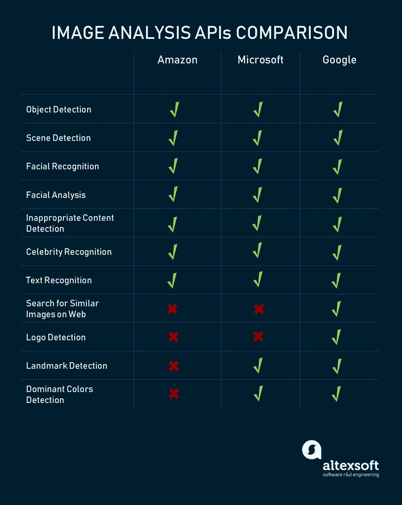
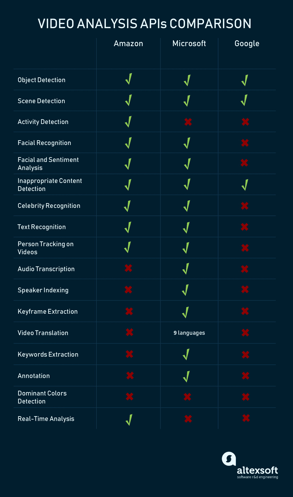

# 比较机器学习即服务：Amazon、Microsoft Azure、Google Cloud AI

> 原文：[`www.kdnuggets.com/2018/01/mlaas-amazon-microsoft-azure-google-cloud-ai.html/2`](https://www.kdnuggets.com/2018/01/mlaas-amazon-microsoft-azure-google-cloud-ai.html/2)

*语音和文本处理 API: Google Cloud Services*

尽管这组 API 主要与 Amazon 和 Microsoft Azure 的建议交集，但它有一些有趣且独特的功能值得关注。

[**Dialogflow**](https://cloud.google.com/dialogflow-enterprise/)**。** 随着各种聊天机器人成为今日的趋势，Google 也有相关的产品。Dialogflow 基于自然语言处理技术，旨在定义文本中的意图，并解释一个人想要什么。该 API 可以通过 Java、Node.js 和 Python 进行调整和定制，以满足所需的意图。

[**云自然语言 API**](https://cloud.google.com/natural-language/)**。** 这个 API 在核心功能上几乎与 Amazon 的 Comprehend 和 Microsoft 的 Language 相同。

+   定义文本中的实体

+   识别情感

+   分析句法结构

+   分类话题（例如：食品、新闻、电子产品等）

[**云语音 API**](https://cloud.google.com/speech/)**。** 该服务可以识别自然语音，其相较于类似 API 的主要优势可能是 Google 支持的语言种类丰富。目前，它的词汇支持超过 110 种全球语言及其变体。它还具有一些附加功能：

+   词汇提示允许将识别定制到特定的上下文和可说的词汇（例如，更好地理解地方或行业术语）

+   过滤不适当的内容

+   处理嘈杂的音频

[**云翻译 API**](https://cloud.google.com/translate/)**。** 基本上，你可以使用这个 API 在你的产品中集成 Google 翻译。它支持超过一百种语言和自动语言检测。

除了文本和语音，Amazon、Microsoft 和 Google 还提供了相当多功能的图像和视频分析 API。

尽管图像分析与视频 API 密切交集，但许多视频分析工具仍在开发或测试版本中。例如，Google 提供对各种图像处理任务的丰富支持，但在视频分析功能上明显落后于 Microsoft 和 Amazon。

*图像和视频处理 API: Amazon Rekognition*

不，我们没有拼错这个词。 [Rekognition API](https://aws.amazon.com/rekognition/?hp=r) 被用于图像和最近的视频识别任务。这些任务包括：

+   物体检测和分类（在图像中找到并检测不同的物体，并定义它们是什么）

+   在视频中，它可以检测如“跳舞”这样的活动或“灭火”这样的复杂动作

+   面部识别（用于检测面孔和查找匹配的面孔）和面部分析（这一点非常有趣，因为它检测微笑、分析眼睛，甚至定义视频中的情感）

+   检测不当视频

+   识别图像和视频中的名人（无论出于何种目的）

*图像和视频处理 API：Microsoft Azure 认知服务*

微软的 Vision 包结合了六个 API，专注于不同类型的图像、视频和文本分析。

+   计算机视觉能够识别图像中的对象、动作（例如，行走），并定义主导颜色

+   内容审核员检测图像、文本和视频中的不当内容

+   面部 API 检测面孔、对其进行分组、定义年龄、情感、性别、姿势、微笑和面部毛发

+   情感 API 是另一个面部识别工具，用于描述面部表情

+   自定义视觉服务支持使用自己的数据构建自定义图像识别模型

+   视频索引器是一个工具，用于在视频中查找人物、定义语音情感和标记关键字

*图像和视频处理 API：Google 云服务*

[**云视觉 API**](https://cloud.google.com/vision/)**.** 该工具用于图像识别任务，对于查找特定图像属性非常强大：

+   标记对象

+   识别面孔并分析表情

+   查找地标并描述场景（例如，度假、婚礼等）

+   查找图像中的文本并识别语言

+   主导颜色

[**云视频智能**](https://cloud.google.com/video-intelligence/)**.** Google 的视频识别 API 仍在开发初期，因此缺少 Amazon Rekognition 和 Microsoft Cognitive Services 提供的许多功能。目前，该 API 提供以下工具集：

+   标记对象和定义动作

+   识别显式内容

+   转录语音

尽管在功能列表级别上 Google AI 服务可能缺少一些能力，但 Google API 的力量在于 Google 可访问的庞大数据集。

**特定 API 和工具**

在这里，我们将讨论来自微软和 Google 的具体 API 提供和工具。我们没有包含 Amazon，因为他们的 API 集仅仅匹配上述提到的文本分析和图像+视频分析类别。然而，这些特定 API 的一些功能也存在于 Amazon 产品中。

**Azure 服务机器人框架。** 微软在提供灵活的 [机器人开发工具集](https://azure.microsoft.com/en-us/services/bot-service/) 方面投入了大量精力。该服务基本上包含了一个完整的环境，用于使用不同的编程语言构建、测试和部署机器人。

有趣的是，Bot 服务不一定需要机器学习方法。由于微软提供了五种机器人模板（基本、表单、语言理解、主动和问答），只有语言理解类型需要先进的 AI 技术。

目前，你可以使用 .NET 和 [Node.js](https://www.altexsoft.com/blog/engineering/the-good-and-the-bad-of-node-js-web-app-development/) 技术来构建 Azure 机器人，并将它们部署到以下平台和服务：

+   Bing

+   Cortana

+   Skype

+   Web Chat

+   Office 365 邮箱

+   GroupMe

+   Facebook Messenger

+   Slack

+   Kik

+   Telegram

+   Twilio

[**微软的 Bing 搜索**](https://azure.microsoft.com/en-us/services/cognitive-services/bing-web-search-api/)**。** 微软提供了七个与核心 Bing 搜索功能连接的 API，包括自动建议、新闻、图片和视频搜索

[**微软的知识**](https://azure.microsoft.com/en-us/services/cognitive-services/directory/know/)**。** 这个 API 组结合了文本分析和广泛的独特任务：

+   Recommendations API 允许构建用于购买 [个性化](https://www.altexsoft.com/blog/datascience/customer-experience-personalization-in-travel-and-hospitality-using-behavioral-analytics-and-machine-learning/) 的推荐系统

+   Knowledge Exploration Service 允许你输入自然语言查询以从数据库中检索数据，进行数据可视化，并自动补全查询

+   Entity Linking Intelligence API 旨在突出显示表示实体的名称和短语（例如，探索时代），并确保消歧

+   Academic Knowledge API 进行词汇自动补全，找到文档中词汇和概念的相似性，并在文档中搜索图谱模式

+   QnA Maker API 可用于匹配问题的各种变体与答案，以构建客户服务聊天机器人和应用程序

+   Custom Decision Service 是一种强化学习工具，用于根据用户的偏好个性化和排名不同类型的内容（例如，链接、广告等）

[**Google Cloud Job Discovery**](https://cloud.google.com/job-discovery/)**。** 该 API 仍在早期开发阶段，但很快可能会重新定义我们今天拥有的职位搜索能力。与依赖精确关键词匹配的传统职位搜索引擎不同，Google 利用机器学习在高度变化的职位描述之间找到相关连接，并避免歧义。例如，它努力减少无关或过于宽泛的返回，例如将所有包含“助理”关键词的职位返回为“销售助理”查询。该 API 的主要功能是什么？

+   修正职位搜索查询中的拼写错误

+   匹配所需的资历水平

+   查找可能涉及变化表达和行业术语的相关职位（例如，将“服务器”查询返回为“咖啡师”，而不是“网络专家”；或将“业务发展”查询返回为“参与专家”）

+   处理缩写（例如，将“HR”查询返回为“人力资源助理”）

+   匹配变化的地点描述

**IBM Watson 和其他**

前述的所有三个平台提供了相当详尽的文档，以便启动机器学习实验并在企业基础设施中部署训练好的模型。此外，还有一些来自初创企业的 ML-as-a-service 解决方案，受到数据科学家的尊敬，例如 [PredicSis](https://predicsis.ai/) 和 [BigML](https://bigml.com/)。

那么，IBM Watson Analytics 呢？

IBM Watson Analytics 目前还不是一个完全成熟的用于商业预测的机器学习平台。目前，Watson 的优势在于数据可视化和描述数据中不同值之间的交互。它还提供了类似于[Google 提供的](https://cloud.google.com/vision/) [视觉识别服务](https://console.ng.bluemix.net/docs/services/VisualRecognition/VisualRecognition.html) 和一 [系列其他认知服务](https://www.ibm.com/watson/developercloud/services-catalog.html)（APIs）。当前 Watson 的问题在于该系统执行的是狭窄且相对简单的任务，非专业人员易于操作。在涉及定制机器学习或预测任务时，IBM Watson 的发展还不够成熟。

**数据存储**

寻找适合存储数据并用机器学习进一步处理的数据存储不再是一个重大挑战，只要你的数据科学家具备足够的知识来操作流行的存储解决方案。

在大多数情况下，机器学习需要 SQL 和 NoSQL 数据库方案，许多成熟且可靠的解决方案如 Hadoop 分布式文件系统（HDFS）、Cassandra、Amazon S3 和 Redshift 都支持这些方案。对于已经使用过强大存储系统的组织而言，这不会构成障碍。如果你计划使用某些 ML-as-a-service 系统，最直接的方法是选择相同的提供商进行存储和机器学习，因为这将减少配置数据源所花费的时间。

然而，这些平台中的一些可以轻松地与其他存储进行集成。例如，Azure ML 主要与其他 Microsoft 产品（Azure SQL、Azure Table、Azure Blob）集成，但也支持 Hadoop 和一些其他数据源选项。这些选项包括从桌面或本地服务器直接上传数据。如果你的机器学习工作流是多样化的且数据来自多个来源，可能会遇到挑战。

**建模与计算**

我们讨论了主要提供计算能力的 ML-as-a-service 解决方案。但如果学习工作流是在内部执行的，那么计算挑战迟早会到来。机器学习在大多数情况下需要大量的计算能力。数据抽样（制作经过精心筛选的子集）仍然是一个相关的实践，尽管大数据时代已经来临。虽然模型原型可以在笔记本电脑上完成，但使用大数据集训练复杂模型需要投资更强大的硬件。数据预处理也是如此，在普通办公机器上可能需要几天时间。在对截止日期非常敏感的环境中——有时模型需要每周或每天修改和重新训练——这显然不是一个选项。处理性能高的三种可行方法如下：

1.  **加速硬件。** 如果你进行的是相对简单的任务，并且没有对大数据应用你的模型，可以使用固态硬盘（SSDs）来处理数据准备或使用分析软件等任务。计算密集型操作可以通过一个或多个图形处理单元（GPUs）来解决。有许多库可以使 GPUs 处理甚至用像 Python 这样的高级语言编写的模型。

1.  **考虑分布式计算。** 分布式计算意味着拥有多台机器，任务在这些机器之间分配。然而，这种方法并不适用于所有的机器学习技术。

1.  **使用云计算以实现可扩展性。** 如果你的模型处理客户相关数据并且有高峰期，云计算服务将允许快速扩展。对于那些仅要求数据在本地存储的公司，值得考虑私有云基础设施。

**下一步**

在众多解决方案中很容易迷失。它们在算法上有所不同，所需技能集也不同，最终任务也有所差异。这种情况在这个年轻的市场中相当普遍，即使是我们讨论的三种主要解决方案也并未完全互相竞争。更重要的是，变化的速度令人印象深刻。你很可能会坚持使用一个供应商，而突然间另一个供应商会推出符合你业务需求的新产品。

正确的做法是尽早明确你打算通过机器学习实现的目标。这并不容易。如果你缺乏数据科学或领域专长，在数据科学与商业价值之间架起一座桥梁是很棘手的。我们在 AltexSoft 经常遇到这个问题，尤其是在与客户讨论机器学习应用时。通常，这涉及将一般问题简化为单一属性。不论是价格预测还是其他数值、对象的类别或将对象划分为多个组，一旦你找到这个属性，决定供应商并选择所提议的方案将变得更简单。

Bradford Cross，DCVC 的创始合伙人，认为[机器学习即服务并非一个可行的商业模式](https://www.bradfordcross.com/blog/2017/3/3/five-ai-startup-predictions-for-2017)。他认为，它处于那些使用开源产品的数据科学家和那些购买解决高层次任务工具的高管之间的空白地带。然而，似乎行业目前正在克服初期问题，最终我们将看到更多公司转向机器学习即服务，以避免昂贵的人才招募，同时仍然拥有多功能的数据工具。

[原文](https://www.altexsoft.com/blog/datascience/comparing-machine-learning-as-a-service-amazon-microsoft-azure-google-cloud-ai/)。经许可转载。

**相关**

+   [**从大数据平台到无平台机器学习**](https://www.kdnuggets.com/2017/03/big-data-platformless-machine-learning.html)

+   [**通过深度认知简化深度学习**](https://www.kdnuggets.com/2017/12/deep-learning-made-easy-deep-cognition.html)

+   [**视觉美学：使用 AI 技术评估照片质量**](https://www.kdnuggets.com/2018/01/visual-aesthetics-photo-quality-ai.html)

* * *

## 我们的前三大课程推荐

 1\. [Google 网络安全证书](https://www.kdnuggets.com/google-cybersecurity) - 快速进入网络安全职业轨道

 2\. [Google 数据分析专业证书](https://www.kdnuggets.com/google-data-analytics) - 提升你的数据分析能力

 3\. [Google IT 支持专业证书](https://www.kdnuggets.com/google-itsupport) - 支持你的组织进行 IT 管理

* * *

### 更多相关话题

+   [成为优秀数据科学家所需的 5 项关键技能](https://www.kdnuggets.com/2021/12/5-key-skills-needed-become-great-data-scientist.html)

+   [每个初学者数据科学家应掌握的 6 种预测模型](https://www.kdnuggets.com/2021/12/6-predictive-models-every-beginner-data-scientist-master.html)

+   [2021 年最佳 ETL 工具](https://www.kdnuggets.com/2021/12/mozart-best-etl-tools-2021.html)

+   [停止学习数据科学以寻找目标，并找到目标……](https://www.kdnuggets.com/2021/12/stop-learning-data-science-find-purpose.html)

+   [学习数据科学统计的最佳资源](https://www.kdnuggets.com/2021/12/springboard-top-resources-learn-data-science-statistics.html)

+   [成功数据科学家的 5 个特征](https://www.kdnuggets.com/2021/12/5-characteristics-successful-data-scientist.html)
