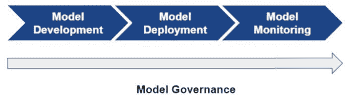
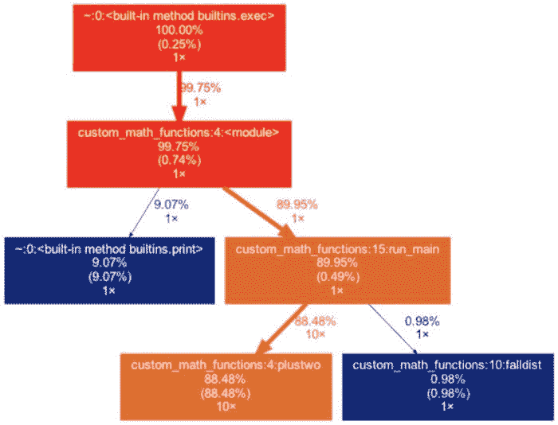

# **MLOps 最佳实践**

> 原文：[`www.kdnuggets.com/2021/07/mlops-best-practices.html`](https://www.kdnuggets.com/2021/07/mlops-best-practices.html)

评论

**[Siddharth (Sid) Kashiramka](https://www.linkedin.com/in/siddharthkashiramka/)，（高级经理，平台，Capital One），

[Anshuman Guha](https://www.linkedin.com/in/anshumanguha/)，（首席数据科学家，Card DS，Capital One），

[DeCarlos Taylor](https://www.linkedin.com/in/decarlos-taylor-igm4844b4b/)，（主任，Card DS，Capital One）**。

现在在多个行业中，人们普遍认识到预测建模和机器学习可能为那些将这些技术作为其商业模式核心部分的组织提供巨大的价值。许多跨越公共和私营部门的组织已经采用了数据驱动的商业战略，利用从全面的数据分析或高度复杂的机器学习算法中得出的洞察来影响关键的业务或运营决策。虽然有许多组织在大规模应用机器学习，并且各种使用案例层出不穷，但整体机器学习生命周期在所有组织中具有相似的结构，无论具体的使用案例或应用是什么。具体来说，对于任何大规模利用数据科学的组织，机器学习生命周期由四个关键组成部分定义：模型开发、模型部署、模型监控和模型治理（见图 1）。

***图 1*** *- 机器学习生命周期的四个关键步骤。*

大多数数据科学家对机器学习生命周期中的*模型开发*部分非常熟悉，并且对复杂的数据查询（例如 SQL）、数据处理、特征工程和算法训练有很高的熟练度。此外，生命周期中的*模型监控*部分在某种程度上与数据科学家的职能相关。模型在时间推移中对数据分布变化或新应用领域的性能可以使用相关的统计指标（例如均方误差、精确度-召回率等）来监控，这些都是许多数据科学家熟悉的。此外，根据行业不同，*模型治理*的要求通常定义明确（尽管执行情况未必理想！），并且在组织政策文件和由监管机构发布的一般性法规中常有详细阐述。

尽管机器学习生命周期的模型开发、监控和治理组件复杂且充满挑战，但***模型部署*** *(或称“生产化”)* 组件是许多组织似乎最难应对的部分。[一份最新报告](https://venturebeat.com/2019/07/19/why-do-87-of-data-science-projects-never-make-it-into-production/) [1] 表示 87%的数据科学项目最终未能进入生产，原因包括：

+   组织内缺乏必要的部署专业知识[2]。

+   部署过程需要多个利益相关者之间的紧密合作，包括数据科学家、软件工程师和平台工程师，这可能会带来有效管理的挑战。

+   关键利益相关者之间可能缺乏透明度，一个小组采用的设计选择可能与其他关键利益相关者的基本要求或实践不完全兼容。

+   大规模生产化模型可能需要一个具有弹性且设计良好的模型部署平台，以支持各种机器学习应用程序并提供任何额外的支持功能。

+   部署平台服务水平协议（例如，最大模型响应时间）可能很难遵守，除非进行大量的软件工程和代码优化。

这绝不是组织在部署和生产化模型时可能面临的挑战的详尽清单。虽然对于上述每一项内容都有很多需要讨论的地方，但在本文中，我们专注于最后两项内容，即构建良好架构的部署平台和在打包机器学习模型时需要考虑的技术。基于我们在管理、维护和提升重要模型部署平台的经验，以及在打包和性能调优生产化机器学习模型方面的丰富经验，我们在下文中分享了一些我们在过程中识别出的高级考虑因素和最佳实践。我们希望这些知识分享能够帮助其他团队和组织更快速地实现机器学习目标，避免可能导致失败的陷阱。

## 机器学习部署平台设计

构建满足组织需求的模型部署平台始于定义潜在最终用户可能需要的总体需求[3]。这些条件可能涵盖执行、治理、监控或维护需求，并且在设计一个稳健的平台时，你可能需要包括的一些功能包括：

+   **实时/批处理 -** 机器学习平台可以支持实时或批处理，或者两者兼有，具体取决于业务需求。在做出决策时，必须考虑组织的数据质量需求和系统响应/延迟。批处理流程对数据质量问题更具耐受性，因为大多数批处理流程有足够的时间在处理后检测问题并在执行客户决策前修复这些问题。相反，对于实时评分，决策是在几秒钟内做出的。数据质量检查、从外部源提取数据、流数据输出等，可能会增加模型响应延迟的要求。

+   **模型注册/清单 -** 在构建平台时，制定关于遗留/旧版本模型的计划（例如，它们是否会被退役或是否有监管要求这些模型保留一定时间等）。拥有一个一致且自动化的路径将所有模型投入生产，并了解模型更新的频率，将有助于减少遗留模型带来的技术债务。

+   **模型治理和风险管理 -** 在受监管的环境中，系统审计的能力至关重要。不幸的是，模型治理有时可能被忽视作为一个关键能力。然而，构建强大的跟踪和管理控制对于模型在机器学习系统中的整个生命周期是必要的。这里的一些考虑因素包括收集和持久化详细的模型元数据、记录数据血统、建立控制措施，以及对文件和模型进行版本管理。

+   **并发模型执行 -** 了解被调用模型的需求/量以及模型是否需要并发执行。在大多数情况下，多个模型在后台同时运行。机器学习平台应确保能够适应不断增长的需求，同时保持最小的执行延迟。

+   **模型监控 -** 为了使模型有效和有价值，它们需要在整个生命周期内进行监控，从投入生产时开始，直到退役。有效的机器学习模型通过减少将偏差模型投入生产环境的风险来创造价值，同时也通过更快地识别瓶颈来提高数据科学团队的生产力。

启用所有这些功能是耗时的（有时甚至需要多年的努力）并且需要复杂的设计和基础设施设置。你的平台架构应该有助于实现这些功能。最终确定的架构应受到扎实工程最佳实践的支持。对于机器学习系统，几个最相关的最佳实践是：

+   可重复性 - 每个组件的输出必须在任何版本的时间点上都可以复制。

+   可扩展性 - 系统应能够适应动态变化的容量，并保持最小的响应时间。

+   自动化 - 尽可能消除手动步骤，以减少错误发生的机会。

## 将模型部署到平台

平台的另一个关键设计选择是用于模型部署的工具和技术[4]。模型部署的一个常见标准是使用容器，这实际上是针对给定应用程序的完整打包和可移植的计算环境。（有关容器化的更多详细信息，请参见[链接](https://www.citrix.com/solutions/app-delivery-and-security/what-is-containerization.html) [5]）。从平台的角度来看，容器化模型提供了几个好处[6]，包括：

+   由于容器与宿主操作系统的抽象，实现了灵活性和可移植性

+   由于能够部署新版本的模型而不会干扰生产中的模型，因此可更好地进行管理

+   更高的效率和更快的模型部署

尽管使用模型容器提供了几个好处，但在打包和部署容器化模型时会出现一些技术挑战。确保容器化模型返回正确的输出分数至关重要，特别是在高度受监管的行业中，模型评分错误可能会对组织或其客户基础产生负面后果。因此，必须拥有一个稳健的测试框架，包括在多个场景下（包括在范围内、范围外、缺失和边界值）的输入数据（也许是模拟数据）上测试容器化模型。

另一个关键考虑因素是容器化模型部署的整体响应时间（“延迟”）。高延迟模型可能会导致许多负面后果，包括平台成本的增加（主要是在云服务提供商托管平台时）或由于平台响应缓慢而导致潜在客户未能完成申请或交易，从而失去机会。因此，容器化模型的性能调优以减少响应延迟是部署过程中的重要部分。

### 使用 cProfiler 改善延迟

根据应用程序或组织施加的基准阈值，模型容器可能需要在 200-300 毫秒（或更短时间）内返回输出。根据我们的经验，通常需要进行显著的代码优化以满足这一要求。传统上，代码优化过程包括对单独的代码块进行计时，识别限制速率的函数，然后对这些代码块进行性能调整。一个流行的开源工具是[cProfiler](https://docs.python.org/3/library/profile.html) [7]，它跟踪各种方法和过程被调用的频率，并监控整体执行时间。举个例子，考虑下面图 2 中表示的调用图。这个调用图表明函数‘plustwo’被调用了 10 次，并消耗了 88%+的评分时间。因此，任何减少对这个限制步骤的函数调用次数的修改，或优化‘plustwo’函数以减少其运行时间的措施，都将减少模型的整体评分时间。

***图 2 -*** *使用 Cprofiler 的代码性能分析。*

### 负载测试

对于许多组织而言，机器学习模型最终可能会部署到面向客户的平台上，例如，由推荐系统支持的零售网站或用于实时决定申请者的金融服务网站。平台必须处理的请求数量可能高度变化，组织可能会经历低活动期（对模型容器的调用较少），随后是极高负载期，在这些期间，平台和模型可能需要处理大量请求，这些请求源于高客户需求。因此，在高负载下测试模型容器的鲁棒性（和准确性！）也是一个关键考虑因素。一个有价值的工具是[Locust](https://locust.io/) [8]，这是一个开源负载测试工具，具有分布式和可扩展性，拥有基于 Web 的用户界面，并可以处理用 Python 编写的测试场景。

***图 3 -*** *使用 Locust 的完整延迟测试。*

图 3 展示了 Locust 的一个样本输出，这个输出来自于一个测试场景，其中每秒向模型发送十个请求，持续了 10 分钟。输出显示了请求的总数，并报告了几个百分位的响应时间。在这个例子中，95 百分位和 99 百分位的延迟分别为 170 毫秒和 270 毫秒，根据平台的阈值，这些延迟可能被接受，也可能表明需要进行额外的性能优化。

## 结论

总结一下，以下是本文的主要要点：

+   在构建你的机器学习系统/平台时，需要考虑所有利益相关者的需求，包括模型合规团队、业务部门和最终客户。

+   对于能够解锁组织中所需功能的机器学习系统，确保在架构方法上达成一致。

+   选择合适的工具进行模型部署；模型容器化是最常见的机器学习模型部署方法。

+   对部署容器和包进行彻底的模型验证测试。

+   复制整个数据处理和部署评分流程的独立代码库可以作为基准真相。

+   针对上下游过程进行充分记录的质量控制措施、生产问题时的应急计划以及日志记录都可能是有帮助的。

### 参考文献

[1] VB Staff. “为何 87%的数据科学项目从未进入生产？” venturebeat.com [`venturebeat.com/2019/07/19/why-do-87-of-data-science-projects-never-make-it-into-production/`](https://venturebeat.com/2019/07/19/why-do-87-of-data-science-projects-never-make-it-into-production/)（访问日期：2021 年 7 月 5 日）

[2] Chris. “机器学习变得越来越简单，软件工程仍然困难” towardsdatascience.com [`towardsdatascience.com/machine-learning-is-getting-easier-software-engineering-is-still-hard-d4e8320bc046`](https://towardsdatascience.com/machine-learning-is-getting-easier-software-engineering-is-still-hard-d4e8320bc046)（访问日期：2021 年 7 月 5 日）

[3] Mckinsey Podcast. “公司在整个组织中采用人工智能的投资与对人员和流程的投资一样多。” mckinsey.com [`www.mckinsey.com/business-functions/mckinsey-digital/our-insights/getting-to-scale-with-artificial-intelligence`](https://www.mckinsey.com/business-functions/mckinsey-digital/our-insights/getting-to-scale-with-artificial-intelligence)（访问日期：2021 年 7 月 5 日）

[4] Assaf Pinhasi. “将机器学习模型部署到生产环境 — 推理服务架构模式” medium.com

[`medium.com/data-for-ai/deploying-machine-learning-models-to-production-inference-service-architecture-patterns-bc8051f70080`](https://medium.com/data-for-ai/deploying-machine-learning-models-to-production-inference-service-architecture-patterns-bc8051f70080)（访问日期：2021 年 7 月 5 日）

[5] Citrix. “什么是容器化以及它是如何工作的？” citrix.com

[`www.citrix.com/solutions/application-delivery-controller/what-is-containerization.html`](https://www.citrix.com/solutions/application-delivery-controller/what-is-containerization.html)（访问日期：2021 年 7 月 5 日）

[6] Christopher. G.S.“如何部署机器学习模型” christopherergs.com

[`christophergs.com/machine%20learning/2019/03/17/how-to-deploy-machine-learning-models/`](https://christophergs.com/machine%20learning/2019/03/17/how-to-deploy-machine-learning-models/)（访问日期：2021 年 7 月 5 日）

[7] [`docs.python.org/3/library/profile.html`](https://docs.python.org/3/library/profile.html)

[8] [`locust.io`](https://locust.io)

**相关：**

+   [MLOps 是一种工程学科：初学者概述](https://www.kdnuggets.com/2021/07/mlops-engineering-discipline.html)

+   [机器学习的持续培训——成功策略框架](https://www.kdnuggets.com/2021/04/continuous-training-machine-learning.html)

+   [使用 PyCaret 和 MLflow 轻松实现 MLOps](https://www.kdnuggets.com/2021/05/easy-mlops-pycaret-mlflow.html)

* * *

## 我们的前三个课程推荐

 1\. [谷歌网络安全证书](https://www.kdnuggets.com/google-cybersecurity) - 快速进入网络安全职业轨道。

 2\. [谷歌数据分析专业证书](https://www.kdnuggets.com/google-data-analytics) - 提升你的数据分析技能

 3\. [谷歌 IT 支持专业证书](https://www.kdnuggets.com/google-itsupport) - 支持你的组织进行 IT 工作

* * *

### 更多相关话题

+   [MLOps：最佳实践及其应用方法](https://www.kdnuggets.com/2022/04/mlops-best-practices-apply.html)

+   [MLOps 的最佳实践，你应该知道](https://www.kdnuggets.com/2023/04/mlops-best-practices-know.html)

+   [5 个最佳端到端开源 MLOps 工具](https://www.kdnuggets.com/5-best-end-to-end-open-source-mlops-tools)

+   [创建领域特定 AI 模型的最佳实践](https://www.kdnuggets.com/2022/07/best-practices-creating-domainspecific-ai-models.html)

+   [将 ChatGPT 融入数据科学工作流程：提示与最佳实践](https://www.kdnuggets.com/2023/05/integrating-chatgpt-data-science-workflows-tips-best-practices.html)

+   [数据科学中 5 个 Python 最佳实践](https://www.kdnuggets.com/5-python-best-practices-for-data-science)
