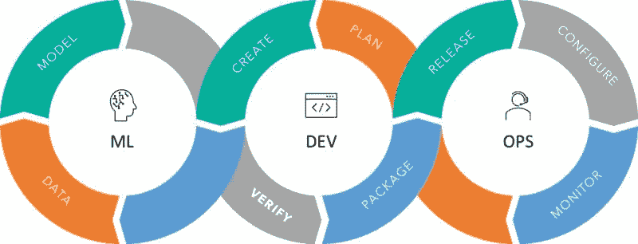

# MLOps 是一门工程学科：初学者概述

> 原文：[`www.kdnuggets.com/2021/07/mlops-engineering-discipline.html`](https://www.kdnuggets.com/2021/07/mlops-engineering-discipline.html)

评论

**由 Angad Gupta 提供，数据科学学生**

### **介绍**

MLOps 是 ML + DEV + OPS 的结合。MLOps 基本上通过增加自动化来提高生产可扩展性和生产模型的质量。

* * *

## 我们的三大课程推荐

 1\. [谷歌网络安全证书](https://www.kdnuggets.com/google-cybersecurity) - 快速进入网络安全职业

 2\. [谷歌数据分析专业证书](https://www.kdnuggets.com/google-data-analytics) - 提升你的数据分析技能

 3\. [谷歌 IT 支持专业证书](https://www.kdnuggets.com/google-itsupport) - 支持你的组织在 IT 方面

* * *

MLOps 是将长期存在的 DevOps 实践与新兴的机器学习领域结合起来的理念。它是创建一个自动化环境，集成模型开发、模型再训练、漂移监控、管道自动化、质量控制和模型治理于一个平台中。

图片来源：techinnocens

MLOps 团队包括策划数据集和设计 AI 模型的数据科学家，以及以自动化方式运行这些模型和数据集的机器学习工程师。

### **为什么 MLOps 很重要**

MLOps 团队将帮助你解决以下问题：

**部署问题：**

1.  使用多种语言构建机器学习

1.  模型在开发和生产环境中的部署

1.  解决模型部署中出现的问题

1.  准备具有不同语言的部署包

**监控问题：**

1.  模型性能监控

1.  一致的方式来监控在整个组织中部署的模型

**模型生命周期管理问题：**

1.  需要数据科学家参与更新生产模型和维护活动

1.  追踪初始部署后的模型衰退

**模型治理：**

1.  生产访问控制

1.  可追溯的模型结果

1.  模型审核记录

1.  模型升级审批工作流程

### **MLOps 的目标**

MLOps 的目标包括：

+   部署和自动化

+   模型训练与升级

+   操作诊断与修复

+   数据治理和业务合规性

+   生产可扩展性

+   团队协作

+   监控和管理

### **主要好处**

**创建可重复的工作流管道和 ML 模型：** 管道是机器学习工作流基础设施的骨干。管道帮助从源系统获取数据，处理和验证数据。它还跟踪所有活动，如模型版本、用于训练模型的数据集等。

+   创建机器学习流水线以设计、部署和重现模型部署。

+   提供跟踪代码版本、数据、各种矩阵以及执行日志的机制。

**在任何生产环境中轻松部署模型：** 机器学习模型本质上是复杂的，每次部署都需要资源以高效运行模型。机器学习模型的部署需要自动化系统来提供和管理所需资源并进行正确的执行。

+   快速且完美地部署机器学习模型。

+   自动控制云资源的使用。

+   在部署之前进行模型验证和各种测试。

+   预定义专用系统，以将模型从部署迁移到生产系统。

**机器学习生命周期管理：** 最终的机器学习模型可能嵌入许多相关的微服务和辅助服务。需要跟踪机器学习模型中使用的所有相关资源，以便进一步改进和验证。

+   使用有效的集成工具跟踪模型开发及其组件，并通过专用工具集成所有组件。

+   进行高级偏差数据分析，以跨时间段验证模型性能。

**机器学习资源控制和管理：** 机器学习模型需要不断使用不同的数据集进行训练，因此必须跟踪模型版本、代码版本、数据集版本以及相关所需资源。

+   跟踪模型版本历史以备审计目的。

+   评估特征的重要性，并使用均匀分布指标创建具有最小偏差的更高级模型。

+   设置资源配额并建立适当的政策，以根据需求增加/减少这些资源，从而高效地运行模型。

+   创建审计记录，以满足监管要求，并自动追踪实验。

### **最佳实践**

**ML 流水线：** 设置各种 ML 流水线，例如数据流水线，以定义依赖关系及其执行顺序，并生成用于监控特定流水线资源的矩阵。

**混合团队：** MLOps 包含数据科学家、机器学习工程师、DevOps 工程师和数据工程师的工作；这样的混合团队希望通过设计能快速高效地处理问题。

**模型和数据版本控制：** 除了维护代码版本外，我们还需要维护机器学习模型版本、用于训练模型的数据、模型的超参数和模型的元数据等；模型版本控制不仅仅是处理最终模型本身。

**模型验证：** 需要设置统计测试以进行模型验证，因为模型验证不能仅仅通过合格/不合格或真/假来衡量；它更加复杂，详细的统计测试可以提供有价值的教训。

**数据验证：** 在对提供的数据进行模型训练之前，必须验证输入数据，以避免模型插入不确定性和偏差

**监控：** 随着训练和部署模型占用越来越多的资源，通过可视化模型使用的各种资源矩阵来监控模型性能变得更加重要

### **辅助 MLOps 的平台和工具**

如上所述，以下类型的平台和工具可以辅助 MLOps：

+   专门用于模型跟踪、模型历史和模型注册信息的工具

+   旨在进行模型版本控制以及版本控制模型的各种单独方面（代码、数据集等）的工具

+   执行模型实验以及模型和 ML 管道部署的云服务平台

### **结论**

MLOps 是工程学科的一个新分支。它是由机器学习工程师、DevOps 和数据科学家组成的混合团队，帮助检索数据、验证数据、部署机器学习模型，并用适当的数据集进行训练。MLOps 还帮助监控模型输出，以优化模型，运行并无缝产生所需的输出。MLOps 对于部署和训练模型以及跟踪模型和相关数据集非常有帮助。

**个人简介：[Angad Gupta](https://www.linkedin.com/in/angad-gupta-37007a37/)** 目前在 AutoGrid India Pvt Ltd 担任客户交付工程师，并在 Bits Pilani 攻读数据科学硕士学位。你可以在[LinkedIn](https://www.linkedin.com/in/angad-gupta-37007a37/)上关注他。

**相关：**

+   释放 MLOps 和 DataOps 在数据科学中的力量

+   使用 PyCaret + MLflow 轻松实现 MLOps

+   将 Docker 化的 FastAPI 应用部署到 Google Cloud Platform

### 更多相关主题

+   [25 门免费课程掌握数据科学、数据工程、机器学习等](https://www.kdnuggets.com/25-free-courses-to-master-data-science-data-engineering-machine-learning-mlops-and-generative-ai)

+   [免费课程集合：学习数据科学、数据工程等](https://www.kdnuggets.com/collection-of-free-courses-to-learn-data-science-data-engineering-machine-learning-mlops-and-llmops)

+   [数据工程初学者指南](https://www.kdnuggets.com/2023/07/beginner-guide-data-engineering.html)

+   [机器学习中的设计模式用于 MLOps](https://www.kdnuggets.com/2022/02/design-patterns-machine-learning-mlops.html)

+   [MLOps 是个混乱的局面，但这在意料之中](https://www.kdnuggets.com/2022/03/mlops-mess-expected.html)

+   [MLOps 全面指南](https://www.kdnuggets.com/2023/08/comprehensive-guide-mlops.html)
