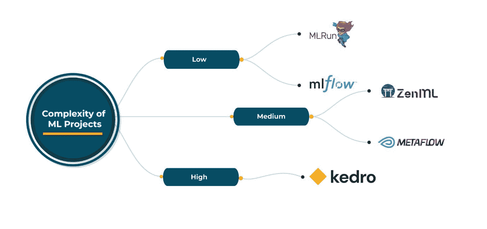

# MLOps 思维方式：始终保持生产就绪

> 原文：[`www.kdnuggets.com/2023/07/mlops-mindset-always-productionready.html`](https://www.kdnuggets.com/2023/07/mlops-mindset-always-productionready.html)

机器学习（ML）在许多领域的成功带来了新的挑战——特别是需要持续训练和评估模型，并不断检查训练数据的漂移。持续集成和部署（CI/CD）是任何成功软件工程项目的核心，通常被称为 DevOps。DevOps 帮助简化代码演变，支持各种测试框架，并提供灵活性以实现对不同部署服务器（开发、预发布、生产等）的选择性部署。

与机器学习相关的新挑战扩展了传统的 CI/CD 范畴，还包括现在常被称为持续训练（CT）的内容，这一术语最早由[谷歌](https://cloud.google.com/architecture/mlops-continuous-delivery-and-automation-pipelines-in-machine-learning#mlops_level_1_ml_pipeline_automation)提出。持续训练要求机器学习模型在新的数据集上进行持续训练，并在部署到生产环境之前进行评估，以满足预期，还需支持更多机器学习特定功能。如今，在机器学习背景下，DevOps 正逐渐被称为 MLOps，包括 CI、CT 和 CD。

# MLOps 原则

所有产品开发都基于一定的原则，MLOps 也不例外。以下是三个最重要的 MLOps 原则。

1.  **持续 X：** MLOps 的重点应放在演变上，无论是持续训练、持续开发、持续集成还是任何持续演变/变化的内容。

1.  **跟踪一切：** 由于机器学习的探索性特征，需要像科学实验一样跟踪和收集所有发生的事情。

1.  **拼图方法：** 任何 MLOps 框架都应支持可插拔组件。然而，重要的是要找到正确的平衡：过多的可插拔性会导致兼容性问题，而过少则限制了使用。

牢记这些原则，让我们确定治理良好 MLOps 框架的关键要求。

# MLOps 要求

如前所述，机器学习驱动了 Ops 的一系列独特要求。

1.  **可重复性：** 使机器学习[实验能够重复](https://arxiv.org/pdf/2205.02302.pdf)相同的结果，以验证性能。

1.  **版本控制：** 从各个方向维护版本控制，包括：数据、代码、模型和配置。一种执行“数据-模型-代码”版本控制的方法是使用如 GitHub 之类的版本控制工具。

1.  **管道化：** 尽管基于有向无环图（DAG）的管道在非 ML 场景（如 Airflow）中经常使用，ML 带来了自己的管道需求以实现持续训练。管道组件的可重用性对于训练和预测确保特征提取的一致性，并减少数据处理错误。

1.  **编排与部署：** ML 模型训练需要一个涉及 GPU 的分布式机器框架，因此，在云中执行管道是 ML 训练周期的固有部分。基于各种条件（指标、环境等）的模型部署在机器学习中带来了独特的挑战。

1.  **灵活性：** 使选择数据源、选择云服务提供商和决定不同工具（数据分析、监控、ML 框架等）变得灵活。灵活性可以通过提供外部工具插件选项和/或提供定义自定义组件的能力来实现。一个灵活的编排与部署组件可以确保云中立的管道执行和 ML 服务。

1.  **实验跟踪：** 对于 ML 而言，实验是任何项目的隐性组成部分。经过多轮实验（即对架构或架构中的超参数进行实验）后，ML 模型会成熟。记录每次实验以供将来参考对于 ML 是至关重要的。可以使用实验跟踪工具来确保代码和模型版本控制，而类似 DVC 的工具则确保代码-数据版本控制。

# 实际考虑

在创建 ML 模型的兴奋中，通常会忽略一些特定的 ML 卫生问题：如初步数据分析、超参数调整或预处理/后处理。在许多情况下，项目开始时缺乏 ML 生产思维，这会导致项目后期出现意外情况（内存问题、预算超支等），特别是在生产阶段，导致重新建模和市场发布时间的延迟。但从 ML 项目开始就使用 MLOps 框架可以及早解决生产考虑问题，并强制实施系统化的方法来解决机器学习问题，如数据分析、实验跟踪等。

MLOps 还使得在任何给定时刻都能准备好生产变得可能。这对于需要更短市场发布时间的初创企业尤其重要。通过提供编排与部署方面的灵活性，MLOps 使得通过预定义编排器（如 github action）或部署器（如 MLflow、KServe 等）来实现生产就绪成为可能，这些都是 MLOps 管道的一部分。

# 现有的 MLOps 框架

云服务提供商如 Google、Amazon、Azure 提供了自己的 MLOps 框架，可以在其平台上使用，或作为现有机器学习框架（如 Tensorflow 框架中的 TFX 管道）的一部分。这些 MLOps 框架易于使用，功能全面。

使用来自云服务提供商的 MLOps 框架会限制组织在其环境中使用 MLOps。对于许多组织来说，这成为了一个大限制，因为云服务的使用取决于客户的需求。在许多情况下，需要一个在选择云提供商方面具有灵活性，并且拥有 MLOps 大部分功能的框架。

开源 MLOps 框架在这种情况下非常有用。ZenML、MLRun、Kedro、Metaflow 是一些广泛使用的知名开源 MLOps 框架，它们各有其[优缺点](https://neptune.ai/blog/best-workflow-and-pipeline-orchestration-tools)。这些框架在选择云提供商、编排/部署和机器学习工具方面都提供了良好的灵活性。选择任何一个开源框架取决于特定的 MLOps 需求。然而，所有这些框架都足够通用，可以满足各种需求。

根据对这些开源 MLOps 框架当前状态的经验，我推荐如下：

# 早期采用 MLOps

MLOps 是 DevOps 的下一次演变，汇集了来自不同领域的人：数据工程师、机器学习工程师、基础设施工程师等。未来我们可以期待 MLOps 变得低代码，类似于我们今天在 DevOps 中看到的情况。尤其是初创公司应该在开发早期就采纳 MLOps，以确保更快的市场时间，以及它带来的其他好处。

**[Abhishek Gupta](https://www.linkedin.com/in/abhishek-gupta-93a6808/)** 是 [Talentica Software](https://www.talentica.com/) 的首席数据科学家。在他目前的角色中，他与许多公司紧密合作，帮助他们在产品线中应用 AI/ML。Abhishek 是印度科学学院（IISc Bangalore）的校友，已有超过 7 年的 AI/ML 和大数据领域的工作经验。他在通信网络和机器学习等多个领域拥有许多专利和论文。

* * *

## 我们的三大课程推荐

 1\. [Google 网络安全证书](https://www.kdnuggets.com/google-cybersecurity) - 加入网络安全职业的快速通道。

 2\. [Google 数据分析专业证书](https://www.kdnuggets.com/google-data-analytics) - 提升你的数据分析技能

 3\. [Google IT 支持专业证书](https://www.kdnuggets.com/google-itsupport) - 支持你的组织进行 IT

* * *

### 更多相关话题

+   [为什么我们永远需要人类来训练 AI — 有时是实时的](https://www.kdnuggets.com/2021/12/why-we-need-humans-training-ai.html)

+   [事物并非总是正常：一些“其他”分布](https://www.kdnuggets.com/2023/01/things-arent-always-normal-distributions.html)

+   [持续学习：AI 如何防止数据泄露](https://www.kdnuggets.com/2023/07/always-learning-ai-prevents-data-breaches.html)

+   [StarCoder：你一直想要的编码助手](https://www.kdnuggets.com/2023/05/starcoder-coding-assistant-always-wanted.html)

+   [MLOps 的机器学习设计模式](https://www.kdnuggets.com/2022/02/design-patterns-machine-learning-mlops.html)

+   [MLOps 一团糟，但这是预期之中的](https://www.kdnuggets.com/2022/03/mlops-mess-expected.html)
