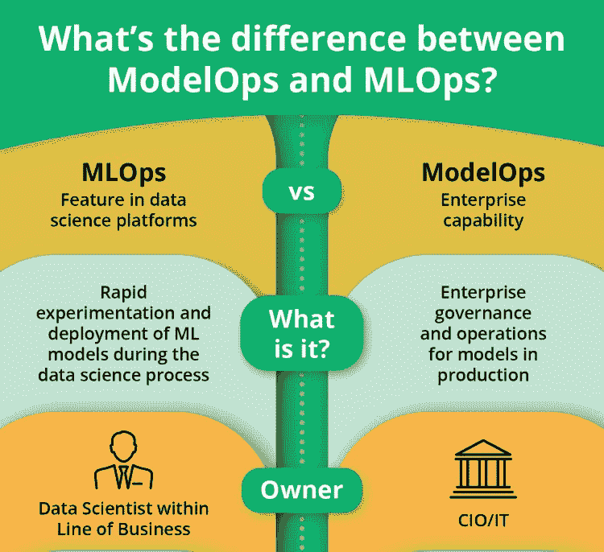
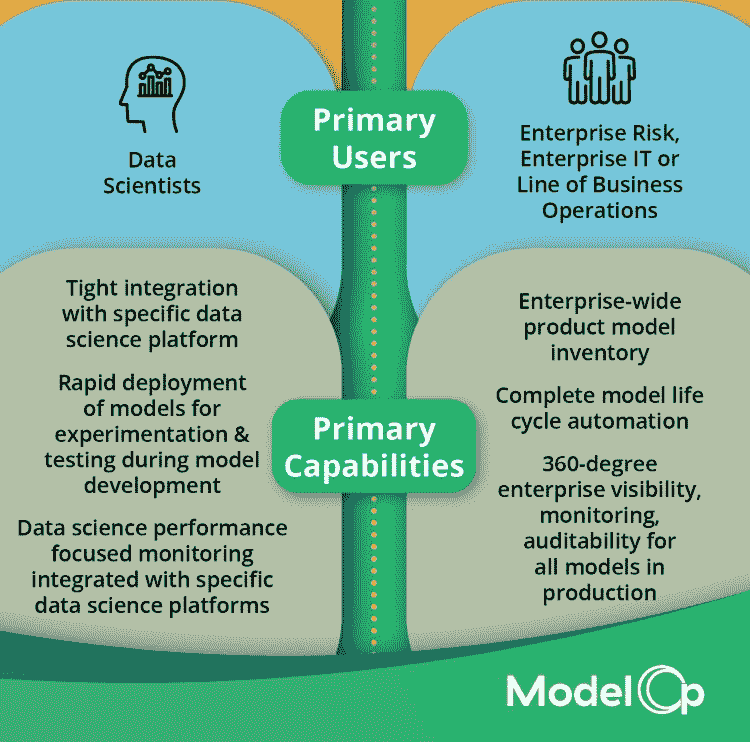
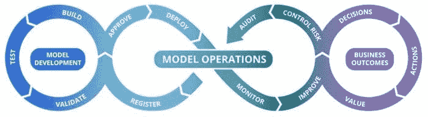

# MLOps 和 ModelOps：区别是什么，为什么重要

> 原文：[`www.kdnuggets.com/2021/09/mlops-modelops-difference.html`](https://www.kdnuggets.com/2021/09/mlops-modelops-difference.html)

评论

**作者：[Stu Bailey](https://www.linkedin.com/in/stubaileyblox/)，ModelOp 联合创始人及首席企业 AI 架构师**。

你知道吗，约有一半开发的 AI 模型实际上并没有投入生产？如果你想了解原因，并防止数据科学家的时间和其他资源在你的组织中被浪费，那么了解 MLOps 和 ModelOps 之间的区别是很重要的。这两个术语并不相同，但常常被互换使用。对 MLOps 和 ModelOps 特定角色和价值的不了解削弱了企业 AI 项目的价值。了解 MLOps 和 ModelOps 之间的区别很重要，因为它们各有其独特的作用，并不能相互替代。

本博客解决以下问题：

+   MLOps 和 ModelOps 有什么区别

+   各自的用途是什么？

+   谁在使用它们？

+   你的组织需要哪个？（这是个伪问题，你可能需要两者。）

+   使用 MLOps 和 ModelOps 的价值是什么？

理解和重视 ModelOps 和 MLOps 之间的区别很重要，因为虽然两者都需要，但只有其中之一能完全解决拖慢近三分之二企业 AI 项目的运营和治理过程问题（[2021 年 ModelOps 状态报告](https://business-of-data.com/reports/state-of-modelops-2021/)）。

### MLOps 和 ModelOps 之间的主要区别

MLOps 帮助**数据科学家**在数据科学过程中快速实验和部署 ML 模型。它是像 [Amazon](https://www.linkedin.com/company/amazon/) Sagemaker、[Domino Data Lab](https://www.linkedin.com/company/domino-data-lab/) 和 [DataRobot](https://www.linkedin.com/company/datarobot/) 这样的成熟和不断成熟的数据科学平台的一个特性。

ModelOps 是针对所有生产中的 AI 和分析模型的企业操作和治理，确保所有模型的独立验证和问责，以便无论这些模型如何创建，都能进行对业务产生影响的决策。[ModelOp Center](http://www.modelop.com/) 等 ModelOps 平台自动化了模型操作的各个方面，无论模型的类型、开发方式或模型的运行位置如何。

### 各自的用途及使用者

MLOps 工具和功能用于开发机器学习（ML）模型。包括 ML 模型的实际编码、测试、训练、验证和重新训练。数据科学家负责模型开发，与 DataOps 和数据分析团队紧密合作，以识别模型所需的适当数据和数据集。数据科学家通常与业务线对齐，并专注于特定业务单元或项目的目标。

ModelOps 平台和功能用于确保生产中的任何和所有模型的可靠和最佳结果。包括管理生产中的所有模型方面，例如盘点生产中的模型，确保生产模型提供可靠的决策，并遵守所有监管、合规和风险要求及控制。CIO 和 IT 运营部门与业务线合作，负责建立和实施满足企业需求的 ModelOps 平台。

### MLOps 和 ModelOps 的价值

MLOps 和 ModelOps 是互补的解决方案，而非竞争关系。ModelOps 解决方案无法构建模型，而 MLOps 无法在整个企业生命周期中管理和治理生产模型。

一些 MLOps 解决方案提供有限的管理能力，但当企业开始扩大 AI 工作并统一执行风险和合规控制时，这些限制往往变得明显。此外，“经过验证”的做法是开发和生产操作之间要有检查和制衡，这适用于每个开发并投入生产的模型。历史已经证明，“学生自己评分”或“狐狸看守鸡舍”是不行的。

ModelOps 平台自动化模型的风险、监管和操作方面，并确保模型可以被审计和评估其技术合规性、商业价值及业务和操作风险。通过将这些企业能力与 MLOps 工具的效率结合，企业可以利用其 MLOps 工具的投资，建立一个加速、扩展和治理企业 AI 的基础平台。

**简介：** [Stu Bailey](https://www.linkedin.com/in/stubaileyblox/) 是 ModelOp 的首席企业 AI 架构师。他是一位技术专家和企业家，专注于分析和数据密集型分布式系统已有二十多年，帮助大型非数字化企业扩大和管理其 AI 计划。Stu 是 Infoblox (NYSE:BLOX) 的创始人和最近的首席科学家。在多年的成功产品市场推广过程中，Stu 获得了多项专利和奖项，并帮助推动了分析和分布式系统控制的新兴标准。在担任国家数据挖掘中心技术负责人期间，Stu 首先开创了一些使用模型交换格式的分析应用。

**相关：**

+   [将 ModelOps 纳入你的 AI 战略](https://www.kdnuggets.com/2021/08/modelops-ai-strategy.html)

+   [MLOps 最佳实践](https://www.kdnuggets.com/2021/07/mlops-best-practices.html)

+   [关于 AI 系统真正成本的七个神话](https://www.kdnuggets.com/2019/10/seven-myths-costs-ai-system.html)

* * *

## 我们的三大课程推荐

 1\. [谷歌网络安全证书](https://www.kdnuggets.com/google-cybersecurity) - 快速进入网络安全职业轨道

 2\. [谷歌数据分析专业证书](https://www.kdnuggets.com/google-data-analytics) - 提升你的数据分析水平

 3\. [谷歌 IT 支持专业证书](https://www.kdnuggets.com/google-itsupport) - 支持你的组织 IT

* * *

### 更多相关主题

+   [你需要了解的数据管理的 6 件事及其重要性……](https://www.kdnuggets.com/2022/05/6-things-need-know-data-management-matters-computer-vision.html)

+   [为什么数据可视化技能提升很重要（以及如何开始）](https://www.kdnuggets.com/2022/07/sphere-upskilling-data-vis-matters.html)

+   [超越编码：为什么人情味至关重要](https://www.kdnuggets.com/beyond-coding-why-the-human-touch-matters)

+   [ModelOps：你需要知道的认证信息](https://www.kdnuggets.com/2022/09/sas-modelops-need-know-get-certified.html)

+   [数据分析师和数据科学家有什么区别？](https://www.kdnuggets.com/2022/03/difference-data-analysts-data-scientists.html)

+   [NLP、NLU 和 NLG：有什么区别？全面指南](https://www.kdnuggets.com/2022/06/nlp-nlu-nlg-difference-comprehensive-guide.html)
