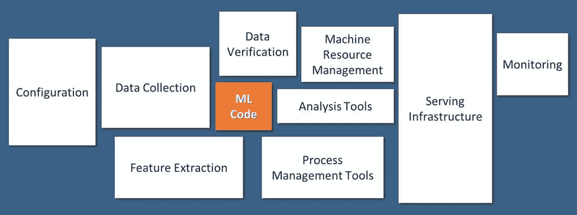
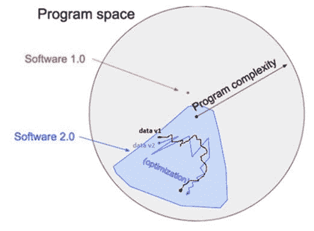
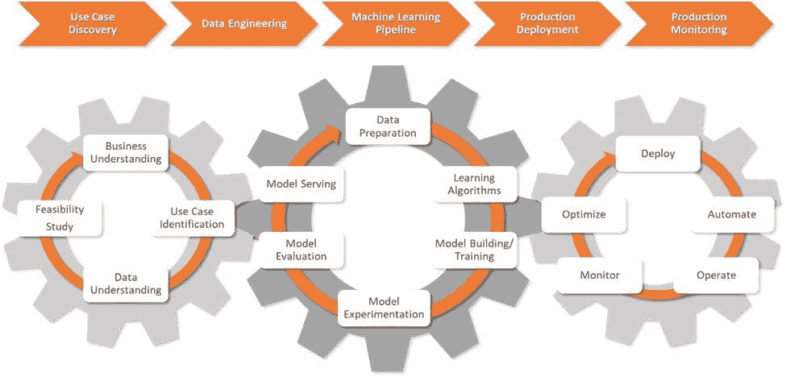

# MLOps - “为何需要？” 和 “它是什么？”

> 原文：[`www.kdnuggets.com/2020/12/mlops-why-required-what-is.html`](https://www.kdnuggets.com/2020/12/mlops-why-required-what-is.html)

评论

**由 [Arnab Bose](https://www.linkedin.com/in/arnab-bose-phd-6369531/)（首席科学官）和 [Aditya Aggarwal](https://www.linkedin.com/in/aditya-agarwal-2395076/)（高级分析实践负责人，Abzooba）**

### MLOps 动机

* * *

## 我们的前三个课程推荐

 1\. [谷歌网络安全证书](https://www.kdnuggets.com/google-cybersecurity) - 快速进入网络安全职业的快车道。

 2\. [谷歌数据分析专业证书](https://www.kdnuggets.com/google-data-analytics) - 提升你的数据分析能力

 3\. [谷歌 IT 支持专业证书](https://www.kdnuggets.com/google-itsupport) - 支持你组织的 IT

* * *

数据科学家构建的机器学习（ML）模型仅占企业生产部署工作流中的一小部分，如下图 1 所示 [[1](http://papers.nips.cc/paper/5656-hidden-technical-debt-in-machine-learning-systems)]。为了将 ML 模型投入运营，数据科学家需要与多个其他团队紧密合作，如业务、工程和运营团队。这在组织层面上代表了沟通、协作和协调方面的挑战。MLOps 的目标是通过成熟的实践来简化这些挑战。此外，MLOps 带来了敏捷性和速度，这在当今数字世界中是基石。

*图 1: 现实世界的机器学习系统仅有一小部分由 ML 代码组成，如图中间的小框所示。所需的外围基础设施广泛且复杂。*

### MLOps 挑战与 DevOps 类似

机器学习模型运营化的挑战与软件生产化有很多共同之处，而 DevOps 已经证明了自己在这方面的有效性。

因此，采纳 **DevOps 的最佳实践** 是帮助数据科学家克服软件生产化常见挑战的明智方法。例如，DevOps 提倡的敏捷方法论相比于瀑布方法论，能显著提升效率。表 1 中列出了 MLOps 中使用的额外 DevOps 实践。​​​​​​​​​​​​​​​​​​​​​

**表 1: MLOps 利用 DevOps。**

| **机器学习模型运营化挑战** | **来自 DevOps 的解决方案** |
| --- | --- |
| **1) 持续集成和持续交付（CI/CD）:** 设置一个流水线，以便更新能够准确、安全、无缝地持续构建并准备好生产。 | 使用 **CI/CD 框架** 来构建、测试和部署软件。它提供了可重复性、安全性和代码版本控制的好处。 |
| **2) 更长的开发到部署生命周期**：数据科学家开发模型/算法并将其交给运营部门部署到生产环境中。缺乏协调和不当的交接导致了延迟和错误。**3) 团队之间沟通不畅导致最终解决方案的延迟：** 机器学习解决方案的评估通常在项目生命周期的末期进行。由于开发团队通常各自为政，解决方案对其他利益相关者来说变成了黑箱。缺乏中间反馈使情况更糟。这些都在时间、精力和资源方面带来了重大挑战。 | **敏捷方法** 通过在初始阶段就强制执行端到端的管道设置来解决这个协调问题。敏捷方法将项目划分为若干个冲刺。在每个冲刺中，开发者交付准备好部署的增量特性。每个冲刺的输出（通过管道制作）从项目的早期阶段开始对每个成员可见。因此，**最后一分钟惊喜的风险减少**，而**早期反馈**成为一种常见做法。在行业术语中，这对协调问题做了“左移”。 |

### MLOps 挑战与 DevOps 的不同

根据行业术语，MLOps 是机器学习的 DevOps。虽然在某种程度上是正确的，但 MLOps 平台需要解决典型的机器学习挑战。

这种挑战的一个例子是数据的角色。在传统的软件工程（即软件 1.0）中，开发者编写逻辑和规则（作为代码），这些逻辑和规则在程序空间中定义明确，如图 2 所示 [[2](https://medium.com/%40karpathy/software-2-0-a64152b37c35)]。然而，在机器学习（即软件 2.0）中，数据科学家编写代码来定义如何使用参数解决业务问题。参数值是通过数据（如梯度下降技术）找到的。这些值可能会随着数据的不同版本而改变，从而改变代码的行为。换句话说，数据在定义输出时与编写的代码同样重要，并且二者可以独立变化。这为软件中需要定义和跟踪的模型代码增加了一层数据复杂性。

*图 2：软件 1.0 与软件 2.0。*

需要由 MLOps 平台处理的各种挑战列在表 2 中。

**表 2：机器学习特定挑战。**

| **机器学习特定挑战** | **描述** |
| --- | --- |
| **1) 数据和超参数版本管理** | 在传统的软件应用中，代码版本管理工具用于跟踪更改。版本控制是任何持续集成（CI）解决方案的前提条件，因为它使得完全自动化的重现成为可能。源代码中的任何更改都会触发 CI/CD 流水线来构建、测试并交付生产就绪的代码。在机器学习中，如果算法代码、超参数或数据发生变化，输出模型也可能会发生变化。虽然代码和超参数由开发人员控制，但数据的变化可能无法控制。这就需要数据和超参数版本管理的概念，除了算法代码之外。请注意，数据版本管理对于图像和音频等非结构化数据是一个挑战，而 MLOps 平台采用独特的方法来应对这一挑战。 |
| **2) 迭代开发和实验** | 机器学习算法和模型开发是**迭代和实验性的**。它需要大量的参数调优和特征工程。机器学习流水线与数据版本、算法代码版本和/或超参数一起工作。这些工件中的任何变化（独立）都会触发新的可部署模型版本，从而需要进行实验和度量计算。MLOps 平台跟踪这些工件的完整谱系。 |
| **3) 测试** | **机器学习需要数据和模型测试**，以便尽早发现问题。**a) 数据验证 -** 检查数据是否干净且没有异常，新数据是否符合先前的分布。**b) 数据预处理 -** 检查数据是否高效且可扩展地进行预处理，避免任何训练-服务偏差 [[3](https://mlsys.org/Conferences/2019/doc/2019/167.pdf)]。**c) 算法验证 -** 根据业务问题跟踪分类/回归指标，并确保算法公平性。 |
| **4) 安全性** | 生产中的机器学习模型通常是一个更大系统的一部分，其输出被应用程序消费，这些应用程序可能是已知的也可能是未知的。这带来了多种安全风险。MLOps 需要提供**安全性和访问控制**，以确保机器学习模型的输出仅被已知用户使用。 |
| **5) 生产监控** | **生产中的模型需要持续监控**，以确保模型在处理新数据时的表现符合预期。监控的维度包括协变量偏移、先验偏移等 |
| **6) 基础设施要求** | 机器学习应用需要**规模和计算能力**，这转化为复杂的基础设施。例如，实验过程中可能需要 GPU，生产扩展可能需要动态进行。 |

### MLOps 组件

​​​​​​​根据 MLOps 的背景及其与 DevOps 的相似性和差异，以下描述了 MLOps 框架的不同组件，如图 3 所示。其底层工作流程通过敏捷方法论，如第二部分所示。

*图 3：MLOps 框架。*

1.  **用例发现：** 这一阶段涉及业务和数据科学家之间的协作，以定义业务问题，并将其转化为通过 ML 解决的问题陈述和目标，以及相关的 KPI（关键绩效指标）。

1.  ​​​​**数据工程：** 这一阶段涉及数据工程师和数据科学家之间的合作，以从各种来源获取数据，并为建模准备数据（处理/验证）。

1.  ​​​​​​​**机器学习管道：** 这一阶段设计和部署一个与 CI/CD 集成的管道。数据科学家使用管道进行多次实验和测试。平台跟踪数据和模型的谱系以及实验中的相关 KPI。

1.  **生产部署：** 这一阶段涉及将系统安全无缝地部署到选择的生产服务器中，无论是公共云、本地服务器还是混合模式。

1.  **生产监控：** 这一阶段包括模型和基础设施的监控。使用配置的 KPI（如输入数据分布的变化或模型性能的变化）对模型进行持续监控。为更多的实验设置触发器，涉及新算法、新数据和超参数，这些会生成新版本的 ML 管道。基础设施根据内存和计算需求进行监控，并在需要时进行扩展。

​​​​​

**参考文献**

1.  Sculley, G. Holt, D. Golovin, E. Davydov, T. Phillips, D. Ebner, V. Chaudhary, M. Young, J. Crespo, 和 D. Dennison, “机器学习系统中的隐性技术债务”，在《神经信息处理系统进展 28：神经信息处理系统年会 2015》，2015 年 12 月 7-12 日，加拿大蒙特利尔，2015 年，页 2503–2511。 [在线] 可用： [`papers.nips.cc/paper/5656-hidden-technical-debt-in-machine-learning-systems`](http://papers.nips.cc/paper/5656-hidden-technical-debt-in-machine-learning-systems)

1.  ​​​​​​​ Karpathy, "软件 2.0", 2017 年 11 月 12 日 [在线] 可用： [`medium.com/@karpathy/software-2-0-a64152b37c35`](https://medium.com/%40karpathy/software-2-0-a64152b37c35)

1.  Breck, M. Zinkevich, N. Polyzotis, S. Whang 和 S. Roy, "机器学习的数据验证"，在《第 2 届 SysML 会议论文集》，美国加州帕洛阿尔托，2019 年。可用： [`mlsys.org/Conferences/2019/doc/2019/167.pdf`](https://mlsys.org/Conferences/2019/doc/2019/167.pdf)

**简历：** [Dr. Arnab Bose](https://www.linkedin.com/in/arnab-bose-phd-6369531/) 是 Abzooba 的首席科学官，并且是芝加哥大学的兼职教授，教授机器学习与预测分析、机器学习操作、时间序列分析与预测以及健康分析。他是一位拥有 20 年预测分析行业经验的资深专家，喜欢利用结构化和非结构化数据预测和影响医疗保健、零售、金融和交通领域的行为结果。他目前的关注领域包括使用机器学习进行健康风险分层和慢性病管理，以及机器学习模型的生产部署和监控。

[Aditya Aggarwal](https://www.linkedin.com/in/aditya-agarwal-2395076/) 担任 Abzooba Inc. 的数据科学实践负责人。Aditya 拥有超过 12 年通过数据驱动解决方案推动业务目标的经验，专注于预测分析、机器学习、商业智能和业务战略，涉及多个行业。

**相关内容：**

+   [数据科学遇上 DevOps：使用 Jupyter、Git 和 Kubernetes 的 MLOps](https://www.kdnuggets.com/2020/08/data-science-meets-devops-mlops-jupyter-git-kubernetes.html)

+   [驯服 MLOps 中的复杂性](https://www.kdnuggets.com/2020/05/taming-complexity-mlops.html)

+   [部署机器学习模型意味着什么？](https://www.kdnuggets.com/2020/02/deploy-machine-learning-model.html)

### 更多相关话题

+   [MLOps：最佳实践及其应用方法](https://www.kdnuggets.com/2022/04/mlops-best-practices-apply.html)

+   [25 门免费课程，掌握数据科学、数据工程、机器学习……](https://www.kdnuggets.com/25-free-courses-to-master-data-science-data-engineering-machine-learning-mlops-and-generative-ai)

+   [学习数据科学、数据工程等的免费课程合集](https://www.kdnuggets.com/collection-of-free-courses-to-learn-data-science-data-engineering-machine-learning-mlops-and-llmops)

+   [MLOps 是一团糟，但这很正常](https://www.kdnuggets.com/2022/03/mlops-mess-expected.html)

+   [全面指南：MLOps](https://www.kdnuggets.com/2023/08/comprehensive-guide-mlops.html)

+   [Ploomber 与 Kubeflow：简化 MLOps](https://www.kdnuggets.com/2022/02/ploomber-kubeflow-mlops-easier.html)
