# 机器学习中的模型评估指标

> 原文：[`www.kdnuggets.com/2020/05/model-evaluation-metrics-machine-learning.html`](https://www.kdnuggets.com/2020/05/model-evaluation-metrics-machine-learning.html)

评论

预测模型已成为许多企业值得信赖的顾问，原因很充分。这些模型能够“预见未来”，而且有许多不同的方法可供选择，这意味着任何行业都能找到适合其特定挑战的方法。

当我们谈论预测模型时，我们讨论的要么是**回归模型**（连续输出），要么是**分类模型**（名义或二进制输出）。在分类问题中，我们使用两种类型的算法（依赖于生成的输出类型）：

1.  **类别输出**：像 SVM 和 KNN 这样的算法会生成类别输出。例如，在一个二分类问题中，输出将是 0 或 1。然而，如今我们有能够将这些类别输出转换为概率的算法。

1.  **概率输出**：像逻辑回归、随机森林、梯度提升、Adaboost 等算法提供概率输出。将概率输出转换为类别输出只需创建一个阈值概率。

* * *

## 我们的前三大课程推荐

 1\. [谷歌网络安全证书](https://www.kdnuggets.com/google-cybersecurity) - 快速入门网络安全职业

 2\. [谷歌数据分析专业证书](https://www.kdnuggets.com/google-data-analytics) - 提升您的数据分析技能

 3\. [谷歌 IT 支持专业证书](https://www.kdnuggets.com/google-itsupport) - 支持您的组织 IT 需求

* * *

### 介绍

数据准备和训练机器学习模型是机器学习流程中的关键步骤，但同样重要的是评估已训练模型的性能。模型在未见数据上的泛化能力是定义自适应与非自适应机器学习模型的标准。

通过使用不同的性能评估指标，我们应该能够在将模型投入生产之前提高其整体预测能力，特别是在未见数据上。

如果没有使用不同的指标对机器学习模型进行适当的评估，仅依赖准确性可能会导致模型在未见数据上部署时出现问题，进而产生较差的预测结果。

这发生是因为在这些情况下，我们的模型不是学习，而是记忆；因此，它们不能在未见数据上很好地泛化。

### 模型评估指标

现在让我们定义评估机器学习模型性能的评估指标，这是任何数据科学项目的重要组成部分。它旨在估计模型在未来（未见/样本外）数据上的泛化准确性。

### 混淆矩阵

混淆矩阵是任何二元测试的预测结果的矩阵表示，通常用于**描述分类模型**（或“分类器”）在一组已知真实值的测试数据上的性能。

混淆矩阵本身相对简单易懂，但相关术语可能会令人困惑。

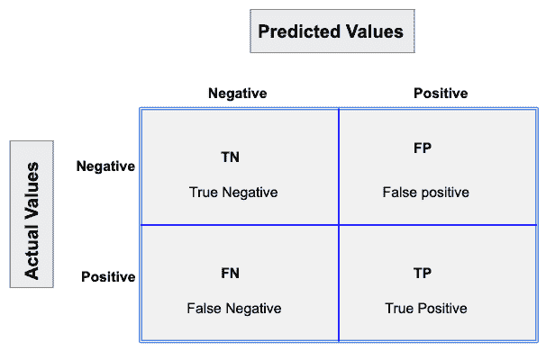

带有 2 个类别标签的混淆矩阵。

每个预测结果可以是四种结果中的一种，具体取决于它与实际值的匹配情况：

+   **真正正例（TP）：** 预测为真，现实中也为真。

+   **真正负例（TN）：** 预测为假，而现实中也为假。

+   **假正例（FP）：** 预测为真，现实中为假。

+   **假负例（FN）：** 预测为假，现实中为真。

现在让我们通过假设检验来理解这个概念。

**假设** 是基于不充分证据的推测或理论，需要进一步的测试和实验。通过进一步测试，假设通常可以被证明为真或假。

**零假设** 是一种假设，表示假设中的两个变量之间没有统计学意义。它是研究者试图证伪的假设。

> 当零假设为假时，我们总是会拒绝它；当零假设确实为真时，我们会接受它。

尽管假设检验旨在提供可靠结果，但**可能会发生两种类型的错误**。

这些错误被称为**第一类和第二类错误**。

例如，当检查药物的有效性时，零假设将是药物对疾病没有影响。

**第一类错误：** 等同于假正例（FP）。

第一类错误涉及拒绝一个真实的零假设。

让我们回到药物用于治疗疾病的例子。如果在这种情况下我们拒绝了零假设，那么我们声称药物确实对疾病有一些效果。但如果零假设为真，那么实际上药物根本没有对抗疾病。药物被错误地宣称对疾病有积极效果。

**第二类错误：** 等同于假负例（FN）。

另一种错误发生在我们接受了一个错误的零假设时。这种错误被称为第二类错误，也被称为第二类错误。

如果我们回到测试药物的情景，第二类错误会是什么样的？第二类错误会发生在我们接受药物对疾病没有效果的结论，但实际上药物确实有效的情况下。

混淆矩阵的一个 Python 实现示例。


带有 3 个类别标签的混淆矩阵。

对角线上的元素表示预测标签与真实标签相等的点的数量，而对角线之外的任何内容都被分类器误标记了。因此，混淆矩阵的对角线值越高越好，表示预测正确的数量多。

在我们的案例中，分类器准确地预测了所有 13 个山鸢尾和 18 个维吉尼亚鸢尾植物。然而，它错误地将 4 个变色鸢尾植物分类为维吉尼亚鸢尾。

还有一个通常从混淆矩阵中计算出的二分类器指标列表：

### 1\. 准确率

总体上，分类器的正确率是多少？

> 准确率 = (TP+TN)/总数

当我们的类别大致相等时，我们可以使用准确率，它将给出正确分类的值。

准确率是分类问题的常见评估指标。它是正确预测的数量与所有预测数量的比率。

**误分类率（错误率）：** 总体上，它出错的频率。由于准确率是我们正确分类的百分比（成功率），因此我们的错误率（错误的百分比）可以通过以下公式计算：

> 误分类率 = (FP+FN)/总数

我们使用 sklearn 模块来计算分类任务的准确率，如下所示。

验证集上的分类准确率为**88%**。

### 2\. 精确率

当预测为正时，模型的准确率是多少？

> 精确率 = TP/预测为正

当我们面对类别不平衡时，准确率可能成为评估性能的不可靠指标。例如，如果我们在两个类别 A 和 B 之间有 99/1 的分割，其中稀有事件 B 是我们的正类，我们可以构建一个通过仅仅说所有数据属于 A 类的模型来获得 99% 的准确率。显然，如果模型没有任何用于识别 B 类的功能，我们就不应该花时间去构建这个模型；因此，我们需要其他指标来避免这种情况。为此，我们使用精确率和召回率来代替准确率。

### 3\. 召回率或灵敏度

当实际为正时，模型预测为正的频率是多少？

> 真阳性率 = TP/实际为正

召回率给我们提供了**真实正例率** (**TPR**)，即真实正例与所有正例的比率。

在 A 类和 B 类之间 99/1 的情况下，所有数据都被分类为 A 的模型会导致正类 B 的召回率为 0%（精确率将未定义 — 0/0）。精确率和召回率提供了一种在面对类别不平衡时评估模型性能的更好方法。它们能正确地告诉我们模型对我们的使用案例几乎没有价值。

就像准确率一样，精确率和召回率也很容易计算和理解，但需要阈值。此外，精确率和召回率仅考虑混淆矩阵的一半：

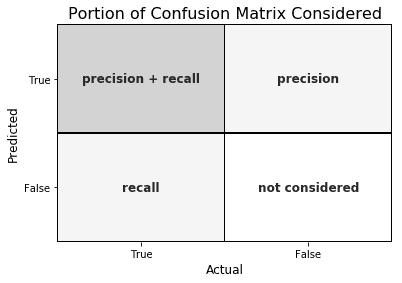

### 4\. F1 分数

F1 分数是[调和均值](https://en.wikipedia.org/wiki/Harmonic_mean)与[精确度和召回率](https://en.wikipedia.org/wiki/Precision_and_recall)的调和均值，F1 分数在 1（完美的精确度和召回率）时达到最佳值，在 0 时最差。

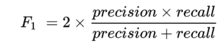

***为什么选择调和均值？*** 因为调和均值对列表中最小的元素有很强的偏斜，相较于算术均值，它倾向于减轻大异常值的影响，而加剧小异常值的影响。

F1 分数对极端值的惩罚更大。理想情况下，F1 分数可以在以下分类场景中作为有效的评估指标：

+   *当 FP 和 FN 的成本相等时——即它们错过真正的阳性或找到假阳性——两者对模型的影响几乎相同，如我们的癌症检测分类示例中所示*

+   *增加更多数据不会有效地改变结果*

+   *TN 很高（例如洪水预测、癌症预测等）*

一个 F1 分数的 Python 示例实现。

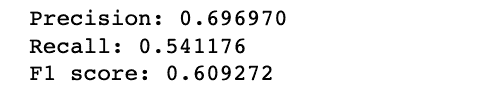

### 5\. 特异性

当预测为否时，它有多频繁预测为否？

> 真负率=TN/实际否

它是**真负率**或真实负例与所有应被分类为负例的比例。

请注意，特异性和敏感性一起考虑了完整的混淆矩阵：

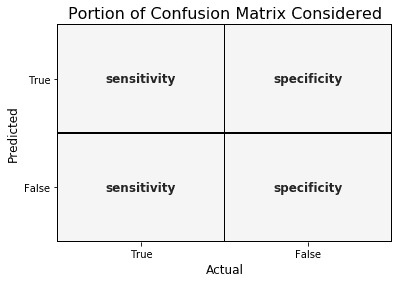

### 6\. 接收者操作特性（ROC）曲线

测量 ROC 曲线下的面积也是评估模型的一个非常有用的方法。通过绘制真正阳性率（敏感性）与假阳性率（1 — 特异性）的关系，我们得到**接收者操作特性**（**ROC**）**曲线**。该曲线使我们能够可视化真正阳性率与假阳性率之间的权衡。

以下是一些好的 ROC 曲线的例子。虚线表示随机猜测（没有预测价值），作为基准；低于该线的则被认为比猜测更差。我们希望接近左上角：

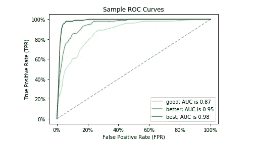

一个 ROC 曲线的 Python 示例实现。

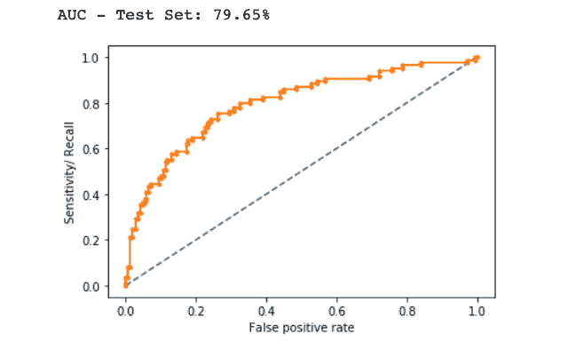

在上面的例子中，AUC 相对接近 1 且大于 0.5。完美的分类器将使 ROC 曲线沿 Y 轴，然后沿 X 轴延展。

### 对数损失

对数损失是基于概率的最重要的分类指标。

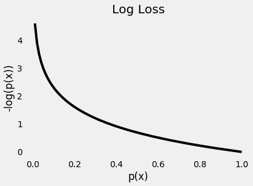

随着**预测概率**接近**真实类别**的**零**，**损失呈指数增加**

它衡量分类模型的性能，其中预测输入是介于 0 和 1 之间的概率值。Log loss 随着预测概率与实际标签的偏离而增加。任何机器学习模型的目标是最小化这个值。因此，较小的 log loss 更好，完美模型的 log loss 为 0。

Log Loss 的 Python 实现示例。

```py
Logloss: 8.02
```

### Jaccard 指数

Jaccard 指数是计算和评估分类 ML 模型准确性的一种最简单的方法之一。让我们通过一个例子来理解它。假设我们有一个标记的测试集，标签为 –

```py
y = [0,0,0,0,0,1,1,1,1,1]
```

我们的模型预测的标签为 –

```py
y1 = [1,1,0,0,0,1,1,1,1,1]
```

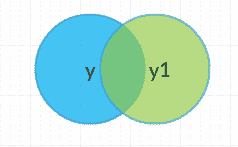

上面的维恩图展示了测试集的标签、预测标签及它们的交集和并集。

Jaccard 指数或 Jaccard 相似度系数是一种用于理解样本集之间相似性的统计量。该测量方法强调有限样本集之间的相似性，正式定义为交集的大小除以两个标记集的并集的大小，公式如下 –

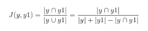

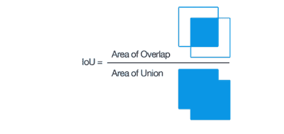

[Jaccard 指数或交集并集 (IoU)](https://commons.wikimedia.org/wiki/File:Intersection_over_Union_-_visual_equation.png)

因此，在我们的例子中，我们可以看到两个集合的交集等于 8（因为有八个值被正确预测），并且并集为 **10 + 10–8 = 12**。所以，Jaccard 指数给出的准确率为 –

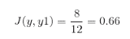

因此，根据 **Jaccard 指数**，我们的模型的准确率为 0.66，即 66%。

Jaccard 指数越高，分类器的准确率越高。

Jaccard 指数的 Python 实现示例。

```py
Jaccard Similarity Score : 0.375
```

### Kolmogorov Smirnov 图表

K-S 或 Kolmogorov-Smirnov 图表衡量分类模型的性能。更准确地说，K-S 是衡量正负分布之间分离程度的指标。

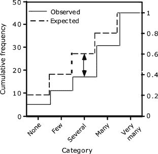

[观察到的和假设的分布的累计频率与有序频率绘制在一起。垂直双箭头表示最大垂直差异](https://www.sciencedirect.com/topics/medicine-and-dentistry/kolmogorov-smirnov-test)。

`K-S 为 100`，如果分数将总体划分为两个独立的组，其中一个组包含所有正样本，另一个组包含所有负样本。另一方面，如果模型无法区分正负样本，那么就像模型从总体中随机选择案例一样。`K-S 将为 0`。

在大多数分类模型中，K-S 值会在 0 和 100 之间，且值越高，模型在分离正负样本的能力越强。

K-S 检验也可以用于测试两个一维概率分布是否不同。这是一种非常有效的方式来确定两个样本是否显著不同。

Kolmogorov-Smirnov 的一个 Python 实现示例。

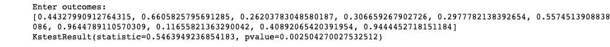

这里使用的零假设假定数据遵循正态分布。它返回统计量和 p 值。如果**p 值 < alpha**，我们将拒绝零假设。

*Alpha 定义为在零假设（H*0*）为真的情况下拒绝零假设的概率。对于大多数实际应用，alpha 选择为 0.05。*

### 增益和提升图表

增益或提升是分类模型效果的度量，计算为使用模型和不使用模型之间的结果比率。增益和提升图表是评估分类模型性能的可视化工具。然而，与评估整个数据集的混淆矩阵不同，增益或提升图表评估模型在数据部分的表现。

提升越高（即离基线越远），模型越好。

以下的增益图表，在验证集上运行，显示了使用 50%的数据时，模型包含了 90%的目标，增加更多的数据对模型中包含的目标百分比的增加几乎没有影响。

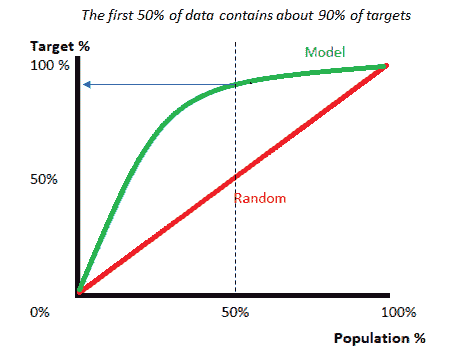

[增益/提升图表](https://www.datasciencecentral.com/profiles/blogs/comparing-model-evaluation-techniques-part-2)

提升图表通常显示为**累积提升图表**，也称为**增益图表**。因此，增益图表有时（可能会令人困惑地）称为“提升图表”，但它们更准确地被称为*cumulative*提升图表。

它们最常见的用途之一是在营销中，用来决定一个潜在客户是否值得联系。

### 基尼系数

**基尼系数**或基尼指数是一个用于处理不平衡类别值的流行指标。该系数的范围从 0 到 1，其中 0 表示完全平等，1 表示完全不平等。在这里，如果一个指标的值更高，则数据将更加分散。

基尼系数可以通过以下公式从 ROC 曲线下的面积计算得出：

> 基尼系数 = (2 * ROC_curve) — 1

### 结论

理解机器学习模型在未见数据上的表现如何是使用这些评估指标的最终目的。像准确率、精确率、召回率这样的指标适用于评估平衡数据集的分类模型，但如果数据不平衡且存在类别差异，则其他方法如 ROC/AUC、基尼系数在评估模型性能方面表现更好。

好的，这就结束了这篇文章**。**希望大家喜欢阅读这篇文章，欢迎在评论区分享你的评论/想法/反馈。

**感谢阅读！！！**

**简历：[纳戈什·辛格·乔汉](https://www.linkedin.com/in/nagesh-singh-chauhan-6936bb13b/)** 是 CirrusLabs 的大数据开发人员。他在电信、分析、销售、数据科学等各个领域拥有超过 4 年的工作经验，专注于各种大数据组件。

[原文](https://levelup.gitconnected.com/model-evaluation-metrics-in-machine-learning-8988739236fc)。已获授权转载。

**相关：**

+   主成分分析（PCA）降维

+   机器学习模型的超参数优化

+   DBSCAN 聚类算法在机器学习中的应用

### 更多相关话题

+   [机器学习评估指标：理论与概述](https://www.kdnuggets.com/machine-learning-evaluation-metrics-theory-and-overview)

+   [停止学习数据科学以寻找目标，并以寻找目标为目的…](https://www.kdnuggets.com/2021/12/stop-learning-data-science-find-purpose.html)

+   [数据科学统计学习的顶级资源](https://www.kdnuggets.com/2021/12/springboard-top-resources-learn-data-science-statistics.html)

+   [9 亿美元人工智能失败的分析](https://www.kdnuggets.com/2021/12/9b-ai-failure-examined.html)

+   [成功数据科学家的 5 个特征](https://www.kdnuggets.com/2021/12/5-characteristics-successful-data-scientist.html)

+   [是什么使 Python 成为初创公司的理想编程语言](https://www.kdnuggets.com/2021/12/makes-python-ideal-programming-language-startups.html)
