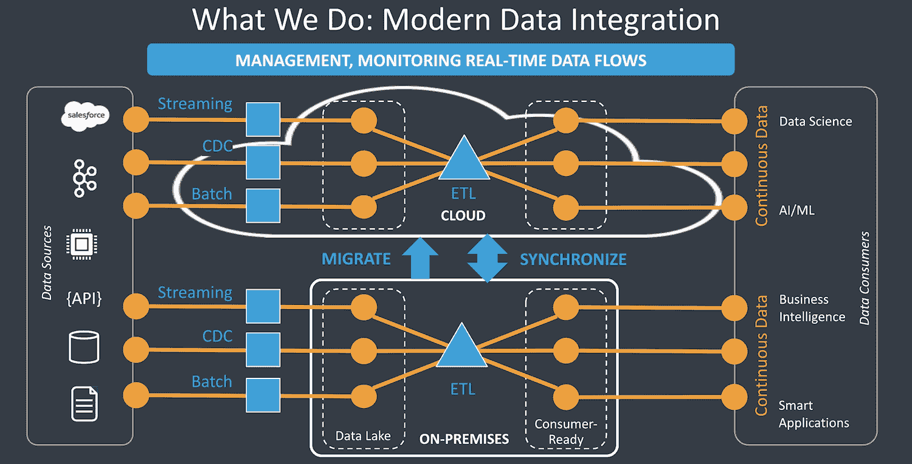
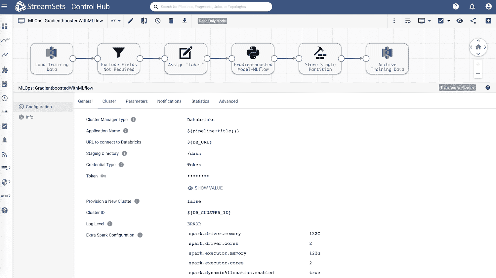
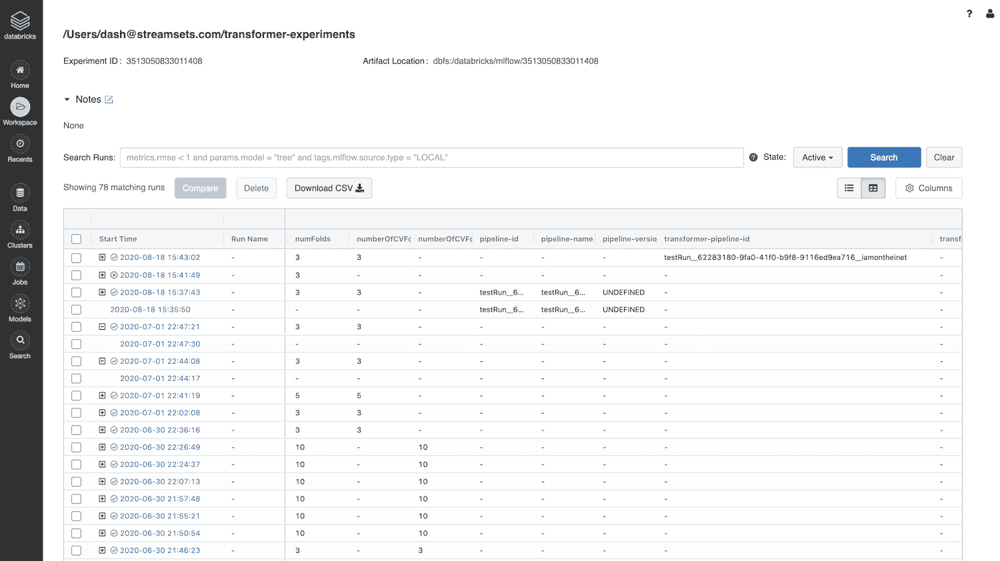
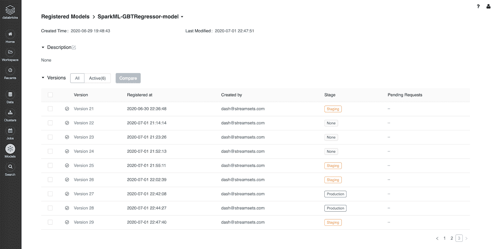
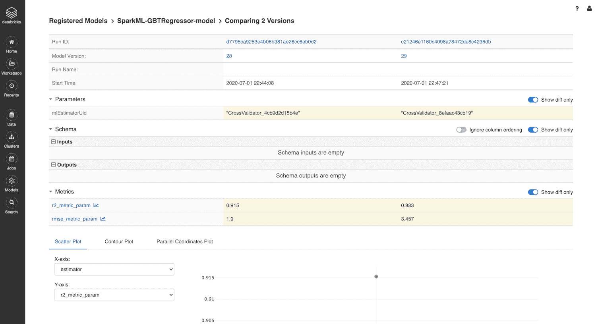
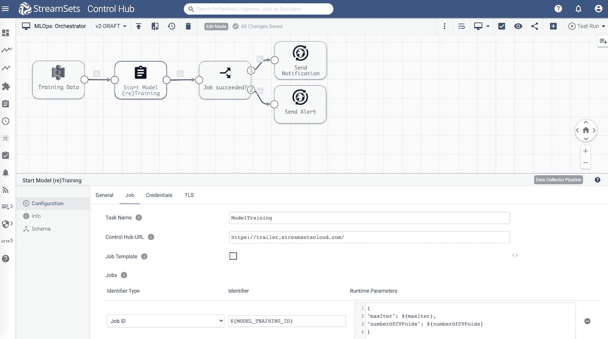

# 使用 MLflow 在 Databricks 上进行模型实验、跟踪和注册

> 原文：[`www.kdnuggets.com/2021/01/model-experiments-tracking-registration-mlflow-databricks.html`](https://www.kdnuggets.com/2021/01/model-experiments-tracking-registration-mlflow-databricks.html)

评论

**作者 [Dash Desai](https://www.linkedin.com/in/dash-desai/)，StreamSets 平台和技术推广总监**

了解 [StreamSets](https://streamsets.com/) 这一个现代数据集成平台如何帮助加快机器学习生命周期和 MLOps 一些关键阶段的操作。

* * *

## 我们的三大课程推荐

 1\. [Google 网络安全证书](https://www.kdnuggets.com/google-cybersecurity) - 快速迈入网络安全职业生涯。

 2\. [Google 数据分析专业证书](https://www.kdnuggets.com/google-data-analytics) - 提升您的数据分析水平

 3\. [Google IT 支持专业证书](https://www.kdnuggets.com/google-itsupport) - 支持您的组织 IT

* * *

### 数据获取和准备

机器学习模型的质量仅与用于训练模型的数据质量和数据集大小有关。[数据表明](https://www.forbes.com/sites/gilpress/2016/03/23/data-preparation-most-time-consuming-least-enjoyable-data-science-task-survey-says/#282426e76f63)数据科学家约花费 80% 的时间用于准备和管理分析数据，57% 的数据科学家认为清理和组织数据是工作中最不愉快的部分。这进一步验证了 MLOps 的理念以及数据科学家与数据工程师之间需要合作的必要性。

在数据获取和准备的关键阶段，数据科学家识别出需要哪些类型的（受信任的）数据集来训练模型，并与数据工程师密切合作，从可行的数据源中获取数据。

### StreamSets 如何提供帮助

一些常见的数据源用于获取数据科学项目的数据集，包括：Amazon S3、Microsoft Azure Blob 存储、Google Cloud 存储、Kafka、Hadoop、本地和云数据仓库。StreamSets DataOps 平台提供易于使用的图形界面，用于构建智能数据管道，支持流数据和批处理数据流，从分布式系统中快速摄取大量数据——包括上述所有常见来源。

数据摄取过程的另一个方面是存储——在某些情况下，公司可能已经拥有数据湖或数据仓库，而在某些情况下，他们可能需要建立一个。StreamSets DataOps 平台能够连接到现有的数据湖和数据仓库（无论是本地的还是云端的），还具有创建新数据湖和数据仓库的内置功能。



在构建这些数据管道的过程中，数据工程师还可以执行数据科学家所需的一些关键转换。数据准备过程中一些常见的转换包括：字段/列/特征的数据类型转换、重命名字段/列/特征、连接数据集、合并数据集、重新分区、数据集数据格式转换（例如，将 JSON 转换为 Parquet，以便在 Apache Spark 中进行高效的下游分析）等。所有这些转换及更多转换均由 StreamSets DataOps 平台提供支持。

*重要说明：广泛而彻底的特征工程任务及对特征、其与目标变量的相关性、特征重要性等的深入分析，最适合使用交互式工具进行，如 Databricks Notebook、Jupyter、RStudio 和 ML 平台。*

### 模型实验、跟踪和注册

实验是模型开发的重要前置步骤，其中数据科学家会从可信数据集中取出足够的子集，并以快速、迭代的方式创建多个模型。

在没有适当行业标准的情况下，数据科学家不得不依靠手动跟踪模型、输入、超参数、输出及其他类似工件，这导致模型部署/发布周期非常长，实际上阻碍了组织适应动态变化、获得竞争优势，并在某些情况下无法遵守不断变化的治理和法规。

### StreamSets 如何提供帮助

使用 StreamSets Transformer，[一个 Spark ETL 引擎](https://streamsets.com/products/dataops-platform/transformer-etl/)，很容易通过其 PySpark 或 Scala API 与[MLflow](https://mlflow.org/)集成。

+   这种 MLflow 集成允许跟踪和版本化模型训练代码、数据、配置、超参数，并且可以从 Transformer 在 MLflow 的中央存储库中注册和管理模型。这对于重新训练模型和/或重现实验至关重要。

+   使用[MLflow on Databricks](https://docs.databricks.com/applications/mlflow/index.html)时，它创建了一个强大而无缝的解决方案，因为[Transformer can run on Databricks](https://streamsets.com/solutions/streamsets-for-databricks/)集群，而 Databricks 自带 MLflow 服务器。

### 端到端用例

让我们通过一个端到端的场景进行演练，我们将从云对象存储（例如，Amazon S3）中获取数据，执行必要的转换，并训练一个回归模型。数据集包含一组房屋，其特征包括卧室数量、浴室数量、平方英尺等，以及其出售价格。

除了跟踪、版本控制和在 MLflow 中注册模型之外，我们还希望管道在满足特定条件时自动将模型从“*staging*”提升到“*production*”。例如，如果*r2 >= ${r2Threshold} 或 rmse <= ${rmseThreshold},* 则该模型需要在 Databricks 上的 MLflow 服务器上提升到“生产”状态。这可以作为数据科学家向负责部署模型的数据工程团队提供的要求和规范的一部分。

### 管道概述

下面展示的 StreamSets Transformer 管道旨在从[Amazon S3](https://streamsets.com/documentation/transformer/latest/help/transformer/Origins/AmazonS3.html#concept_gww_1kw_shb)加载训练数据，执行像[删除](https://streamsets.com/documentation/transformer/latest/help/transformer/Processors/FieldRemover.html#concept_svw_dxf_fhb)行 ID、将目标列“*mdev*”重命名为“*label*”（这是 SparkMLlib 所需的），使用[PySpark](https://streamsets.com/documentation/transformer/latest/help/transformer/Processors/PySpark.html#concept_gqm_4hn_ygb)处理器训练**梯度提升回归**模型，并将训练数据存档到[Amazon S3](https://streamsets.com/documentation/transformer/latest/help/transformer/Destinations/AmazonS3-D.html#concept_ymh_534_d3b)中。

更重要的是，管道还与[Databricks 上的 MLflow](https://docs.databricks.com/applications/mlflow/index.html)集成，以跟踪和版本化模型训练代码，包括超参数、模型评估指标，并注册模型。

****

**模型训练与实验**

这里是[PySpark 处理器](https://streamsets.com/documentation/transformer/latest/help/transformer/Processors/PySpark.html#concept_gqm_4hn_ygb)的代码片段——这是管道的一部分，它训练梯度提升回归模型，并在 MLflow 中跟踪一切，包括根据某些条件将模型从“*staging*”提升到“*production*”。

```py
# Import required libraries
from pyspark.ml.feature import VectorAssembler
from pyspark.ml.linalg import Vectors
from pyspark.ml import Pipeline, PipelineModel
from pyspark.sql.functions import *
from pyspark.ml.tuning import CrossValidator, ParamGridBuilder
from pyspark.ml.evaluation import MulticlassClassificationEvaluator, RegressionEvaluator
from pyspark.ml.regression import GBTRegressor
from pyspark.sql.types import FloatType

import mlflow
import mlflow.spark
import mlflow.tracking

mlflow.set_experiment('/Users/dash@streamsets.com/transformer-experiments')
mlflow_client = mlflow.tracking.MlflowClient()

# Setup variables for convenience and readability 
trainSplit = ${trainSplit}
testSplit = ${testSplit}
maxIter = ${maxIter}
numberOfCVFolds = ${numberOfCVFolds}
r2 = 0
rmse = 0
stage = "Staging"

# The input dataframe is accessbile via inputs[0]
df = inputs[0]

features = ['crim', 'zn', 'indus', 'chas', 'nox', 'rm', 'age', 'dis', 'rad', 'tax', 'ptratio', 'black', 'lstat']

# MUST for Spark features
vectorAssembler = VectorAssembler(inputCols = features, outputCol = 'features')
df = vectorAssembler.transform(df)

# Split dataset into "train" and "test" sets
(train, test) = df.randomSplit([trainSplit, testSplit], 42) 

# Setup evaluator -- default is F1 score
classEvaluator = MulticlassClassificationEvaluator(metricName="accuracy")

with mlflow.start_run(): 
  # Gradient-boosted tree regression
  gbt = GBTRegressor(maxIter=maxIter)

  # Setup pipeline
  pipeline = Pipeline(stages=[gbt])

  # Setup hyperparams grid
  paramGrid = ParamGridBuilder().build()

  # Setup model evaluators
  rmseevaluator = RegressionEvaluator() #Note: By default, it will show how many units off in the same scale as the target -- RMSE
  r2evaluator = RegressionEvaluator(metricName="r2") #Select R2 as our main scoring metric

  # Setup cross validator
  cv = CrossValidator(estimator=pipeline, estimatorParamMaps=paramGrid, evaluator=r2evaluator, numFolds=numberOfCVFolds) 

  # Fit model on "train" set
  cvModel = cv.fit(train)

  # Get the best model based on CrossValidator
  model = cvModel.bestModel

  # Run inference on "test" set
  predictions = model.transform(test)

  rmse = rmseevaluator.evaluate(predictions)
  r2 = r2evaluator.evaluate(predictions)

  mlflow.log_param("transformer-pipeline-id","${pipeline:id()}")

  mlflow.log_param("features", features)
  mlflow.log_param("maxIter_hyperparam", maxIter)
  mlflow.log_param("numberOfCVFolds_hyperparam", numberOfCVFolds)
  mlflow.log_metric("rmse_metric_param", rmse)
  mlflow.log_metric("r2_metric_param", r2)

  # Log and register the model
  mlflow.spark.log_model(spark_model=model, artifact_path="SparkML-GBTRegressor-model", registered_model_name="SparkML-GBTRegressor-model")

mlflow.end_run()

# Transition the current model to 'Staging' or 'Production'
current_version = mlflow_client.search_model_versions('name="SparkML-GBTRegressor-model"')[0].version
while mlflow_client.search_model_versions('name="SparkML-GBTRegressor-model"')[0].status != 'READY':
  current_version = current_version

if (r2 >= ${r2Threshold} or rmse <= ${rmseThreshold}):
  stage = "Production"

mlflow_client.transition_model_version_stage(name="SparkML-GBTRegressor-model",stage=stage,version=current_version)

output = inputs[0]
```

显示全部 ▼

**Databricks 上的模型跟踪**

这里是 MLflow 中跟踪的来自 Transformer 管道的模型训练运行。

****

**Databricks 上的模型版本控制**

这里是从 Transformer 管道注册的模型版本。

****

**Databricks 上的模型比较**

这是从 Transformer 管道创建的两个选定模型的并排比较。

****

### 模型重新训练

现在，一个非常常见的需求是自动化重新训练模型的过程，当更多数据变得可用时——特别是当模型尚未满足评估标准时。例如，准确率可以是评估特定模型的指标之一。这种类型的自动化可以通过设置 [编排管道](https://streamsets.com/documentation/datacollector/latest/help/datacollector/UserGuide/Orchestration_Pipelines/OrchestrationPipelines_Title.html#Orchestrators_Title) 实现，如下所示。

编排管道被设计为持续运行并“等待”训练数据集文件上传到 Amazon S3。 一旦训练数据集上传，此管道会触发/启动前面描述的模型（重新）训练任务。



还需注意，管道中传递了两个超参数 ***maxIter*** 和 ***numberOfCVFolds***，因此无需硬编码它们，并且可以在模型重新训练和实验过程中动态传递到管道中。 StreamSets DataOps 平台还提供检查当前运行的作业状态的方法，以便根据管道中所示的状态采取行动。

### 示例管道

如果你对额外的技术细节和示例管道感兴趣，请联系我：dash at streamsets dot com 或 [@iamontheinet](https://twitter.com/iamontheinet)。

### 开始你自己的模型实验

StreamSets DataOps 平台不是一个机器学习平台，但它提供了重要的功能和扩展性，能够帮助并加快机器学习生命周期和 MLOps 中一些最关键阶段的操作。

了解更多关于 [StreamSets For Databricks](https://streamsets.com/products/cloud/streamsets-for-databricks-marketplace/) 在 AWS Marketplace 和 Microsoft Azure Marketplace 上的信息。

**个人简介： [Dash Desai](https://www.linkedin.com/in/dash-desai/)** 是 StreamSets 的平台和技术布道总监，拥有超过 18 年的软件和数据工程实践经验。凭借在大数据、数据科学和机器学习方面的最新经验，Dash 运用他的技术技能帮助构建解决方案，解决商业问题，并揭示以新方式塑造市场的趋势。Dash 曾在全球企业和技术初创公司担任工程师和解决方案架构师。作为平台和技术布道者，他对评估新想法充满热情，以帮助阐明技术如何解决特定的商业问题。他还喜欢撰写技术博客、动手教程和主持技术研讨会。

[原文](https://streamsets.com/blog/model-experiments-tracking-and-registration-using-mlflow-on-databricks/)。经许可转载。

**相关：**

+   MLOps 正在改变机器学习模型的开发方式

+   生产机器学习监控：异常值、漂移、解释器与统计性能

+   管理机器学习周期：从比较数据科学实验/协作工具中获得的五个经验教训

### 更多相关话题

+   [机器学习实验的版本控制与追踪](https://www.kdnuggets.com/2021/12/versioning-machine-learning-experiments-tracking.html)

+   [如何使用 MLFlow 打包和分发机器学习模型](https://www.kdnuggets.com/2022/08/package-distribute-machine-learning-models-mlflow.html)

+   [制定分析追踪的开放标准](https://www.kdnuggets.com/2022/07/developing-open-standard-analytics-tracking.html)

+   [机器学习实验追踪的 7 款最佳工具](https://www.kdnuggets.com/2023/02/7-best-tools-machine-learning-experiment-tracking.html)

+   [优化数据分析：在 Databricks 中集成 GitHub Copilot](https://www.kdnuggets.com/optimizing-data-analytics-integrating-github-copilot-in-databricks)

+   [如何设计数据收集实验](https://www.kdnuggets.com/2022/04/design-experiments-data-collection.html)
