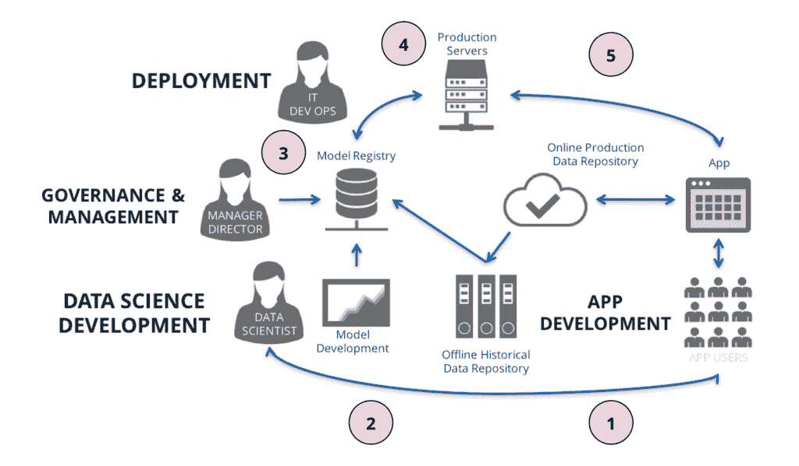
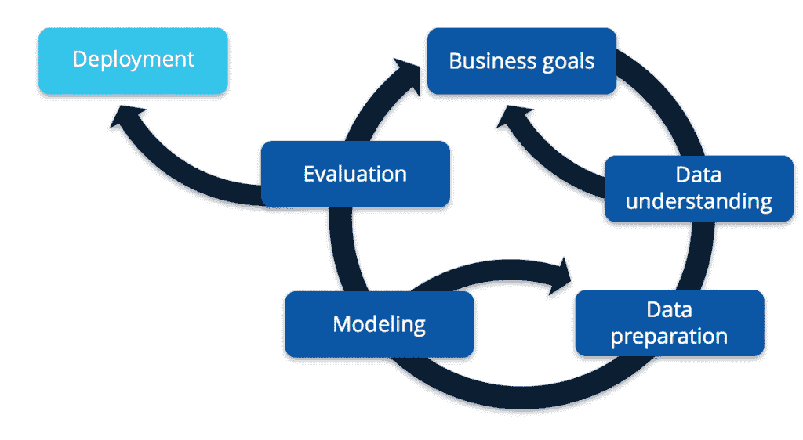
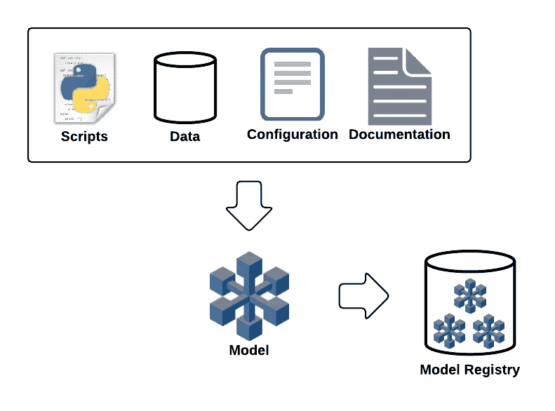
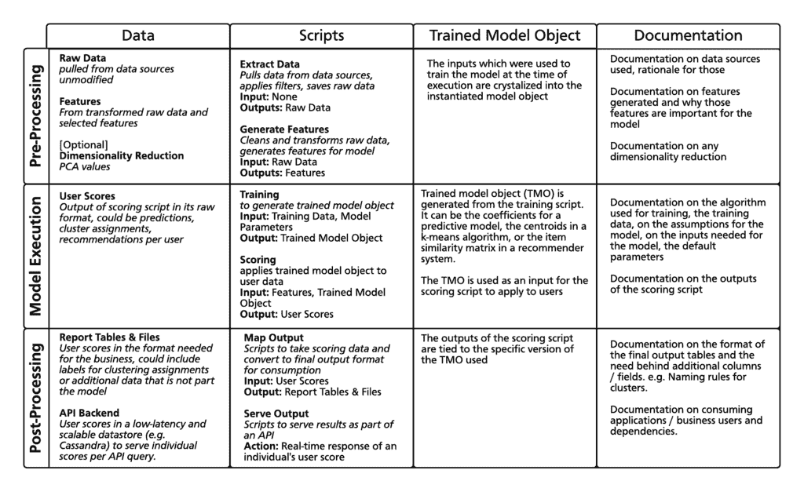

# 模型：从实验室到工厂

> 原文：[`www.kdnuggets.com/2017/04/models-from-lab-factory.html`](https://www.kdnuggets.com/2017/04/models-from-lab-factory.html)

**作者：Mauricio Vacas，硅谷数据科学。**

在我们的行业中，很多关注点放在开发分析模型以回答关键业务问题和预测客户行为上。然而，当数据科学家完成模型开发并需要将其部署到更大的组织中时会发生什么？

* * *

## 我们的前三名课程推荐

 1\. [Google 网络安全证书](https://www.kdnuggets.com/google-cybersecurity) - 快速进入网络安全职业生涯。

 2\. [Google 数据分析专业证书](https://www.kdnuggets.com/google-data-analytics) - 提升您的数据分析技能

 3\. [Google IT 支持专业证书](https://www.kdnuggets.com/google-itsupport) - 支持您的组织的 IT

* * *

在没有严格流程的情况下部署模型是有后果的——请看一下金融服务中的以下示例。

由于其高频交易算法，[Knight 是美国股票市场上最大的交易商](https://en.wikipedia.org/wiki/Knight_Capital_Group)，在纽约证券交易所的市场份额为 17.3%，在纳斯达克的市场份额为 16.9%。由于[2012 年的计算机交易“故障”](https://www.wsj.com/news/articles/SB10000872396390443866404577564772083961412)，公司在不到一小时的时间内损失了 4.4 亿美元。该公司在年底被收购。这说明了将未经充分测试的模型部署到生产环境中的风险以及可能出现的错误的影响。

在这篇文章中，我们将探讨通过模型管理和部署过程来避免这些情况的技术。以下是我们在部署模型到生产环境时需要解决的一些问题：

+   模型结果如何到达受益于这些分析的决策者或应用程序手中？

+   模型能否自动运行而没有问题？它如何从故障中恢复？

+   如果模型由于基于不再相关的历史数据进行训练而变得过时，会发生什么？

+   如何在不破坏下游用户的情况下部署和管理模型的新版本？

将数据科学开发和部署视为更大模型生命周期工作流中的两个独立过程是有帮助的。下面的示例图说明了这个过程是什么样的。

1.  我们有终端用户与应用程序交互，生成的数据会存储在应用程序的在线生产数据存储库中。

1.  这些数据随后会被送入离线历史数据存储库（如 Hadoop 或 S3），以便数据科学家可以分析这些数据，了解用户如何与应用程序互动。例如，它还可以用于构建一个模型，将用户根据他们在应用程序中的行为进行聚类，以便我们可以利用这些信息进行市场推广。

1.  一旦模型开发完成，我们需要将其注册到模型注册库中，以便进行治理流程，在该流程中，模型将被审查和批准用于生产，并且可以评估部署的需求。

1.  一旦模型获得生产使用批准，我们需要将其部署。为此，我们需要了解模型在组织中的使用方式，并进行相应的更改以支持这一点，确保模型可以在指定的性能约束内端到端自动运行，并且需要有测试以确保部署的模型与开发的模型相同。一旦这些步骤完成，模型将被再次审查和批准，然后才能上线。

1.  最后，一旦模型部署完成，来自该模型的预测将提供给应用程序，根据用户互动收集预测的指标。这些信息可以用于改进模型或提出新的业务问题，这会使我们回到（2）。

为了使生命周期成功，了解数据科学开发和部署有不同的需求是重要的。这就是为什么你需要[一个实验室和一个工厂](https://hbr.org/2013/04/two-departments-for-data-succe)。

### 实验室

数据实验室是一个供数据科学家探索的环境，与应用程序的生产关注点分离。我们的最终目标可能是能够利用数据驱动组织内的决策，但在达到这一目标之前，我们需要理解哪些假设对我们的组织有意义并验证其价值。因此，我们主要关注创建一个环境——“实验室”——让数据科学家可以提出问题、构建模型和实验数据。

该过程主要是迭代的，如下图所示，基于[CRISP-DM 模型](https://en.wikipedia.org/wiki/Cross_Industry_Standard_Process_for_Data_Mining)。

我们不会在这篇文章中深入探讨太多细节，但我们确实有一个教程可以深入了解这个主题。如果你想下载该教程的幻灯片，可以在我们的[Enterprise Data World 2017 页面](https://www.svds.com/event/enterprise-data-world-2017/)上进行下载。

我们在这里关注的是，我们需要一个实验室来支持模型的探索和开发，但当我们需要将该模型部署以自动应用于实时数据、在定义的约束内向适当的用户提供结果并监控过程中的失败或异常时，我们也需要一个工厂。

### 工厂

在工厂中，我们希望优化价值创造和降低成本，重视稳定性和结构而非灵活性，以确保在定义的约束条件下将结果交付给正确的消费者，并监控和管理失败。我们需要为模型提供结构，以便对其在生产中的行为有预期。

为了理解工厂，我们将探讨如何通过模型注册表管理模型，以及在部署过程中需要考虑的事项。

### 模型注册表

为了为模型提供结构，我们根据其组件——数据依赖关系、脚本、配置和文档——来定义模型。此外，我们捕获模型及其版本的元数据，以提供额外的业务背景和模型特定信息。通过为模型提供结构，我们可以在模型注册表中保持模型库存，包括不同的模型版本和由执行过程提供的相关结果。下图说明了这一概念。

从注册表中，我们可以：

+   了解和控制生产中使用的模型版本。

+   审查解释特定版本中发生变化的发行说明。

+   审查与模型相关的资产和文档，这在需要创建现有模型的新版本或进行维护时非常有用。

+   监控模型执行的性能指标及其消耗的进程。这些信息由模型执行过程提供，该过程将指标发送回注册表。

你还可以选择在模型版本中包含一个[Jupyter Notebook](http://jupyter.org/)。这使得审查者或开发人员可以了解原开发者在模型版本中所做的思考过程和假设。这有助于支持模型的维护和组织的发现。

这里是一个矩阵，分解了我们在实际工作中模型的不同元素：

注册表需要捕获数据、脚本、训练模型对象和特定模型版本的文档之间的关联，如图所示。

实际上这给我们带来了什么？

+   通过收集运行模型所需的资产和元数据，我们可以驱动执行工作流，将特定版本的模型应用于实时数据，以向最终用户生成预测。如果这是批处理过程的一部分，我们可以利用这些信息创建短暂的执行环境，以便模型拉取数据、拉取脚本、运行模型、将结果存储在对象存储中，并在过程完成时关闭环境，从而最大化资源利用并最小化成本。

+   从治理的角度来看，我们可以支持业务工作流来决定何时将模型推送到生产环境，并允许进行持续的模型监控，例如，当我们发现预测结果不再与实际情况相符时，决定是否需要重新训练模型。如果有审计要求，你可能需要解释如何为客户产生特定的结果。为此，你需要能够追踪在特定时间运行的模型的具体版本，以及使用了哪些数据，以便能够重现结果。

+   如果我们在现有模型中发现了一个错误，我们可以将该版本标记为“不可使用”，并发布一个修复后的新版本。通过通知所有使用了有缺陷模型的用户，他们可以过渡到使用修复后的模型版本。

如果没有这些步骤，我们面临的风险是模型维护变成一个试图理解原开发者意图的挑战性过程，生产环境中的模型可能与开发环境中的模型不匹配，从而产生不正确的结果，并且在更新现有模型时会干扰下游消费者。

### 模型部署

一旦模型被批准部署，我们需要经过一些步骤以确保模型可以顺利部署。应该有测试措施来验证模型的正确性，提取原始数据、特征生成和模型评分的管道应被分析，以确保模型执行可以自动运行、以消费者所需的方式暴露结果，并满足业务定义的性能要求。同时，确保模型执行得到监控，以防出现错误或模型变得过时，不再产生准确的结果。

在部署之前，我们需要确保测试以下内容：

+   部署的模型是否符合原始模型开发者的期望。通过使用在开发过程中识别的测试输入集，这些输入集会生成经过验证的结果，我们可以验证部署的代码是否与开发过程中预期的结果匹配。我们在[之前的博客文章](https://svds.com/from-impala-to-hive-with-love/)中说明了这一需求。

+   模型在部署时是否能够适应各种不同的输入，测试这些输出的极端情况以及由于数据质量问题可能缺失的值。模型应具备防止这些输入使模型崩溃的控制措施，从而避免影响下游消费者。

我们通过以下方式最小化部署的模型与开发模型不匹配的风险：1）在将模型部署到生产环境之前进行测试，2）捕捉环境的具体细节，如模型的特定语言版本和库依赖（例如 Python 的 requirements.txt 文件）。

一旦部署到生产环境中，我们希望将模型的预测结果暴露给消费者。有多少用户会使用这个模型预测？在对模型进行评分时，特征数据必须多快才能可用？例如，在欺诈检测的情况下，如果特征每 24 小时生成一次，则可能会存在事件发生和欺诈检测模型检测到事件之间的延迟。这些是需要回答的一些可扩展性和性能问题。

在应用的情况下，理想的做法是通过网络服务暴露模型的结果，无论是通过模型的实时评分还是通过批处理过程生成的离线评分。或者，模型可能需要支持业务流程，我们需要将模型的结果放置在一个可以创建报告的位置，以便决策者根据这些结果采取行动。在任何情况下，没有模型注册表，可能很难理解在哪里找到和使用当前生产中的模型结果。

另一个用例是希望了解模型在实时数据上的表现，以判断模型是否已经过时，或者新开发的模型是否优于旧模型。一个简单的例子是回归模型，我们可以比较预测值和实际值。如果我们不监控模型随时间的表现，可能会根据不再适用于当前情况的历史数据做出决策。

### 结论

在这篇文章中，我们讨论了模型生命周期，并讨论了实验室和工厂的需求，目的是减少部署可能影响业务决策（并可能产生巨大成本）的“坏”模型的风险。此外，注册表提供了组织中模型的透明度和可发现性。这通过暴露组织中用于解决类似问题的现有技术，促进了新模型的开发，并通过明确当前生产中的模型版本、相关资产以及发布新模型版本的过程，促进了现有模型的维护或改进。

在 SVDS，我们正在开发一种架构，支持将模型及其版本注册到注册表中，并管理这些模型版本如何部署到执行引擎。如果你想了解更多关于这项工作的内容，[请联系我们](https://www.svds.com/contact/)。

**简介: [Mauricio Vacas](https://www.linkedin.com/in/mjvacas/)** 在云计算和分布式数据架构方面有多年的经验。Mauricio 热衷于利用技术创造价值，并且是业内公认的云托管数据解决方案技术架构领导者。

[原文](https://www.svds.com/models-lab-factory/?utm_campaign=KDNuggets%20Blog&utm_source=KDNuggets)。经许可转载。

**相关内容:**

+   Jupyter 生态系统导航简短指南

+   深度学习入门指南

+   开源语音识别工具包

### 更多相关内容

+   [每位初学者数据科学家应掌握的 6 种预测模型](https://www.kdnuggets.com/2021/12/6-predictive-models-every-beginner-data-scientist-master.html)

+   [机器学习模型为何沉默地“消亡”？](https://www.kdnuggets.com/2022/01/machine-learning-models-die-silence.html)

+   [用 LIME 解释 NLP 模型](https://www.kdnuggets.com/2022/01/explain-nlp-models-lime.html)

+   [GPT-4：一体化的 8 种模型；秘密揭晓](https://www.kdnuggets.com/2023/08/gpt4-8-models-one-secret.html)

+   [AI 的未来：探索下一代生成模型](https://www.kdnuggets.com/2023/05/future-ai-exploring-next-generation-generative-models.html)

+   [什么是基础模型及其工作原理？](https://www.kdnuggets.com/2023/05/foundation-models-work.html)
