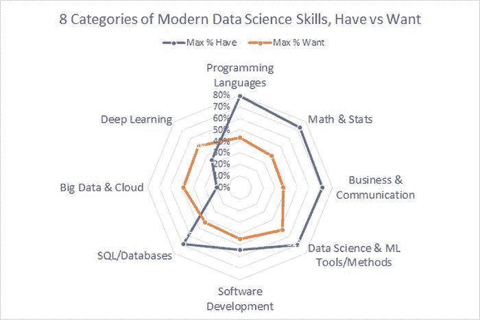
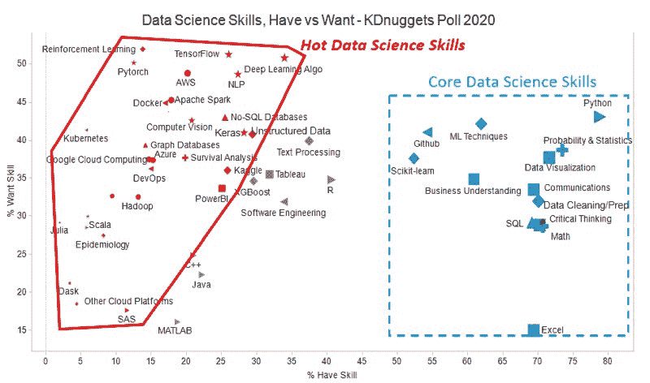
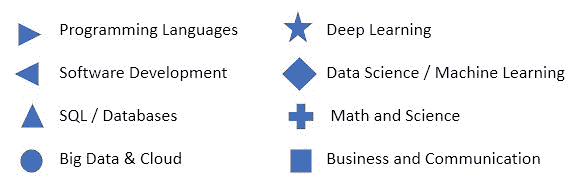

# 现代数据科学技能: 8 类，核心技能，热门技能

> 原文：[`www.kdnuggets.com/2020/09/modern-data-science-skills.html`](https://www.kdnuggets.com/2020/09/modern-data-science-skills.html)

评论最新的 KDnuggets 调查是对去年非常受欢迎的数据科学技能调查的后续，提出了相同的两个问题：

> **1. 你当前具备哪些技能/知识领域（达到可以在工作或研究中使用的水平）？**和
> 
> 2. **你希望增加或改进哪些技能？**

Drew Conway 在 2013 年提出的经典数据科学 Venn 图有 3 个主要领域：黑客（编程），数学与统计，以及商业/领域知识。然而，数据科学领域的发展如此迅速，这 3 个领域已不再足够。现在，数据科学包括额外的领域，如深度学习算法和云计算平台。深度学习需要更多的数学知识（特别是代数和微积分）。COVID 大流行增加了对生存分析和流行病学的需求。部署数据科学需要理解软件开发、DevOps，以及使用 GitHub、Docker 等工具。

我们回顾了许多关于数据科学技能的博客和文章，并将技能/知识领域从去年的 30 项更新扩展到本次调查中的 50 项。为了更好地组织此列表，我们将其分为 8 个类别，并在 Conway Venn 图的基础上增加了 5 个类别：

+   **编程语言**: Python，R，Java，Java，C++，MATLAB，SAS，Scala，Julia

+   **数学与统计**: 代数与微积分，概率与统计，生存分析，流行病学

+   **商业与沟通**: 商业理解，批判性思维，沟通技巧，Excel，数据可视化，Tableau，PowerBI

+   **数据科学/机器学习工具/方法**: 数据清理/准备，ML 算法，Scikit-learn，文本处理，XGBoost，非结构化数据，Kaggle，强化学习

+   **软件开发**: Github，软件工程，Docker，DevOps，Kubernetes

+   **SQL / 数据库**: SQL/数据库编码，No-SQL 数据库，图数据库

+   **大数据/云计算**: AWS，Apache Spark，Dask，Microsoft Azure，Google Cloud，Hadoop，其他大数据工具，其他云计算平台

+   **深度学习**: DL 算法，Keras，自然语言处理，TensorFlow，计算机视觉，PyTorch，其他 DL 框架

上述列表和分类并不完整或完美，但它们是了解数据科学家当前技能状态的有用方式，如调查结果所示。

本次调查共收到近 1000 个投票。平均受访者拥有 16 项技能（相比 2019 年的 10 项），并希望增加或改进 18 项技能（相比 2019 年的 6.5 项）。

下面的图 1 显示了按类别划分的技能雷达图，蓝线表示受访者已拥有的技能，橙线表示所需技能。由于每个类别中有许多条目，我们使用最大百分比（最受欢迎的条目）来代表该类别。

**图 1: 现代数据科学相关技能的 8 个类别，拥有与需求对比**

我们注意到，典型的数据科学家在前 6 个类别中表现良好：编程、数学与统计、业务与沟通、数据科学/机器学习工具、软件开发和 SQL/数据库，% 拥有的范围从 79% 到 69%。只有 54% 具备软件开发技能。两个最现代的领域显示出当前技能的差距，% 需求超出 % 拥有的技能 - 大数据与云计算和深度学习。

**表 1: 各类别的 % 拥有 vs % 需求**

| 类别 | 最大 % 拥有 | 最大 % 需求 |
| --- | --- | --- |
| 编程语言 | 79% | 43% |
| 数学与统计 | 73% | 39% |
| 业务与沟通 | 72% | 38% |
| 数据科学与机器学习工具/方法 | 70% | 52% |
| 软件开发 | 54% | 45% |
| SQL/数据库 | 69% | 43% |
| 大数据与云计算 | 20% | 49% |
| 深度学习 | 34% | 51% |

现代数据科学不是由拥有所有必要技能的独角兽完成的，而是由团队完成的，研究不同职位的技能（如研究员、数据科学家、数据分析师、机器学习工程师、业务分析师等）会很有用。我们将这部分内容留到未来讨论。

接下来，我们将深入分析在这次调查中单独的数据科学技能的受欢迎程度。

**图 2: 现代数据科学相关技能，拥有与需求对比**

X 轴显示 **% 拥有技能** - 第一个调查问题的答案，Y 轴显示 **% 需求技能** - 第二个调查问题的答案。

形状代表类别 - 见下文。形状的大小与拥有该技能的选民比例成正比。颜色取决于需求/拥有的比率：红色表示高 - 大于 1.2，灰色表示 1.2 到 0.8 之间，蓝色表示低 - 小于 0.8。

与 去年数据科学技能调查 相同，我们可以看到两个主要的集群。

集群 1 位于图表右侧的蓝色虚线矩形中，包括所有超过 50% 受访者拥有的技能。此集群中所有形状的颜色为蓝色，表明需求/拥有的比率小于 0.8。与去年一样，我们将这组技能称为 **核心数据科学技能**。它们列在表 2 中。

**表 2: 13 个核心数据科学技能，按 %拥有 的降序排列**

| 技能 | 类别 | %拥有 | %需求 | %需求/ %拥有 |
| --- | --- | --- | --- | --- |
| **Python** | 编程语言 | 78.8% | 43.1% | 0.55 |
| **概率与统计** | 数学与统计 | 73.4% | 38.7% | 0.53 |
| **数据可视化** | 业务与沟通 | 71.6% | 37.7% | 0.53 |
| **数学（代数与微积分）** | 数学与统计 | 70.7% | 28.6% | 0.40 |
| **批判性思维** | 商业与沟通 | 70.3% | 28.8% | 0.41 |
| **数据清洗/数据准备/ETL** | 数据科学与机器学习工具 | 70.1% | 31.9% | 0.45 |
| **沟通技能** | 商业与沟通 | 69.4% | 33.4% | 0.48 |
| **Excel** | 商业与沟通 | 69.4% | 15.0% | 0.22 |
| **SQL** | SQL/数据库 | 69.2% | 29.1% | 0.42 |
| **机器学习技术** | 数据科学与机器学习工具 | 61.9% | 42.2% | 0.68 |
| **商业理解** | 商业与沟通 | 60.9% | 34.9% | 0.57 |
| **Github** | 软件开发 | 54.2% | 41.1% | 0.76 |
| **Scikit-learn** | 数据科学与机器学习工具 | 52.3% | 37.6% | 0.72 |

核心技能几乎与 2019 年调查相同，唯一的两个例外是：R 的受欢迎程度从 45%下降到 40%，因此未包含在核心技能中。新增了一个技能：Github（2019 年调查中没有）。

核心技能中最常见的类别是商业与沟通（5 项）和数据科学与机器学习工具（3 项）。

调查还允许人们选择“拥有”和“希望增加或改进”该技能（这解释了为什么某些技能的%拥有 + %希望 > 100%）。在核心技能中，人们最希望改进的是

+   Python，有 33%的人希望提升它。

+   机器学习技术，33%

+   概率与统计，31%

+   数据可视化，30%

+   Scikit-learn，29%

改进意愿最低的技能是

+   Excel，11%

+   SQL，18%

第二个集群，在图 2 的左侧，用红色边框标记，包括了目前较少人掌握（%拥有 < 30%）但更多人希望增加的技能，其中%希望/%拥有 > 1.2，并且至少 15%的受访者希望掌握这些技能。

我们称这些为**热门/新兴数据科学技能**，它们列在表 3 中。我们可以看到，最热门的技能，拥有最高的学习愿望百分比，分别是强化学习、TensorFlow、深度学习算法和 PyTorch。

**表 3：现代数据科学技能的热门/新兴技能，按%希望降序排列**

| 技能 | 类别 | %希望 | %拥有 | %希望/ %拥有 |
| --- | --- | --- | --- | --- |
| **强化学习** | 数据科学与机器学习工具 | 51.9% | 13.8% | 3.8 |
| **TensorFlow** | 深度学习 | 51.2% | 26.0% | 2.0 |
| **深度学习算法** | 深度学习 | 50.8% | 34.0% | 1.5 |
| **PyTorch** | 深度学习 | 50.1% | 12.5% | 4.0 |
| **AWS（亚马逊网络服务）** | 大数据与云计算 | 48.8% | 20.1% | 2.4 |
| **自然语言处理** | 深度学习 | 48.7% | 27.3% | 1.8 |
| **Apache Spark** | 大数据与云计算 | 45.3% | 17.8% | 2.5 |
| **Docker** | 软件开发 | 44.9% | 17.0% | 2.6 |
| **No-SQL 数据库** | SQL/数据库 | 43.0% | 25.5% | 1.7 |
| **计算机视觉** | 深度学习 | 42.7% | 20.7% | 2.1 |
| **Kubernetes** | 软件开发 | 41.3% | 5.8% | 7.2 |
| **Keras** | 深度学习 | 41.1% | 28.2% | 1.5 |
| **非结构化数据** | 数据科学与机器学习工具 | 40.8% | 29.4% | 1.4 |
| **图数据库** | SQL/数据库 | 39.4% | 14.2% | 2.8 |
| **生存分析** | 数学与统计 | 37.7% | 19.8% | 1.9 |
| **Google 云计算** | 大数据与云计算 | 37.4% | 14.7% | 2.5 |
| **Microsoft Azure** | 大数据与云计算 | 37.3% | 15.3% | 2.4 |
| **DevOps** | 软件开发 | 36.2% | 14.9% | 2.4 |
| **Kaggle** | 数据科学与机器学习工具 | 36.0% | 25.9% | 1.4 |
| **PowerBI** | 商务与沟通 | 33.6% | 25.1% | 1.3 |
| **Hadoop 或 Spark 以外的大数据工具** | 大数据与云计算 | 32.6% | 9.5% | 3.4 |
| **Hadoop** | 大数据与云计算 | 32.5% | 13.1% | 2.5 |
| **其他深度学习框架** | 深度学习 | 30.0% | 6.0% | 5.0 |
| **Julia** | 编程语言 | 29.1% | 2.0% | 14.9 |
| **Scala** | 编程语言 | 28.4% | 5.9% | 4.8 |
| **流行病学** | 数学与统计 | 27.4% | 8.2% | 3.3 |
| **Dask** | 大数据与云计算 | 21.2% | 3.4% | 6.2 |
| **其他云计算平台** | 大数据与云计算 | 18.4% | 4.4% | 4.2 |
| **SAS** | 编程语言 | 17.6% | 11.6% | 1.5 |

新兴数据科学技能中最常见的类别包括：

+   大数据与云计算, 8

+   深度学习, 7

+   数据科学与机器学习工具, 3

+   编程语言, 3

+   软件开发, 3

剩余的技能是那些需求增长不强劲的技能，期望/拥有比率小于 1.2，并且当前流行度低于 50%。这些技能在许多领域仍然非常有用。该组技能在表 4 中列出。

**表 4：有用/其他数据科学技能，按%拥有降序排列**

| 技能 | 类别 | %拥有 | %期望 | %期望/ %拥有 |
| --- | --- | --- | --- | --- |
| **R 语言** | 编程语言 | 40.6% | 34.8% | 0.86 |
| **文本处理** | 数据科学与机器学习工具 | 37.5% | 39.9% | 1.1 |
| **软件工程** | 软件开发 | 33.9% | 31.8% | 0.94 |
| **Tableau** | 商务与沟通 | 31.8% | 35.5% | 1.1 |
| **XGBoost** | 数据科学与机器学习工具 | 29.5% | 34.6% | 1.2 |
| **Java** | 编程语言 | 22.2% | 22.3% | 1.0 |
| **C++** | 编程语言 | 21.0% | 24.9% | 1.2 |
| **MATLAB** | 编程语言 | 18.8% | 16.1% | 0.86 |

告诉我们我们遗漏了什么以及你的想法 - 请在下面评论！

**相关内容：**

+   [这些数据科学技能将成为你的超级能力](https://www.kdnuggets.com/2020/08/data-science-skills-superpower.html)

+   [2020 年必须掌握的前 5 项数据科学技能](https://www.kdnuggets.com/2020/01/top-5-data-science-skills-2020.html)

+   哪些数据科学技能是核心的，哪些是热门/新兴的？, 2019 KDnuggets 调查

+   Python 领先的 11 大数据科学、机器学习平台：趋势与分析

+   Python 蚕食 R：2018 年分析、数据科学、机器学习的顶级软件：趋势与分析

+   成为顶级数据科学家的前 13 项技能

+   数据科学家最需的技能

+   我没有被聘为数据科学家。因此，我寻找了关于谁被聘用的数据。

### 了解更多相关内容

+   [成为出色数据科学家所需的 5 项关键技能](https://www.kdnuggets.com/2021/12/5-key-skills-needed-become-great-data-scientist.html)

+   [每位初学者数据科学家应掌握的 6 个预测模型](https://www.kdnuggets.com/2021/12/6-predictive-models-every-beginner-data-scientist-master.html)

+   [2021 年最佳 ETL 工具](https://www.kdnuggets.com/2021/12/mozart-best-etl-tools-2021.html)

+   [停止学习数据科学以寻找目标，并找到目标以……](https://www.kdnuggets.com/2021/12/stop-learning-data-science-find-purpose.html)

+   [学习数据科学统计的顶级资源](https://www.kdnuggets.com/2021/12/springboard-top-resources-learn-data-science-statistics.html)

+   [建立一个稳固的数据团队](https://www.kdnuggets.com/2021/12/build-solid-data-team.html)
