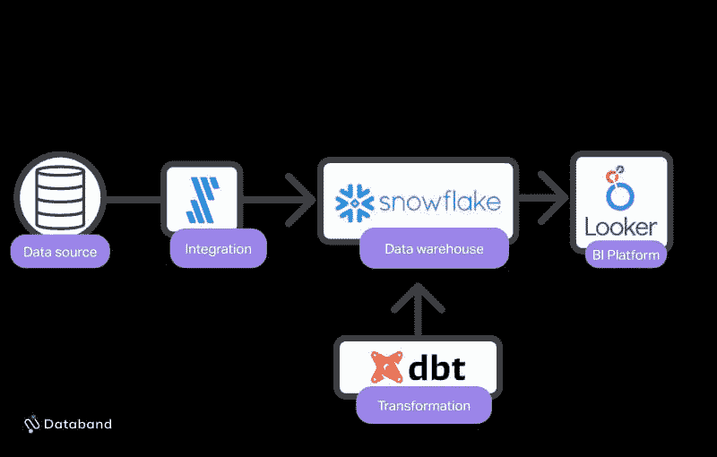
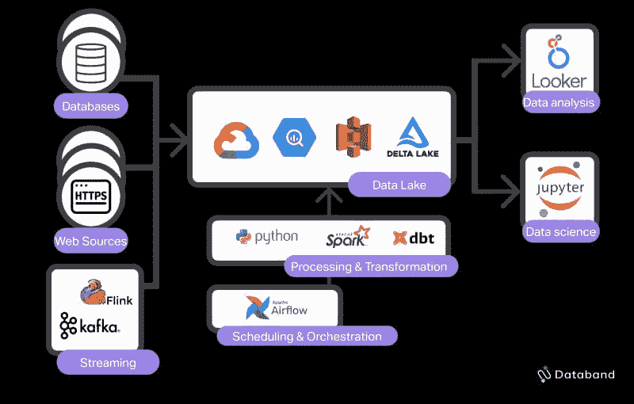

# 现代数据栈是否把你甩在了后头？

> 原文：[`www.kdnuggets.com/2021/11/modern-data-stack-leaving-behind.html`](https://www.kdnuggets.com/2021/11/modern-data-stack-leaving-behind.html)

评论

**由 [Josh Benamram](https://www.linkedin.com/in/josh-benamram/)，Databand 的联合创始人兼 CEO**

图片由 [Andy Beales](https://unsplash.com/@andybeales?utm_source=unsplash&utm_medium=referral&utm_content=creditCopyText) 提供，来源于 [Unsplash](https://unsplash.com/s/photos/hailing-a-cab?utm_source=unsplash&utm_medium=referral&utm_content=creditCopyText)

* * *

## 我们的前三大课程推荐

 1\. [Google 网络安全证书](https://www.kdnuggets.com/google-cybersecurity) - 快速进入网络安全职业生涯。

 2\. [Google 数据分析专业证书](https://www.kdnuggets.com/google-data-analytics) - 提升你的数据分析技能

 3\. [Google IT 支持专业证书](https://www.kdnuggets.com/google-itsupport) - 支持你组织的 IT

* * *

“现代数据栈”最近在数据博客圈内获得了大量关注。理由很充分——它是识别构建[有效数据组织](https://databand.ai/blog/dataops-org-structure/)所需工具的有用模型。

假设你刚刚在全新的工具上投入了大量时间和金钱来运行你的数据基础设施。但你的工具与所描述的现代栈不匹配。你正在使用一堆其他工具，并且不认识所有这些标志。被“现代栈”排除在外，你可能会认为数据操作会因其不可动摇的衰退而逐渐停止。或者你永远无法找到和聘用愿意容忍你过时的数据平台的新工程师。

这些都不太可能是真的。事实是，“现代栈”的定义过于狭窄，只适用于某种特定类型的数据组织。对于许多数据团队来说，你需要以不同的方式思考你的栈。

## 现代数据栈：当前定义

现代数据栈的当前定义是一个自助服务的数据平台，包含以下层次：

+   管理的数据集成工具（Fivetran）

+   基于云的数据仓库（Bigquery）

+   工作流协调器（DBT）

+   商业智能平台（Looker）

独立来看，这些都是很棒的工具。将它们结合起来，就能提供许多组织所需的组合。但如果你不符合这种模式，这是否意味着你的团队不“现代”？当然不是！虽然这些工具满足了许多人的需求，但它们并未讲述全部故事。它缺少了许多团队无法缺少的核心数据平台服务的关键层。

## 现代数据栈：重新定义

事实是现代数据堆栈有不同的偏差。你需要什么样的“现代数据堆栈”取决于你公司的战略和数据产品的性质。你选择的堆栈类型将影响你数据平台中的压力源（失败源）和你对[数据质量](https://databand.ai/blog/what-is-good-data-quality-for-data-engineers/)的定义。

目前，现代堆栈正与**分析工程**的兴起混为一谈。DBT Labs 在[这里](https://www.getdbt.com/what-is-analytics-engineering/)对这一角色提供了很好的描述。如果你更全面地看待数据行业，你会发现围绕“现代数据堆栈”有两个分化的趋势。

其中之一，你猜对了，就是现代数据堆栈（MDS）用于分析工程。这个版本的 MDS 针对可访问性、易用性和工作（“T”）在数据仓库中的集中进行了优化。它通常被认为是一种“无代码”构建的方法。

我们看到的另一种版本是优化工程的现代数据堆栈。这一版本的 MDS 旨在实现灵活性、控制和可扩展性。

### 现代分析工程堆栈

这是围绕这个话题讨论最多的现代数据堆栈类型。这一类别的数据平台通常是低代码和 SQL 导向的。因此，数据团队通常由数据分析师和分析工程师组成，数据工程师较少（根据组织规模，可能没有数据工程师）。

在这种范式下工作的团队对数据工程师的依赖较少，以便摄取和准备他们的数据。他们有较少的常用数据源，这些数据源可以被 Fivetran 和 Stitch 等平台完全摄取。如果存在数据工程师，他们将负责维护整个数据平台，并偶尔进行自定义集成。数据仓库左侧的所有内容都更简单，不需要深度的工程关注。

当出现复杂性时，它会来自数据流的内部内容，但更多地来自用户如何查询和分析数据。因此，许多数据问题和失败将是由于 SQL 和仪表板错误。分析师将主要与负责在数据仓库中聚合数据并提供文档以改善最终用户可访问性的分析工程师对接。

这个平台灵活，能够快速启动。管理它所需的技能更容易学习（SQL，基于 GUI 的工具），因此这是一个快速、精简的方式来启动一个分析程序。例如，当业务利益相关者希望对 Salesforce 数据进行持续和临时分析，以便能够快速做出决策时，这种模型非常适合。

### 现代数据工程堆栈

现代数据栈的重点是为数据工程师提供构建更复杂数据产品所需的工具，以便以一种可维护、可靠和可扩展的方式进行构建。

现代数据栈包括：

+   基于云的数据湖（S3, Delta Lake, BigQuery 或 GCS）

+   云转型工具（Spark, Google Dataflow）

+   工作流编排工具（Airflow, Argo, Dagster）

+   流处理系统（Kafka, Beam, Flink）

使用这种架构的组织需要来自广泛来源的大量数据来构建他们的数据产品。这些团队在如何处理和从独特数据集中生成洞察或模型方面积累了大量的知识产权。他们处理更多独特和多样的数据源（csv, parquest, json），并对数据进行更重的处理以使其适配。

这些团队需要比分析工程更多的专业技能，将所有数据转化为分析就绪的形式。数据工程师对于控制、灵活性和数据摄取、准备及交付给分析师和科学家的能力至关重要。为了提供这些灵活性和控制，这些团队使用面向代码的架构；Python 和定制的管道构建。由于这种复杂性和数据源的多样性，我们将在数据仓库左侧的摄取和预处理层看到一个扩展架构，这引入了更多的故障点，并需要专业工具来确保跨大量数据源和可能的故障原因的数据可靠性。

## 现代数据栈 2.0

现代数据栈运动使得以分析工程为导向的团队实现了更高的可访问性和速度，同时也使得以数据工程为导向的团队能够大规模地交付高质量的数据。

现在，我们已经开始看到这一运动的下一次迭代成形：[数据可观测性](https://databand.ai/data-observability)。

随着数据平台变得越来越可扩展和灵活，团队需要让这些系统更可靠和可信。数据可观测性工具应运而生。既有像[Re-data](https://github.com/re-data/re-data)这样的解决方案，主要面向分析工程师，也有像我们在[Databand](https://databand.ai)这样更专注于数据工程的解决方案。

无论你选择何种数据栈，有一点是明确的：数据可观测性平台将塑造现代数据栈的未来。通过对数据质量的更大控制，团队将能够自动化和加速他们的数据平台开发，并更快地将高质量的数据产品推向市场。

**简介： [Josh Benamram](https://www.linkedin.com/in/josh-benamram/)** 拥有丰富的背景，以对数据的痴迷为共同特点。他最初在金融领域开始，曾在一家量化投资公司担任分析师，随后在 Bessemer Venture Partners 专注于投资数据和机器学习公司。在创办 Databand.ai 之前，他在 Sisense 担任产品经理，这是一家快速增长的分析公司，他在这里构建了针对数据工程团队的产品功能。他与两位共同创始人一起创立了 Databand.ai，以帮助数据工程师提供更可靠的数据产品。他拥有康奈尔大学的理学学士学位。

**相关：**

+   数据工程技术 2021

+   没有数据工程技能的数据科学家将面临严峻的现实

+   数据工程师最重要的工具

### 更多相关话题

+   [ChatGPT 的工作原理：机器人背后的模型]（https://www.kdnuggets.com/2023/04/chatgpt-works-model-behind-bot.html）

+   [稳定扩散：生成 AI 的基本直觉]（https://www.kdnuggets.com/2023/06/stable-diffusion-basic-intuition-behind-generative-ai.html）

+   [开始使用 LLMOps：无缝互动背后的秘密武器]（https://www.kdnuggets.com/getting-started-with-llmops-the-secret-sauce-behind-seamless-interactions）

+   [LLM 基础的自主代理背后的增长]（https://www.kdnuggets.com/the-growth-behind-llmbased-autonomous-agents）

+   [如何在预算内建立你的数据科学技术栈]（https://www.kdnuggets.com/2022/01/data-science-stack-budget.html）

+   [全栈一切？数据科学、开发和技术之间的组织交集]（https://www.kdnuggets.com/2022/08/full-stack-everything-organizational-intersections-data-science-dev-tech.html）
