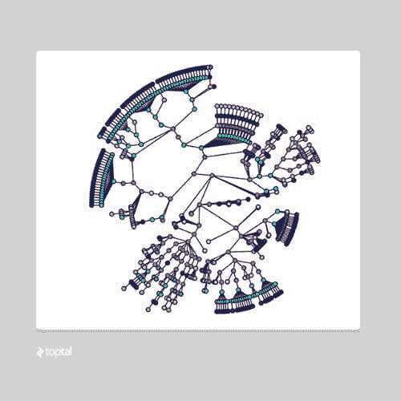

# 现代图形查询语言 – GSQL

> 原文：[`www.kdnuggets.com/2018/06/modern-graph-query-language-gsql.html`](https://www.kdnuggets.com/2018/06/modern-graph-query-language-gsql.html)

 评论

**作者：[余旭博士](https://www.linkedin.com/in/yuxusandiego/)，TigerGraph CEO**

根据咨询公司[DB-Engines.com](http://db-engines.com/)，图形数据库技术是所有数据管理类别中增长最快的。最近的[Forrester](https://www.forrester.com/report/Vendor+Landscape+Graph+Databases/-/E-RES121473)调查显示，全球超过一半的数据和分析技术决策者现在使用图形数据库。

目前，企业使用图形技术作为[客户分析](https://www.mckinsey.com/business-functions/marketing-and-sales/our-insights/why-customer-analytics-matter)、[欺诈检测](https://www.gartner.com/it-glossary/fraud-detection/)、[风险评估](https://www.investopedia.com/terms/r/risk-assessment.asp)和其他复杂数据挑战的竞争优势。这项技术提供了快速高效地探索、发现和预测关系的能力，以揭示关键模式和洞察，支持业务目标。

**是时候使用现代图形查询语言了**

随着图形数据库的广泛采用，现在正是制定标准图形查询语言的时候。企业今天成功地使用各种查询语言，如 Neo4j 的 Cypher、Apache TinkerPop Gremlin，但这些也有其自身的局限性。

尽管 Cypher 是高级且用户友好的，但它不是图灵完备的。有许多图形算法和业务逻辑规则无法使用 Cypher 实现。例如，PageRank/Label Propagation 风格的算法，其中变异对电力流计算和优化、风险分析等垂直领域很重要。

Gremlin 是图灵完备的，但层次较低。该语言适用于非常简单的查询，但在实际业务问题中，需要高级编程技能，生成的查询可能难以理解和维护。有关图形查询语言的技术比较可以在[这里](https://info.tigergraph.com/gsql)找到。

随着数据和用例的增长和复杂化，显然组织需要具备向上和向外扩展的能力，以及为大数据、复杂分析（如机器学习和 AI）和实时操作生成所需的物质性能影响的能力。

国际标准还将有助于解决图市场中普遍存在的挑战，包括难以找到熟练的图开发人员和加快企业采纳的需求。通过高级图查询语言降低学习和实施图应用的门槛，使更多开发人员能够更轻松地从提出高层次的现实生活问题过渡到轻松构建基于图的解决方案。

现代图查询语言，以及支持它的超高速和可扩展系统，对于帮助企业大规模实现数字化转型也至关重要。

**现代图查询语言应该是什么样的？**

让我们退一步，理解为何用户选择图数据库而不是关系型数据库、键值存储、文档存储和其他类型的数据库。通常是因为他们希望以令人满意的性能解决复杂问题。非图数据库有以下缺点：

- 表达现实世界商业问题极其困难。例如，像账户或人员这样的实体如何以各种通常未知的方式（特别是对已知的恶意行为者）连接起来？

- 在访问数千万到数亿个实体及其关系时，实时性能极差。对于实时个性化推荐、欺诈检测等应用，速度至关重要。

图数据库提供了解决这些问题的平台，但用户仍然需要适当的查询语言：以定义图模式来建模复杂的实体和关系，以轻松将各种数据源映射到图中，以快速将数据加载到图中，并且具有足够的表达能力（图灵完备），以建模和解决各类行业的现实商业问题。这些都是使图技术能够跨越鸿沟，实现更广泛企业采纳的关键。

鉴于此，专家指出了现代图查询语言的重要八个关键特征：1）基于模式并具有动态模式更改的能力，2）图遍历的高级表达，3）图遍历的精细控制，4）内置并行语义以保证高性能，5）高度表达的加载语言，6）数据安全和隐私，7）支持查询调用查询（递归）和 8）SQL 用户友好。关于这些要求的更多细节可以在[这里](https://www.tigergraph.com/2018/05/22/crossing-the-chasm-eight-prerequisites-for-a-graph-query-language/)找到。

**介绍 GSQL**

GSQL 是一种用户友好、高度表达和图灵完备的图查询语言。与其他选项不同，GSQL 支持组织已经遇到的现实商业需求，并从头开始设计以满足上述标准。

实际上，GSQL 的开发是在寻找一种能够充分满足实际业务需求的现代图查询语言失败之后开始的。当 TigerGraph 六年前成立时，我们决定花费数年时间创建 GSQL，以缓解这一痛点。我们从头开始设计，支持并行加载、查询和实时交易的更新，以及超快的分析。

自去年年底 TigerGraph 公开发布以来，客户反馈极为积极。我们不断听到客户获得了之前认为不可能的数据洞察。换句话说，GSQL 使得不可能变为可能。GSQL 被包括支付宝在内的一些大型公司使用，支付宝是全球最大的图形部署，每天有超过二十亿的实时交易。

用户们还报告说，GSQL 在处理大数据查询时使用方便。速度也是一个好处，因为 GSQL 查询在几秒钟内就能返回结果，而使用 Cypher 或 Gremlin 等解决方案可能需要几个小时——当然，前提是查询能够实现。简而言之，GSQL 满足了图查询语言最重要的需求：性能、表达能力和易用性。要了解更多关于 Tigergraph 和 GSQL 的信息，请访问 [www.tigergraph.com](http://www.tigergraph.com)。

我鼓励业界推动制定国际标准，以最大化他们的图数据库投资。这将对所有人都有利。然而，在选择设计用于满足现代业务需求的语言时，需要考虑关键因素。

示例 GSQL 查询 1：PageRank 计算节点的相对权威性，对于许多应用程序（如社区聚类、影响分析、电力流收敛、预测分析中的标签传播等）至关重要。能够在高级图查询语言中纯粹实现和 *定制* PageRank 风格（迭代、对迭代次数和终止条件的完全控制等）的图算法对于这些用例至关重要。相反，*硬编码* 的 PageRank 算法无法提供解决现实问题的表达能力。

`创建查询 pageRank (FLOAT diffLimit, INT maxIter, FLOAT damping) FOR GRAPH G { # @@ = 全局累加器; @ = 每个顶点的累加器`

MaxAccum <float>@@maxDiff = 9999; # 一次迭代中的最大分数变化

SumAccum <float>@rcvd_score = 0; # 每个顶点从邻居处获得的分数总和

SumAccum <float>@score = 1; # 每个顶点的初始分数是 1。</float></float></float>

Vertices = {ANY};

当 @@maxDiff > diffLimit 时，LIMIT maxIter DO

@@maxDiff = 0;

Vertices = SELECT s FROM Vertices:s-(:e)->:t

ACCUM t.@rcvd_score += s.@score/(s.outdegree())

POST-ACCUM s.@score = (1-damping) + damping * t.@rcvd_score，

s.@rcvd_score = 0，

@@maxDiff += abs(s.@score - s.@score');

结束;

打印 Vertices;

}

**个人简介**: [余旭博士](https://www.linkedin.com/in/yuxusandiego/)是 TigerGraph 的创始人兼首席执行官，TigerGraph 是世界上首个原生并行图数据库。余博士在加州大学圣地亚哥分校获得计算机科学与工程博士学位。他是大数据、并行数据库系统以及图数据库方面的专家，并拥有 26 项并行数据管理和优化的专利。在创办 TigerGraph 之前，余博士曾在 Twitter 负责大规模数据分析的数据基础设施工作。在此之前，他曾担任 Teradata 的 Hadoop 架构师，领导公司的大数据项目。

**相关内容:**

+   [图数据库进入主流](https://www.kdnuggets.com/2018/02/graph-databases-burst-into-the-mainstream.html)

+   [利用大数据进行图分析](https://www.kdnuggets.com/2017/12/graph-analytics-using-big-data.html)

+   [如何在 SQL Server 中通过机器学习服务执行 R 和 Python](https://www.kdnuggets.com/2018/06/microsoft-azure-machine-learning-r-python-sql-server.html)

* * *

## 我们的三大课程推荐

 1\. [Google 网络安全证书](https://www.kdnuggets.com/google-cybersecurity) - 快速进入网络安全职业生涯。

 2\. [Google 数据分析专业证书](https://www.kdnuggets.com/google-data-analytics) - 提升你的数据分析能力

 3\. [Google IT 支持专业证书](https://www.kdnuggets.com/google-itsupport) - 支持你组织的 IT 需求

* * *

### 相关话题

+   [用 SQL 查询你的 Pandas 数据框](https://www.kdnuggets.com/2021/10/query-pandas-dataframes-sql.html)

+   [我们能用 T5 查询表格吗？](https://www.kdnuggets.com/2022/05/query-table-t5.html)

+   [SQL 查询优化技巧](https://www.kdnuggets.com/2023/03/sql-query-optimization-techniques.html)

+   [提高 SQL 查询性能的 5 个技巧](https://www.kdnuggets.com/5-tips-for-improving-sql-query-performance)

+   [思想图谱：大型语言模型中复杂问题解决的新范式](https://www.kdnuggets.com/graph-of-thoughts-a-new-paradigm-for-elaborate-problem-solving-in-large-language-models)

+   [自然语言处理中的 N-gram 语言建模](https://www.kdnuggets.com/2022/06/ngram-language-modeling-natural-language-processing.html)
