# 什么是矩生成函数？

> 原文：[`www.kdnuggets.com/2022/12/momentgenerating-functions.html`](https://www.kdnuggets.com/2022/12/momentgenerating-functions.html)

数据科学是一个多学科领域。因此，它通常更倾向于多语种和多才多艺的人。它需要对计算和应用数学的理解，这可能会让纯编码背景的数据科学家感到望而却步。然而，掌握数学统计学是重要的，特别是如果你计划为预测结果创建算法和数据模型的话。

在大多数情况下，学习任何东西的最佳方法是将其分解成概念。这也适用于概率与统计中的概念。矩生成函数（MGF）就是所有数据科学家都应了解的概念之一。以下指南将回答它们是什么以及如何在编程中实现它们。

* * *

## 我们的前三大课程推荐

 1\. [谷歌网络安全证书](https://www.kdnuggets.com/google-cybersecurity) - 快速进入网络安全职业生涯。

 2\. [谷歌数据分析专业证书](https://www.kdnuggets.com/google-data-analytics) - 提升你的数据分析技能

 3\. [谷歌 IT 支持专业证书](https://www.kdnuggets.com/google-itsupport) - 支持你所在组织的 IT

* * *

# 在概率和统计中，什么是矩？

如果你字面理解矩生成函数，你会发现 MGF 是生成矩的函数。但什么是矩？在统计学中，我们使用所谓的**分布**来说明值在一个领域中的分布情况，即哪些值是常见的，哪些是稀有的。

数据科学家和统计学家使用**矩**来测量分布。从根本上说，[矩是分布的参数](https://www.statistics.com/glossary/moments/)，它们可以用来确定或描述其形状，允许你提取有关数据的信息（元数据）。我们将下文介绍四种最常见的矩。

## 均值 E(X)

均值是**第一矩**。它描述了分布的中心位置/位置/倾向。此外，它是初始期望值，也称为（数学）期望或平均值。在结果具有联合发生概率的情况下，我们使用算术平均公式：

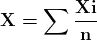

简而言之，所有变量值的总和可以除以值的数量 [(值的总和)÷(值的总数)]。

然而，如果结果的发生概率不同，你必须计算每个概率的结果，将这些值加总，然后乘以相应的结果/概率。

均值公式是[最受欢迎的方法之一](https://statistics.laerd.com/statistical-guides/measures-central-tendency-mean-mode-median.php)来测量平均值或中心趋势。它也可以表示为中位数（中间值）或众数（最可能的值）。

## 方差 E(X²)

方差是第二个矩。它表示分布的宽度或扩散程度——值与平均值或标准的偏离程度。这个矩最终用于说明或查找分布或数据集中的任何偏差。我们通常使用标准差，它由方差的平方根表示[E(X³)]。

## 偏度 E(X³)

偏度是第三个矩。它表示分布的非对称性或相对于分布均值的偏斜程度。偏度影响均值、中位数和众数之间的关系。一个分布的偏度可以分为三类：

+   **对称分布：** 分布的两侧/尾部对称。在这个类别中，偏度的值为 0。在一个完全对称（单峰）分布中，均值、中位数和众数是相同的。

+   **正偏**：分布的右侧/尾部比左侧长。这用于识别和表示异常值，这些值大于均值。这个类别也可以称为右偏、右尾或右偏分布。通常，均值大于中位数，中位数大于众数（众数 < 中位数 < 均值）。

+   **负偏**：分布的左侧/尾部比右侧长。我们用它来识别和表示值小于均值的异常值。这个类别也可以称为左偏、左尾或左偏分布。通常，众数大于中位数，中位数大于均值（众数 > 中位数 > 均值）。

你还可以使用以下简单公式来找出偏度：

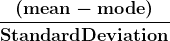

或

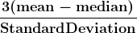

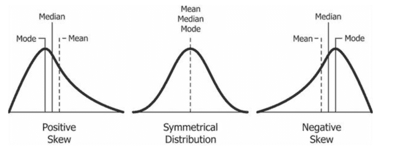

来源：[Creative Commons](https://commons.wikimedia.org/wiki/File:Relationship_between_mean_and_median_under_different_skewness.png)

## 峰度 E(X⁴)

峰度是第四个矩。我们用它来通过分布的“尾部”来测量和指示异常值的出现。因此，峰度最关注分布的尾部。它帮助我们确定分布是否正常或充满极端值。

通常，正态分布的峰度值为 3 或超额峰度为 0。具有这种类型峰度的分布称为**中峰度型**。具有较轻尾部和峰度值小于三（K < 3）的分布称为**负峰度**。在这些情况下，分布通常较宽且较平坦，称为**平峰型**。

另一方面，具有较重尾部和峰度值大于三（K > 3）的分布称为具有**正峰度**。在这些情况下，分布较窄，具有尖锐或高峰，称为**尖峰型**。高峰度表明分布包含异常值。

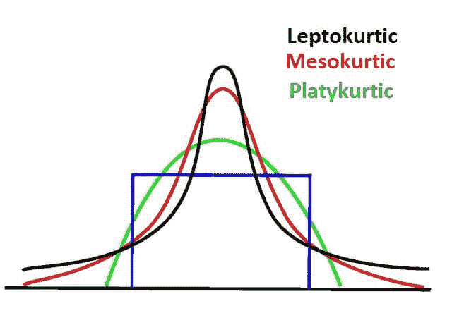

现在我们已经涵盖了什么是矩，我们可以讨论矩生成函数（MGF）。

# 什么是矩生成函数（MGF）？

矩生成函数最终是允许你生成矩的函数。在 *X* 是一个具有累积分布函数 *Fx* 的随机变量且 *t* 的期望值接近于零的某个邻域的情况下，X 的 MGF 定义为：

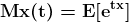

其中 *X* 是离散的，pi 代表概率质量函数（PMF），其定义为：

其中 *X* 是连续的，f(X) 代表[概率密度函数](https://www.investopedia.com/terms/p/pdf.asp)（PDF），其定义如下：

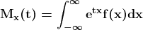

在我们尝试找到原矩的情况下，我们必须找到 E[xn] 的值。这涉及使用 E[etx] 的 nth 导数。我们还通过将 t (t = 0) 作为值来简化它：

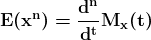

因此，使用 MGF 找到第一阶原矩（均值）时，将 t 设为 0 看起来如下：

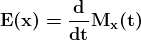

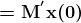

你可以使用相同的方法找到第二阶原矩：

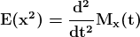

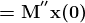

你可以使用泰勒展开式（ex=1+x1!+x22!+x33!+…，-∞<x to="" prove="" that="" the="" n-th="" derivative="" of="" mgf="" is="" moment.="" ultimately="">t 作为辅助变量使用。你可以用它来找到 MGF 中的不同导数。

# 为什么矩生成函数是必要的？

MGF 提供了一种替代方案，用于在连续概率分布中积分 PDF 以找到其矩。在编程中，寻找正确的积分使算法变得更加复杂，需要更多的计算资源，增加了程序的负载或运行时间。MGF 和其衍生方法在找到矩时更为高效。

# 结论

在不使用 MGF 的情况下找到分布的矩是可能的，但计算高阶矩而不使用 MGF 会变得复杂。Python 的内置统计模块提供了一系列足够的函数，可用于从数据集中计算矩。然而，这并不是在 Python 中[使用统计函数](https://www.kdnuggets.com/2022/10/statistical-functions-python.html)的唯一选项。

上述指南提供了对矩和矩生成函数的基本探讨。作为程序员或数据科学家，你可能从未需要手动计算原始矩或尝试手动推导中心矩。很可能，有多种模块和库可以为你完成这些任务。然而，了解后台发生的过程始终是重要的。

**[Nahla Davies](http://nahlawrites.com/)** 是一名软件开发者和技术作家。在全职从事技术写作之前，她管理了——除了其他有趣的工作——担任过 Inc. 5,000 实验性品牌组织的首席程序员，该组织的客户包括三星、时代华纳、Netflix 和索尼。

### 更多相关主题

+   [数据科学面试中你应该知道的五种 SQL 窗口函数](https://www.kdnuggets.com/2022/01/top-five-sql-window-functions-know-data-science-interviews.html)

+   [损失函数：解释者](https://www.kdnuggets.com/2022/03/loss-functions-explainer.html)

+   [SQL 窗口函数](https://www.kdnuggets.com/2022/04/sql-window-functions.html)

+   [KDnuggets™ 新闻 22:n03，1 月 19 日：深入探讨 13 个数据…](https://www.kdnuggets.com/2022/n03.html)

+   [深度学习中激活函数的工作原理](https://www.kdnuggets.com/2022/06/activation-functions-work-deep-learning.html)

+   [数据科学中的函数理解](https://www.kdnuggets.com/2022/06/understanding-functions-data-science.html)
