# Mongo DB 基础

> 原文：[`www.kdnuggets.com/2019/06/mongo-db-basics.html`](https://www.kdnuggets.com/2019/06/mongo-db-basics.html)

 评论

**由 [Jyoti Reddy](https://www.linkedin.com/in/jyoti-reddy11/?originalSubdomain=in) 提供，Krones 数据工程师**

Mongo DB 是一种面向文档的 NO SQL 数据库，不同于具有宽列存储的 HBASE。面向文档的数据库相较于关系型数据库的优势在于，可以根据需要为每个情况更改列名，而不是所有行使用相同的列名。

* * *

## 我们的前三个课程推荐

 1\. [Google 网络安全证书](https://www.kdnuggets.com/google-cybersecurity) - 快速进入网络安全职业生涯。

 2\. [Google 数据分析专业证书](https://www.kdnuggets.com/google-data-analytics) - 提升你的数据分析能力

 3\. [Google IT 支持专业证书](https://www.kdnuggets.com/google-itsupport) - 支持你的组织 IT

* * *

### 在 Mongo DB 中操作的方法

**1.** **创建数据库**

使用命令 — use <desired database name>

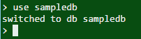

**2\. 列出 Mongo DB 系统中的数据库**

使用命令 — show dbs

该命令将显示默认数据库以及客户端创建的数据库。然而，如果在创建的数据库中没有集合，则它不会出现在列表中。此外，要检查当前选定的数据库，请使用命令- db。下图显示了数据库

当前正在操作中。

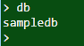

**3\. 删除数据库**

使用命令 — db.dropDatabase()。按照以下命令，显示了在删除选定数据库前后的情况。我们无法指定选定的数据库名称。当前选定的数据库将被自动删除。此外，我们在 sampledb 中插入了一些数据，这就是它出现在列表中的原因。如果 sampledb 中没有数据，则在输入命令 — show dbs 后将不会出现。

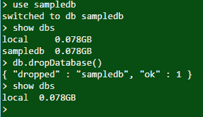

**4\. 创建集合**

以下过程展示了如何在数据库中创建一个集合。集合中包含文档。使用命令 — db.collectionname.insert({})。下图仅显示了在集合‘Country’中创建的一个文档。我们可以在同一集合中创建多个文档。这个集合相当于 HBase 中的表或关系型数据库管理系统中的表。

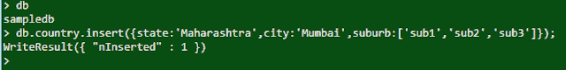

以下示例展示了一个包含多个文档的集合。注意两个文档中的字段数量。第一个文档没有 suburb 字段，这意味着我们只需插入我们拥有的信息。

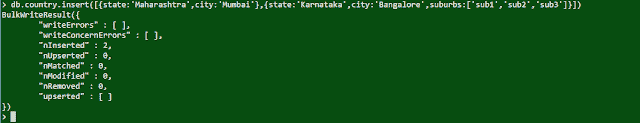

**5\. 查找集合中的文档**

使用命令- `db.collectionname.find()`。对象 ID 会附加到每个文档中，使每个文档唯一。

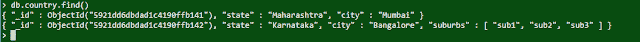

我们还可以使用 AND 和 OR 操作符在集合中查找特定的文档。例如，要查找包含城市 Mumbai 的文档，请使用以下命令：

`db.country.find({city:’Mumbai’});`

**6\. 更新集合中的文档**

要更新特定字段，请使用命令-

`db.collectionname.update({field:’old name’},{$set:{field:’new name’}})`

**更新前**

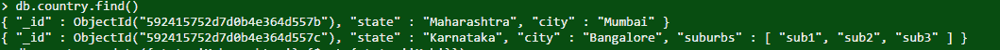

**更新后**

**7\. 删除文档**

要删除文档，请使用以下命令-

`db.collectioname.remove({field:’Value’})`

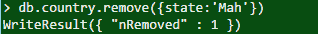

我们还可以使用命令 `db.collectionname.remove({})` 来清空整个集合，这已在版本 2.6 中添加。以前命令 `db.collectionname.remove()` 也可以使用。这相当于 SQL 中的 truncate 命令。

**8\. 行的投影**

要选择所需的字段，我们可以使用下面给出的命令。我们需要在命令中将‘1’或‘0’附加到字段上。如果给‘1’，则该字段的所有行都会出现，‘0’则相反。如果命令中没有指定字段名，则默认为 Object ID 字段取‘1’，这种情况不适用于列表中的其他字段。这里的字段对应于关系型数据库中的列。

`db.collectionname.find({},field:1})`

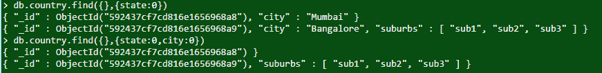

**9\. 限制行数**

这是投影行的高级版本。在投影技术中，所有行都会出现，导致获取不需要的数据。在这里，我们可以限制列数并跳过一些行。使用命令 - `db.collectionname.find({},{field:1 or 0,field:1 or 0…}).limit(1).skip(1)`。该方法将只检索一行。跳过的数量决定了从结果中移除的行数。

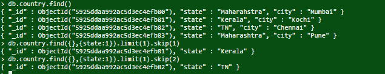

**10\. 排序行**

在这种方法中，我们可以以升序或降序排列行。选择所需的字段，然后将 1 或 -1 附加到排序命令中。默认值为 1，因此在这种情况下，排序命令不需要指定。升序或降序将基于排序命令中选择的列。

`Command: db.country.find({},{state:1}).sort({state:-1})`

这些是操作 Mongo DB 的一些方法。语法友好且易于理解。这个数据库的另一个优点是，我们不需要在同一集合中的所有文档中包含所有字段。例如，如果一个文档有一个名为 city 的字段，而另一个文档不需要这个字段，那么我们可以不包括它。这有助于节省大量空间。请参阅下面的示例

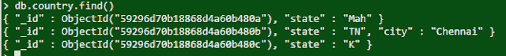

**简介： [Jyoti Reddy](https://www.linkedin.com/in/jyoti-reddy11/?originalSubdomain=in)** 是 Krones 的数据工程师。

[原文](https://medium.com/plumbersofdatascience/mongo-db-basics-f1a2c74b2bfe)。经授权转载。

**相关：**

+   理解 NoSQL 数据库的 7 个步骤

+   数据工程初学者指南  –  第一部分

+   数据工程初学者指南 – 第二部分

### 更多相关内容

+   [基础回顾第二部分：梯度下降](https://www.kdnuggets.com/2023/03/back-basics-part-dos-gradient-descent.html)

+   [通过这本免费电子书学习 MLOps 基础](https://www.kdnuggets.com/2023/08/learn-mlops-basics-free-ebook.html)

+   [Python 基础：语法、数据类型和控制结构](https://www.kdnuggets.com/python-basics-syntax-data-types-and-control-structures)

+   [基础回顾第 1 周：Python 编程与数据科学基础](https://www.kdnuggets.com/back-to-basics-week-1-python-programming-data-science-foundations)

+   [基础回顾第 3 周：机器学习简介](https://www.kdnuggets.com/back-to-basics-week-3-introduction-to-machine-learning)

+   [基础回顾第 4 周：高级主题和部署](https://www.kdnuggets.com/back-to-basics-week-4-advanced-topics-and-deployment)
