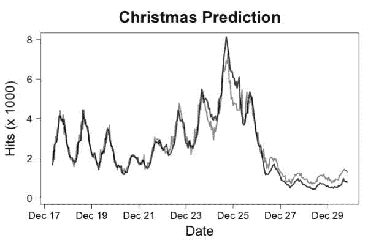
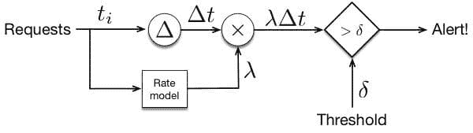
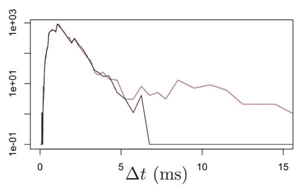
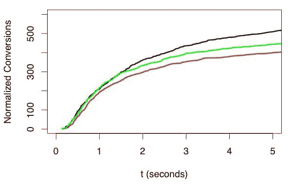

# 如何实时监控机器学习模型

> 原文：[`www.kdnuggets.com/2019/01/monitor-machine-learning-real-time.html`](https://www.kdnuggets.com/2019/01/monitor-machine-learning-real-time.html)

 评论

**由 [Ted Dunning](https://mapr.com/blog/author/ted-dunning/)，MapR 首席应用架构师**

### 介绍

信不信由你，在机器学习课程中学到的东西并不是你需要知道的内容来将机器学习付诸实践。学术机器学习几乎完全涉及对机器学习模型的离线评估。这种理想化的观点也由 Kaggle[^([1])](#_ftn1) 或 Netflix 挑战赛[^([2])](#_ftn2) 等广泛宣传的竞赛所助长。在现实世界中，这种方法令人惊讶地通常仅能作为一个粗略的初步筛选，用于剔除真正糟糕的模型。对于严肃的生产工作，在线评估通常是确定多个最终候选模型中哪个可能被选择用于进一步使用的唯一选择。正如爱因斯坦所传言的那样，理论与实践在理论上是一样的。在实践中，它们是不同的。模型也是如此。部分问题与其他模型和系统的互动有关。另一个问题则涉及现实世界的变异性，可能是对手的作用。甚至可能是太阳黑子。一个特别的问题是，当模型选择自己的训练数据时，它们会表现出自我强化的行为。

除了这些困难，生产模型几乎总是有服务水平协议，这些协议涉及它们必须多快产生结果以及它们允许失败的频率。这些操作性考虑因素可能与模型的准确性一样重要……返回的正确结果迟到比及时返回的基本正确结果要糟糕得多。

本文将重点讨论如何实时或近实时地监控机器学习系统。由于这个重点，我们不会多谈论如何确定一个模型是否产生了正确答案，因为你通常很难在很长时间内确认这一点。例如，如果一个欺诈模型说某个账户已被接管，你可能要几个月才能得知真相。然而，即便如此，我们通常可以在此之前很早就发现模型是否在某些重要方面表现异常。

这里描述的技术将包括使用粗略功能监控器、非线性延迟直方图、如何规范化用户响应数据以及如何将得分分布与参考分布和金丝雀模型进行比较。这些技术听起来可能很神秘，但在华丽的名称背后，每一种都有一个简单的核心，不需要高级数学就能理解、实施或解释。

### 这是一个充满挑战的世界

让我们谈谈除了在课堂上学到的内容之外你需要关注的方面。如果一切像在课堂和比赛中那样简单，那将绝对是一个更简单的世界，但实际情况远非如此。不仅正确提取训练数据是一项巨大的工程工作，而且在实际运行的模型必须处理一些非常复杂的现实世界问题。如果你在构建一个欺诈模型，欺诈者会调整他们的方法以避开你的模型。如果你在做市场营销，你的竞争对手将总是寻找超越你努力的方法。即使是那些不依赖于人类行为的系统，如飞机引擎或工厂，也会发生意外。这些意外可能是像双引擎鸟击、铣床的意外升级，甚至是市场条件或天气等上下文问题。

即使数据环境没有变化，也可能会发生设备故障，导致世界看起来奇怪和令人惊讶。

无论你构建的是哪种类型的机器学习系统，你都需要监控你的模型，以确保它们仍然按照你认为的方式工作。让我们看看一些帮助发现问题的具体技术。

### 关注基础知识

模型性能的最基本方面是它是否接收到请求以及它产生结果的速度。如果你不提出请求，模型不会给出好的结果。而且，结果的质量也取决于你是否能及时获得这些结果。

要监控请求是否到达，你需要记录每一个传入请求的到达时间、请求所到达的机器名称以及准确的时间戳。通常，将这些数据记录到分布式平台上的持久流中会更好，因为如果机器宕机，日志文件可能会消失。将请求到达和完成记录为单独的事件也更好，这样你可以区分响应失败与请求缺失。你可以构建的最简单的监控方法是测量请求之间的时间。更进一步的是基于最近的请求速率[构建当前请求速率的简单预测器](https://mapr.com/practical-machine-learning-new-look-anomaly-detection/)，并使用预测速率与上次请求之间的时间的乘积。即使是简单的线性模型通常也会在一个小时前预测请求速率，误差小于 10%，这将允许你在请求停止时发出警报。图 1 展示了通过绘制“圣诞节”维基百科页面的预测流量，预测的准确性如何。

**图 1\. 实际流量（深色线）与针对 11 月流量训练的流量预测模型预测流量（灰色线）进行对比。尽管圣诞节期间的流量与训练期间的流量大相径庭，但预测仍然足够准确，能够非常快速地检测到系统故障。**

用于此预测的模型是一个线性回归模型，使用了最近 4 小时、24 小时前和 48 小时前的流量对流量的对数进行预测。这个预测可以用于检测请求率异常，如图 2 所示。

**图 2\. 请求率异常检测器的架构。使用阈值来确定何时请求率下降到预测值以下，因为事件之间的时间将上升到一个高水平。预测率用于对这个时间进行归一化。**

一旦我们确认请求正在到达，我们可以查看我们的模型是否及时产生结果。为此，我们需要记录每个请求响应的时间。这些日志条目应指定原始请求的唯一 ID、当前时间、计算请求所用的模型和硬件的详细信息以及经过的时间。作为初步工作，我们可以计算报告的经过时间的分布。对于延迟，最佳方法是使用 [非均匀直方图](https://github.com/tdunning/t-digest/blob/master/core/src/main/java/com/tdunning/math/stats/LogHistogram.java)。我们可以为每个，例如，每五分钟的时间间隔计算这样的直方图。为了监控性能，我们可以在相当长的一段时间内积累背景，并将最近的结果与该背景分布进行对比。图 3 显示了我们可能看到的情况。

**图 3\. 以毫秒为单位的正常响应时间（黑线）与大约 1% 的响应显著延迟的响应时间进行对比。由于纵轴上的对数刻度和非均匀的区间大小，99%延迟的变化非常明显。**

这些直方图也可以使用基于比较对应区间计数的更高级的自动化技术进行比较。一种很好的方法是使用被称为 [G-检验](https://tdunning.blogspot.com/2008/03/surprise-and-coincidence.html) 的统计方法。这种测试可以将每个直方图转换为一个单一的得分，描述其与长期背景相比的异常程度。如果进入直方图的延迟测量有标签，那么可以比较单个直方图中的慢速和快速部分，以找出在慢速部分更常见的标签。如果这些标签代表硬件 ID 或型号版本，则可以用来定向诊断工作。

### 但这是否正确？！

到目前为止提到的所有方法都适用于模型应执行的任务。但这种普遍性也意味着这些技术不能告诉我们模型实际产生的响应情况。结果是否良好？是否正确？我们没有真正的了解。目前我们只知道请求正在到达，结果也在以历史上合理的水平和速度产生。速度和处理量很好，但我们还需要了解事情不仅仅是在运行，还要了解它们是否运行正确。

在一些情况下，特别是在处理营销模型时，我们可以在几分钟内获得有关我们模型是否表现良好的初步反馈。然而，在进行比较时，我们必须非常小心。特别是，我们不能仅仅比较每个模型的转化数量，因为随着时间的推移，广告或优惠呈现给用户后，转化数量会不断增加，这给较老的印象带来了优势。图 4 显示了发生了什么。

**图 4\. 转化需要相对于原始印象的时间和印象的数量进行归一化。比较还必须在印象后经过足够长的时间以获得可靠的比较，但等待过长时间并没有帮助。在这里，绿色轨迹起初似乎最好，但在印象后 2 秒，当只有 60%的转化被接收时，明显是黑色最佳，红色最差。选择适当的延迟可以实现模型的最快准确评估。**

问题在于，每次广告或优惠的印象都是独立于其他印象的。如果接收印象的人会做出反应，他们可能会在看到印象后的相对较短时间内做出回应。然而，有些人可能需要更长时间，有些人可能会在很长时间后才做出反应。这意味着，随着时间的推移，任何优惠的转化率都会逐渐上升。因此，首先要做的就是相对于相应印象的时间来调整每个转化率。同样，有些优惠会获得更多的印象，因此你也需要按印象的数量进行纵向缩放。

当你这样做时，你会发现，由于统计变异，你必须等待一段时间才能确定哪个优惠效果最好，但通常不需要等到超过最终响应数的 60%。这非常重要，因为等待 95%的所有印象可能比等待 50-60%的印象要长 10 倍。这个技巧也很重要，因为它允许我们近乎实时地测量响应率。

### 事实可能需要很长时间

尽管实时的真实反馈可能很有用，但在许多情况下这是不可能的。例如，我们可能几天或几周内都无法确定检测到的欺诈行为是否确实存在。然而，我们仍然可以采取一些措施快速检测问题。

许多模型会产生某种分数或一组分数。这些分数通常代表某种概率估计。我们可以用来监控的最简单的方法之一是查看模型产生的分数分布。如果该分布发生意外变化，则很可能是模型输入发生了重要变化，反映了外部世界的变化，或者模型依赖的系统，例如特征提取系统，发生了某种变化。无论哪种情况，发现变化是了解发生了什么的第一步。

检测这种变化的最佳方法之一是使用称为*t*-digest 的系统。你不能真正使用我们讨论过的用于延迟分布的 logHistogram，因为分数没有延迟那样明确的特征。*t*-digest 的使用成本稍高，但它几乎可以处理任何情况。方法是每分钟存储一次分数分布的摘要，并标记模型版本等。要检查分数分布，你可以从过去积累这些存储的摘要，以获得参考分布，并将该参考分布与最新的摘要进行比较。

比较分布有两种常用方法。其一是使用参考分布的十分位数作为区间边界，然后使用最新的摘要来估计每个区间中的样本数量。如果分布相同，那么最近数据中每个区间中的样本数量应该是一样的。可以像以前一样使用 G 检验来测试，以获得当分布有趣地不同的时候分数较大的结果。

另一种方法是使用称为 Kolmogorov-Smirnov 统计量的值直接检测参考分布与最近分布之间的差异。在即将发布的*t*-digest 版本中有计算此统计量的代码，但重要的因素是，当分布显著不同的时候统计量较大，当它们不同时则较小。

### 没有什么能像金丝雀那样唱歌。

通常来说，我们对模型应执行的任务了解得越多，并且在与参考行为比较时越具体，我们就能更快、可靠地检测到变化。这就是使用金丝雀模型的动机。这个想法是我们像往常一样将每个请求发送给当前的生产模型，同时保留一个较旧版本的模型，并将每个（或几乎每个）请求也发送给那个较旧版本。这个较旧的模型被称为金丝雀。

因为我们向两个模型发送的是完全相同的请求，并且金丝雀模型几乎做的是我们希望当前模型做的事情，我们可以逐请求比较这两个模型的输出，从而非常具体地了解新模型是否按预期运行。金丝雀模型与当前冠军模型之间的平均偏差是当前模型故障的非常敏感指标，特别是如果我们选择金丝雀时考虑到获得一个非常稳定（即使不那么准确）的模型。

当我们面对潜在的新挑战者要取代当前的冠军时，金丝雀模型也非常有用。如果我们试图量化推出这个新挑战者以替代当前冠军的风险，我们可以比较挑战者与冠军之间的差异，以及挑战者与金丝雀之间的差异。特别是，一旦我们拥有了相当好的模型并进行渐进改进时，任何新的挑战者都不应与当前的冠军或金丝雀有显著差异。差异存在的地方既是我们面临低准确度风险的地方，也是挑战者有机会表现出色的地方。专注于这些特定实例进行人工检查通常能给我们提供重要的见解，帮助判断挑战者是否准备好迎接冠军。

### 总结一下

本文介绍了一系列近实时监控机器学习模型的技术，首先是查看请求率和响应时间等总体操作特性的监控器。这些监控器通常对于检测评估请求时的系统级问题非常有效。接下来，我们讨论了如何对搜索结果或营销印象等情况的响应进行归一化，以便能够干净地进行比较，并在近实时中估计准确性。在不知道模型应该输出什么的情况下，我们讨论了通过比较过去模型的表现或比较金丝雀模型来寻找分数分布变化的方法。

你可能不需要实现所有这些监控方法，但你可能需要实现其中的几个。你永远不知道隐藏着什么，直到你去查看，而你肯定需要了解清楚。

[^([1])](#_ftnref1) 参见 [`www.kaggle.com/c/GiveMeSomeCredit`](https://www.kaggle.com/c/GiveMeSomeCredit)

[^([2])](#_ftnref2) 参见 [`en.wikipedia.org/wiki/Netflix_Prize`](https://en.wikipedia.org/wiki/Netflix_Prize)

**简介**： [Ted Dunning](https://mapr.com/blog/author/ted-dunning/) 是 MapR 的首席应用架构师，同时也是 Apache 软件基金会的董事会成员。他在建立成功的创业公司方面有着丰富的经验，其中机器学习在公司价值上发挥了重要作用。他在数十项专利中被列为发明人，并继续开发新的算法和架构。

**资源：**

+   [在线和基于网络的：分析、数据挖掘、数据科学、机器学习教育](https://www.kdnuggets.com/education/online.html)

+   [分析、数据科学、数据挖掘和机器学习的软件](https://www.kdnuggets.com/software/index.html)

**相关：**

+   [数据科学家的困境：冷启动问题 – 十个机器学习实例](https://www.kdnuggets.com/2019/01/data-scientist-dilemma-cold-start-machine-learning.html)

+   [如何使用 Flask 在 5 分钟内为机器学习模型构建 API](https://www.kdnuggets.com/2019/01/build-api-machine-learning-model-using-flask.html)

+   [2018 年最有用的 6 个机器学习项目](https://www.kdnuggets.com/2019/01/6-most-useful-machine-learning-projects-2018.html)

* * *

## 我们的前三名课程推荐

 1\. [谷歌网络安全证书](https://www.kdnuggets.com/google-cybersecurity) - 快速进入网络安全职业的快车道。

 2\. [谷歌数据分析专业证书](https://www.kdnuggets.com/google-data-analytics) - 提升你的数据分析技能

 3\. [谷歌 IT 支持专业证书](https://www.kdnuggets.com/google-itsupport) - 支持你所在组织的 IT 工作

* * *

### 了解更多相关话题

+   [使用 Python 监控 MLOps 管道中的模型性能](https://www.kdnuggets.com/2023/05/monitor-model-performance-mlops-pipeline-python.html)

+   [使用 Python 的 Watchdog 监控你的文件系统](https://www.kdnuggets.com/monitor-your-file-system-with-pythons-watchdog)

+   [为什么机器学习模型在沉默中死去？](https://www.kdnuggets.com/2022/01/machine-learning-models-die-silence.html)

+   [在机器学习模型中处理稀疏特征](https://www.kdnuggets.com/2021/01/sparse-features-machine-learning-models.html)

+   [模型很少被部署：机器学习领域的普遍失败](https://www.kdnuggets.com/2022/01/models-rarely-deployed-industrywide-failure-machine-learning-leadership.html)

+   [如何使用 MLFlow 打包和分发机器学习模型](https://www.kdnuggets.com/2022/08/package-distribute-machine-learning-models-mlflow.html)
