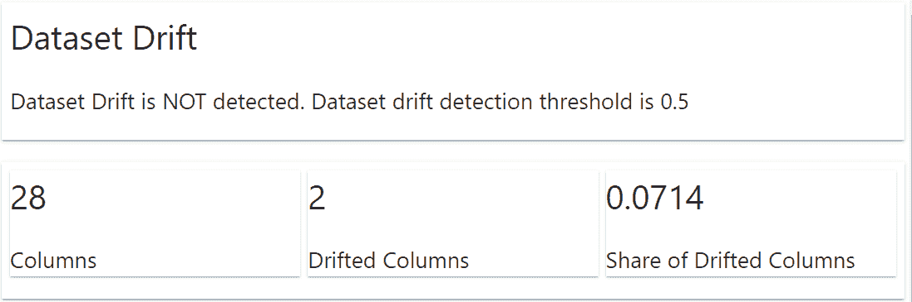
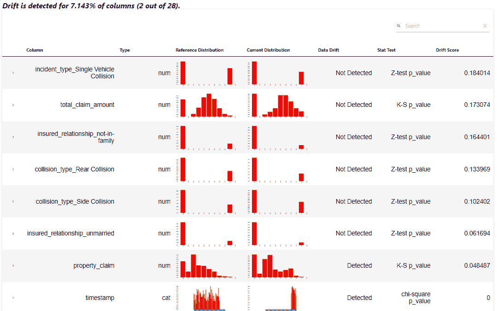
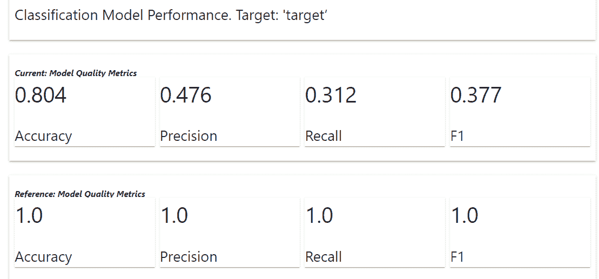
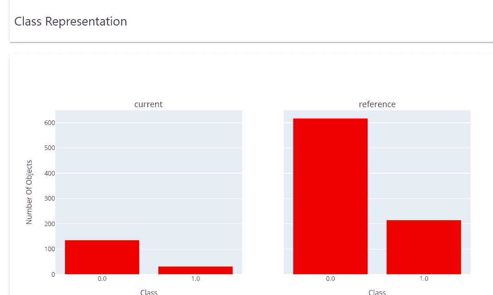
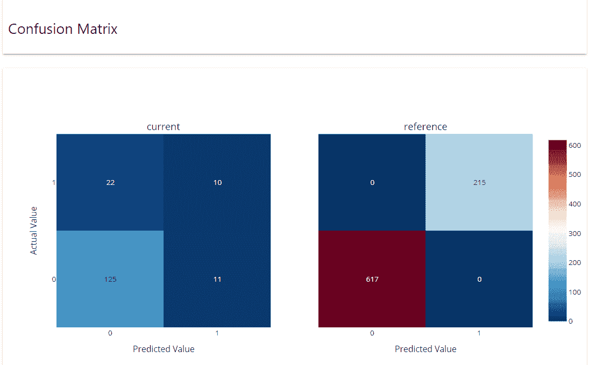
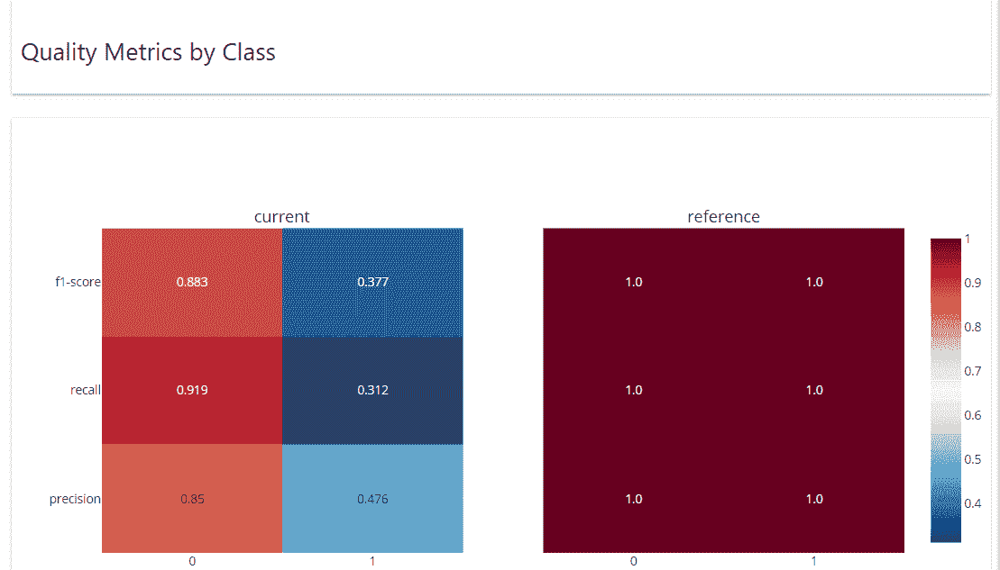

# 在 MLOps 管道中使用 Python 监控模型性能

> 原文：[`www.kdnuggets.com/2023/05/monitor-model-performance-mlops-pipeline-python.html`](https://www.kdnuggets.com/2023/05/monitor-model-performance-mlops-pipeline-python.html)


图片来源于 [rawpixel.com](https://www.freepik.com/free-photo/girl-coding-interactive-screen_13307587.htm#query=machine%20learning&from_query=mlops&position=2&from_view=search&track=sph) 在 [Freepik](https://www.freepik.com/)

机器学习模型只有在生产中用于解决业务问题时才有用。然而，业务问题和机器学习模型在不断发展。这就是为什么我们需要维护机器学习，以便性能能够跟上业务 KPI。这就是 MLOps 概念的来源。

* * *

## 我们的三大课程推荐

 1\. [谷歌网络安全证书](https://www.kdnuggets.com/google-cybersecurity) - 快速进入网络安全职业

 2\. [谷歌数据分析专业证书](https://www.kdnuggets.com/google-data-analytics) - 提升你的数据分析技能

 3\. [谷歌 IT 支持专业证书](https://www.kdnuggets.com/google-itsupport) - 支持你的组织的 IT

* * *

MLOps，或机器学习运维，是用于生产环境中机器学习的一系列技术和工具。从机器学习的自动化、版本控制、交付到监控都是 MLOps 处理的内容。本文将重点介绍监控以及如何使用 Python 包来设置生产环境中的模型性能监控。让我们深入了解一下。

# 监控模型性能

当我们谈论 MLOps 中的监控时，它可能指很多方面，因为 MLOps 的原则之一就是监控。例如：

- 监控数据分布随时间的变化

- 监控开发与生产中使用的特征

- 监控模型衰退

- 监控模型性能

- 监控系统的陈旧性

在 MLOps 中仍有许多元素需要监控，但在本文中，我们将重点关注监控模型性能。模型性能，在我们的案例中，指的是模型从未见过的数据中进行可靠预测的能力，通过特定的指标如准确率、精确率、召回率等来衡量。

为什么我们需要监控模型性能？是为了保持模型预测的可靠性，以解决业务问题。在生产之前，我们通常会计算模型的性能及其对 KPI 的影响；例如，基准是 70%的准确率，如果我们希望模型仍然符合业务需求，低于这个值就是不可接受的。这就是为什么监控性能可以使模型始终满足业务需求。

使用 Python，我们将学习如何进行模型监控。让我们从安装包开始。虽然有许多模型监控的选择，但在这个示例中，我们将使用名为 [evidently](https://docs.evidentlyai.com/) 的开源监控包。

# 使用 Python 设置模型监控

首先，我们需要使用以下代码安装**evidently** 包。

```py
pip install evidently
```

安装包之后，我们将下载数据示例，即来自 [Kaggle](https://www.kaggle.com/datasets/buntyshah/auto-insurance-claims-data) 的保险索赔数据。同时，我们会在进一步使用数据之前对其进行清理。

```py
import pandas as pd

df = pd.read_csv("insurance_claims.csv")

# Sort the data based on the Incident Data
df = df.sort_values(by="incident_date").reset_index(drop=True)

# Variable Selection
df = df[
    [
        "incident_date",
        "months_as_customer",
        "age",
        "policy_deductable",
        "policy_annual_premium",
        "umbrella_limit",
        "insured_sex",
        "insured_relationship",
        "capital-gains",
        "capital-loss",
        "incident_type",
        "collision_type",
        "total_claim_amount",
        "injury_claim",
        "property_claim",
        "vehicle_claim",
        "incident_severity",
        "fraud_reported",
    ]
]

# Data Cleaning and One-Hot Encoding
df = pd.get_dummies(
    df,
    columns=[
        "insured_sex",
        "insured_relationship",
        "incident_type",
        "collision_type",
        "incident_severity",
    ],
    drop_first=True,
)

df["fraud_reported"] = df["fraud_reported"].apply(lambda x: 1 if x == "Y" else 0)

df = df.rename(columns={"incident_date": "timestamp", "fraud_reported": "target"})

for i in df.select_dtypes("number").columns:
    df[i] = df[i].apply(float)

data = df[df["timestamp"] < "2015-02-20"].copy()
val = df[df["timestamp"] >= "2015-02-20"].copy()
```

在上面的代码中，我们选择了一些列用于模型训练，将它们转换为数值表示，并将数据拆分为参考数据（data）和当前数据（val）。

我们在 MLOps 流水线中需要参考数据或基准数据来监控模型性能。它通常是从训练数据中分离出来的数据（例如测试数据）。此外，我们还需要当前数据或模型未见过的数据（新数据）。

我们需要使用**evidently**来监控数据和模型性能。由于数据漂移会影响模型性能，所以监控数据漂移也是必要的。

```py
from evidently.report import Report
from evidently.metric_preset import DataDriftPreset

data_drift_report = Report(metrics=[
    DataDriftPreset(),
])

data_drift_report.run(current_data=val, reference_data=data, column_mapping=None)
data_drift_report.show(mode='inline')
```



**evidently** 包会自动显示数据集发生了什么情况的报告。报告信息包括数据集漂移和列漂移。在上述示例中，我们没有数据集漂移的发生，但有两个列发生了漂移。



报告显示‘property_claim’和‘timestamp’列确实检测到了漂移。这些信息可以在 MLOps 流水线中用于重新训练模型，或者我们仍需进一步的数据探索。

如果需要，我们还可以在日志字典对象中获取上述数据报告。

```py
data_drift_report.as_dict()
```

接下来，让我们尝试从数据中训练一个分类模型，并尝试使用**evidently**来监控模型的性能。

```py
from sklearn.ensemble import RandomForestClassifier

rf = RandomForestClassifier()
rf.fit(data.drop(['target', 'timestamp'], axis = 1), data['target'])
```

**evidently** 需要在参考数据集和当前数据集中都有目标列和预测列。让我们将模型预测添加到数据集中，并使用**evidently**来监控性能。

```py
data['prediction'] = rf.predict(data.drop(['target', 'timestamp'], axis = 1))
val['prediction'] = rf.predict(val.drop(['target', 'timestamp'], axis = 1))
```

作为备注，最好有一些不包含在训练数据中的参考数据来监控模型性能。让我们使用以下代码设置模型性能监控。

```py
from evidently.metric_preset import ClassificationPreset

classification_performance_report = Report(metrics=[
    ClassificationPreset(),
])

classification_performance_report.run(reference_data=data, current_data=val)

classification_performance_report.show(mode='inline')
```



结果显示，我们当前模型的质量指标低于参考值（由于我们使用了训练数据作为参考，因此这是预期的）。根据业务需求，上述指标可以成为我们需要采取的下一步的指示。让我们查看从 evidently 报告中获得的其他信息。

类别表示报告显示了实际的类别分布。

混淆矩阵展示了预测值与实际数据在参考数据集和当前数据集中的对比。



按类别的质量指标展示了每个类别的性能。

如前所述，我们可以将分类性能报告转换为字典日志，使用以下代码。

```py
classification_performance_report.as_dict()
```

目前就是这些。你可以在你现有的任何 MLOps 管道中使用 evidently 设置模型性能监控，它仍然会表现出色。

# 结论

模型性能监控是 MLOps 管道中的一个重要任务，因为它帮助维护模型如何满足业务需求。通过一个名为 evidently 的 Python 包，我们可以轻松设置模型性能监控，这可以集成到任何现有的 MLOps 管道中。

**[Cornellius Yudha Wijaya](https://www.linkedin.com/in/cornellius-yudha-wijaya/)** 是一名数据科学助理经理和数据撰稿人。在全职工作于 Allianz Indonesia 期间，他喜欢通过社交媒体和写作分享 Python 和数据技巧。

### 更多相关话题

+   [使用 Python 的 Watchdog 监控你的文件系统](https://www.kdnuggets.com/monitor-your-file-system-with-pythons-watchdog)

+   [使用 MLOps 管理生产中的模型漂移](https://www.kdnuggets.com/2023/05/managing-model-drift-production-mlops.html)

+   [提升你的机器学习模型性能！](https://www.kdnuggets.com/2023/04/manning-boost-machine-learning-model-performance.html)

+   [使用迁移学习提升模型性能](https://www.kdnuggets.com/using-transfer-learning-to-boost-model-performance)

+   [TPOT 进行机器学习管道优化](https://www.kdnuggets.com/2021/05/machine-learning-pipeline-optimization-tpot.html)

+   [你需要构建供应链管道的 6 种数据科学技术](https://www.kdnuggets.com/2022/01/6-data-science-technologies-need-build-supply-chain-pipeline.html)


[](/news/subscribe.html)

获取免费的电子书《伟大的自然语言处理指南》和《数据科学备忘单完整合集》，以及关于数据科学、机器学习、AI 和分析的领先新闻通讯，直送到你的收件箱。

订阅即表示您接受 KDnuggets 的 [隐私政策](https://www.kdnuggets.com/news/privacy-policy.html)

* * *

[<= 上一篇文章](https://www.kdnuggets.com/2023/05/build-chatgptlike-chatbot-courses.html)[下一篇文章 =>](https://www.kdnuggets.com/2023/05/stop-chatgpt-get-ahead-99-users.html)

### 最新文章

+   [如何跟踪 Python 中的内存分配](https://www.kdnuggets.com/how-to-trace-memory-allocation-in-python)

+   [如何在 R 中导入数据](https://www.kdnuggets.com/how-to-import-data-in-r)

+   [机器学习实践者应该了解的前 5 个 API](https://www.kdnuggets.com/top-5-machine-learning-apis-practitioners-should-know)

+   [谷歌、Snowflake 和微软的新职业技术证书](https://www.kdnuggets.com/new-professional-tech-certificates-from-google-snowflake-microsoft)

+   [数据科学中的 5 个隐藏宝石 Python 库](https://www.kdnuggets.com/5-hidden-gem-python-libraries-for-data-science)

+   [NumPy 在线性代数应用中的应用](https://www.kdnuggets.com/numpy-for-linear-algebra-applications)

|

## 热门文章

|

+   [微软 4 个入门级证书助您获得热门职位](https://www.kdnuggets.com/4-entry-level-certificates-from-microsoft-to-land-in-demand-jobs)

+   [数据科学中的 5 个隐藏宝石 Python 库](https://www.kdnuggets.com/5-hidden-gem-python-libraries-for-data-science)

+   [每个数据工程师都应该知道的 10 个内置 Python 模块](https://www.kdnuggets.com/10-built-in-python-modules-every-data-engineer-should-know)

+   [如何使用 Pandas 有效管理分类数据](https://www.kdnuggets.com/how-to-manage-categorical-data-effectively-with-pandas)

+   [掌握数据工程的项目创意](https://www.kdnuggets.com/project-ideas-to-master-data-engineering)

+   [使用 FastAPI 构建 ML 驱动的 Web 应用](https://www.kdnuggets.com/using-fastapi-for-building-ml-powered-web-apps)

+   [我参加了 Udacity 的谷歌免费 A/B 测试课程：我学到了什么](https://www.kdnuggets.com/i-took-udacitys-free-a-b-testing-course-by-google-heres-what-i-learned)

+   [停止为课程付费，免费学习](https://www.kdnuggets.com/stop-paying-for-courses-and-learn-for-free)

+   [在本地使用 FLUX.1](https://www.kdnuggets.com/using-flux-1-locally)

+   [5 个常见的数据科学错误及如何避免它们](https://www.kdnuggets.com/5-common-data-science-mistakes-and-how-to-avoid-them)

* * *

© 2024 [Guiding Tech Media](https://www.guidingtechmedia.com/)   |   关于   |   联系   |   [广告]（https://mailchi.mp/kdnuggets/media-kit） |   隐私   |   服务条款

发表时间：2023 年 5 月 9 日 作者：Cornellius Yudha Wijaya
