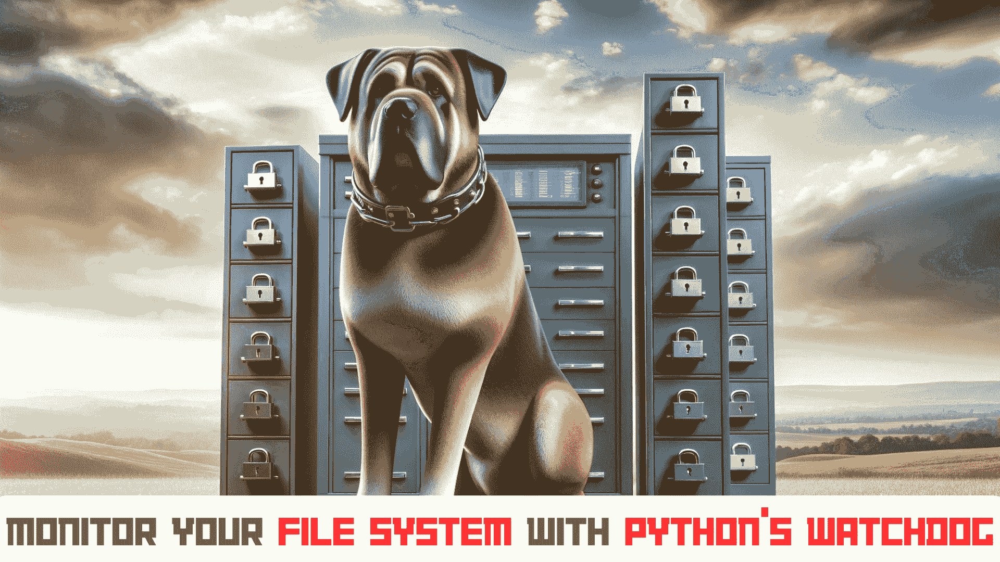

# 使用 Python 的监控程序监控你的文件系统

> 原文：[`www.kdnuggets.com/monitor-your-file-system-with-pythons-watchdog`](https://www.kdnuggets.com/monitor-your-file-system-with-pythons-watchdog)



图片由作者提供 | DALLE-3 & Canva

Python 的监控程序库使得监控你的文件系统并自动响应这些变化变得容易。监控程序是一个跨平台的 API，允许你在监控的文件系统中发生任何变化时运行命令。我们可以对文件创建、修改、删除和移动等多个事件设置触发器，然后用自定义脚本响应这些变化。

* * *

## 我们的 top 3 课程推荐

 1\. [谷歌网络安全证书](https://www.kdnuggets.com/google-cybersecurity) - 快速进入网络安全职业生涯。

 2\. [谷歌数据分析专业证书](https://www.kdnuggets.com/google-data-analytics) - 提升你的数据分析技能

 3\. [谷歌 IT 支持专业证书](https://www.kdnuggets.com/google-itsupport) - 支持你的组织 IT 需求

* * *

## 监控程序设置

开始时你需要两个模块：

+   **监控程序：** 在终端中运行以下命令以安装监控程序。

    ```py
    pip install watchdog
    ```

+   **日志记录：** 这是一个内置的 Python 模块，因此无需外部安装。

## 基本使用

让我们创建一个简单的脚本 ‘main.py’，它监控一个目录，并在文件被创建、修改或删除时打印一条消息。

### 步骤 1：导入所需模块

首先，从监控程序库中导入必要的模块：

```py
import time
from watchdog.observers import Observer
from watchdog.events import FileSystemEventHandler
```

### 步骤 2：定义事件处理程序类

我们定义了一个 MyHandler 类，继承自 FileSystemEventHandler。这个类重写了 on_modified、on_created 和 on_deleted 等方法，以指定这些事件发生时的操作。事件处理程序对象将在文件系统发生任何变化时被通知。

```py
class MyHandler(FileSystemEventHandler):
    def on_modified(self, event):
        print(f'File {event.src_path} has been modified')

    def on_created(self, event):
        print(f'File {event.src_path} has been created')

    def on_deleted(self, event):
        print(f'File {event.src_path} has been deleted')
```

`FileSystemEventHandler` 的一些有用方法如下所示。

+   **on_any_event：** 对任何事件执行。

+   **on_created：** 在创建新文件或目录时执行。

+   **on_modified：** 在文件被修改或目录被重命名时执行。

+   **on_deleted：** 在文件或目录被删除时触发。

+   **on_moved：** 当文件或目录被重新定位时触发。

### 步骤 3：初始化并运行 Observer

Observer 类负责跟踪文件系统中的任何变化，并随后通知事件处理程序。它持续跟踪文件系统活动，以检测任何更新。

```py
if __name__ == "__main__":
    event_handler = MyHandler()
    observer = Observer()
    observer.schedule(event_handler, path='.', recursive=True)
    observer.start()

    try:
        while True:
            time.sleep(1)
    except KeyboardInterrupt:
        observer.stop()
    observer.join()
```

我们启动观察者并使用循环使其持续运行。当你想停止它时，可以通过键盘信号 `(Ctrl+C)` 中断。

### 步骤 4：运行脚本

最后，使用以下命令运行脚本。

```py
python main.py
```

**输出：**

```py
File .\File1.txt has been modified
File .\New Text Document (2).txt has been created
File .\New Text Document (2).txt has been deleted
File .\New Text Document.txt has been deleted
```

上述代码会在终端记录目录中所有的更改，如果有任何文件/文件夹被创建、修改或删除。

## 高级用法

在以下示例中，我们将探讨如何设置一个系统，以检测 Python 文件中的任何更改并自动运行测试。我们需要使用以下命令安装 pytest。

```py
pip install pytest
```

### 第一步：创建一个简单的 Python 项目及测试

首先，设置项目的基本结构：

```py
my_project/
│
├── src/
│   ├── __init__.py
│   └── example.py
│
├── tests/
│   ├── __init__.py
│   └── test_example.py
│
└── watchdog_test_runner.py
```

### 第二步：在示例 Python 文件中编写代码

在 src/example.py 中创建一个简单的 Python 模块：

```py
def add(a, b):
    return a + b

def subtract(a, b):
    return a - b 
```

### 第三步：编写测试用例

接下来，为 tests/test_example.py 中的函数编写测试用例：

```py
import pytest
from src.example import add, subtract

def test_add():
    assert add(1, 2) == 3
    assert add(-1, 1) == 0
    assert add(-1, -1) == -2

def test_subtract():
    assert subtract(2, 1) == 1
    assert subtract(1, 1) == 0
    assert subtract(1, -1) == 2
```

### 第四步：编写 Watchdog 脚本

现在，创建 watchdog_test_runner.py 脚本以监控 Python 文件中的更改并自动运行测试：

```py
import time
import subprocess
from watchdog.observers import Observer
from watchdog.events import FileSystemEventHandler

class TestRunnerHandler(FileSystemEventHandler):
    def on_modified(self, event):
        if event.src_path.endswith('.py'):
            self.run_tests()

    def run_tests(self):
        try:
            result = subprocess.run(['pytest'], check=False, capture_output=True, text=True)
            print(result.stdout)
            print(result.stderr)
            if result.returncode == 0:
                print("Tests passed successfully.")
            else:
                print("Some tests failed.")
        except subprocess.CalledProcessError as e:
            print(f"Error running tests: {e}")

if __name__ == "__main__":
    path = "."  # Directory to watch
    event_handler = TestRunnerHandler()
    observer = Observer()
    observer.schedule(event_handler, path, recursive=True)

    observer.start()
    print(f"Watching for changes in {path}...")

    try:
        while True:
            time.sleep(1)
    except KeyboardInterrupt:
        observer.stop()

    observer.join()
```

### 第五步：运行 Watchdog 脚本

最后，打开终端，导航到项目目录（my_project），并运行 watchdog 脚本：

```py
python watchdog_test_runner.py
```

**输出：**

```py
Watching for changes in ....
========================= test session starts =============================
platform win32 -- Python 3.9.13, pytest-8.2.1, pluggy-1.5.0
rootdir: F:\Web Dev\watchdog
plugins: anyio-3.7.1
collected 2 items

tests\test_example.py ..                                                 [100%]

========================== 2 passed in 0.04s ==============================

Tests passed successfully. 
```

该输出显示在对 example.py 文件进行更改后，所有测试用例均已通过。

## 总结

Python 的 watchdog 库是监控文件系统的强大工具。无论你是在自动化任务、同步文件，还是构建更响应的应用程序，watchdog 使实时响应文件系统更改变得容易。只需几行代码，你就可以开始监控目录和处理事件，从而简化工作流程。

**[](https://www.linkedin.com/in/kanwal-mehreen1/)**[Kanwal Mehreen](https://www.linkedin.com/in/kanwal-mehreen1/)**** Kanwal 是一名机器学习工程师和技术作家，对数据科学以及 AI 与医学的交集有深厚的热情。她共同撰写了电子书《利用 ChatGPT 最大化生产力》。作为 2022 年 APAC 地区的 Google Generation 学者，她倡导多样性和学术卓越。她还被认定为 Teradata 多样性技术学者、Mitacs Globalink 研究学者和哈佛 WeCode 学者。Kanwal 是变革的热心倡导者，创立了 FEMCodes，旨在赋能 STEM 领域的女性。

### 更多内容

+   [在 MLOps 管道中使用 Python 监控模型性能](https://www.kdnuggets.com/2023/05/monitor-model-performance-mlops-pipeline-python.html)

+   [Python 中的并行处理大文件](https://www.kdnuggets.com/2022/07/parallel-processing-large-file-python.html)

+   [KDnuggets 新闻，7 月 20 日：机器学习算法解释…](https://www.kdnuggets.com/2022/n29.html)

+   [使用 Python 为 Amazon 产品构建推荐系统](https://www.kdnuggets.com/2023/02/building-recommender-system-amazon-products-python.html)

+   [等级系统如何帮助预测 AI 成本](https://www.kdnuggets.com/2022/03/level-system-help-forecast-ai-costs.html)

+   [学习系统设计：前 5 本必读书籍](https://www.kdnuggets.com/learning-system-design-top-5-essential-reads)
