# Python 中的蒙特卡洛积分

> 原文：[`www.kdnuggets.com/2020/12/monte-carlo-integration-python.html`](https://www.kdnuggets.com/2020/12/monte-carlo-integration-python.html)

评论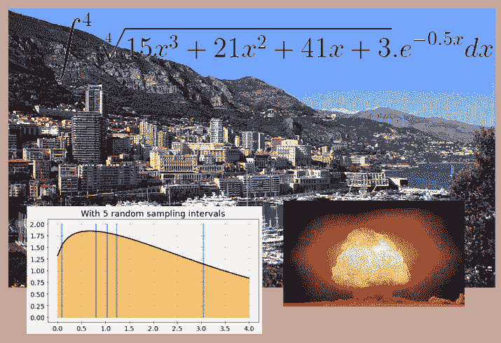

图片来源：维基百科（免费）及作者制作的拼贴图

* * *

## 我们的前三名课程推荐

 1\. [谷歌网络安全证书](https://www.kdnuggets.com/google-cybersecurity) - 快速进入网络安全职业生涯。

 2\. [谷歌数据分析专业证书](https://www.kdnuggets.com/google-data-analytics) - 提升你的数据分析技能

 3\. [谷歌 IT 支持专业证书](https://www.kdnuggets.com/google-itsupport) - 支持你组织的 IT 工作

* * *

**免责声明**：本文的灵感来源于 [**乔治亚理工学院的在线分析硕士（OMSA）**](https://www.gatech.edu/academics/degrees/masters/analytics-online-degree-oms-analytics) 项目的学习资料。我为追求这一优秀的在线硕士项目而感到自豪。你也可以 [在这里查看详细信息。](http://catalog.gatech.edu/programs/analytics-ms/#onlinetext)

### 什么是蒙特卡洛积分？

蒙特卡洛实际上是位于摩纳哥（这个城市-国家，也称为公国）同名区的世界著名赌场的名字，位于世界闻名的法国里维埃拉。

事实证明，这个赌场激发了著名科学家们发明一种有趣的数学技术，用于解决统计学、数值计算和系统模拟中的复杂问题。

图片来源：[维基百科](https://en.wikipedia.org/wiki/Monte_Carlo#/media/File:Monaco_Monte_Carlo_1.jpg)

[这种技术的最早和最著名的用途之一是在曼哈顿计划期间](https://www.solver.com/press/monte-carlo-methods-led-atomic-bomb-may-be-your-best-bet-business-decision-making)，当时，高度浓缩铀的链式反应动力学给科学家们带来了极其复杂的理论计算。即使是像约翰·冯·诺依曼、斯坦尼斯瓦夫·乌拉姆、尼古拉斯·美特罗波利斯这样的天才也无法用传统的方法解决。因此，他们转向了随机数的奇妙世界，让这些概率量驯服了原本难以处理的计算。

三位一体试验：（图片来源：[维基百科](https://en.wikipedia.org/wiki/Nuclear_weapon#/media/File:Trinity_Detonation_T&B.jpg)）

令人惊讶的是，这些随机变量能够解决计算问题，这个问题困扰了确定性方法。实际上，不确定性的元素赢得了胜利。

正如**不确定性和随机性主导了蒙特卡洛游戏的世界**。这就是这个名字的灵感来源。

图像来源：[Pixabay](https://pixabay.com/illustrations/cube-random-luck-eye-numbers-1655118/)

今天，它是一种在广泛领域中使用的技术——

+   [风险分析，金融工程](https://en.wikipedia.org/wiki/Monte_Carlo_methods_in_finance)，

+   供应链物流，

+   [医疗保健研究](https://www.beckershospitalreview.com/healthcare-information-technology/a-million-trials-in-5-minutes-how-monte-carlo-simulations-could-revolutionize-healthcare.html)，药物开发

+   统计学习与建模，

+   [计算机图形学](https://link.springer.com/chapter/10.1007/978-3-540-74496-2_8)，图像处理，[游戏设计](https://beej.us/blog/data/monte-carlo-method-game-ai/)，

+   大型系统模拟，

+   [计算物理学](https://en.wikipedia.org/wiki/Monte_Carlo_method_in_statistical_physics)，天文学等。

尽管取得了许多成功和声誉，但基本思想却非常简单且易于演示。我们在本文中用一组简单的 Python 代码进行演示。

> 这种技术最早和最著名的用途之一是在曼哈顿计划期间

### 这个想法

### 一个棘手的积分

尽管一般的蒙特卡洛模拟技术范围更广，但我们在这里特别关注蒙特卡洛积分技术。

这只是计算复杂定积分的数值方法，这些积分缺乏闭式解析解。

比如，我们想要计算，

对于这个不定积分，获得闭式解既不容易也几乎不可能。但**数值近似总是可以给我们一个作为总和的定积分**。

这是函数的图像。

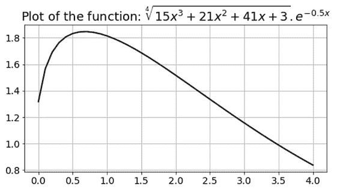

### 黎曼和

在[**黎曼和**](https://en.wikipedia.org/wiki/Riemann_sum)的广泛类别下，有许多这样的技术。这个想法就是将曲线下的区域划分为小的矩形或梯形，通过简单的几何计算来近似这些区域，并将这些部分相加。

为了简单说明，我展示了一个只有 5 个等距区间的方案。

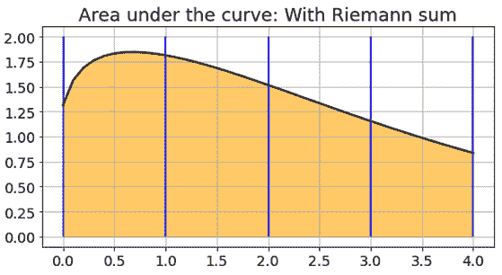

对于程序员朋友们，实际上，Scipy 包中有一个现成的[函数](https://docs.scipy.org/doc/scipy/reference/generated/scipy.integrate.quad.html#scipy.integrate.quad)可以快速准确地完成这个计算。

### 如果我选择随机呢？

如果我告诉你，我不需要均匀选择区间，实际上，我可以完全采用概率方法，随机选择 100%的区间来计算相同的积分呢？

疯狂的说法？我的样本选择可能是这样的……

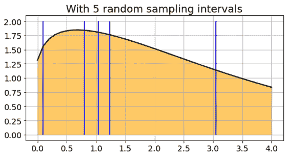

或者，这个……

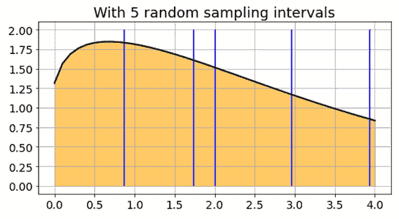

我们没有时间或范围来证明背后的理论，但可以表明 **通过合理数量的随机抽样，我们实际上可以以足够高的准确度计算积分**！

我们只需选择随机数（在限制范围内），在这些点上评估函数，将它们加起来，并按已知因子进行缩放。这样就完成了。

好的。我们在等什么呢？让我们用一些简单的 Python 代码来演示这个说法。

> 尽管取得了许多成功和声誉，但基本思想却 deceptively simple，容易演示。

### Python 代码

### 用简单的平均值替代复杂的数学

如果我们尝试计算下面这种形式的积分——任何积分，

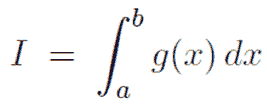

我们只是用以下平均值替代积分的‘估算’，

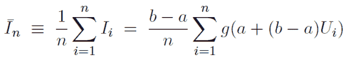

其中 ***U*** 代表介于 0 和 1 之间的均匀随机数。注意，我们是如何 **通过简单地将一堆数字相加并取其平均值来替代复杂的积分过程**！

在任何现代计算系统、编程语言，甚至是像 Excel 这样的商业软件包中，你都可以访问这个统一的随机数生成器。查看我关于这个主题的文章，

[**如何从头开始生成随机变量（不使用库）**](https://towardsdatascience.com/how-to-generate-random-variables-from-scratch-no-library-used-4b71eb3c8dc7)

我们使用一个简单的伪随机生成器算法，并展示如何使用它生成重要的随机数……

> 我们只需选择随机数（在限制范围内），在这些点上评估函数，将它们加起来，并按已知因子进行缩放。这样就完成了。

### 函数

这是一个 Python 函数，它接受另一个函数作为第一个参数，两个积分限制，以及一个可选的整数来计算由参数函数表示的定积分。

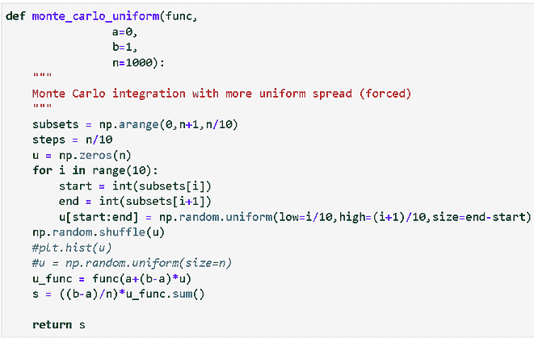

代码可能看起来与上面的方程（或你可能在教科书中见到的另一个版本）略有不同。这是因为 **我通过将随机样本分布在 10 个区间上来提高计算的准确性**。

对于我们具体的例子，参数函数看起来像这样，

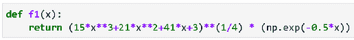

我们可以通过将其传递给 `monte_carlo_uniform()` 函数来计算该积分，

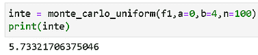

在这里，如你所见，我们在积分限制 ***a*** = 0 和 ***b*** = 4 之间取了 100 个随机样本。

### 那计算效果到底如何？

这个积分无法用解析方法计算。因此，我们需要将蒙特卡洛方法的准确性与另一种数值积分技术进行基准比较。为此我们选择了 Scipy 的 `integrate.quad()` 函数。

现在，你可能还在想——**当采样密度变化时，准确度会发生什么**。这个选择显然影响了计算速度——如果选择减少采样密度，我们需要添加更少的量。

因此，我们对不同采样密度范围内的相同积分进行了模拟，并将结果绘制在金标准——下图中的水平线代表的 Scipy 函数之上。

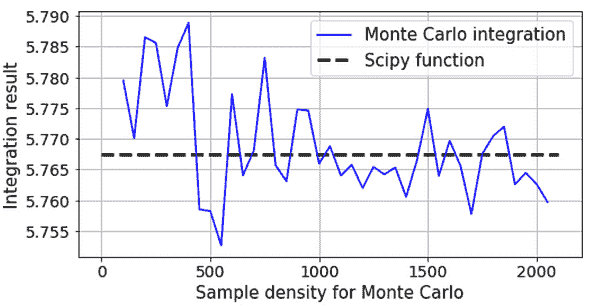

因此，我们在低样本密度阶段观察到一些小的扰动，但随着样本密度的增加，它们平滑地消失。无论如何，与 Scipy 函数返回的值相比，绝对误差非常小——约为 0.02%。

蒙特卡洛技巧表现得非常棒！

图像来源：[Pixabay](https://pixabay.com/illustrations/gambling-roulette-game-bank-2001033/)

### 速度怎么样？

但它的速度是否与 Scipy 方法一样快？更快？更慢？

我们尝试通过运行 100 次循环，每次 100 次运行（总共 10,000 次运行）来找出答案，并获取总结统计数据。

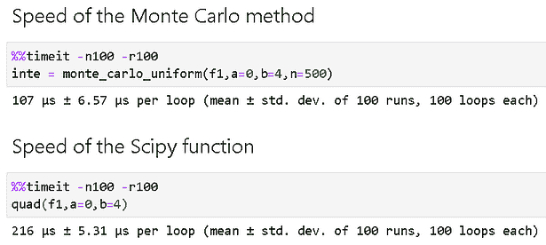

在这个特定的例子中，蒙特卡洛计算的速度是 Scipy 积分方法的两倍快！

虽然这种速度优势依赖于许多因素，但我们可以确信**蒙特卡洛技术在计算效率方面并不逊色**。

> 我们观察到在低样本密度阶段存在一些小的扰动，但随着样本密度的增加，它们平滑地消失。

### 冲洗，重复，冲洗，再重复……

对于像蒙特卡洛积分这样的概率技术，数学家和科学家几乎总是不满足于一次运行，而是重复计算多次并取平均值。

这是一个来自 10,000 次实验的分布图。

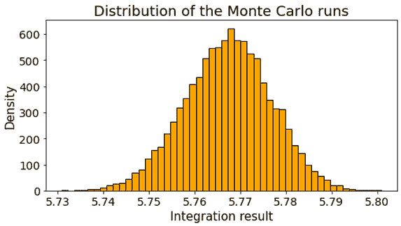

如你所见，图表几乎类似于[高斯正态分布](https://en.wikipedia.org/wiki/Normal_distribution)，这一事实可以利用不仅得到平均值，还可以在该结果周围构建[**置信区间**](https://www.mathsisfun.com/data/confidence-interval.html)。

[**置信区间**](https://www.mathsisfun.com/data/confidence-interval.html)

4 加减 2 的区间置信区间是一个我们相当确定真实值所在范围的值……

### 特别适用于高维积分

虽然为了简单说明（并出于教学目的），我们坚持使用单变量积分，但同样的思路可以很容易地扩展到具有多个变量的高维积分。

在更高维度中，蒙特卡洛方法相较于基于黎曼和的方法特别突出。对于蒙特卡洛方法而言，样本密度可以以更有利的方式进行优化，使其在不影响准确性的情况下大大加快速度。

从数学角度看，该方法的收敛速度与维度数量无关。用机器学习的术语来说，**蒙特卡洛方法是你在复杂积分计算中战胜维度诅咒的最佳朋友**。

阅读这篇文章以获得一个很好的介绍，

[**实践中的蒙特卡洛方法（蒙特卡洛积分）**](https://www.scratchapixel.com/lessons/mathematics-physics-for-computer-graphics/monte-carlo-methods-in-practice/monte-carlo-integration)

实践中的蒙特卡洛方法 如果你了解并掌握了概率的最重要概念和…

> 在更高维度中，蒙特卡洛方法相较于基于黎曼和的方法特别突出。

### 总结

我们介绍了蒙特卡洛积分的概念，并展示了它如何与传统的数值积分方法不同。我们还展示了一组简单的 Python 代码，以评估一维函数，并评估这些技术的准确性和速度。

更广泛的[蒙特卡洛模拟技术](https://en.wikipedia.org/wiki/Monte_Carlo_method)更令人兴奋，并在人工智能、数据科学和统计建模等领域得到普遍应用。

例如，DeepMind 的著名 Alpha Go 程序使用了蒙特卡洛搜索技术，在围棋这一高维空间中实现了计算效率。实践中可以找到许多类似的例子。

[**蒙特卡洛树搜索简介：深度学习 AlphaGo 背后的游戏改变算法**](https://www.analyticsvidhya.com/blog/2019/01/monte-carlo-tree-search-introduction-algorithm-deepmind-alphago/)

五局三胜制，总奖金 100 万美元——一场高风险的对决。2016 年 3 月 9 日至 15 日…

### 如果你喜欢它…

如果你喜欢这篇文章，你可能还会喜欢我关于类似主题的其他文章，

[**如何从零开始生成随机变量（不使用库）**](https://towardsdatascience.com/how-to-generate-random-variables-from-scratch-no-library-used-4b71eb3c8dc7)

我们介绍了一个简单的伪随机生成器算法，并展示了如何使用它生成重要的随机…

[**数学编程——推进数据科学的关键习惯**](https://towardsdatascience.com/mathematical-programming-a-key-habit-to-built-up-for-advancing-in-data-science-c6d5c29533be)

我们展示了迈向数学编程习惯的一个小步骤，这在新兴数据科学家的技能库中是一个关键技能…

[**用 Python 进行布朗运动**](https://towardsdatascience.com/brownian-motion-with-python-9083ebc46ff0)

我们展示了如何模拟布朗运动，这是一种在广泛应用中使用的最著名的随机过程，使用…

此外，你还可以查看作者的 [**GitHub**](https://github.com/tirthajyoti?tab=repositories)** 代码库**，获取机器学习和数据科学方面的代码、想法和资源。如果你和我一样，对 AI/机器学习/数据科学充满热情，请随时 [在 LinkedIn 上添加我](https://www.linkedin.com/in/tirthajyoti-sarkar-2127aa7/) 或 [在 Twitter 上关注我](https://twitter.com/tirthajyotiS)。

[原文](https://towardsdatascience.com/monte-carlo-integration-in-python-a71a209d277e)。经许可转载。

**相关：**

+   使用 Pomegranate 进行快速直观的统计建模

+   被遗忘的算法

+   实用的马尔可夫链蒙特卡罗方法

### 更多相关话题

+   [成为伟大数据科学家需要的 5 项关键技能](https://www.kdnuggets.com/2021/12/5-key-skills-needed-become-great-data-scientist.html)

+   [每个初学者数据科学家应掌握的 6 种预测模型](https://www.kdnuggets.com/2021/12/6-predictive-models-every-beginner-data-scientist-master.html)

+   [2021 年最佳 ETL 工具](https://www.kdnuggets.com/2021/12/mozart-best-etl-tools-2021.html)

+   [天高地迥：了解 JetBlue 如何使用蒙特卡罗方法和 Snowflake…](https://www.kdnuggets.com/2022/12/monte-carlo-jetblue-snowflake-build-trust-improve-model-accuracy.html)

+   [Monte Carlo 在 IMPACT 2023 的开幕，数据与 AI 先锋的主题演讲](https://www.kdnuggets.com/2023/11/monte-carlo-is-kicking-off-impact-2023-keynotes-from-data-ai-pioneers)

+   [使用管道编写干净的 Python 代码](https://www.kdnuggets.com/2021/12/write-clean-python-code-pipes.html)
