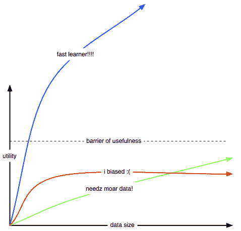
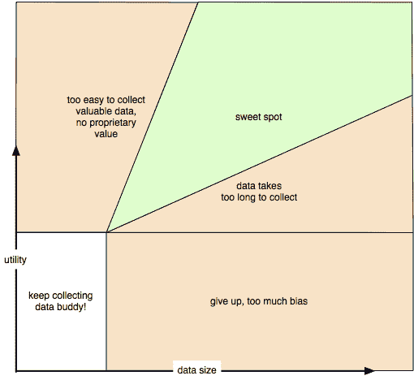

# 更多数据还是更好的算法：最佳平衡点

> 原文：[`www.kdnuggets.com/2017/01/more-data-better-algorithms.html`](https://www.kdnuggets.com/2017/01/more-data-better-algorithms.html)

评论

**作者：Erik Bernhardsson，CTO（首席巨魔官）betterdotcom**

这篇博客文章[数据集是新的服务器房间](https://medium.com/@josh_nussbaum/data-sets-are-the-new-server-rooms-40fdb5aed6b0)指出，一些公司筹集大量资金去获取真正专有的优秀数据作为竞争壁垒。因为一旦你拥有数据，你就能构建更好的产品，而没有人可以轻易复制（至少不便宜）。理想情况下，你会进入一个良性循环，即系统使用一旦开始，就会提供更多的数据，这使得系统更好，从而吸引更多用户……

随着数据量增加，机器学习模型的行为很有趣。如果你正在建立一个基于机器学习的公司，首先，你要确保*更多的数据能带来更好的算法*。

但这只是必要条件，而非充分条件。你还需要找到一个最佳平衡点。

+   收集足够的数据并*不太容易*，因为那样数据的价值就会很小。

+   收集足够的数据并*不太难*，因为那样你将花费过多的钱来解决问题（如果有解决办法的话）。

+   数据的价值随着数据量的增加而不断增长。

在推荐系统领域（我在那里待了 5 年），算法在 100M 或 1B 数据点后基本会收敛，这并不罕见。这当然取决于你拥有多少项目。一些模型类在它们甚至尚未有用之前就会收敛，这种情况下显然更多的数据没有价值。如果你想了解更多，Xavier Amatriain 在[Quora 上的一个优秀回答](https://www.quora.com/In-machine-learning-is-more-data-always-better-than-better-algorithms)值得你查看。

无论如何，让我们简化这个问题。考虑一下某些算法的行为：

+   蓝色模型代表了在相对便宜的成本下能够获得良好数据的问题。例如，猫与狗的分类器不是一个有用的技术，因为获取这些训练数据的价值大约是$0。对于任何构建通用图像分类器的公司，我会对此感到担忧。或者，如果你正在构建一个包含 10k 项的推荐系统，可能用 10M 个评分已经足够。拥有 100B 个评分未必更有价值。

+   红色模型可能出现在你的数据来自不同分布或你的损失函数不符合产品需求的情况下。在这些情况下，更多的数据在某些时候会变得无用。如果你通过抓取网络文本来构建一个电影推荐系统，它可能会收敛到一个还不错但不够好的模型。（这里还有一个假设：也许收集*被动*数据来学习如何*主动*驾驶汽车是不够的？）

+   绿色模型是当你的问题可能需要如此巨大的数据量以至于不切实际。例如，构建一个可以解决*世界上所有问题*的通用问答服务，从机器学习的角度来看，如果你有无限的数据问题和答案，这并不难。但如果输入数据少于数 TB 或 PB，可能就会变得无用。如果我尝试构建一个虚拟助手，这将是我最大的担忧。

这里是一些我认为你*可以*建立数据集的甜蜜点，但这很难。困难是好的，因为这意味着一旦你完成，你就有了一道护城河：

+   从交易数据中检测欺诈

+   预测哪些贷款将会违约

+   从安全监控中检测犯罪

难以记住？这里有一个我制作的实用表格

我认为这个总体思路是相当有效的。但它 100%正确吗？可能不是。是否过于简化？哦，是的，极端地简化了。

[原始帖子](https://erikbern.com/2016/11/01/are-data-sets-the-new-server-rooms.html)。经许可转载。

**个人简介: [Erik Bernhardsson (@fulhack)](https://twitter.com/fulhack)**，是 betterdotcom 的首席怪才官（CTO）。

前 Spotify，纽约机器学习聚会共同组织者，有时开源（Luigi，Annoy），博主，爸爸。

**相关内容：**

+   数据就是新一切

+   Python 中的随机森林

+   机器学习和数据科学中最流行的语言是……

* * *

## 我们的前三个课程推荐

 1\. [Google 网络安全证书](https://www.kdnuggets.com/google-cybersecurity) - 快速进入网络安全职业生涯。

 2\. [Google 数据分析专业证书](https://www.kdnuggets.com/google-data-analytics) - 提升你的数据分析技能

 3\. [Google IT 支持专业证书](https://www.kdnuggets.com/google-itsupport) - 支持你的组织 IT

* * *

### 更多相关内容

+   [机器学习的甜蜜点：NLP 和文档分析中的纯方法](https://www.kdnuggets.com/2022/05/machine-learning-sweet-spot-pure-approaches-nlp-document-analysis.html)

+   [如何更好地利用数据科学推动业务增长](https://www.kdnuggets.com/2022/08/better-leverage-data-science-business-growth.html)

+   [IMPACT：数据可观测性峰会将于 11 月 8 日回归，...](https://www.kdnuggets.com/2023/10/monte-carlo-impact-the-data-observability-summit-is-back)

+   [推动更佳商业决策](https://www.kdnuggets.com/2022/04/informs-driving-better-business-decisions.html)

+   [超级巴德：能够做到一切并且更好的 AI](https://www.kdnuggets.com/2023/05/super-bard-ai-better.html)

+   [提升 Python 函数编写质量的 5 个技巧](https://www.kdnuggets.com/5-tips-for-writing-better-python-functions)
