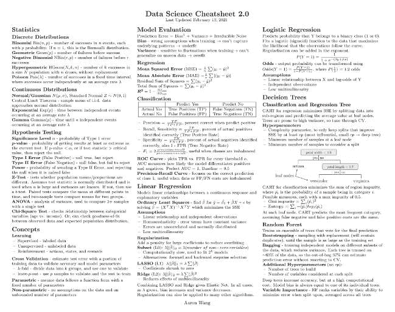
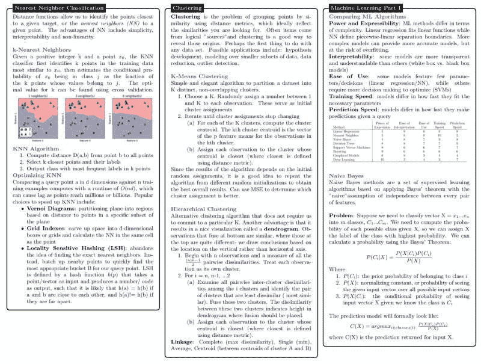
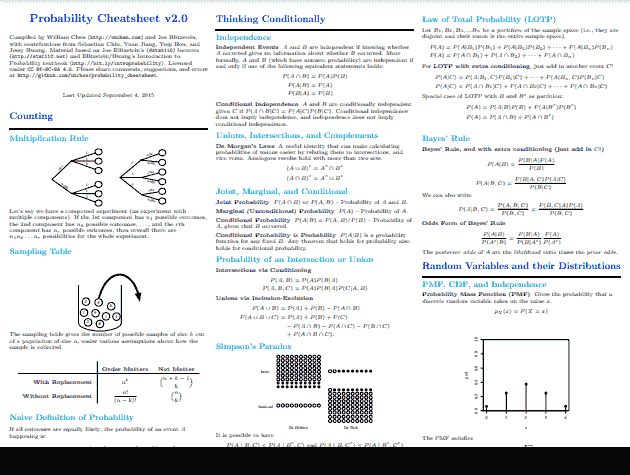
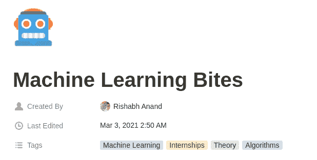

# 更多数据科学备忘单

> 原文：[`www.kdnuggets.com/2021/03/more-data-science-cheatsheets.html`](https://www.kdnuggets.com/2021/03/more-data-science-cheatsheets.html)

我们最近意识到已经有一段时间没有给你带来任何数据科学备忘单了。这并不是因为备忘单的缺乏；数据科学备忘单无处不在，从入门到高级，涵盖从算法、统计到面试技巧等各种主题。

那么，什么使得一个备忘单优秀呢？是什么使得一个备忘单值得被特别指出？虽然很难准确指出*什么*使得一个备忘单好，但显然，能够简洁地传达基本信息的备忘单——无论这些信息是具体的还是一般性的——无疑是一个好的开始。这也是我们今天的候选备忘单值得关注的原因。所以，继续阅读以获取四个精心挑选的备忘单，帮助你进行数据科学学习或复习。

* * *

## 我们的三大课程推荐

 1\. [Google Cybersecurity Certificate](https://www.kdnuggets.com/google-cybersecurity) - 快速进入网络安全领域的职业生涯。

 2\. [Google Data Analytics Professional Certificate](https://www.kdnuggets.com/google-data-analytics) - 提升你的数据分析能力

 3\. [Google IT Support Professional Certificate](https://www.kdnuggets.com/google-itsupport) - 支持你所在组织的 IT 工作

* * *

首先是**[Aaron Wang's Data Science Cheatsheet 2.0](https://github.com/aaronwangy/Data-Science-Cheatsheet/blob/main/Data_Science_Cheatsheet.pdf)**，这是一个四页的统计抽象、基本机器学习算法和深度学习主题及概念的汇编。它并不是详尽无遗的，而是作为一种快速参考，适用于面试准备、考试复习及其他需要类似审查深度的情况。作者提到，尽管对统计学和线性代数有基本了解的人会从中受益最多，但初学者也应该能够从中获取有用的信息。

截图来源于 Aaron Wang 的[Data Science Cheatsheet 2.0](https://github.com/aaronwangy/Data-Science-Cheatsheet/blob/main/Data_Science_Cheatsheet.pdf)

我们今天的下一个备忘单是基于**[Maverick Lin 的数据科学备忘单](https://github.com/ml874/Data-Science-Cheatsheet/blob/master/data-science-cheatsheet.pdf)**的资源，这也是 Aaron Wang 参考的对象（Wang 将自己的备忘单称为 2.0，是对 Lin“原版”的直接致敬）。我们可以认为 Lin 的备忘单比 Wang 的更为深入（尽管 Wang 决定让他的备忘单不那么深入似乎是有意为之，并且是一个有用的替代方案），涵盖了更多基本的数据科学概念，如数据清洗、建模的理念、使用 Hadoop 处理“大数据”、SQL，甚至是 Python 的基础知识。

显然，这将吸引那些更加坚定的“初学者”阵营，并且很好地激发了兴趣，让读者了解数据科学的广泛领域以及其包含的许多不同概念。这绝对是另一个值得推荐的资源，尤其是对于数据科学的初学者。

Maverick Lin 的[数据科学备忘单](https://github.com/ml874/Data-Science-Cheatsheet/blob/master/data-science-cheatsheet.pdf)的截屏

随着我们向过去追溯——寻找 Lin 备忘单的灵感——我们发现了**[William Chen 的概率备忘单 2.0](https://static1.squarespace.com/static/54bf3241e4b0f0d81bf7ff36/t/55e9494fe4b011aed10e48e5/1441352015658/probability_cheatsheet.pdf)**。Chen 的备忘单在这些年里获得了很多关注和赞誉，你可能在某个时候见过它。显然，由于其名称，Chen 的备忘单重点介绍了概率概念的速成课程或深度回顾，包括各种分布、协方差和变换、条件期望、Markov 链、各种重要公式等。

10 页的长度，你应该可以想象这里涵盖了概率主题的广度。但不要因此却步；Chen 将概念提炼成本质要点并用简单的英语解释，同时不牺牲要点的能力值得注意。它还丰富了说明性可视化，在空间有限且需要简洁表达时，这一点尤其有用。

Chen 的汇编不仅质量上乘、值得你花时间阅读，作为初学者或有兴趣进行全面回顾的人，我会按照这些资源呈现的相反顺序使用——从 Chen 的备忘单到 Lin 的，最后到 Wang 的，逐步构建概念。

William Chen 的[概率备忘单 2.0](https://static1.squarespace.com/static/54bf3241e4b0f0d81bf7ff36/t/55e9494fe4b011aed10e48e5/1441352015658/probability_cheatsheet.pdf)的截屏

最后一个我在这里包含的资源，虽然不完全是备忘单，是**[Rishabh Anand 的机器学习精华](https://www.notion.so/Machine-Learning-Bites-7c1675ecb587451e9caf793c68972276)**。它自称为“关于常见机器学习概念、最佳实践、定义和理论的面试指南”，Anand 汇编了范围广泛的知识“片段”，其用处确实超越了最初的面试准备。涵盖的主题包括：

+   模型评分指标

+   参数共享

+   k 折交叉验证

+   Python 数据类型

+   改善模型性能

+   计算机视觉模型

+   注意力及其变体

+   处理类别不平衡

+   计算机视觉词汇表

+   基础反向传播

+   正则化

+   参考资料

来自[机器学习精华](https://www.notion.so/Machine-Learning-Bites-7c1675ecb587451e9caf793c68972276)的截图

虽然“概念、最佳实践、定义和理论”在资源的描述中有所提及，但这些“片段”无疑更倾向于实际应用，这使得该网站对之前提到的三个备忘单中的许多内容形成了补充。如果我想覆盖这篇帖子中所有四个资源的所有材料，我肯定会在看完其他三个之后查看这个。

所以你有四个备忘单（或者三个备忘单和一个相关资源）可以用来学习或复习。希望这里有些对你有用的内容，我邀请大家在下方评论中分享他们找到的有用备忘单。

### 关于这个主题的更多内容

+   [利用数据科学使清洁能源更加公平](https://www.kdnuggets.com/2022/03/data-science-make-clean-energy-equitable.html)

+   [数据科学中 3 个 SQL 聚合函数面试问题](https://www.kdnuggets.com/2023/01/3-sql-aggregate-function-interview-questions-data-science.html)

+   [数据科学的 5 种额外命令行工具](https://www.kdnuggets.com/2023/03/5-command-line-tools-data-science.html)

+   [成功应对初级数据科学职位面试的更多技巧](https://www.kdnuggets.com/more-tips-for-successfully-navigating-beginner-data-science-job-interviews)

+   [利用 NumPy 和 Pandas 进行更高效的数据分析](https://www.kdnuggets.com/numpy-with-pandas-for-more-efficient-data-analysis)

+   [分类问题的更多性能评估指标](https://www.kdnuggets.com/2020/04/performance-evaluation-metrics-classification.html)
