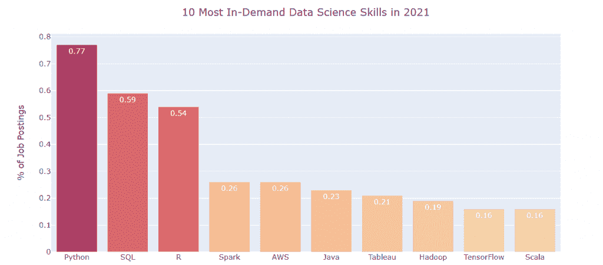
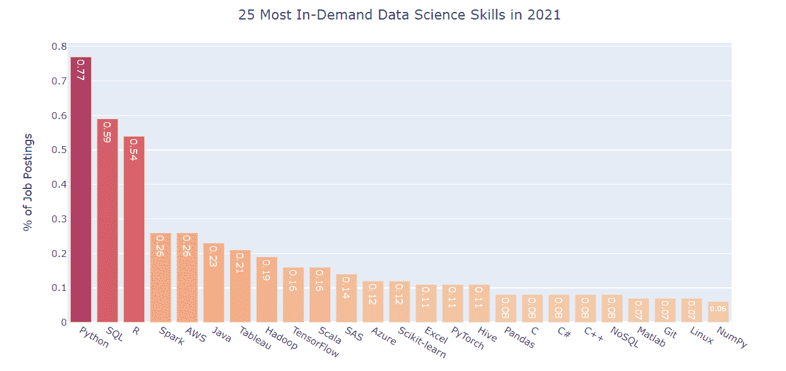
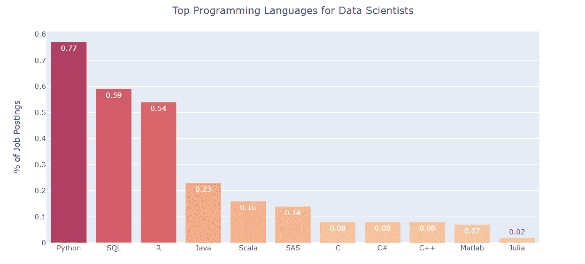
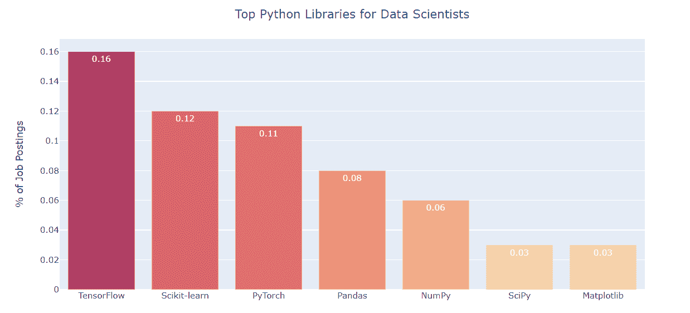

# 2021 年数据科学家最需要的技能

> 原文：[`www.kdnuggets.com/2021/04/most-demand-skills-data-scientists.html`](https://www.kdnuggets.com/2021/04/most-demand-skills-data-scientists.html)

评论

* * *

## 我们的前三个课程推荐

 1\. [谷歌网络安全证书](https://www.kdnuggets.com/google-cybersecurity) - 快速进入网络安全职业道路。

 2\. [谷歌数据分析专业证书](https://www.kdnuggets.com/google-data-analytics) - 提升你的数据分析技能

 3\. [谷歌 IT 支持专业证书](https://www.kdnuggets.com/google-itsupport) - 支持你的组织 IT 工作

* * *

*作者创建的图片。*

我想首先说明，这些内容深受 Jeff Hale 的[文章](https://www.kdnuggets.com/2018/11/most-demand-skills-data-scientists.html)启发，他在 2018/2019 年写的。我写这篇文章是为了获得对当前需求技能的更新分析，并分享给大家，因为我假设还有人也希望看到 2021 年数据科学家最需要技能的更新版本。

从这项分析中提取你所需要的内容——显然，从网页抓取的职位发布中获取的见解并不完全与实际需求的技能完美匹配。然而，我认为这给出了一个良好的指示，说明你应该更多地关注哪些通用技能，同时，避免哪些技能。

说完这些，希望你喜欢这篇文章，让我们深入了解吧！

### 方法论

对于这项分析，我从 Indeed、Monster 和 SimplyHired 抓取并积累了超过 15,000 个职位发布。我没有抓取 LinkedIn，因为在尝试抓取时遇到了验证码问题。

我接着检查了有多少职位发布包含了我搜索的每个术语。我搜索的术语列表如下（*如果你想看到其他技能，请在评论中提及，我会在明年的分析中添加！*）：

+   Python, SQL, R, Java, Git, C, MATLAB, Excel, C++, JavaScript, C#, Julia, Scala, SAS

+   Scikit-learn, Pandas, NumPy, SciPy

+   Matplotlib, Looker, Tableau

+   TensorFlow, PyTorch, Keras

+   Spark, Hadoop, AWS, GCP, Hive, Azure, Google Cloud, MongoDB, BigQuery

+   Docker, Kubernetes, Airflow

+   NoSQL, MySQL, PostgreSQL

+   Caffe, Alteryx, Perl, Cassandra, Linux

在获取每个来源的计数后，我将它们相加，然后除以数据科学家职位发布的总数，以获取百分比。例如，Python 的值为 0.77，意味着 77%的职位发布中包含了 Python。

最后，我将结果与 Jeff Hale 在 2019 年进行的分析进行了比较，以获取 2019 年至 2021 年的百分比变化。

### 结果

**顶级技能**

以下是 2021 年最受欢迎的 25 项数据科学技能，按需求量从高到低排名：

*图片由作者创建。*

**顶级编程语言**

为了更详细地了解情况，下图显示了数据科学家使用的顶级编程语言：

*图片由作者创建。*

不足为奇的是，Python、SQL 和 R 是前三大编程语言。

就个人而言，我也认为你应该掌握 Python 或 R 以及 SQL。我从 Python 开始，可能会在余生中继续使用 Python。它在开源贡献方面遥遥领先，并且学习起来相对简单。SQL 无疑是学习任何数据相关职业中最重要的技能，无论你是数据科学家、数据工程师、数据分析师、业务分析师等等。

**顶级 Python 库**

类似地，下图显示了数据科学家最常用的 Python 库：

*图片由作者创建。*

TensorFlow 排名第一，因为它是 Python 中最受欢迎的深度学习库之一。PyTorch 是一个强有力的替代品，因此其排名紧随其后。

Scikit-learn 可以说是 Python 中最重要的机器学习库。在使用 Pandas 和/或 NumPy 清洗和处理数据之后，scikit-learn 用于构建机器学习模型，因为它拥有大量用于预测建模和分析的工具。

在我看来，尽管上面未能体现，Pandas、NumPy 和 SciPy 对数据科学家来说也是至关重要的。

**增长最快和下降最快的技能**

以下图表显示了 2019 年至 2021 年期间增长最快和下降最快的技能：

*图片由作者创建。*

*图片由作者创建。*

*以下是上述两张图表的一些要点：*

1.  与云相关的技能，如 AWS 和 GCP，出现了大幅增长。

1.  类似地，深度学习相关技能，如 PyTorch 和 TensorFlow，也有大幅增长。

1.  SQL 和 Python 继续增长重要性，而 R 保持不变。

1.  Apache 产品，如 Hadoop、Hive 和 Spark，重要性持续下降。

[原文](https://towardsdatascience.com/the-most-in-demand-skills-for-data-scientists-in-2021-4b2a808f4005)。已获许可转载。

**相关：**

+   [成为数据科学家最推荐学习的 7 项技能](https://www.kdnuggets.com/2021/02/7-most-recommended-skills-data-scientist.html)

+   [5 种可以帮助你获得数据科学工作的支持技能](https://www.kdnuggets.com/2021/02/5-supporting-skills-data-science-job.html)

+   [成为数据工程师所需的 9 项技能](https://www.kdnuggets.com/2021/03/9-skills-become-data-engineer.html)

+   [数据科学家最需要的技能](https://www.kdnuggets.com/2018/11/most-demand-skills-data-scientists.html)，作者：Jeff Hale，2018 年 11 月。

### 更多相关内容

+   [建立一个稳固的数据团队](https://www.kdnuggets.com/2021/12/build-solid-data-team.html)

+   [使用管道编写干净的 Python 代码](https://www.kdnuggets.com/2021/12/write-clean-python-code-pipes.html)

+   [2021 年最佳 ETL 工具](https://www.kdnuggets.com/2021/12/mozart-best-etl-tools-2021.html)

+   [成为优秀数据科学家所需的 5 项关键技能](https://www.kdnuggets.com/2021/12/5-key-skills-needed-become-great-data-scientist.html)

+   [2022 年最需要学习的人工智能技能](https://www.kdnuggets.com/2022/08/indemand-artificial-intelligence-skills-learn-2022.html)

+   [停止学习数据科学以寻找目的，并寻找目的来……](https://www.kdnuggets.com/2021/12/stop-learning-data-science-find-purpose.html)
