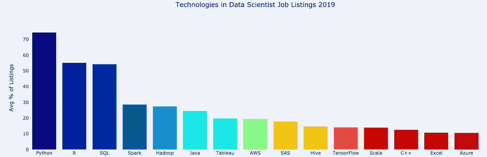
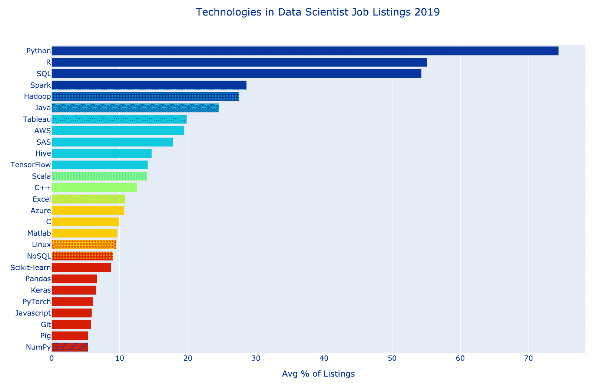
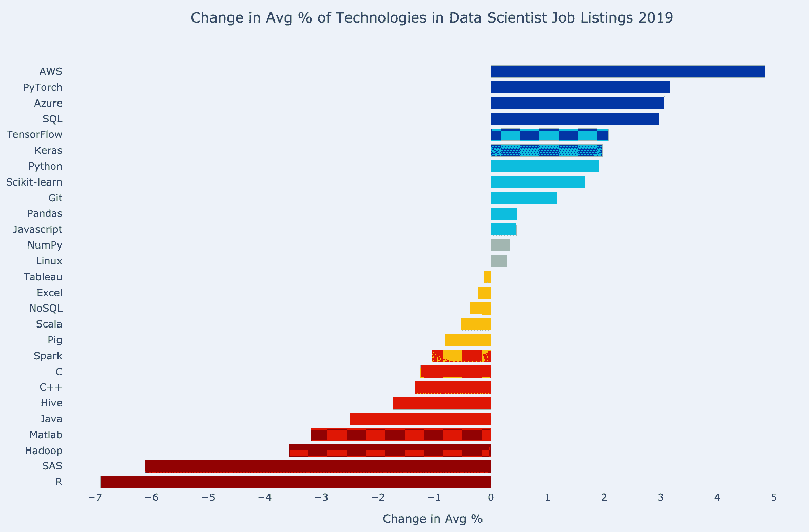
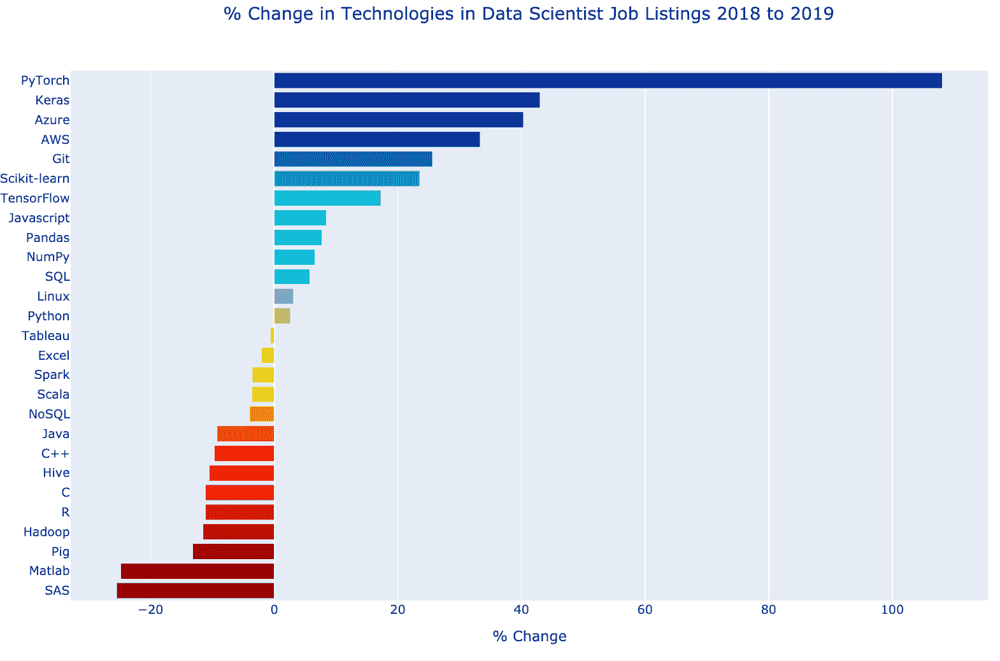
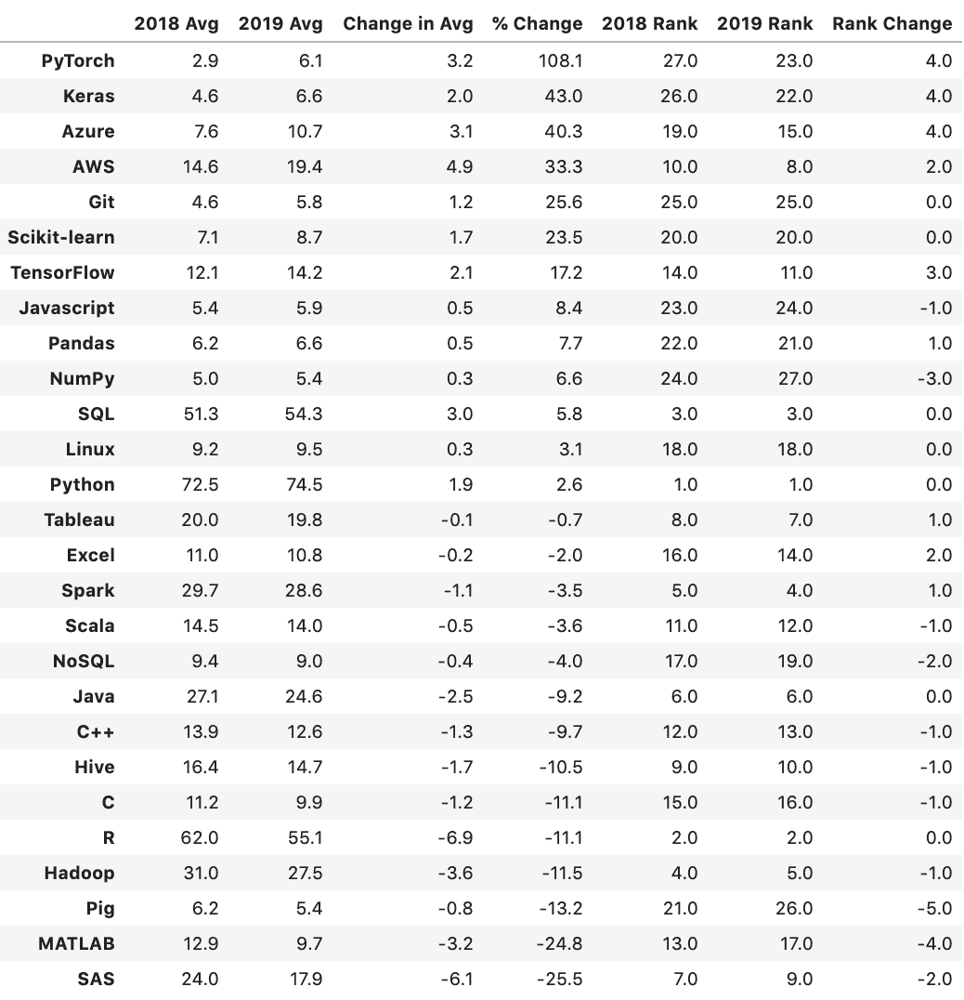
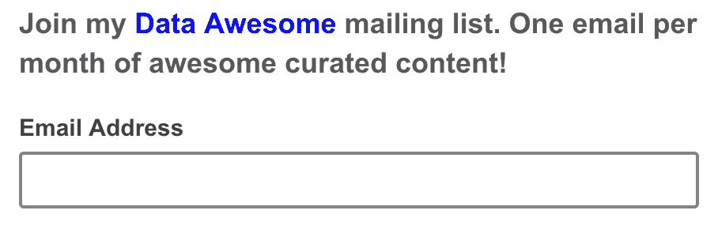
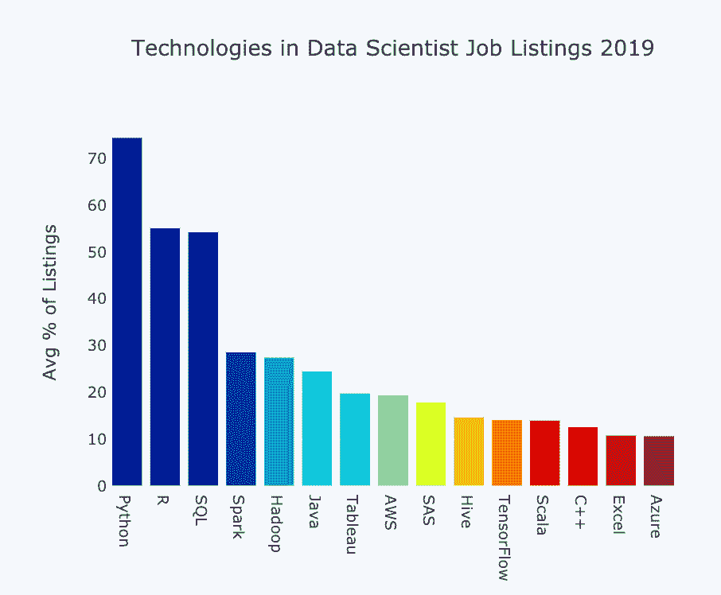

# 数据科学家最需要的技术技能

> 原文：[`www.kdnuggets.com/2019/12/most-demand-tech-skills-data-scientists.html`](https://www.kdnuggets.com/2019/12/most-demand-tech-skills-data-scientists.html)

评论

**作者：[Jeff Hale](https://www.linkedin.com/in/jeff-hale-99a7877)，数据科学家、作者、电商首席运营官**

在 2018 年秋季，我分析了[数据科学家最需要的技能和技术](https://towardsdatascience.com/the-most-in-demand-skills-for-data-scientists-4a4a8db896db)。那篇文章引起了大家的共鸣。它在 Medium 上获得了超过 11,000 次点赞，被翻译成了几种语言，并且在 2018 年 11 月成为 KD Nuggets 上最受欢迎的故事。

一年多的时间已经过去了。让我们看看有什么新变化。????

到文章的最后，你将知道哪些技术在雇主中变得越来越受欢迎，哪些技术则变得不那么受欢迎。

在我[2018 年的原始文章](https://towardsdatascience.com/the-most-in-demand-skills-for-data-scientists-4a4a8db896db)中，我考察了对统计学和沟通等通用技能的需求。我还考察了对 Python 和 R 等技术的需求。软件技术的变化速度远远快于对通用技能的需求，因此在这次更新的分析中我只包含了技术方面的内容。

我搜索了[SimplyHired](https://www.simplyhired.com/)、[Indeed](https://www.indeed.com/)、[Monster](https://www.monster.com/)和[LinkedIn](https://www.linkedin.com/)，查看“数据科学家”职位的招聘信息中出现了哪些关键词。这次我决定编写代码来抓取职位列表，而不是手动搜索。这项工作对 SimplyHired、Indeed 和 Monster 都取得了良好的结果。我使用了[Requests](https://requests.readthedocs.io/en/master/)和[Beautiful Soup](https://www.crummy.com/software/BeautifulSoup/bs4/doc/)这两个 Python 库。你可以在[我的 GitHub 仓库](https://github.com/discdiver/2019-in-demand-ds-tech-skills)中查看抓取和分析的代码 Jupyter 笔记本。

抓取 LinkedIn 的过程远比预期的要困难得多。需要身份验证才能查看职位列表的准确数量。我决定使用 Selenium 进行无头浏览。在 2019 年 9 月，关于 LinkedIn 的一个[美国最高法院案件](https://www.vice.com/en_us/article/9kek83/linkedin-data-scraping-lawsuit-shot-down)作出了对 LinkedIn 不利的裁决，允许抓取 LinkedIn 的数据。尽管如此，在几次抓取尝试后，我仍无法访问我的账户。这个问题可能是由于速率限制造成的。???? 更新：我现在已经可以访问了，但担心如果再次尝试抓取会被锁定。

顺便提一下，微软拥有 LinkedIn，Randstad Holding 拥有 Monster，Recruit Holdings 拥有 Indeed 和 SimplyHired。

LinkedIn 的数据可能没有提供从去年到今年的逐一对比。这个夏天，我注意到 LinkedIn 对一些技术职位搜索词的波动变得非常大。我推测他们可能在通过使用自然语言处理来评估意图，来测试他们的搜索结果算法。相比之下，‘数据科学家’的职位列表在其他三个搜索网站上的数量在两年间变化相对较小。

因此，我在本文中排除了 LinkedIn 在 2019 年和 2018 年的分析。

对于每个职位搜索网站，我计算了该网站上每个关键词出现在数据科学家职位列表中的总百分比。然后我计算了这些百分比在三个网站上的平均值。

我手动调查了新的搜索词，并筛选了那些看起来有前途的词汇。没有新的词汇在 2019 年达到 5%的职位列表平均比例，这是我用于结果包含的截止值。

让我们看看我们发现了什么！ ????

### 结果

对于每个关键词，有至少四种方法来查看结果：

1.  对于每个招聘网站，每一年，将包含该关键词的职位数量除以包括数据科学家的所有搜索词的总数。然后计算这三个招聘网站的平均值。这就是上述所描述的过程。

1.  在完成上述第 1 步之后，计算 2018 年到 2019 年职位列表平均百分比的变化。

1.  在完成上述第 1 步之后，计算 2018 年到 2019 年职位列表平均百分比的变化。

1.  在完成上述第 1 步之后，计算每个关键词相对于当年其他关键词的排名。然后计算从一年到下一年的排名变化。

我们来看前面三个选项的条形图。然后我会展示一个包含数据的表格，并讨论结果。

这是上述第 1 步的 2019 年图表，显示了 Python 出现在近 75%的职位列表中。

这是上述第 2 步的图表，显示了 2018 年和 2019 年职位列表平均百分比的增减变化。AWS 显示出 5 个百分点的增长。它在 2019 年的职位列表中出现的平均比例为 19.4%，而在 2018 年的职位列表中为 14.6%。

这是上述第 3 步的图表，显示了年际之间的百分比变化。PyTorch 相比于 2018 年出现的职位列表平均百分比增长了 108.1%。

所有图表均使用了 [Plotly](https://plot.ly/) 制作。如果你想学习如何使用 Plotly 制作互动可视化，请查看 [我的指南](https://towardsdatascience.com/its-2019-make-your-data-visualizations-interactive-with-plotly-b361e7d45dc6)。如果你想查看互动图表，请查看 [我的 GitHub 仓库](https://github.com/discdiver/2019-in-demand-ds-tech-skills) 中的 HTML 文件。Jupyter Notebook 用于抓取、分析和可视化也在那里。

下面是上述图表中的信息，只是以表格格式呈现，并按 2018 年至 2019 年的平均职位百分比变化排序。

我知道这些不同的指标可能会让人感到困惑，所以这里是对上面图表中内容的指导。

+   *2018 平均值* 是指 2018 年 10 月 10 日的职位列表在 SimplyHired、Indeed 和 Monster 上的百分比平均值。

+   *2019 平均值* 与 *2018 平均值* 相同，只是针对 2019 年 12 月 4 日的数据。这个数据在上述三张图表的第一张中显示。

+   *平均变化* 是 *2019* 列减去 *2018* 列。它显示在上述三张图表的第二张中。

+   *% 变化* 是指从 *2018* 到 *2019* 的百分比变化。它显示在上述三张图表的最后一张中。

+   *2018 排名* 是指 2018 年相对于其他关键词的排名。

+   *2019 排名* 是指 2019 年相对于其他关键词的排名。

+   *排名变化* 是指从 2019 年到 2018 年的排名上升或下降。

### 重点总结

在不到 14 个月的时间里发生了相当大的变化！

### 胜出者

**Python** 仍然居于榜首。它是出现频率最高的关键词，占近四分之三的职位列表。Python 从 2018 年开始有了显著的增长。

**SQL** 处于上升趋势。它几乎超越了 R，成为第二高的平均分数。如果趋势继续，它很快将成为第二名。

最显著的 **深度学习框架** 变得越来越受欢迎。 **PyTorch** 是所有关键词中增长百分比最大的一项。 **Keras** 和 **TensorFlow** 也有了大幅度的增长。Keras 和 PyTorch 在排名中分别上升了四位，TensorFlow 上升了三位。需要注意的是，PyTorch 的起始平均值较低——TensorFlow 的平均值仍然是 PyTorch 的两倍。

**云平台技能** 在数据科学家中变得越来越受欢迎。**AWS** 出现在近 20%的职位列表中，而 **Azure** 出现在大约 10%的职位列表中。Azure 在排名中上升了四位。

这些是最具活力的技术！ ????

### 败出者

**R**的整体平均下降幅度最大。鉴于[其他调查](https://insights.stackoverflow.com/survey/2019)的结果，这一发现并不令人惊讶。Python 显然已经超越了 R，成为数据科学的首选语言。不过，R 仍然非常受欢迎，在大约 55%的职位列表中出现。如果你知道 R，不必气馁，但如果你想拥有更受欢迎的技能，也可以考虑学习 Python。

许多**Apache**产品的受欢迎程度下降，包括**Pig**、**Hive**、**Hadoop**和**Spark**。Pig 在排名中下降了五个位次，比任何其他技术都多。Spark 和 Hadoop 仍然是常见的技能，但我的发现显示出从它们向其他大数据技术的转变趋势。

专有统计软件包**MATLAB**和**SAS**经历了显著的下降。MATLAB 在排名中下降了四个位次，而 SAS 从第六位降至第八位。与 2018 年的平均水平相比，这两种语言都经历了大幅度的百分比下降。

### 建议

这个列表上有很多技术。???? 你肯定不需要了解它们所有的。所谓的神话数据科学家被称为独角兽是有原因的。????

我建议，如果你刚刚开始数据科学的学习，集中精力在那些需求量大且正在增长的技术上。

专注于学习一种。

技术。

在。

A.

时间。

（这是一条非常好的建议，尽管我并不总是遵循它。????）

以下是我推荐的学习路径，顺序如下：

+   学习 Python 进行通用编程。查看我的书，[Memorable Python](https://memorablepython.com/)，以学习基础知识。

+   学习 pandas 进行数据处理。我认为招聘 Python 数据科学家角色的组织会期待申请者熟悉 pandas 和 Scikit-learn 库。Scikit-learn 出现在列表上，而 Pandas 刚好没有进入名单。你在学习 pandas 的同时也会学习一些 Matplotlib 可视化和 NumPy。我正在完成一本关于 pandas 的书。订阅[我的邮件列表](https://dataawesome.com/)以确保你不会错过它。

+   使用 Scikit-learn 库学习机器学习。我推荐 Müller & Guido 的书[*Introduction to Machine Learning with Python*](https://www.amazon.com/Introduction-Machine-Learning-Python-Scientists-ebook/dp/B01M0LNE8C)。

+   高效查询关系型数据库需要学习 SQL。我也正在完成一本关于 SQL 的书。订阅[我的邮件列表](https://dataawesome.com/)以确保你不会错过它。

+   学习 Tableau 进行数据可视化。这可能是列表中最有趣且最容易上手的技术。 ???? 查看我的 Medium 文章，了解六分钟的基础知识介绍，[**点击这里**](https://towardsdatascience.com/tableau-basics-in-six-minutes-35b50ec9ae9b)。

+   适应云平台。由于市场份额，AWS 是一个不错的选择。微软 Azure 是一个稳健的第二选择。虽然它的受欢迎程度较低，但我个人偏爱 Google Cloud，因为我喜欢它的用户体验和机器学习关注点。如果你想熟悉 Google Cloud 的数据摄取、转换和存储选项，请参阅[我关于成为 Google Cloud 认证专业数据工程师的文章](https://towardsdatascience.com/10-days-to-become-a-google-cloud-certified-professional-data-engineer-fdb6c401f8e0)。

+   学习一个深度学习框架。TensorFlow 是最受欢迎的。Chollet 的书[*Deep Learning with Python*](https://www.amazon.com/Deep-Learning-Python-Francois-Chollet/dp/1617294438) 是学习 Keras 和深度学习原理的绝佳资源。Keras 现在与 TensorFlow 紧密集成，因此是一个很好的起点。PyTorch 也在快速增长。有关不同深度学习框架的受欢迎程度，请查看我[这里](https://towardsdatascience.com/which-deep-learning-framework-is-growing-fastest-3f77f14aa318)的分析。

这就是我的一般学习路径建议。根据你的需要调整或忽略它，做你想做的事情吧！ ????

### 总结

我希望你发现这份关于数据科学家最受欢迎技术的指南有用。如果你觉得有用，请在你喜欢的社交媒体上分享，以便其他人也能找到它。 ????

我撰写关于 Python、Docker、数据科学以及其他技术话题的文章。如果你对这些感兴趣，请关注我，并在[这里](https://medium.com/@jeffhale)阅读更多内容。

祝学习愉快！ ????????

**简历：[Jeff Hale](https://www.linkedin.com/in/jeff-hale-99a7877)** 是一名数据科学家，《Memorable Python ????》和《Memorable Docker ????》的作者，以及电子商务首席运营官。

[原文](https://towardsdatascience.com/the-most-in-demand-tech-skills-for-data-scientists-d716d10c191d). 经许可转载。

**相关：**

+   数据科学家最受欢迎的技能

+   哪个深度学习框架增长最快？

+   哪些数据科学技能是核心的，哪些是热门/新兴的？

### 更多相关主题

+   [2022 年最受欢迎的人工智能技能](https://www.kdnuggets.com/2022/08/indemand-artificial-intelligence-skills-learn-2022.html)

+   [通过需求数据技能加速你的下一步](https://www.kdnuggets.com/2023/01/datacamp-fast-track-next-move-indemand-data-skills.html)

+   [数据科学家需要专业化以度过科技寒冬](https://www.kdnuggets.com/2023/08/data-scientists-need-specialize-survive-tech-winter.html)

+   [KDnuggets 新闻 3 月 30 日：最受欢迎的编程入门…](https://www.kdnuggets.com/2022/n13.html)

+   [解锁你的下一步：节省高达 67% 的需求数据技能提升费用](https://www.kdnuggets.com/2023/03/datacamp-unlock-next-move-save-67-indemand-data-upskilling.html)

+   [解锁商业成功：对数据科学领袖的需求增长](https://www.kdnuggets.com/unlocking-business-success-the-growing-demand-for-data-science-leaders)
