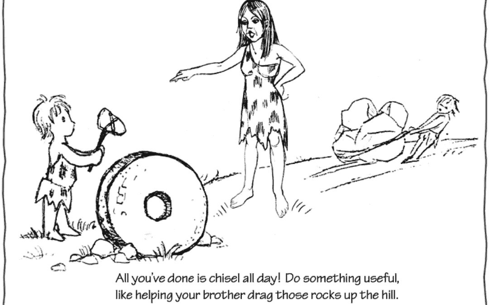
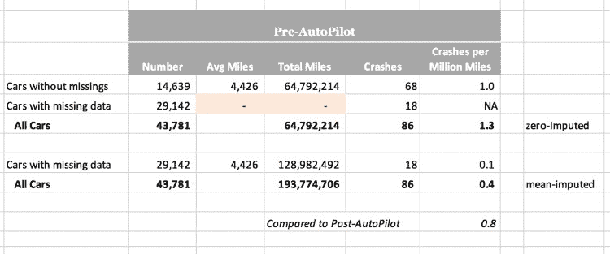

# 数据科学中最受欢迎的技能

> 原文：[`www.kdnuggets.com/2019/04/most-desired-skill-data-science.html`](https://www.kdnuggets.com/2019/04/most-desired-skill-data-science.html)

 评论

**凯瑟尔·冯，创始人，[Principal Analytics Prep](https://www.principalanalyticsprep.com)**

**这一技能差距通常被描述为缺乏“批判性思维”。**

很难想象一个拥有 STEM 学位的人缺乏批判性思维，我们来解析一下这意味着什么。

数据科学中的批判性思维可以分为两个方面。首先是**提出问题的能力**。在实践中，这涉及到与数据科学或分析结果的用户进行广泛的采访，以真正理解需要解决的问题。许多从业者，包括我最近参加的一次会议上的几位发言人，都指出用户经常无法准确表达问题。

**[来源](https://writereflections4u.com/wp-content/uploads/Creative-vs.-Critical-Thinker-1080x675.png)**

我并不完全同意这种描述。提出问题的过程需要数据科学家（他们对数据和分析工具了解很多）与业务负责人（他们对业务目标和指标了解很多）之间的合作。这种合作促成了知识的共享和共生的解决问题方法。

批判性思维的第二个方面是**质疑数据的能力**。有经验的分析师绝不会直接将原始数据投入软件中看会得到什么。经验告诉我们需要进行哪些调整，以去除数据中可能分散注意力或具有误导性的特征。

STEM 培训特别缺乏这两方面的批判性思维。数学、科学或工程课程中的典型问题包括（a）一个明确定义的问题，和（b）整洁的数据，学生的挑战是找出哪个公式或方法可以利用提供的数据来回答指定的问题。没有必要进一步发展问题；实际上，任何试图改变问题的学生都会受到惩罚！也不需要质疑数据。如果数据应该被质疑，那么问题将没有单一正确答案，这与传统的学术 STEM 培训不太符合。（相比之下，社会科学毕业生在处理复杂性和不完整数据方面训练得更好。）

在最近的[博客文章](https://junkcharts.typepad.com/numbersruleyourworld/2019/03/excel-error-but-could-happen-in-any-tool.html)中，我展示了数据分析师如何利用批判性思维来质疑数据，并避免得出令人尴尬的错误结论。国家公路交通安全管理局（NHTSA）的分析师未能注意到特斯拉提交的数据中的巨大漏洞，当他们支持特斯拉的说法，即自动驾驶功能将降低 40%的碰撞率时。一位独立顾问成功地使数据得以公开，并发现了大量的空白条目。当使用标准方法（均值插补）对缺失值进行插补时，报告的自动驾驶功能的好处*完全*消失了。

弥合这个技能差距是我启动 Principal Analytics Prep 时的一个关键目标。我们通过与具有多年实际工作经验的从业人员在课堂内进行动手学习，并寻找具有多样背景的学生，以考虑科学和社会科学的方法来解决问题，来实现这一目标。

在[第二部分](https://www.kdnuggets.com/2019/04/interview-questions-data-science.html)中，我提供了帮助你准备招聘经理用来测试批判性思维的案例面试材料。

本文最初发布在 Kaiser Fung 的博客上（[`www.principalanalyticsprep.com/news/critical-thinking-the-most-desired-skill-in-data-science`](https://www.principalanalyticsprep.com/news/critical-thinking-the-most-desired-skill-in-data-science)），并经过了略微修改。

**简历**：Kaiser Fung 是 Principal Analytics Prep 的创始人，这是一个领先的数据分析训练营；畅销书《Numbers Rule Your World》的作者；以及 Junk Charts 的作者（[`www.junkcharts.com`](https://www.junkcharts.com)），这是一个受欢迎的数据可视化博客。

Twitter: [@junkcharts](https://twitter.com/@junkcharts)

Youtube: [bitly.com/fungwithdata-1](http://bitly.com/fungwithdata-1)

**资源：**

+   [在线和基于网络的：分析、数据挖掘、数据科学、机器学习教育](https://www.kdnuggets.com/education/online.html)

+   [用于分析、数据科学、数据挖掘和机器学习的软件](https://www.kdnuggets.com/software/index.html)

**相关内容：**

+   [2019 年典型的数据科学家是谁？](https://www.kdnuggets.com/2019/03/typical-data-scientist-2019.html)

+   [数据科学家与数据工程师的区别](https://www.kdnuggets.com/2019/03/odsc-difference-data-scientists-data-engineers.html)

+   [为了成为数据科学家，不要随波逐流](https://www.kdnuggets.com/2018/11/get-hired-as-data-scientist.html)

### 更多相关主题

+   [建立一个强大的数据团队](https://www.kdnuggets.com/2021/12/build-solid-data-team.html)

+   [使用管道编写干净的 Python 代码](https://www.kdnuggets.com/2021/12/write-clean-python-code-pipes.html)

+   [成为出色数据科学家所需的 5 项关键技能](https://www.kdnuggets.com/2021/12/5-key-skills-needed-become-great-data-scientist.html)

+   [每个初学者数据科学家都应该掌握的 6 种预测模型](https://www.kdnuggets.com/2021/12/6-predictive-models-every-beginner-data-scientist-master.html)

+   [2021 年最佳 ETL 工具](https://www.kdnuggets.com/2021/12/mozart-best-etl-tools-2021.html)

+   [团队合作为何是数据科学中必备的技能的 3 个理由](https://www.kdnuggets.com/2022/05/3-reasons-teamwork-essential-skill-data-science.html)
