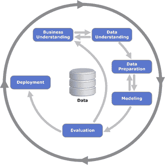

# 机器学习项目中最重要的步骤是什么？

> 原文：[`www.kdnuggets.com/2017/08/most-important-step-machine-learning-project.html`](https://www.kdnuggets.com/2017/08/most-important-step-machine-learning-project.html)

评论

**作者：Shahar Cohen，YellowRoad**。

[CRISP-DM](https://en.wikipedia.org/wiki/Cross_Industry_Standard_Process_for_Data_Mining) 是机器学习项目的常见标准。业务理解、数据理解、数据准备、建模、评估和部署。这六个步骤对机器学习项目至关重要。每个步骤中的质量问题都会直接影响整个结果的质量。它们都很重要。

然而，在向许多组织提供机器学习建议，并自己运行更多此类项目后，我们（在 YellowRoad）得出结论，流程中投资最少的步骤是**业务理解**。我们看到许多公司在理解他们要解决的任务的业务方面之前，讨论算法和技术。这显然不是一个好的起点。

我们编制了一系列问题，用于任何我们参与的机器学习项目，在得到这些问题的良好答案之前，我们不会在后续步骤上投入过多精力。我们发现这种做法非常有帮助。

这些是问题：

1.  我们试图实现什么目标，从业务角度来看？这有多重要？

1.  我们正在尝试解决的任务的输入和输出是什么？

1.  给定一个假设的解决方案，它将如何影响我们的操作？（另一种问法是：假设我有一个完美的解决方案，你将如何使用它？）

1.  我们是否已经具备根据这种解决方案行动的能力，还是我们还需要开发这种能力？（如果能力已经具备，仔细学习。如果没有，保持与负责开发该能力的团队的紧密联系）

1.  我们将如何衡量建议的解决方案？（关键绩效指标）

1.  什么会使它成功？

1.  我们是否有可用的输入数据？提取这些数据有多难？我们是否被允许使用这些数据？

1.  我们是否有构建类似解决方案的经验？我们是否了解需要什么？

1.  我们是否面临严格的预算和时间限制？

1.  谁将开发解决方案？我们是否具备所需的内部技能？

[原文](https://blog.myyellowroad.com/what-is-the-most-important-step-in-a-machine-learning-project-3ee20a13bd20)。经许可转载。

**简历： [Shahar Cohen](https://www.linkedin.com/in/shahar-cohen-a606017/?ppe=1)** 是 YellowRoad 的联合创始人，同时也是一位经验丰富的数据科学家和研究员，拥有超过 10 年的经验。

**相关：**

+   数据科学家如何提高生产力

+   数据版本控制：迭代机器学习

+   解决 CRISP-DM 中的部署和迭代问题

* * *

## 我们的三大课程推荐

 1\. [Google 网络安全证书](https://www.kdnuggets.com/google-cybersecurity) - 快速进入网络安全职业生涯

 2\. [Google 数据分析专业证书](https://www.kdnuggets.com/google-data-analytics) - 提升你的数据分析能力

 3\. [Google IT 支持专业证书](https://www.kdnuggets.com/google-itsupport) - 支持你的组织的 IT

* * *

### 更多相关主题

+   [如何结构化数据科学项目：逐步指南](https://www.kdnuggets.com/2022/05/structure-data-science-project-stepbystep-guide.html)

+   [停止学习数据科学以寻找目标，并寻找目标去…](https://www.kdnuggets.com/2021/12/stop-learning-data-science-find-purpose.html)

+   [学习数据科学统计的顶级资源](https://www.kdnuggets.com/2021/12/springboard-top-resources-learn-data-science-statistics.html)

+   [一个 90 亿美元的 AI 失败，进行分析](https://www.kdnuggets.com/2021/12/9b-ai-failure-examined.html)

+   [建立一个稳固的数据团队](https://www.kdnuggets.com/2021/12/build-solid-data-team.html)

+   [使用管道编写干净的 Python 代码](https://www.kdnuggets.com/2021/12/write-clean-python-code-pipes.html)
