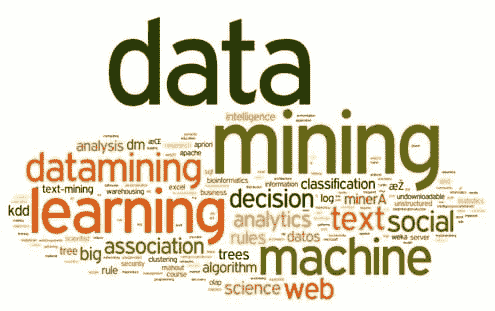
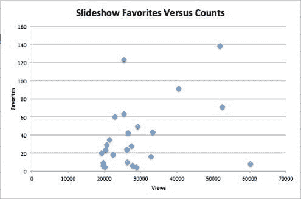

# 最受欢迎的 Slideshare 数据挖掘演示文稿

> 原文：[`www.kdnuggets.com/2014/11/most-popular-slideshare-presentations-data-mining.html`](https://www.kdnuggets.com/2014/11/most-popular-slideshare-presentations-data-mining.html)

作者：Grant Marshall，2014 年 11 月

Slideshare 是一个上传、注释、分享和评论基于幻灯片的演示文稿的平台。该平台已经存在一段时间，并积累了大量关于数据挖掘等技术主题的演示文稿。

图 1：与演示文稿相关的标签词云

今天，我们将深入探讨一些在 Slideshare 上找到的顶级数据挖掘演示文稿。这些演示文稿是通过 Python 脚本和[Slideshare search_slideshow](http://www.slideshare.net/developers/documentation#search_slideshows) API 检索的，然后经过精心筛选以选择最佳和最相关的演示文稿。以下是幻灯片及其相关指标：

| 标题 | 日期 | 浏览量 | 下载量 | 收藏量 |
| --- | --- | --- | --- | --- |
| [数据挖掘：概念与技术](http://www.slideshare.net/Tommy96/data-mining-concepts-and-techniques-4036310) | 2010-05-10 | 60288 | 932 |

* * *

## 我们的三大课程推荐

 1\. [谷歌网络安全证书](https://www.kdnuggets.com/google-cybersecurity) - 快速进入网络安全职业的捷径。 2\. [谷歌数据分析专业证书](https://www.kdnuggets.com/google-data-analytics) - 提升你的数据分析技能！ 3\. [谷歌 IT 支持专业证书](https://www.kdnuggets.com/google-itsupport) - 支持你组织的 IT 需求

* * *

8 |

| [机器学习与数据挖掘：11 棵决策树](http://www.slideshare.net/pierluca.lanzi/machine-learning-and-data-mining-11-decision-trees) | 2007-04-02 | 52487 | 0 | 71 |
| --- | --- | --- | --- | --- |
| [大数据[抱歉]与数据科学：数据科学家在做什么？](http://www.slideshare.net/datasciencelondon/big-data-sorry-data-science-what-does-a-data-scientist-do) | 2013-01-26 | 51793 | 0 | 138 |
| [挖掘社交数据的乐趣与洞察](http://www.slideshare.net/adunne/mining-social-data-for-fun-and-insight) | 2007-11-05 | 40434 | 1903 | 91 |
| [构建工具以通过机器学习 API 挖掘非结构化文本](http://www.slideshare.net/ai-one/building-tools-to-data-mine-unstructured-text-using-a-machine-learning-api) | 2012-02-14 | 32812 | 98 | 16 |
| [机器学习与数据挖掘：19 种挖掘文本和网络数据的方法](http://www.slideshare.net/pierluca.lanzi/machine-learning-and-data-mining-19-mining-text-and-web-data) | 2007-06-03 | 33329 | 2003 | 43 |
| [Mahout 与机器学习简介](http://www.slideshare.net/VaradMeru/introduction-to-mahout-and-machine-learning) | 2013-07-27 | 29261 | 575 | 49 |
| [日志挖掘：超越日志分析](http://www.slideshare.net/anton_chuvakin/log-mining-beyond-log-analysis) | 2007-09-27 | 27497 | 0 | 28 |
| [社交数据挖掘](http://www.slideshare.net/maheshmeniya/sdm-final) | 2013-11-02 | 28944 | 0 | 4 |
| [机器学习与数据挖掘：04 关联规则挖掘](http://www.slideshare.net/pierluca.lanzi/machine-learning-and-data-mining-04-association-rule-mining-30967) | 2007-03-18 | 26448 | 0 | 42 |
| [数据挖掘：分类与预测](http://www.slideshare.net/dataminingtools/data-mining-classification-and-prediction) | 2010-08-19 | 27776 | 0 | 6 |
| [第十一章：数据挖掘中的应用与趋势](http://www.slideshare.net/Tommy96/chapter-11-applications-and-trends-in-data-mining) | 2010-05-10 | 26285 | 1024 | 10 |
| [使用 R 进行文本挖掘](http://www.slideshare.net/whitish/textmining-with-r) | 2012-02-23 | 25380 | 4 | 63 |
| [机器学习与数据挖掘：01 数据挖掘](http://www.slideshare.net/pierluca.lanzi/machine-learning-and-data-mining-01-data-mining) | 2007-03-14 | 25407 | 0 | 123 |
| [数据挖掘概念](http://www.slideshare.net/huongcokho/data-mining-concepts) | 2007-05-18 | 26125 | 2166 | 24 |
| [统计学家对大数据和数据科学的看法（第 1 版）](http://www.slideshare.net/kuonen/a-statisticians-view-on-big-data-and-data-science) | 2013-11-25 | 22832 | 0 | 60 |
| [讲座 01 数据挖掘](http://www.slideshare.net/pierluca.lanzi/lecture-01-data-mining) | 2008-03-11 | 22405 | 1474 | 18 |
| [网页挖掘教程](http://www.slideshare.net/Tommy96/web-mining-tutorial) | 2010-05-10 | 21408 | 1319 | 35 |
| [机器学习与数据挖掘：12 个分类规则](http://www.slideshare.net/pierluca.lanzi/machine-learning-and-data-mining-12-classification-rules) | 2007-04-11 | 20386 | 0 | 23 |
| [分析与数据挖掘行业概述](http://www.slideshare.net/gpiatetskyshapiro/analytics-and-data-mining-industry-overview) | 2011-11-18 | 20604 | 1007 | 29 |
| [使用 Excel 2007 和 SQL Server 2008 的数据挖掘](http://www.slideshare.net/marktab/data-mining-with-excel-2007-and-sql-server-2008-presentation) | 2008-12-06 | 19718 | 824 | 9 |
| [数据仓库与数据挖掘在支持斯里兰卡高等教育系统规划中的应用](http://www.slideshare.net/wikramanayake/application-of-data-warehousing-data-mining-to-exploitation-for-supporting-the-planning-of-higher-education-system-in-sri-lanka) | 2009-07-25 | 20225 | 417 | 5 |
| [数据挖掘 - 使用决策树归纳法对乳腺癌数据集进行分类 - Sunil Nair 健康信息学 达尔豪斯大学](http://www.slideshare.net/snair/classification-of-breast-cancer-dataset-presentation) | 2008-12-04 | 19715 | 608 | 6 |
| [大数据与数据挖掘](http://www.slideshare.net/PeterCochrane/big-data-v-data-mining) | 2013-01-31 | 19266 | 559 | 20 |

关于表中这 24 个幻灯片的一些快速统计数据：每个幻灯片平均约有 29,000 次观看，621 次下载，5 条评论和 38 个收藏。然而，这些总数可能具有误导性。

在评论方面，例如，大量评论来自于[机器学习与数据挖掘：11 个决策树](http://www.slideshare.net/pierluca.lanzi/machine-learning-and-data-mining-11-decision-trees)和[使用 R 进行文本挖掘](http://www.slideshare.net/whitish/textmining-with-r)。在第一个案例中，大多数评论是请求幻灯片（作者选择禁用下载），而在第二个案例中，大多数评论是请求演示文稿中摘录的代码。类似地，由于某些演示文稿禁用了下载功能，因此平均下载次数可能会产生误导。调整这些评论和一些下载禁用情况后，实际的平均值大约为每个演示文稿 994 次下载和 3 条评论。

尽管如此，社交功能似乎得到了应用，以[分析与数据挖掘行业概述](http://www.slideshare.net/gpiatetskyshapiro/analytics-and-data-mining-industry-overview)为例，作者可以看到回复评论。这显示了这种格式为人们与数据挖掘专家互动提供了有趣的潜力。

图 2：SlideShare 收藏与次数

在这张图表中，我们可以看到这些不同幻灯片所吸引的观众的多样性。尽管与观看次数相比，收藏数量总体上呈上升趋势，但也存在一些例外。我的假设是，像[数据挖掘：概念与技术](http://www.slideshare.net/Tommy96/data-mining-concepts-and-techniques-4036310)这样的通用讲座可能会吸引更多的普通观众，但观众更不容易收藏这些幻灯片。另一方面，像[挖掘社交数据以获取乐趣和洞见](http://www.slideshare.net/adunne/mining-social-data-for-fun-and-insight)这样的更具特定性的幻灯片可能不会吸引那么多普通观众，但观众可能更倾向于收藏它。

**相关：**

+   马萨诸塞州的文本挖掘与选举分析

+   审视 GoodData 开放分析平台

+   解读公共数据 – 处理 Jeopardy

### 更多相关话题

+   [如何利用数据可视化为工作报告增添影响力…](https://www.kdnuggets.com/2022/08/data-visualization-add-impact-work-reports-presentations.html)

+   [KDnuggets 新闻 3 月 30 日：最受欢迎的编程入门…](https://www.kdnuggets.com/2022/n13.html)

+   [哈佛大学最受欢迎的编程入门课程免费开放！](https://www.kdnuggets.com/2022/03/popular-intro-programming-course-harvard-free.html)

+   [学习 Python 的 3 大热门训练营](https://www.kdnuggets.com/3-most-popular-bootcamps-to-learn-python)

+   [人工智能质量免费研讨会，因受欢迎重返](https://www.kdnuggets.com/2022/05/truera-free-workshop-ai-quality-back-popular-demand.html)

+   [PyTorch 还是 TensorFlow？比较流行的机器学习框架](https://www.kdnuggets.com/2022/02/packt-pytorch-tensorflow-comparing-popular-machine-learning-frameworks.html)
