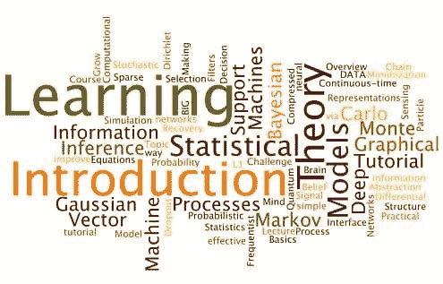
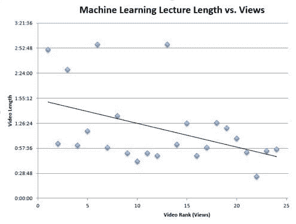

# 最受欢迎的机器学习讲座

> 原文：[`www.kdnuggets.com/2014/09/most-viewed-machine-learning-talks-videolectures.html`](https://www.kdnuggets.com/2014/09/most-viewed-machine-learning-talks-videolectures.html)

 由 Grant Marshall 撰写，2014 年 9 月

今天，我们查看 [videolectures.net](http://www.videolectures.net) 上观看次数最多的前 25 个数据挖掘讲座

流行度的确定方法是通过查看机器学习视频列表上的“[热门](http://videolectures.net/Top/Computer_Science/Machine_Learning/#o=top)”排序。这些视频，包括作者、时长和场地，按照观看次数排序：

1.  [贝叶斯推断简介](http://videolectures.net/mlss09uk_bishop_ibi/)，Christopher Bishop，43045 次观看，2:51:04（2009 年 11 月 2 日，在 [机器学习暑期学校（MLSS），剑桥 2009](http://videolectures.net/mlss09uk_cambridge/)）

1.  [机器学习、概率与图形模型](http://videolectures.net/mlss06tw_roweis_mlpgm/)，Sam Roweis，41039 次观看，1:02:45（2007 年 2 月 25 日，在 [机器学习暑期学校（MLSS），台北 2006](http://videolectures.net/mlss06tw_taipei/)）

1.  [马尔可夫链蒙特卡罗](http://videolectures.net/mlss09uk_murray_mcmc/)，Iain Murray，37223 次观看，2:27:56（2009 年 11 月 2 日，在 [机器学习暑期学校（MLSS），剑桥 2009](http://videolectures.net/mlss09uk_cambridge/)）

1.  [高斯过程基础](http://videolectures.net/gpip06_mackay_gpb/)，David MacKay，35956 次观看，1:00:47（2007 年 2 月 25 日，在 [高斯过程实践研讨会，布莱切利公园 2006](http://videolectures.net/gpip06_bletchley_park/)）

1.  [支持向量机](http://videolectures.net/mlss06tw_lin_svm/)，Chih-Jen Lin，32530 次观看，1:17:15（2007 年 2 月 25 日，在 [机器学习暑期学校（MLSS），台北 2006](http://videolectures.net/mlss06tw_taipei/)）

1.  [主题模型](http://videolectures.net/mlss09uk_blei_tm/)，David Blei，26666 次观看，2:57:01（2009 年 11 月 2 日，在 [机器学习暑期学校（MLSS），剑桥 2009](http://videolectures.net/mlss09uk_cambridge/)）

1.  [蒙特卡罗模拟用于统计推断、模型选择和决策制定](http://videolectures.net/mlss08au_freitas_asm/)，Nando de Freitas，26596 次观看，5:22:55（2008 年 3 月 13 日，在 [机器学习暑期学校（MLSS），基奥洛亚 2008](http://videolectures.net/mlss08au_kioloa/)）

1.  [狄利克雷过程：教程与实践课程](http://videolectures.net/mlss07_teh_dp/)，Yee Whye The，23579 次观看，0:58:40（2007 年 8 月 27 日，在 [机器学习暑期学校（MLSS），图宾根 2007](http://videolectures.net/mlss07_tuebingen/)）

1.  [深度学习教程](http://videolectures.net/jul09_hinton_deeplearn/)，Geoffrey E. Hinton，23489 次观看，1:34:53（2009 年 9 月 15 日，在 [VideoLectures.NET - 单场讲座系列](http://videolectures.net/single_lecture_series/)）

1.  [支持向量机简介](http://videolectures.net/epsrcws08_campbell_isvm/)，Colin Campbell，21925 次观看，0:51:54（2008 年 2 月 5 日，[EPSRC 数据建模数学冬季学校，谢菲尔德 2008](http://videolectures.net/epsrcws08_sheffield/)）

1.  [随机微分方程教程介绍：连续时间高斯马尔可夫过程](http://videolectures.net/dsb06_williams_ctgmp/)，Chris Williams，19482 次观看，0:42:43（2007 年 2 月 25 日，[NIPS 动态系统、随机过程和贝叶斯推断研讨会，惠斯勒 2006](http://videolectures.net/dsb06_whistler/)）

1.  [概率图模型](http://videolectures.net/mlss05au_roweis_pgm/)，Sam Roweis，18860 次观看，0:52:06（2007 年 2 月 25 日，[机器学习夏季学校（MLSS），堪培拉 2005](http://videolectures.net/mlss05au_canberra/)）

1.  [统计学习理论](http://videolectures.net/mlss04_taylor_slt/)，John Shawe-Taylor，15659 次观看，0:48:52（2007 年 2 月 25 日，[机器学习夏季学校（MLSS），贝尔德岛 2004](http://videolectures.net/mlss04_berderisland/)）

1.  [贝叶斯还是频率派，你是哪种？](http://videolectures.net/mlss09uk_jordan_bfway/)，Michael I. Jordan，15612 次观看，2:57:10（2009 年 11 月 2 日，[机器学习夏季学校（MLSS），剑桥 2009](http://videolectures.net/mlss09uk_cambridge/)）

1.  [讲座 1：信息理论简介](http://videolectures.net/mackay_course_01/)，David MacKay，13931 次观看，1:01:50（2012 年 11 月 5 日，[信息理论、模式识别与神经网络课程](http://videolectures.net/course_information_theory_pattern_recognition/)）

1.  [信息理论](http://videolectures.net/mlss09uk_mackay_it/)，David MacKay，13694 次观看，1:26:35（2009 年 11 月 2 日，[机器学习夏季学校（MLSS），剑桥 2009](http://videolectures.net/mlss09uk_cambridge/)）

1.  [机器学习简介](http://videolectures.net/bootcamp2010_murray_iml/)，Iain Murray，12498 次观看，0:49:14（2010 年 8 月 5 日，[PASCAL 机器学习暑期培训班，马赛 2010](http://videolectures.net/bootcamp2010_marseille/)）

1.  [压缩感知与稀疏信号恢复概述](http://videolectures.net/mlss09us_candes_ocsssrl1m/)，Emmanuel Candes，11723 次观看，0:58:36（2009 年 7 月 30 日，[机器学习夏季学校（MLSS），芝加哥 2009](http://videolectures.net/mlss09us_chicago/)）

1.  深度信念网络，Geoffrey E. Hinton，11024 次观看，1:27:00（2009 年 11 月 2 日，[机器学习夏季学校（MLSS），剑桥 2009](http://videolectures.net/mlss09uk_cambridge/)）

1.  [粒子滤波器](http://videolectures.net/mlss09uk_godsill_pf/)，Simon Godsill，10744 次观看，1:21:00（2009 年 11 月 2 日，[机器学习夏季学校（MLSS），剑桥 2009](http://videolectures.net/mlss09uk_cambridge/)）

1.  [如何培养思维：统计、结构与抽象](http://videolectures.net/aaai2012_tenenbaum_grow_mind/)，乔舒亚·B·特嫩鲍姆，4949 次观看，1:09:08（2012 年 8 月 17 日，在[第 26 届人工智能协会年会（AAAI），多伦多 2012](http://videolectures.net/aaai2012_toronto/)）

1.  [量子信息与大脑](http://videolectures.net/nips2012_aaronson_quantum_information/)，斯科特·阿龙森，4283 次观看，0:53:11（2013 年 1 月 16 日，在[第 26 届神经信息处理系统年会（NIPS），太浩湖 2012](http://videolectures.net/nips2012_laketahoe/)）

1.  [Dropout：一种简单有效的改进神经网络的方法](http://videolectures.net/nips2012_hinton_networks/)，杰弗里·E·辛顿，3851 次观看，0:25:19（2013 年 1 月 16 日，在[第 26 届神经信息处理系统年会（NIPS），太浩湖 2012](http://videolectures.net/nips2012_laketahoe/)）

1.  [学习表示：学习理论中的挑战](http://videolectures.net/colt2013_lecun_theory/)，扬·勒库恩，2916 次观看，0:54:32（2013 年 8 月 9 日，在[第 26 届学习理论年会（COLT），普林斯顿 2013](http://videolectures.net/colt2013_princeton/)）

1.  [计算与统计界面及“BIG DATA”](http://videolectures.net/colt2014_jordan_bigdata/)，迈克尔·I·乔丹，421 次观看，0:56:26（2014 年 7 月 15 日，在[第 27 届学习理论年会（COLT），巴塞罗那 2014](http://videolectures.net/colt2014_barcelona/)）

你会立即注意到，这个列表中有许多讲座来自[机器学习暑期学校](http://www.mlss.cc/)。总体来看，视频讲座网中最受欢迎的二十五个机器学习讲座中有超过一半（十三个）来自这里，占据了前四名。

现在我们将查看视频标题，以确定什么因素使得机器学习视频受欢迎。

这幅可视化图表清晰地集中于理论、建模和统计等主题——显示了视频讲座的观众对机器学习的理论方面的亲和力，而非应用方面。

现在，我们来看一下讲座的长度如何影响视频的观看次数。

与视频讲座上的其他类别视频类似，较长的视频长度与更多的观看次数相关，表明深入的内容在视频讲座的观众中更受欢迎。

**相关内容：**

+   视频讲座中观看次数最多的大数据讲座

+   视频讲座中观看次数最多的数据挖掘讲座

+   [KDD 2013 视频讲座：观看数据挖掘和知识发现领域的顶尖研究者](http://videolectures.net/2013/10/videolectures-kdd-2013-acm-sigkdd-conference-on-knowledge-discovery-data-mining-chicago.html)

* * *

## 我们的前三大课程推荐

 1\. [Google 网络安全认证](https://www.kdnuggets.com/google-cybersecurity) - 快速进入网络安全职业领域

 2\. [Google 数据分析职业认证](https://www.kdnuggets.com/google-data-analytics) - 提升你的数据分析技能

 3\. [Google IT 支持专业认证](https://www.kdnuggets.com/google-itsupport) - 支持你组织的 IT 需求

* * *

### 更多相关内容

+   [15 个热门的 MLOps 演讲，你可以在 ODSC East 2022 上免费访问](https://www.kdnuggets.com/2022/04/odsc-15-trending-mlops-talks-access-free-odsc-east-2022.html)

+   [KDnuggets 新闻，8 月 3 日：10 个最常用的 Tableau 函数• 是…](https://www.kdnuggets.com/2022/n31.html)

+   [数据：对企业来说最有价值的商品](https://www.kdnuggets.com/2022/03/data-valuable-commodity-businesses.html)

+   [为什么大多数人无法学会编程？](https://www.kdnuggets.com/2022/03/people-fail-learn-programming.html)

+   [哈佛大学最受欢迎的编程入门课程现在免费提供！](https://www.kdnuggets.com/2022/03/popular-intro-programming-course-harvard-free.html)

+   [12 个最具挑战性的数据科学面试问题](https://www.kdnuggets.com/2022/07/12-challenging-data-science-interview-questions.html)
