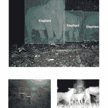
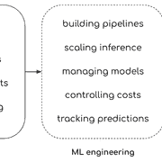
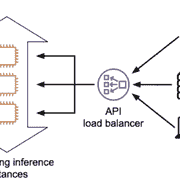
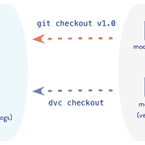
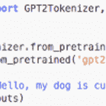

# 从数据科学到机器学习工程

> 原文：[`www.kdnuggets.com/2020/11/moving-data-science-machine-learning-engineering.html`](https://www.kdnuggets.com/2020/11/moving-data-science-machine-learning-engineering.html)

评论

**[Caleb Kaiser](https://www.linkedin.com/in/caleb-kaiser-843249126/)，Cortex Labs**

在过去的 20 年里，机器学习一直在回答一个问题：我们能否训练一个模型来做*某些事情*？

* * *

## 我们的前三个课程推荐

 1\. [谷歌网络安全证书](https://www.kdnuggets.com/google-cybersecurity) - 快速进入网络安全职业生涯。

 2\. [谷歌数据分析专业证书](https://www.kdnuggets.com/google-data-analytics) - 提升你的数据分析技能

 3\. [谷歌 IT 支持专业证书](https://www.kdnuggets.com/google-itsupport) - 支持你的组织的 IT 需求

* * *

*某些事情* 当然可以是任何任务。预测句子中的下一个单词，识别照片中的人脸，生成某种声音。目标是查看机器学习是否有效，如果我们能做出准确的预测。

感谢数据科学家们几十年的努力，我们现在拥有了很多可以做很多*事情*的模型：

+   OpenAI 的 GPT-2（现在还有 GPT-3）可以生成勉强像人类的文本。

+   像 YOLOv5 这样的目标检测模型（官方版本的争论暂且不提）每秒可以解析 140 帧视频中的物体。

+   文本到语音模型如 Tacotron 2 可以生成类似人类的语音。

数据科学家和机器学习研究人员所做的工作是令人难以置信的，因此，一个第二个问题自然出现了：

*我们可以用这些模型做些什么，怎么做呢？*

这显然是*不是* 数据科学问题。这是一个工程问题。为了解答这个问题，一门新的学科——**机器学习工程**应运而生。

### 机器学习工程就是如何将机器学习应用于现实世界的问题

数据科学和机器学习工程之间的差异起初可能感觉有些无形，因此查看一些例子是很有帮助的。

### 1\. 从图像分类到机器学习生成的目录

图像分类和关键词提取分别是计算机视觉和自然语言处理的经典问题。

Glisten.ai 使用训练有素的模型集来创建一个 API，从产品图像中提取结构化信息：

来源： [TechCrunch](https://techcrunch.com/2020/03/13/glisten-uses-computer-vision-to-break-down-fashion-photos-to-their-styles-and-parts/)

这些模型本身是数据科学的令人惊叹的成果。然而，Glisten API 是机器学习工程的杰作。

### 从目标检测到打击盗猎

Wildlife Protection Solutions 是一个小型非营利组织，利用技术保护濒危物种。最近，他们升级了视频监控系统，纳入了一个经过训练的目标检测模型，以识别偷猎者。该模型的检测率已经**翻倍**：

来源：[Silverpond](https://silverpond.com.au/case-studies/wildlife-protection-solutions/)

像 YOLOv4 这样的目标检测模型是数据科学的成功案例，而 Highlighter——WPS 用于训练其模型的平台——是一个令人印象深刻的数据科学工具。然而，WPS 的偷猎者检测系统则是机器学习工程的一项壮举。

### 3\. 从机器翻译到 COVID19 的重大挑战

机器翻译指的是使用机器学习将数据从一种形式“翻译”成另一种形式——有时是在人类语言之间，有时是完全不同的格式之间。

PostEra 是一个药物化学平台，利用机器翻译将化合物“翻译”为工程蓝图。目前，化学家们正在利用这个平台进行一个开源项目，寻找 COVID19 的治疗方法：

来源：[PostEra](https://postera.ai/demo)

开发一个能够将分子转化为一系列“路线”（从一个分子转变为另一个分子的变换）的模型是数据科学的一项壮举。构建 PostEra 平台则是机器学习工程的一项壮举。

### 4\. 从文本生成到机器学习地下城主

OpenAI 的 GPT-2 在发布时是历史上最强大的文本生成模型。拥有惊人的 15 亿参数，它代表了变换器模型的一个重大进步。

AI Dungeon 是一个经典的地下城探险游戏，带有一个小变化：它的地下城主实际上是经过文本微调的 GPT-2，用于选择你自己的冒险故事：

> Reddit 今日发现 ???? 有没有其他人有幸为你的龙车买保险？[pic.twitter.com/TGQh3Tju89](https://t.co/TGQh3Tju89)
> 
> — AI Dungeon (@AiDungeon) [2020 年 6 月 28 日](https://twitter.com/AiDungeon/status/1277352539101356032?ref_src=twsrc%5Etfw)

训练 GPT-2 是一项历史性的 数据科学 成就。将其构建成地下城探险游戏则是机器学习工程的一项壮举。

所有这些平台都建立在数据科学的基础之上。如果不能为其任务训练模型，它们是无法工作的。但为了将这些模型应用于现实世界的问题，它们需要被工程化成应用程序。

换句话说，**机器学习工程是数据科学的创新在机器学习研究之外的体现**。

然而，机器学习工程带来的核心挑战是它引入了一种全新的工程问题类别——这些问题我们目前还没有简单的答案。

### 机器学习工程的内容

从高层次来看，我们可以说机器学习工程指的是所有需要将训练好的模型转化为生产应用程序的任务：

为了让这些更具体，我们可以用一个简单的例子。

让我们回到 AI Dungeon，这个由 ML 驱动的地下城爬行游戏。游戏的架构很简单。玩家输入一些文本，游戏调用模型，模型生成响应，然后游戏显示出来。显而易见的构建方法是将模型部署为微服务。

理论上，这应该类似于部署任何其他 Web 服务。将模型封装在类似 FastAPI 的 API 中，用 Docker 容器化它，部署到 Kubernetes 集群中，并通过负载均衡器暴露它。

来源：[Cortex 推理架构](https://github.com/cortexlabs/cortex)

实际上，GPT-2 使事情变得复杂：

+   **GPT-2 非常庞大**。完全训练好的模型超过 5 GB。为了服务它，你需要一个配备了大实例类型的集群。

+   **GPT-2 资源密集**。单次预测可能会长时间占用一个 GPU。低延迟很难实现，而且单个实例无法同时处理多个请求。

+   **GPT-2 成本高**。由于上述事实，将 GPT-2 部署到生产环境意味着——假设你有相当多的流量——你将运行许多大型 GPU 实例，这会很昂贵。

当你考虑到游戏在发布后很快就拥有了超过 100 万名玩家，这些问题变得更加严重。

编写高性能 API、配置带 GPU 实例的集群、使用抢占实例来优化成本、为推理工作负载配置自动扩展、实施滚动更新以便每次更新模型时 API 不会崩溃——这是大量的工程工作，而这只是一个 *简单* 的 ML 应用程序。

有许多常见的功能——重新训练、监控、多模型端点、批量预测等——对于许多 ML 应用程序来说都是必要的，每个功能都会显著提高复杂性。

解决这些问题是机器学习工程师（根据组织情况，可能还需与 ML 平台团队合作）的工作，他们的工作因大多数机器学习工具是为数据科学而非工程设计的而变得更加困难。

幸运的是，这种情况正在改变。

### 我们正在构建一个用于机器学习工程的平台——而不是数据科学。

几年前，我们中的一些人从软件工程转向了 MLE。在花了几周时间破解数据科学工作流和编写粘合代码以使 ML 应用程序正常工作后，我们开始思考如何将软件工程原则应用于机器学习工程。

例如，看看 AI Dungeon。如果他们在构建一个普通的 API——一个不涉及 GPT-2 的 API——他们会使用类似 Lambda 的工具在 15 分钟内启动 API。然而，由于服务 GPT-2 的机器学习特定挑战，软件工程的编排工具将不起作用。

但，为什么这些原则不能继续适用呢？

所以，我们开始开发适用于机器学习工程的工具，这些工具应用了这些原则。[Cortex，我们的开源 API 平台](https://github.com/cortexlabs/cortex)使机器学习工程师尽可能容易地将模型部署为 API，使用的界面对任何软件工程师来说都很熟悉：

来源：[Cortex repo](https://github.com/cortexlabs/cortex)

API 平台实际上是 AI Dungeon 以及上述所有其他机器学习初创公司用来部署其模型的工具。其设计哲学非常简单：

**我们将机器学习工程的挑战视为工程问题，而非数据科学问题。**

对于 API 平台来说，这意味着我们使用 YAML 和 Python 文件，而不是难以版本化、依赖隐性状态并允许任意执行顺序的笔记本。我们构建了一个 CLI，而不是带有“部署”按钮的 GUI，通过 CLI，你可以实际管理部署。

你可以将这种哲学应用于生产环境中使用机器学习的许多挑战。

可重复性，例如，不仅仅是机器学习中的挑战。这也是软件工程中的问题——但我们使用版本控制来解决它。而虽然传统的版本控制软件如 Git 不适用于机器学习，你仍然可以应用这些原则。DVC（数据版本控制），将类似 Git 的版本控制应用于训练数据、代码及其结果模型，就实现了这一点。

来源：[DVC](https://dvc.org/doc/use-cases/versioning-data-and-model-files)

那么，所有用于初始化模型和生成预测的样板代码和胶水代码呢？在软件工程中，我们会设计一个框架来处理这些问题。

最终，我们也看到这种情况发生在机器学习工程中。例如，Hugging Face 的 Transformers 库提供了大多数流行变换模型的简易接口：

来源：[Hugging Face](https://huggingface.co/)

使用那六行 Python 代码，你可以下载、初始化并提供 GPT-2 的预测，这是一个强大的文本生成模型。这六行 Python 代码完成了即使是成熟、资金充足的团队三年前也无法做到的事情。

我们对这个生态系统如此兴奋——不仅仅因为我们是其中的一部分——是因为它代表了机器学习几十年的研究与人们每天面临的问题之间的桥梁。每当这些项目消除了机器学习工程的障碍时，新团队就更容易用机器学习解决问题。

在未来，机器学习将成为每位工程师工具栈的一部分。几乎没有问题是机器学习无法触及的。这一进程的速度完全取决于我们能够多快开发出像 Cortex 这样的平台，并加速机器学习工程的普及。

如果这也让你兴奋，[我们随时欢迎新的贡献者](https://github.com/cortexlabs)。

**个人简介：[Caleb Kaiser](https://www.linkedin.com/in/caleb-kaiser-843249126/)** ([@KaiserFrose](https://twitter.com/KaiserFrose)) 是 Cortex Labs 的创始团队成员，帮助维护 Cortex。

[原文](https://towardsdatascience.com/moving-from-data-science-to-machine-learning-engineering-68916173eaf3)。经许可转载。

**相关内容：**

+   如何将 PyTorch Lightning 模型部署到生产环境

+   机器学习工程师与数据科学家（数据科学结束了吗？）

+   你不必再使用 Docker 了

### 更多相关话题

+   [掌握数据科学、数据工程、机器学习的 25 门免费课程](https://www.kdnuggets.com/25-free-courses-to-master-data-science-data-engineering-machine-learning-mlops-and-generative-ai)

+   [学习数据科学、数据工程等的免费课程合集](https://www.kdnuggets.com/collection-of-free-courses-to-learn-data-science-data-engineering-machine-learning-mlops-and-llmops)

+   [机器学习中的特征工程实用方法](https://www.kdnuggets.com/2023/07/practical-approach-feature-engineering-machine-learning.html)

+   [KDnuggets 新闻，7 月 13 日：数据科学的线性代数；10 种现代…](https://www.kdnuggets.com/2022/n28.html)

+   [10 种现代数据工程工具](https://www.kdnuggets.com/2022/07/10-modern-data-engineering-tools.html)

+   [完整的数据工程学习路线图](https://www.kdnuggets.com/2022/11/complete-data-engineering-study-roadmap.html)
