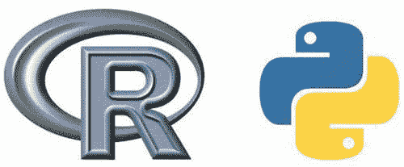

# 从 R 迁移到 Python：你需要了解的库

> 原文：[`www.kdnuggets.com/2017/02/moving-r-python-libraries.html`](https://www.kdnuggets.com/2017/02/moving-r-python-libraries.html)

这篇文章最初出现在 [Yhat 博客](http://blog.yhat.com/) 上。[**Yhat**](https://www.yhat.com/) 是一家位于布鲁克林的公司，旨在让数据科学对开发者、数据科学家和企业都适用。Yhat 提供了一个用于部署和管理预测算法的 REST API 的软件平台，同时消除了与生产环境相关的痛苦的工程障碍，如测试、版本控制、扩展和安全。

* * *

### 为什么要切换？

我在 Python 中最喜欢的机器学习部分之一是它受益于观察 R 社区，然后模仿其最佳部分。我坚信语言的有用性在于其库。因此，在这篇文章中，我将介绍一些我在使用 R 时几乎每次都会用到的重要包，以及它们在 Python 中的对应包。

### glm, knn, randomForest, e1071 -> scikit-learn

在 R 中，一个既是福音又是诅咒的特点是机器学习算法*通常*由不同的包进行划分。这意味着不是拥有一个（或一组）实现一些常见算法的 ML 库，而是每个算法都有自己的包。这有点好，因为你可以找到非常小众、前沿的算法实现，但在日常使用中切换算法可能会很麻烦。这个麻烦是 Python 的 [`scikit-learn`](https://github.com/scikit-learn/scikit-learn) 很好地解决了的。[`scikit-learn`](https://github.com/scikit-learn/scikit-learn) 提供了一套共同的 ML 算法，全部在相同的 API 下。这使得在 LogisticRegression 和 GradientBoostingMachines 之间切换变成了一行代码。

### reshape/reshape2, plyr/dplyr -> pandas

实际上，这也是 [我们第一篇文章之一](http://blog.yhat.com/posts/R-and-pandas-and-what-ive-learned-about-each.html) 的主题。[`pandas`](https://github.com/pydata/pandas) 采用了 R 中数据处理的最佳部分，并将其转化为一个 Python 包。这包括其自己的数据框架实现以及修改和重构的方式。基本上，它采纳了 [`reshape`](https://github.com/hadley/reshape)/[`reshape2`](https://github.com/hadley/reshape) 和 [`plyr`](https://github.com/hadley/plyr)/[`dplyr`](https://github.com/hadley/dplyr) 的最佳部分，并将其 Python 化！

### ggplot2 -> ggplot + seaborn + bokeh

R 仍然在绘图方面做得比 Python 更好。毫无疑问，R 在几乎所有的 *方面* 都更好。即便如此，Python 的绘图也已经成熟，尽管社区是碎片化的。如果你喜欢 ggplot 风格的语法，可以看看 [Yhat 的 `ggplot`](https://github.com/yhat/ggplot)。如果你需要超级统计和技术图表，那么可以尝试 [`seaborn`](https://github.com/mwaskom/seaborn)。如果你想要一些超酷、好看的交互式图表，那就试试 [`bokeh`](https://github.com/bokeh/bokeh)。

### stringr -> nothing

在 “base R” 中，字符串操作几乎同样不直观且傻乎乎的。每次我在 R 中处理字符串时，我会做两件事（按顺序）：

+   对新西兰生产 Hadley Wickham 简单表示感谢

+   导入 [`stringr`](https://github.com/hadley/stringr)

非常感谢，新西兰

[`stringr`](https://github.com/hadley/stringr) 是一个绝对的救星。它编写良好，性能优异（至少我认为如此），且易于安装（不要忽视最后这一点。如果人们无法安装你的软件，那就没有意义了）。

好了，所以 [`stringr`](https://github.com/hadley/stringr) 赞美独白完成。好消息是，Python 在字符串操作方面非常出色，你实际上不需要一个字符串库！它有一个出色的内置正则表达式库 `re`，以及一个恰当地称为 `string` 的内置字符串元库。所以幸运的是，Python 带有所有与字符串相关的电池！

### RStudio -> Rodeo

对许多用户来说，[`RStudio`](https://www.rstudio.com/products/rstudio/download/) 是 R 的代名词。为什么不呢？它是一个出色的 R 数据分析 IDE。从历史上看，Python 没有很多类似的选项。当然，现在情况已经不一样了。我们在一年前发布了 Rodeo 的第一个版本，并在一个月前发布了适用于 Windows、OSX 和 Linux 的 2.0 版本。

> “自从我们使用 RStudio 以来，我们一直在寻找一个类似的 Python IDE。我们尝试了如 Sublime Text 和 Spyder 等 IDE，但没有一个符合我们的喜好。我们搜索并找到了 Rodeo，对这个 IDE 非常满意。” - Stephen Hsu，加州大学伯克利分校

[**下载 Rodeo！**](https://www.yhat.com/products/rodeo/)

### Knitr -> Jupyter

[`Knitr`](https://github.com/yihui/knitr) 是一个使用 R 创建可重复和高度视觉化分析的绝佳工具。它在 RStudio 中已经使用了一段时间。在 Python 世界中，最类似的包是 [`Jupyter`](https://github.com/jupyter)。Jupyter 笔记本提供了一个用于 Python（以及其他语言）编程的交互环境，专注于可重复性和可视化——它甚至有一个 R 插件！

### sqldf -> pandasql

[`sqldf`](https://github.com/ggrothendieck/sqldf) 是 SQL 用户在 R 中舒适操作数据的好方法。我自己在刚开始学习 R 时也使用过它。早在那时，Yhat 实际上为 Python 开发了一个类似的包，叫做 [`pandasql`](https://github.com/yhat/pandasql)。概念相同：对数据框写 SQL 查询，获取数据框！快进三年，`pandasql` 在 GitHub 上已经有超过 256 个星标了 :)。对于一个只有 358 行代码的库来说，这不算差！

[原文](http://blog.yhat.com/posts/moving-from-r-to-python.html)。经许可转载。

**相关**：

+   R 用户在学习 Python 时会遇到的八大挫折

+   R 与 Python 在数据科学中的对决：赢家是...

+   R 与 Python：面对面的数据分析

* * *

## 我们的前三大课程推荐

 1\. [Google 网络安全证书](https://www.kdnuggets.com/google-cybersecurity) - 快速进入网络安全职业生涯。

 2\. [Google 数据分析专业证书](https://www.kdnuggets.com/google-data-analytics) - 提升你的数据分析技能

 3\. [Google IT 支持专业证书](https://www.kdnuggets.com/google-itsupport) - 支持你组织的 IT 工作

* * *

### 了解更多相关信息

+   [KDnuggets 新闻，4 月 13 日：数据科学家应该了解的 Python 库…](https://www.kdnuggets.com/2022/n15.html)

+   [每个数据科学家都应该知道的三个 R 库（即使你使用 Python）](https://www.kdnuggets.com/2021/12/three-r-libraries-every-data-scientist-know-even-python.html)

+   [2022 年数据科学家必须了解的 Python 库](https://www.kdnuggets.com/2022/04/python-libraries-data-scientists-know-2022.html)

+   [50 级数据科学家：必须了解的 Python 库](https://www.kdnuggets.com/level-50-data-scientist-python-libraries-to-know)

+   [每个数据工程师都应该知道的 7 个 Python 库](https://www.kdnuggets.com/7-python-libraries-every-data-engineer-should-know)

+   [每个数据科学家都应该知道的 10 个 Python 库](https://www.kdnuggets.com/10-python-libraries-every-data-scientist-should-know)
