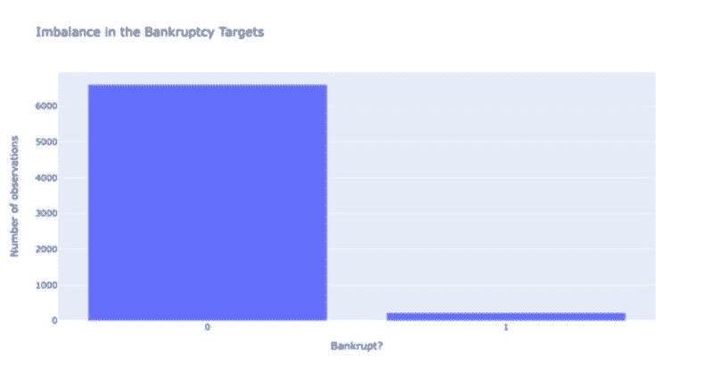
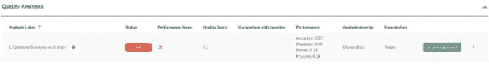
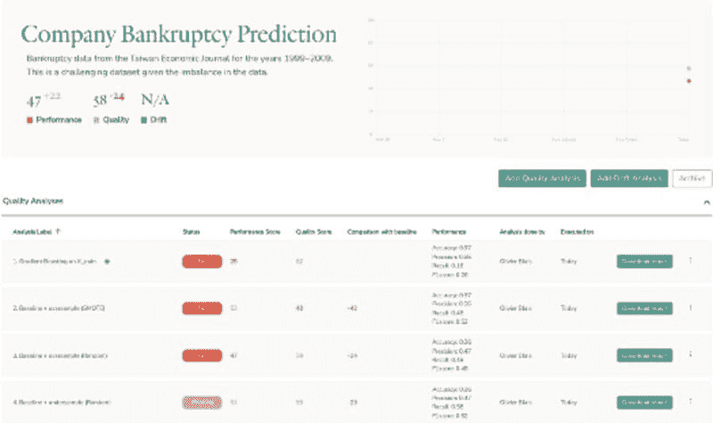
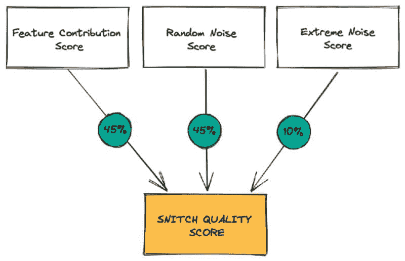

# 一个（更好）的评估机器学习模型的方法

> 原文：[`www.kdnuggets.com/2022/01/much-better-approach-evaluate-machine-learning-model.html`](https://www.kdnuggets.com/2022/01/much-better-approach-evaluate-machine-learning-model.html)

数据科学家像我一样评估机器学习模型使用经典性能指标时，困难重重。

即使有[多种指标和评分方法](https://scikit-learn.org/stable/modules/model_evaluation.html)，理解哪些指标适合我——以及可能许多其他人——面临的问题仍然具有挑战性。这正是我使用 Snitch AI 来评估大多数机器学习模型质量的原因。PS——过去两年我一直积极参与 Snitch AI 的开发。

* * *

## 我们的前三大课程推荐

 1\. [谷歌网络安全证书](https://www.kdnuggets.com/google-cybersecurity) - 快速进入网络安全职业生涯

 2\. [谷歌数据分析专业证书](https://www.kdnuggets.com/google-data-analytics) - 提升你的数据分析能力

 3\. [谷歌 IT 支持专业证书](https://www.kdnuggets.com/google-itsupport) - 支持你的组织的 IT 需求

* * *

[**机器学习模型验证工具 | Snitch AI**](https://snit.ch/?utm_source=blogOlivier&utm_medium=referral&utm_campaign=abetterapproach)

让我通过一个例子来解释为什么选择正确的指标如此重要：生成一个可以使用集中在 UC Irvine 机器学习库中的数据来预测公司破产的模型。数据集被称为[Taiwanese Bankruptcy Prediction](https://archive-beta.ics.uci.edu/ml/datasets/taiwanese+bankruptcy+prediction)（在 CC BY 4.0 许可下），利用了 1999 年至 2009 年台湾经济期刊中的破产数据。

### 问题：不平衡的数据集

你将遇到的第一个问题是数据集的不平衡。这既是好消息也是坏消息。好消息是只有 3.3%的公司破产了！但另一方面，坏消息是数据集的不平衡使得预测“稀有类别”（3.3%）变得更加困难，因为我们的懒惰模型可以通过简单地预测没有破产来为 96.7%的公司预测正确的结果。

作者的目标不平衡评估

你可以看到这也是一个性能评估问题，因为大多数指标对最大类有偏见，最终使它们不准确。为什么？预测没有破产使我们的模型理论上准确度达到 96.7%。这里是 Snitch AI 中第一个建立并评估的模型的示例。该工具默认计算多个相关的性能指标。如下所示，我们的第一个模型准确度为 96%。然而，当你查看 F1 分数时，[一个更适合不平衡类的指标](https://peltarion.com/knowledge-center/documentation/evaluation-view/measure-performance-when-working-with-imbalanced-data)，我的分数勉强达到 26%...

作者提供的初步质量分析图像

那么这是什么情况？

### 不平衡数据集的解决方案

处理不平衡数据时，一个好的做法是在第二步尝试让训练数据集更加平衡。你可以通过以下方式来实现：对多数类（无破产）进行欠采样，通过移除随机观察值，或者对少数类（破产）进行过采样。

对于过采样，你可以选择随机复制观察值或使用经过验证的算法来创建合成观察值，例如 *合成少数类过采样技术（SMOTE）*。SMOTE 通过选择相近的示例，绘制这些示例之间的连线，并在连线上的某一点绘制新样本来工作。

如你所见，我可以使用许多技术来增强我的模型。

使用 Snitch，我可以查看我各种实验的清晰历史记录：

作者提供的多种质量分析图像

这里是我从上述实验中得出的一些结论：

+   欠采样和过采样技术显著提升了 F1 分数。这是件好事！

+   然而，这种性能提升是以我们模型的整体质量为代价的。

+   我们的模型 4（使用欠采样的梯度提升）是最好的模型，因为它的性能几乎与模型 2 一样，但总体质量更佳。

### 等等！这“质量评分”是什么？

Snitch 使用约十几种自动化质量分析来生成这个质量评分。

质量分析产生了：

+   **特征贡献评分：** 检查你的模型预测是否对输入变量的分布有偏或公平。

+   **随机噪声鲁棒性评分：** 检查你的模型是否对噪声数据的引入具有鲁棒性。

+   **极端噪声鲁棒性评分：** 检查你的模型是否对最糟糕情况下的噪声数据引入具有鲁棒性。

来自 [Snitch AI 质量分析方法](https://help.snit.ch/article/19-quality-analysis) 的图像，2021 年。经许可转载

### 性能评估很困难

没有什么好的东西是容易得到的，性能评估也不例外。虽然很难做到正确，性能评估在开发模型时需要认真对待。仅仅因为你的模型有好的准确率，并不意味着它就是一个好的模型。

事实是，准确率可能甚至不是一个相关的性能指标。在我们的案例中，由于数据集不平衡，F1 分数显然更好。这里的教训很简单。确保你验证所选指标是否能准确衡量你想要实现的目标。

尽管性能指标很重要（毕竟是衡量模型预测结果的好坏），但这些指标不能验证数据偏差或模型的整体稳健性。一个好的做法是专门测试其他特性，如偏差和稳健性。

我们看到一些模型在理论上比其他模型表现更好，但实际上质量较差。我们也看到一些表现不佳但质量更好的模型。最终目标是能够比较这些信号，以选择最佳方法。

记住，更好的方法不仅应集中于估计模型的性能，它实际上还需要深入测试，以确保你的系统在实际生产中新数据上能够稳健工作……这就是魔法发生的地方！

**[奥利维耶·布莱斯](https://www.linkedin.com/in/olivierblais/?originalSubdomain=ca)** 是 Moov AI 的联合创始人和决策科学部负责人。他还是加拿大标准委员会的成员，负责定义人工智能解决方案的 ISO 标准，并领导人工智能系统质量评估指南的倡议。

[原文](https://towardsdatascience.com/good-approach-to-evaluate-your-machine-learning-model-e2e1fd6aa6bb)。已获许可转载。

### 更多相关主题

+   [评估 LLMs 的更好方法](https://www.kdnuggets.com/a-better-way-to-evaluate-llms)

+   [构建机器学习模型的结构化方法](https://www.kdnuggets.com/2022/06/structured-approach-building-machine-learning-model.html)

+   [数据科学需要多少数学？](https://www.kdnuggets.com/2020/06/math-data-science.html)

+   [2022 年数据科学家赚多少钱？](https://www.kdnuggets.com/2022/02/much-data-scientists-make-2022.html)

+   [机器学习中的实际特征工程方法](https://www.kdnuggets.com/2023/07/practical-approach-feature-engineering-machine-learning.html)

+   [逐步指南：如何成为数据科学家](https://www.kdnuggets.com/2021/05/guide-become-data-scientist.html)
