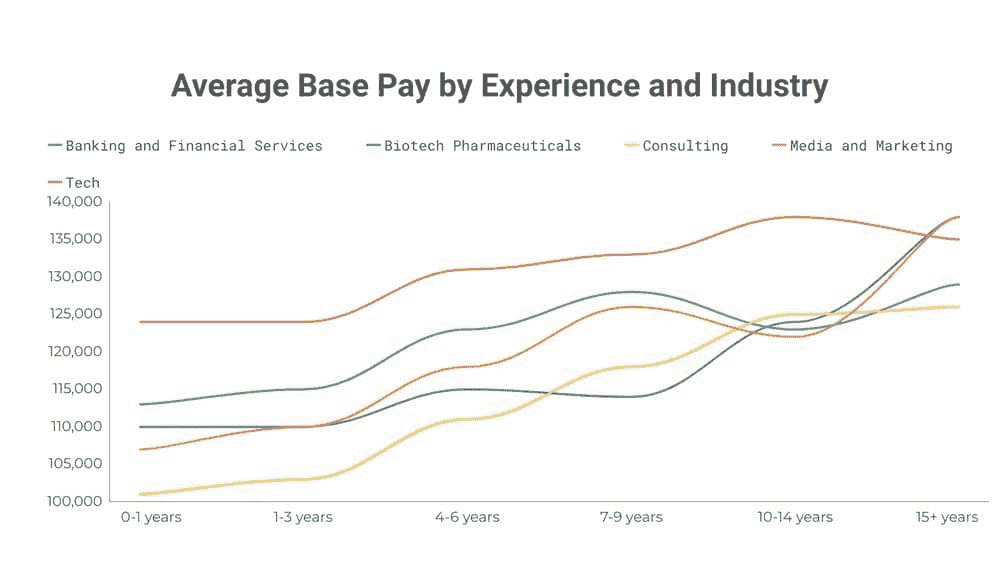
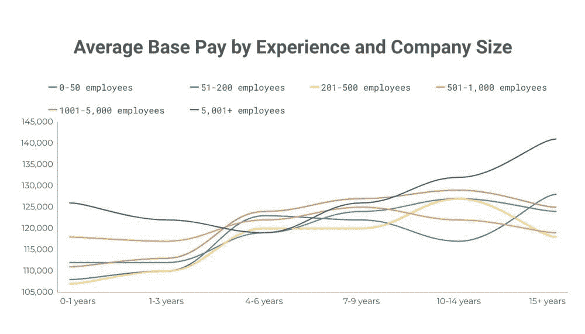
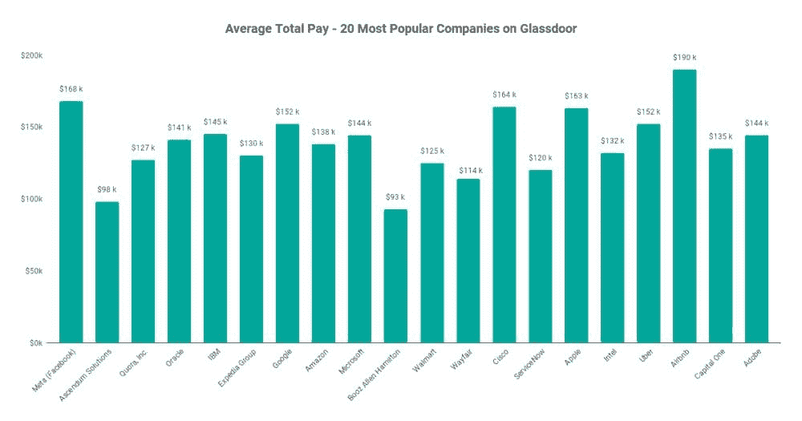
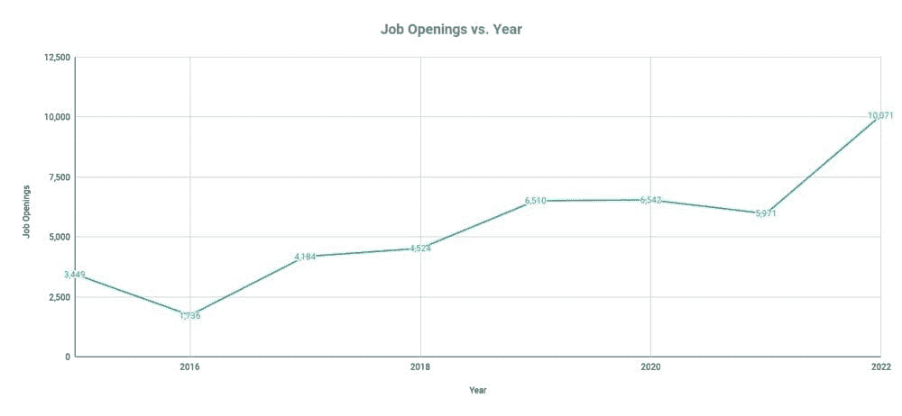

# 2022 年数据科学家的薪资是多少？

> 原文：[`www.kdnuggets.com/2022/02/much-data-scientists-make-2022.html`](https://www.kdnuggets.com/2022/02/much-data-scientists-make-2022.html)

数据科学家在 2021 年仍然需求旺盛。过去几年中世界的重塑，使我们明显变得依赖数据，这是数据科学受欢迎的主要原因。

* * *

## 我们的三大课程推荐

 1\. [Google 网络安全证书](https://www.kdnuggets.com/google-cybersecurity) - 快速开启网络安全职业生涯。

 2\. [Google 数据分析专业证书](https://www.kdnuggets.com/google-data-analytics) - 提升你的数据分析能力

 3\. [Google IT 支持专业证书](https://www.kdnuggets.com/google-itsupport) - 支持你的组织的 IT 系统

* * *

为了吸引顶尖数据科学家，公司们正在激烈竞争，因此使数据科学成为一个高薪职业。薪资有多高，这是我将在这篇文章中尝试回答的问题。

为此，我将向你展示一些关于数据科学家薪资的数据。我不会讲太多，或者说，在这种情况下，是写得太多。我将让数据和图表做大部分讲解。

## 方法论

我相信你已经知道，回答作为数据科学家你能赚多少并不容易。你的薪资依赖于许多因素，如教育水平、职级、技术知识、行业、公司规模、地点和谈判技巧。

在这次分析中，我关注了三个主要因素：

+   职级

+   行业

+   公司规模

所有图表和表格中展示的数据均来自[Glassdoor](https://www.glassdoor.com/Salaries/data-scientist-salary-SRCH_KO0,14.htm)，截至 2022 年 2 月 3 日。

分析将集中在数据科学这一职位上。当然，还有更多[属于数据科学范畴的职位](https://www.stratascratch.com/blog/14-different-data-science-job-titles/?utm_source=blog&utm_medium=click&utm_campaign=kdnuggets)。这些职位包括数据分析师、数据工程师、机器学习工程师等。我将简要概述所有这些职位的一般数据。

但根据职级、行业和公司规模的薪资分析将仅限于数据科学职位。

显示的薪资将是一个平均基本工资。这意味着实际的总补偿会稍高一些。为了了解这有多少，我还准备了一个图表，显示了 Glassdoor 上 20 家最受欢迎公司的平均总补偿。在这里，受欢迎程度意味着提交到网站上的数据科学薪资数量。

所有数据均为美国的数据。

## 数据科学家薪资

根据 Glassdoor 的数据，数据科学家的平均基本薪资为 117,000 美元。让我们看看这个平均薪资如何根据一些因素而变化。

### 数据科学家薪资按经验和行业分类

正如你可能预期的那样，不管行业如何，薪资通常随着数据科学家的经验增加而上升。

薪资最高的自然是在科技行业。数据科学家在这里的薪资在前三年的经验中几乎没有变化。但这些起薪点显著高于其他行业。在每个经验类别中，科技行业的薪资都是最高的。唯一的例外是 15 年及以上的数据。数据显示，这可能是因为科技公司对最有经验的员工的需求远低于其数据科学职位的总数。他们对拥有 0-1 年和 1-3 年经验的数据科学家的需求最高。

银行与金融服务、生物技术与制药、以及媒体与营销排名第二、第三和第四。有趣的是，在所有三个行业中，拥有 10-14 年经验的数据科学员工的薪资下降（数据也支持这一点）显示，这些行业对这些专业人士的需求最少。随后，对经验最丰富的数据科学家的需求显著上升，尤其是在生物技术与制药和媒体与营销领域。如果你是数据科学高管，你将在这些行业中赚取最多。

咨询行业的薪资最低，尤其是对于拥有 0-1 年和 1-3 年经验的人。考虑到薪资上涨，如果你的经验在中间阶段，咨询行业的工作最具优势。但相比其他行业，它的薪资还是最低的。

### 数据科学家薪资按经验和公司规模分类

薪资最高的公司也是规模最大的公司，这一点并不令人惊讶。与其他公司相比，最适合在这类公司工作的时期是你拥有三年或七年以上的经验。如果你在这两个阶段之间，那么在员工较少的其他公司工作，你的薪资会更高。

拥有 501 到 1,000 名员工的公司是经验最少者的第二佳选择。接下来是最小的公司和拥有 1,001 到 5,000 名员工的公司。对于经验最少者而言，最差的选择是拥有 51 到 500 名员工的公司。

如果你有 4-9 年的经验，拥有 1,001 到 5,000 名员工的公司成为最佳选择。经验更丰富时也不差，但对于经验最丰富的员工而言，相对较差。

所有其他公司规模也是如此，只有两个例外：最大型公司和拥有 51-200 名员工的公司。如果你处于高管层，这些公司薪资最高。

### 数据科学家薪资排名前 20 家公司

前两个图表显示，最有经验的数据科学家的最高平均基本工资约为$140k。为了更好地了解你的薪资，这里提供了平均总薪资的概览，这包括基本薪资之外的所有奖金。

在最受欢迎的[数据科学公司](https://www.stratascratch.com/blog/11-best-companies-to-work-for-as-a-data-scientist/?utm_source=blog&utm_medium=click&utm_campaign=kdnuggets)中，薪资最高的是 Airbnb，平均总薪资为$190k。其次是最受欢迎的公司 Meta，薪资为$168k。第三高薪公司是 Cisco（$164k），而 Apple 排名第四，为$163k。

Uber 和 Google 并列第五；它们的平均薪资都是$152k。

虽然这些公司并非仅因为薪资高而受欢迎，但这无疑助长了它们的受欢迎程度。与我上面提到的$140k 相比，这六家公司支付的薪资要高得多。如果你考虑到美国数据科学家的平均薪资是$117k，难怪这些公司如此受欢迎。

### 未来会带来什么？

我提供的数据展示了数据科学家迄今为止的收入。

虽然预测准确的数字是不可能的，但我可以说，只要 2022 年的薪资至少保持不变，这就是一个确定的赌注。

这也可能是一个过于保守的预测。除了 2016 年和 2021 年，Glassdoor 的数据表明，数据科学职位的数量一直在不断上升。2022 年，相比 2021 年已经增长了 70%，而这一年才刚刚开始。

这如何反映在数据科学家的薪资上？如果你查看[这篇 Dice 上的文章](https://insights.dice.com/2021/12/21/data-scientist-engineer-salaries-rise-significantly-driven-by-demand/)，它还[链接了数据科学薪资研究](https://www.burtchworks.com/2021/12/15/2021-salary-increases-for-data-scientists-data-engineers-when-changing-jobs/)，你可以感受到 2022 年薪资将会增长。2021 年数据科学家的平均基本薪资增长了 20%。

根据当前平均基本薪资$117k，它可能增加到$140k。对于经验最少的科学家来说，2022 年在薪资最低的行业中，薪资可能为$120k，而在薪资最高的行业中可达$148k。最有经验的科学家的薪资可能从$151k 到$166k 不等。

请注意，这只是基本薪资。看到职位空缺的增加，我认为这甚至是一个保守的预测。

数据科学家的薪资增长需要努力争取。这适用于每个经验水平，尤其是那些 0-3 年经验的人。数据科学的吸引力也会随着时间的推移增加竞争力。在这个领域，像 [StrataScratch](https://www.stratascratch.com) 这样的平台可能会变得越来越重要，对于那些希望为求职面试做准备并提高[获得数据科学职位的机会](https://www.stratascratch.com/blog/how-to-get-a-data-science-job-the-ultimate-guide/?utm_source=blog&utm_medium=click&utm_campaign=kdnuggets)的人来说尤为如此。

我还推荐查看这篇文章“[数据科学家赚多少钱？](https://www.stratascratch.com/blog/how-much-do-data-scientists-make/?utm_source=blog&utm_medium=click&utm_campaign=kdnuggets)”，了解数据科学领域的薪资以及其受各种因素的影响。

## 概览

下面的概览展示了属于数据科学领域的 14 个职位的平均基础工资。通过这些数据，你可以更全面地了解数据科学中不同职位的薪资水平。

| 无 | 职位名称 | 平均基础薪资（$USD） |
| --- | --- | --- |
| 1 | 数据分析师 | $70k |
| 2 | 数据库管理员 | $84k |
| 3 | 数据建模师 | $94k |
| 4 | 软件工程师 | $108k |
| 5 | 数据工程师 | $112k |
| 6 | 数据架构师 | $119k |
| 7 | 统计学家 | $89k |
| 8 | 商业智能（BI）开发者 | $92k |
| 9 | 营销科学家 | $94k |
| 10 | 商业分析师 | $77k |
| 11 | 定量分析师 | $112k |
| 12 | 数据科学家 | $117k |
| 13 | 计算机与信息研究科学家 | $142k |
| 14 | 机器学习工程师 | $131k |

**[Nate Rosidi](https://www.stratascratch.com)** 是一位数据科学家，专注于产品战略。他还是一名兼职教授，教授分析学，并且是 [StrataScratch](https://www.stratascratch.com/) 的创始人，该平台帮助数据科学家通过真实的面试问题准备面试。他可以通过 [Twitter: StrataScratch](https://twitter.com/StrataScratch) 或 [LinkedIn](https://www.linkedin.com/in/nathanrosidi/) 联系。

### 更多相关话题

+   [数据科学中需要多少数学知识？](https://www.kdnuggets.com/2020/06/math-data-science.html)

+   [评估机器学习模型的（更好）方法](https://www.kdnuggets.com/2022/01/much-better-approach-evaluate-machine-learning-model.html)

+   [2022 年数据科学家应了解的 Python 库](https://www.kdnuggets.com/2022/04/python-libraries-data-scientists-know-2022.html)

+   [KDnuggets 新闻，4 月 13 日：数据科学家应了解的 Python 库…](https://www.kdnuggets.com/2022/n15.html)

+   [2022 年数据科学家招聘的顶级行业和雇主](https://www.kdnuggets.com/2022/06/top-industries-employers-hiring-data-scientists-2022.html)

+   [KDnuggets 新闻 2022 年 3 月 16 日：学习数据科学基础及 5…](https://www.kdnuggets.com/2022/n11.html)
