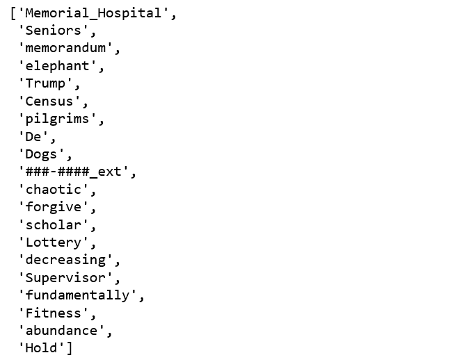
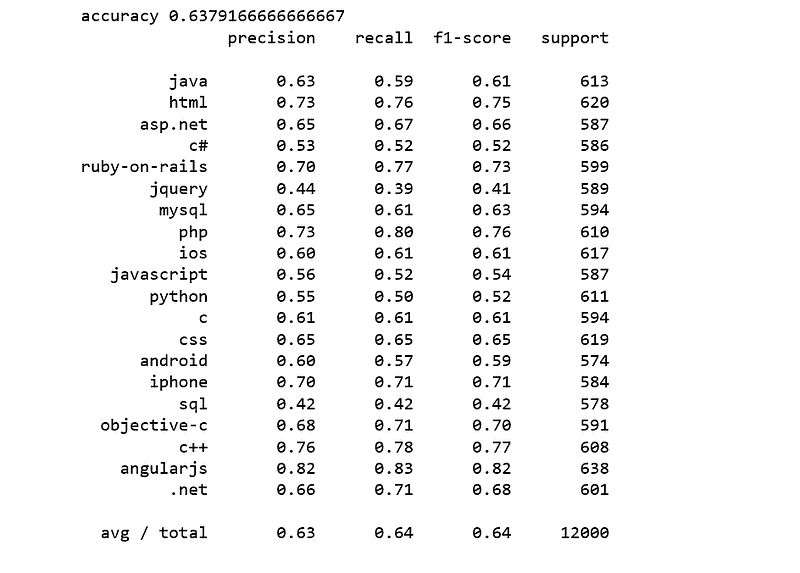
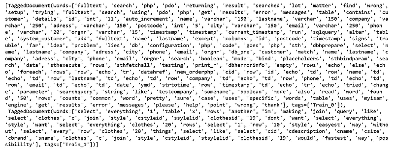
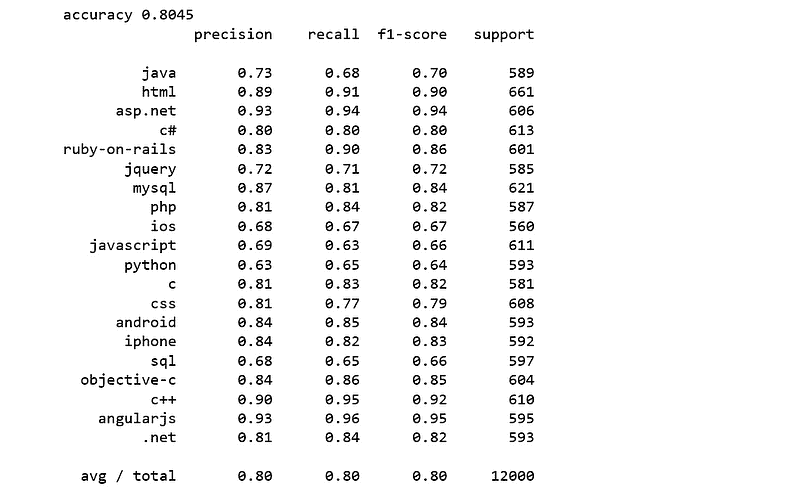
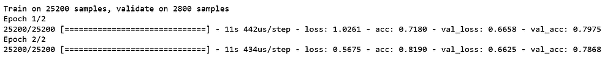

# 多类别文本分类模型比较与选择

> 原文：[`www.kdnuggets.com/2018/11/multi-class-text-classification-model-comparison-selection.html/2`](https://www.kdnuggets.com/2018/11/multi-class-text-classification-model-comparison-selection.html/2)

 评论

### Word2vec 与逻辑回归

[Word2vec](https://en.wikipedia.org/wiki/Word2vec)像[doc2vec](https://medium.com/scaleabout/a-gentle-introduction-to-doc2vec-db3e8c0cce5e)一样，属于文本预处理阶段。具体来说，是将文本转换为一排数字的部分。Word2vec 是一种映射方式，可以使意义相似的词具有相似的向量表示。

Word2vec 背后的想法相当简单：我们希望使用周围的词来表示目标词，通过一个神经网络，其隐藏层编码词表示。

* * *

## 我们的前三名课程推荐

 1\. [Google 网络安全证书](https://www.kdnuggets.com/google-cybersecurity) - 快速进入网络安全职业

 2\. [Google 数据分析专业证书](https://www.kdnuggets.com/google-data-analytics) - 提升你的数据分析技能

 3\. [Google IT 支持专业证书](https://www.kdnuggets.com/google-itsupport) - 支持你在 IT 领域的工作

* * *

首先我们加载一个 word2vec 模型。该模型由 Google 在[1000 亿字的 Google 新闻语料库](https://drive.google.com/file/d/0B7XkCwpI5KDYNlNUTTlSS21pQmM/edit)上进行预训练。

```py
from gensim.models import Word2Vec

wv = gensim.models.KeyedVectors.load_word2vec_format("GoogleNews-vectors-negative300.bin.gz", binary=True)
wv.init_sims(replace=True)
```

我们可能想要探索一些词汇。

```py
from itertools import islice
list(islice(wv.vocab, 13030, 13050))
```



图 9

基于 BOW 的方法包括平均、求和、加权相加。常见的方法是对两个词向量取平均。因此，我们将遵循最常见的方法。

我们将对文本进行分词，并将分词应用于“post”列，然后对分词后的文本应用词向量平均。

现在是时候看看逻辑回归分类器在这些词平均文档特征上的表现了。

```py
from sklearn.linear_model import LogisticRegression
logreg = LogisticRegression(n_jobs=1, C=1e5)
logreg = logreg.fit(X_train_word_average, train['tags'])
y_pred = logreg.predict(X_test_word_average)
print('accuracy %s' % accuracy_score(y_pred, test.tags))
print(classification_report(test.tags, y_pred,target_names=my_tags))
```



图 10

这让人失望，是我们迄今为止见过的最糟糕的。

### **Doc2vec 与逻辑回归**

[word2vec](https://en.wikipedia.org/wiki/Word2vec)的相同思想可以扩展到文档中，在这里我们学习的是句子或文档的特征表示，而不是词。要对[word2vec](https://en.wikipedia.org/wiki/Word2vec)有一个大致了解，可以将其视为文档中所有词向量表示的数学平均值。[Doc2Vec](https://medium.com/scaleabout/a-gentle-introduction-to-doc2vec-db3e8c0cce5e)扩展了[word2vec](https://en.wikipedia.org/wiki/Word2vec)的思想，然而词语只能捕捉到一定程度，有时我们需要的是文档之间的关系，而不仅仅是词。

对于我们的 Stack Overflow 问题和标签数据，训练 doc2vec 模型的方法与训练[多类别文本分类与 Doc2vec 和逻辑回归](https://towardsdatascience.com/multi-class-text-classification-with-doc2vec-logistic-regression-9da9947b43f4)时非常相似。

首先，我们对句子进行标记。[Gensim 的 Doc2Vec](https://radimrehurek.com/gensim/models/doc2vec.html)实现要求每个文档/段落都必须有一个相关联的标签，我们通过使用`TaggedDocument`方法来实现。格式将为“TRAIN_i”或“TEST_i”，其中“i”是帖子的虚拟索引。

根据[Gensim doc2vec 教程](https://github.com/RaRe-Technologies/gensim/blob/ca0dcaa1eca8b1764f6456adac5719309e0d8e6d/docs/notebooks/doc2vec-IMDB.ipynb)，其 doc2vec 类是在整个数据集上训练的，我们也将进行相同的操作。让我们看看标记文档的样子：

```py
all_data[:2]
```



图 11

在训练 doc2vec 时，我们将调整以下参数：

+   `dm=0`，使用分布式词袋（DBOW）。

+   `vector_size=300`，300 维的特征向量。

+   `negative=5`，指定应该抽取多少个“噪声词”。

+   `min_count=1`，忽略所有总频率低于此的词。

+   `alpha=0.065`，初始学习率。

我们初始化模型并训练 30 个 epoch。

接下来，我们从训练好的 doc2vec 模型中获取向量。

最后，我们得到一个由 doc2vec 特征训练的逻辑回归模型。

```py
logreg = LogisticRegression(n_jobs=1, C=1e5)
logreg.fit(train_vectors_dbow, y_train)
logreg = logreg.fit(train_vectors_dbow, y_train)
y_pred = logreg.predict(test_vectors_dbow)
print('accuracy %s' % accuracy_score(y_pred, y_test))
print(classification_report(y_test, y_pred,target_names=my_tags))
```



图 12

我们获得了 80%的准确率，比 SVM 高出 1%。

### 使用 Keras 的 BOW

最后，我们将使用[Keras](https://keras.io/)进行文本分类，Keras 是一个 Python 深度学习库。

以下代码大部分来自于[Google 工作坊](https://github.com/tensorflow/workshops/blob/master/extras/keras-bag-of-words/keras-bow-model.ipynb)。过程如下：

+   将数据分成训练集和测试集。

+   使用`tokenizer`方法来计算我们词汇中的唯一词，并将每个词分配到索引。

+   调用`fit_on_texts()`会自动创建我们的词汇的词索引查找。

+   我们通过向分词器传递`num_words`参数来限制我们的词汇为前几个词。

+   使用我们的分词器，我们现在可以使用 `texts_to_matrix` 方法来创建训练数据，然后传递给我们的模型。

+   我们向模型输入一个 one-hot 向量。

+   在我们将特征和标签转换为 Keras 可以读取的格式后，我们就准备好构建文本分类模型了。

+   当我们构建模型时，我们只需要告诉 Keras 输入数据的形状、输出数据的形状和每层的类型。Keras 会处理其余的部分。

+   在训练模型时，我们会调用 `fit()` 方法，传入训练数据和标签、批量大小和训练轮数。



图 13

准确率是：

```py
score = model.evaluate(x_test, y_test,
                       batch_size=batch_size, verbose=1)
print('Test accuracy:', score[1])
```


图 14

那么，哪个模型最适合这个特定的数据集呢？我会留给你去决定。

[Jupyter notebook](https://github.com/susanli2016/NLP-with-Python/blob/master/Text%20Classification%20model%20selection.ipynb) 可以在 [Github](https://github.com/susanli2016/NLP-with-Python/blob/master/Text%20Classification%20model%20selection.ipynb) 上找到。祝您一天愉快！

**参考文献：**

+   [`github.com/RaRe-Technologies/movie-plots-by-genre/blob/master/ipynb_with_output/Document%20classification%20with%20word%20embeddings%20tutorial%20-%20with%20output.ipynb`](https://github.com/RaRe-Technologies/movie-plots-by-genre/blob/master/ipynb_with_output/Document%20classification%20with%20word%20embeddings%20tutorial%20-%20with%20output.ipynb)

+   [`github.com/tensorflow/workshops/blob/master/extras/keras-bag-of-words/keras-bow-model.ipynb`](https://github.com/tensorflow/workshops/blob/master/extras/keras-bag-of-words/keras-bow-model.ipynb)

+   [`datascience.stackexchange.com/questions/20076/word2vec-vs-sentence2vec-vs-doc2vec`](https://datascience.stackexchange.com/questions/20076/word2vec-vs-sentence2vec-vs-doc2vec)

**简介：[Susan Li](https://www.linkedin.com/in/susanli/)** 正在以一篇文章改变世界。她是一位高级数据科学家，工作地点在加拿大多伦多。

[原文](https://towardsdatascience.com/multi-class-text-classification-model-comparison-and-selection-5eb066197568)。经许可转载。

**相关内容：**

+   使用 SpaCy 进行文本分类的机器学习

+   使用 Scikit-Learn 的多分类文本分类

+   使用 Scikit-Learn 进行命名实体识别和分类

### 更多相关话题

+   [Python 和 R 中的机器学习算法比较](https://www.kdnuggets.com/2023/06/machine-learning-algorithms-python-r.html)

+   [线性回归模型选择：平衡简洁性和复杂性](https://www.kdnuggets.com/2023/02/linear-regression-model-selection-balancing-simplicity-complexity.html)

+   [什么是文本分类？](https://www.kdnuggets.com/2022/07/text-classification.html)

+   [您文本分类任务的最佳架构：基准测试…](https://www.kdnuggets.com/2023/04/best-architecture-text-classification-task-benchmarking-options.html)

+   [ChatGPT 与 Google Bard：技术差异比较](https://www.kdnuggets.com/2023/03/chatgpt-google-bard-comparison-technical-differences.html)

+   [深入探讨 GPT 模型：演变与性能比较](https://www.kdnuggets.com/2023/05/deep-dive-gpt-models.html)
