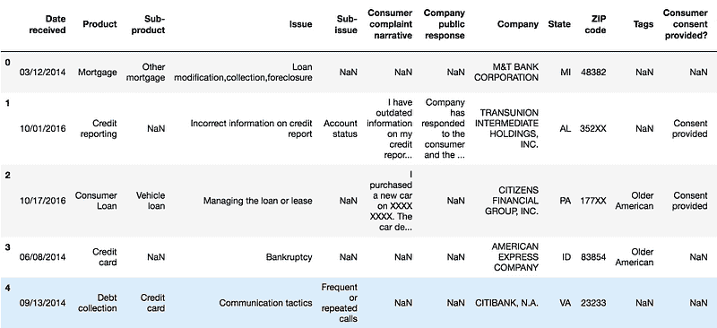
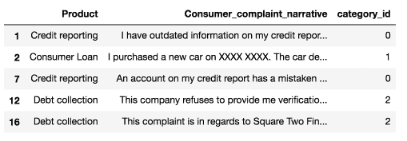
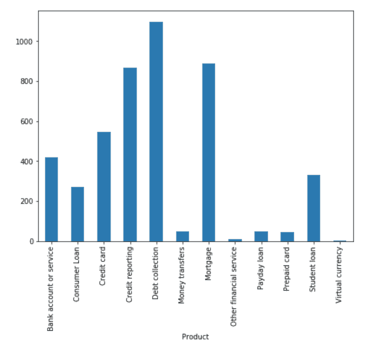
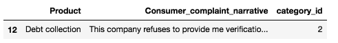
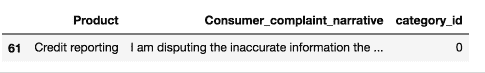
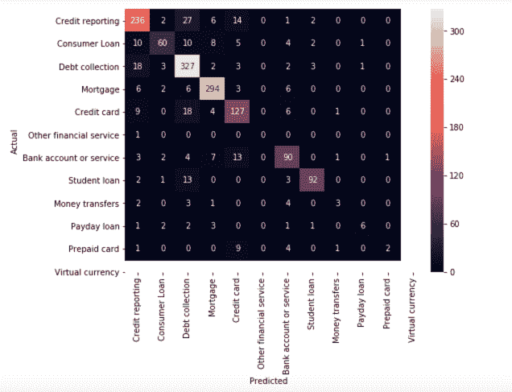
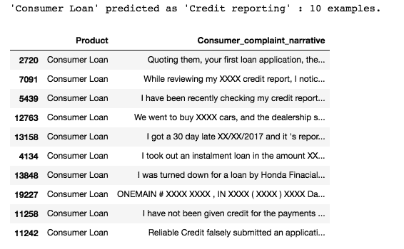
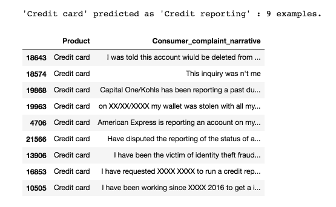
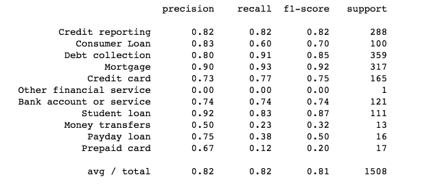

# 使用 Scikit-Learn 的多类别文本分类

> 原文：[`www.kdnuggets.com/2018/08/multi-class-text-classification-scikit-learn.html`](https://www.kdnuggets.com/2018/08/multi-class-text-classification-scikit-learn.html)

 评论

**由 [Susan Li](https://www.linkedin.com/in/susanli/), 高级数据科学家**


* * *

## 我们的前三个课程推荐

 1\. [Google 网络安全证书](https://www.kdnuggets.com/google-cybersecurity) - 快速进入网络安全职业。

 2\. [Google 数据分析专业证书](https://www.kdnuggets.com/google-data-analytics) - 提升你的数据分析技能

 3\. [Google IT 支持专业证书](https://www.kdnuggets.com/google-itsupport) - 支持组织的 IT

* * *

文本分类在商业世界中有许多应用。例如，新闻报道通常按主题组织；内容或产品通常按类别标记；用户可以根据他们在线谈论产品或品牌的方式被分类到不同的群体中...

然而，互联网上绝大多数的文本分类文章和教程都是二分类文本分类，例如电子邮件垃圾过滤（垃圾邮件与正常邮件）、情感分析（积极与消极）。在大多数情况下，我们现实中的问题要复杂得多。因此，这就是我们今天要做的事情：将消费者金融投诉分类为 12 个预定义类别。数据可以从[data.gov](https://catalog.data.gov/dataset/consumer-complaint-database)下载。

我们使用 [Python](https://www.python.org/) 和 [Jupyter Notebook](http://jupyter.org/) 来开发我们的系统，依靠 [Scikit-Learn](http://scikit-learn.org/stable/) 进行机器学习组件。如果你想查看 [PySpark](https://spark.apache.org/docs/0.9.0/mllib-guide.html)的实现，可以阅读 [下一篇文章](https://medium.com/@actsusanli/multi-class-text-classification-with-pyspark-7d78d022ed35)。

### 问题制定

这个问题是监督文本分类问题，我们的目标是研究哪些监督机器学习方法最适合解决这个问题。

假设有一个新的投诉进来，我们希望将其分配到 12 个类别中的一个。分类器假设每个新的投诉被分配到一个且只有一个类别。这是一个多类别文本分类问题。我迫不及待想看看我们能取得什么成果！

### 数据探索

在深入训练机器学习模型之前，我们应该先查看一些示例以及每个类别中的投诉数量：

```py
import pandas as pd
df = pd.read_csv('Consumer_Complaints.csv')
df.head()
```



图 1

对于这个项目，我们只需要两列——“产品”和“消费者投诉叙述”。

**输入**：Consumer_complaint_narrative

示例：“我在我的信用报告上有过时的信息，我之前已提出异议，这些信息尚未被删除，这些信息超过七年且不符合信用报告要求”

**输出**：产品

示例：信用报告

我们将删除“消费者投诉叙述”列中的缺失值，并添加一个将产品编码为整数的列，因为分类变量通常用整数比用字符串表示更好。

我们还创建了几个字典以备将来使用。

清理之后，这是我们将要处理的数据的前五行：

```py
from io import StringIO

col = ['Product', 'Consumer complaint narrative']
df = df[col]
df = df[pd.notnull(df['Consumer complaint narrative'])]

df.columns = ['Product', 'Consumer_complaint_narrative']

df['category_id'] = df['Product'].factorize()[0]
category_id_df = df[['Product', 'category_id']].drop_duplicates().sort_values('category_id')
category_to_id = dict(category_id_df.values)
id_to_category = dict(category_id_df[['category_id', 'Product']].values)
df.head()
```



图 2

### 不平衡类

我们看到每个产品的投诉数量不平衡。消费者的投诉更倾向于债务催收、信用报告和抵押贷款。

```py
import matplotlib.pyplot as plt
fig = plt.figure(figsize=(8,6))
df.groupby('Product').Consumer_complaint_narrative.count().plot.bar(ylim=0)
plt.show()
```



图 3

当我们遇到这种问题时，使用标准算法往往会有困难。传统算法往往偏向于主要类别，而不考虑数据分布。在最坏的情况下，少数类别会被视为异常值并被忽略。对于一些情况，如欺诈检测或癌症预测，我们需要仔细配置模型或人工平衡数据集，例如通过[欠采样或过采样](https://en.wikipedia.org/wiki/Oversampling_and_undersampling_in_data_analysis)每个类别。

然而，在我们学习不平衡数据的情况下，主要类别可能是我们非常感兴趣的。希望有一个分类器能够对主要类别提供高预测准确度，同时对少数类别保持合理的准确度。因此，我们将保持原样。

### 文本表示

分类器和学习算法不能直接处理原始文本文档，因为它们大多数期望固定大小的数值特征向量，而不是具有可变长度的原始文本文档。因此，在预处理步骤中，文本会被转换为更易于处理的表示。

从文本中提取特征的一种常见方法是使用词袋模型：在该模型中，对于每个文档（在我们这里是投诉叙述），考虑的是词的出现（通常还有频率），但忽略它们出现的顺序。

具体来说，对于数据集中每个术语，我们将计算一个叫做词频-逆文档频率的度量，简称 tf-idf。我们将使用`sklearn.feature_extraction.text.TfidfVectorizer`为每个消费者投诉叙述计算`tf-idf`向量：

+   `sublinear_df`设置为`True`以使用频率的对数形式。

+   `min_df`是词必须出现在的最小文档数量，以便保留。

+   `norm` 设置为 `l2`，以确保我们所有的特征向量都有一个欧几里得范数为 1。

+   `ngram_range` 设置为 `(1, 2)` 以表示我们希望同时考虑单词和双词组合。

+   `stop_words` 设置为 `"english"` 以去除所有常见代词（`"a"`、`"the"` 等），以减少噪声特征的数量。

```py
from sklearn.feature_extraction.text import TfidfVectorizer

tfidf = TfidfVectorizer(sublinear_tf=True, min_df=5, norm='l2', encoding='latin-1', ngram_range=(1, 2), stop_words='english')

features = tfidf.fit_transform(df.Consumer_complaint_narrative).toarray()
labels = df.category_id
features.shape
```

`(4569, 12633)`

现在，每个 4569 个消费者投诉叙述由 12633 个特征表示，表示不同单词和双词组合的 tf-idf 分数。

我们可以使用 `sklearn.feature_selection.chi2` 来找到与每个产品最相关的术语：

```py
from sklearn.feature_selection import chi2
import numpy as np

N = 2
for Product, category_id in sorted(category_to_id.items()):
  features_chi2 = chi2(features, labels == category_id)
  indices = np.argsort(features_chi2[0])
  feature_names = np.array(tfidf.get_feature_names())[indices]
  unigrams = [v for v in feature_names if len(v.split(' ')) == 1]
  bigrams = [v for v in feature_names if len(v.split(' ')) == 2]
  print("# '{}':".format(Product))
  print("  . Most correlated unigrams:\n. {}".format('\n. '.join(unigrams[-N:])))
  print("  . Most correlated bigrams:\n. {}".format('\n. '.join(bigrams[-N:])))
```

# '**银行账户或服务**':

最相关的单词：

+   银行

+   透支

最相关的双词组合：

+   透支费用

+   活期账户

# '**消费贷款**':

最相关的单词：

+   汽车

+   车辆

最相关的双词组合：

+   车辆 xxxx

+   丰田金融

# '**信用卡**':

最相关的单词：

+   花旗

+   卡

最相关的双词组合：

+   年费

+   信用卡

# '**信用报告**':

最相关的单词：

+   Experian

+   Equifax

最相关的双词组合：

+   TransUnion

+   信用报告

# '**债务催收**':

最相关的单词：

+   讨债

+   债务

最相关的双词组合：

+   收债

+   讨债机构

# '**汇款**':

最相关的单词：

+   吴

+   PayPal

最相关的双词组合：

+   西联汇款

+   汇款

# '**按揭**':

最相关的单词：

+   修改

+   抵押贷款

最相关的双词组合：

+   抵押贷款公司

+   贷款修改

# '**其他金融服务**':

最相关的单词：

+   牙科

+   护照

最相关的双词组合：

+   帮助支付

+   声明支付

# '**发薪日贷款**':

最相关的单词：

+   借款

+   发薪日

最相关的双词组合：

+   大致情况

+   发薪日贷款

# '**预付卡**':

最相关的单词：

+   服务

+   预付

最相关的双词组合：

+   获取资金

+   预付卡

# '**学生贷款**':

最相关的单词：

+   学生

+   Navient

最相关的双词组合：

+   学生贷款

+   学生贷款

# '**虚拟货币**':

最相关的单词：

+   处理

+   https

最相关的双词组合：

+   xxxx 服务提供商

+   资金需求

这些都很有道理，不是吗？

**多类别分类器：特征与设计**

+   为了训练监督分类器，我们首先将“消费者投诉叙述”转换为数字向量。我们探索了诸如 TF-IDF 加权向量等向量表示。

+   在获得文本的向量表示后，我们可以训练监督分类器，以训练未见的“消费者投诉叙述”并预测它们属于哪个“产品”。

在完成上述所有数据转换后，现在我们已经拥有了所有特征和标签，是时候训练分类器了。对于这种类型的问题，我们可以使用多种算法。

**朴素贝叶斯分类器**：最适合词频统计的是多项式变体：

```py
from sklearn.model_selection import train_test_split
from sklearn.feature_extraction.text import CountVectorizer
from sklearn.feature_extraction.text import TfidfTransformer
from sklearn.naive_bayes import MultinomialNB

X_train, X_test, y_train, y_test = train_test_split(df['Consumer_complaint_narrative'], df['Product'], random_state = 0)
count_vect = CountVectorizer()
X_train_counts = count_vect.fit_transform(X_train)
tfidf_transformer = TfidfTransformer()
X_train_tfidf = tfidf_transformer.fit_transform(X_train_counts)

clf = MultinomialNB().fit(X_train_tfidf, y_train)
```

在拟合训练集之后，让我们做一些预测。

```py
print(clf.predict(count_vect.transform(["This company refuses to provide me verification and validation of debt per my right under the FDCPA. I do not believe this debt is mine."])))
```

`[‘债务催收’]`

```py
df[df['Consumer_complaint_narrative'] == "This company refuses to provide me verification and validation of debt per my right under the FDCPA. I do not believe this debt is mine."]
```



图 4

```py
print(clf.predict(count_vect.transform(["I am disputing the inaccurate information the Chex-Systems has on my credit report. I initially submitted a police report on XXXX/XXXX/16 and Chex Systems only deleted the items that I mentioned in the letter and not all the items that were actually listed on the police report. In other words they wanted me to say word for word to them what items were fraudulent. The total disregard of the police report and what accounts that it states that are fraudulent. If they just had paid a little closer attention to the police report I would not been in this position now and they would n't have to research once again. I would like the reported information to be removed : XXXX XXXX XXXX"])))
```

`[‘信用报告’]`

```py
df[df['Consumer_complaint_narrative'] == "I am disputing the inaccurate information the Chex-Systems has on my credit report. I initially submitted a police report on XXXX/XXXX/16 and Chex Systems only deleted the items that I mentioned in the letter and not all the items that were actually listed on the police report. In other words they wanted me to say word for word to them what items were fraudulent. The total disregard of the police report and what accounts that it states that are fraudulent. If they just had paid a little closer attention to the police report I would not been in this position now and they would n't have to research once again. I would like the reported information to be removed : XXXX XXXX XXXX"]
```



图 5

不错哦！

### 模型选择

我们现在准备实验不同的机器学习模型，评估它们的准确性，并找到潜在问题的来源。

我们将对以下四个模型进行基准测试：

+   Logistic Regression

+   （Multinomial）朴素贝叶斯

+   线性支持向量机

+   随机森林

```py
from sklearn.linear_model import LogisticRegression
from sklearn.ensemble import RandomForestClassifier
from sklearn.svm import LinearSVC
from sklearn.model_selection import cross_val_score

models = [
    RandomForestClassifier(n_estimators=200, max_depth=3, random_state=0),
    LinearSVC(),
    MultinomialNB(),
    LogisticRegression(random_state=0),
]
CV = 5
cv_df = pd.DataFrame(index=range(CV * len(models)))
entries = []
for model in models:
  model_name = model.__class__.__name__
  accuracies = cross_val_score(model, features, labels, scoring='accuracy', cv=CV)
  for fold_idx, accuracy in enumerate(accuracies):
    entries.append((model_name, fold_idx, accuracy))
cv_df = pd.DataFrame(entries, columns=['model_name', 'fold_idx', 'accuracy'])

import seaborn as sns

sns.boxplot(x='model_name', y='accuracy', data=cv_df)
sns.stripplot(x='model_name', y='accuracy', data=cv_df, 
              size=8, jitter=True, edgecolor="gray", linewidth=2)
plt.show()
```


图 6

```py
cv_df.groupby('model_name').accuracy.mean()
```

model_name

**LinearSVC:** 0.822890

**LogisticRegression:** 0.792927

**MultinomialNB:** 0.688519

**RandomForestClassifier:** 0.443826

名称：accuracy，dtype：float64

LinearSVC 和 Logistic Regression 比其他两个分类器表现更好，其中 LinearSVC 具有略微的优势，中位数准确率约为 82%。

### 模型评估

继续使用我们最好的模型（LinearSVC），我们将查看混淆矩阵，并展示预测标签与实际标签之间的差异。

```py
model = LinearSVC()

X_train, X_test, y_train, y_test, indices_train, indices_test = train_test_split(features, labels, df.index, test_size=0.33, random_state=0)
model.fit(X_train, y_train)
y_pred = model.predict(X_test)

from sklearn.metrics import confusion_matrix

conf_mat = confusion_matrix(y_test, y_pred)
fig, ax = plt.subplots(figsize=(10,10))
sns.heatmap(conf_mat, annot=True, fmt='d',
            xticklabels=category_id_df.Product.values, yticklabels=category_id_df.Product.values)
plt.ylabel('Actual')
plt.xlabel('Predicted')
plt.show()
```



图 7

大多数预测结果都落在对角线（预测标签 = 实际标签）上，这是我们期望的。然而，也存在一些误分类，了解这些误分类的原因可能会很有趣：

```py
from IPython.display import display
```

```py
for predicted in category_id_df.category_id:
  for actual in category_id_df.category_id:
    if predicted != actual and conf_mat[actual, predicted] >= 10:
      print("'{}' predicted as '{}' : {} examples.".format(id_to_category[actual], id_to_category[predicted], conf_mat[actual, predicted]))
      display(df.loc[indices_test[(y_test == actual) & (y_pred == predicted)]][['Product', 'Consumer_complaint_narrative']])
      print('')
```



图 8 

图 9

如你所见，一些误分类的投诉涉及多个主题（例如，涉及信用卡和信用报告的投诉）。这种错误将始终发生。

我们再次使用[卡方检验](https://en.wikipedia.org/wiki/Pearson%27s_chi-squared_test)来找出与各类别相关性最高的术语：

```py
model.fit(features, labels)

N = 2
for Product, category_id in sorted(category_to_id.items()):
  indices = np.argsort(model.coef_[category_id])
  feature_names = np.array(tfidf.get_feature_names())[indices]
  unigrams = [v for v in reversed(feature_names) if len(v.split(' ')) == 1][:N]
  bigrams = [v for v in reversed(feature_names) if len(v.split(' ')) == 2][:N]
  print("# '{}':".format(Product))
  print("  . Top unigrams:\n       . {}".format('\n       . '.join(unigrams)))
  print("  . Top bigrams:\n       . {}".format('\n       . '.join(bigrams)))
```

# ‘**银行账户或服务**’：

顶级单词组：

+   bank

+   account

顶级双词组：

+   debit card

+   overdraft fees

# ‘**消费者贷款**’：

顶级单词组：

+   vehicle

+   car

顶级双词组：

+   personal loan

+   history xxxx

# ‘**信用卡**’：

顶级单词组：

+   card

+   discover

顶级双词组：

+   credit card

+   discover card

# ‘**信用报告**’：

顶级单词组：

+   equifax

+   transunion

顶级双词组：

+   xxxx account

+   trans union

# ‘**债务催收**’：

顶级单词组：

+   debt

+   collection

顶级双词组：

+   account credit

+   time provided

# ‘**资金转移**’：

顶级单词组：

+   paypal

+   transfer

顶级双词组：

+   money transfer

+   send money

# ‘**按揭**’：

顶级单词组：

+   mortgage

+   escrow

顶级双词组：

+   loan modification

+   mortgage company

# ‘**其他金融服务**’：

顶级单词组：

+   passport

+   dental

顶级双词组：

+   stated pay

+   help pay

# ‘**发薪日贷款**’：

顶级单词组：

+   payday

+   loan

顶级双词组：

+   payday loan

+   pay day

# ‘**预付卡**’：

顶级单词组：

+   prepaid

+   serve

顶级双词组：

+   预付卡

+   use card

# ‘**学生贷款**’：

顶级单词组：

+   navient

+   loans

顶级双词组：

+   student loan

+   sallie mae

# ‘**虚拟货币**’：

顶级单词组：

+   https

+   tx

顶级双词组：

+   money want

+   xxxx provider

它们在我们的预期范围内保持一致。

最后，我们打印出每个类别的分类报告：

```py
from sklearn import metrics
print(metrics.classification_report(y_test, y_pred, target_names=df['Product'].unique()))
```



图 9

源代码可以在[Github](https://github.com/susanli2016/Machine-Learning-with-Python/blob/master/Consumer_complaints.ipynb)找到。期待收到您的反馈或问题。

**简介：[Susan Li](https://www.linkedin.com/in/susanli/)** 正在通过一篇文章改变世界。她是一位位于加拿大多伦多的高级数据科学家。

[原文](https://towardsdatascience.com/multi-class-text-classification-with-scikit-learn-12f1e60e0a9f)。已获得许可重新发布。

**相关：**

+   使用 LSTMs、CNNs 和预训练词向量进行文本分类与嵌入可视化

+   TF-IDF 是什么？

+   自然语言处理要点：入门 NLP

### 更多相关话题

+   [什么是文本分类？](https://www.kdnuggets.com/2022/07/text-classification.html)

+   [适合您文本分类任务的最佳架构：基准测试选项](https://www.kdnuggets.com/2023/04/best-architecture-text-classification-task-benchmarking-options.html)

+   [分类问题的更多性能评估指标](https://www.kdnuggets.com/2020/04/performance-evaluation-metrics-classification.html)

+   [使用 PyCaret 进行二分类介绍](https://www.kdnuggets.com/2021/12/introduction-binary-classification-pycaret.html)

+   [使用 HuggingFace 微调 BERT 进行推文分类](https://www.kdnuggets.com/2022/01/finetuning-bert-tweets-classification-ft-hugging-face.html)

+   [分类的机器学习算法](https://www.kdnuggets.com/2022/03/machine-learning-algorithms-classification.html)
