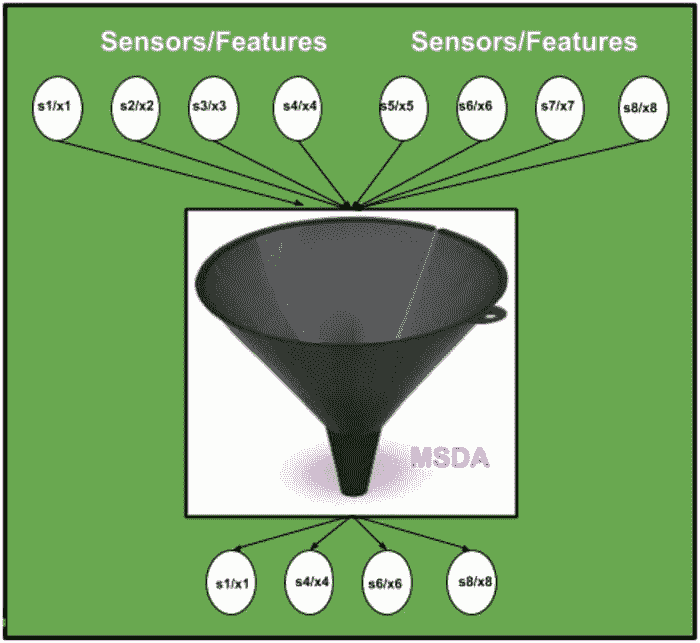
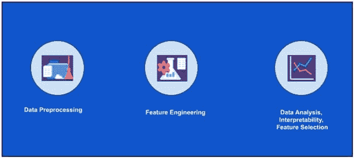
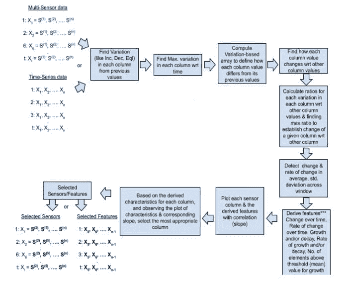

# 多维多传感器时间序列数据分析框架

> 原文：[`www.kdnuggets.com/2021/02/multidimensional-multi-sensor-time-series-data-analysis-framework.html`](https://www.kdnuggets.com/2021/02/multidimensional-multi-sensor-time-series-data-analysis-framework.html)

评论

**由 [Ajay Arunachalam](https://www.linkedin.com/in/ajay-arunachalam-4744581a/)，厄勒布大学**

你好，朋友们。在这篇博客文章中，我将向你介绍我的包“[msda](https://pypi.org/project/msda/)”，它对时间序列传感器数据分析非常有用。还提供了关于时间序列数据的简要介绍。演示笔记本可以在[这里](https://github.com/ajayarunachalam/msda)找到。

使用该包进行**“无监督特征选择”**的特定应用案例可以在博客文章[这里](https://ajay-arunachalam08.medium.com/multi-dimensional-time-series-data-analysis-unsupervised-feature-selection-with-msda-package-430900a3829a)中找到。

### 什么是时间序列数据？

时间序列数据是指在特定时间段内收集的信息。例如，一组在特定等间隔下观察到的传感器数据，每个传感器都可以被归类为时间序列。如果数据是无时间顺序或一次性收集的，那就不是时间序列数据。

时间序列数据有两种类型：

**1- 存货系列**（在特定时间点的属性度量）

**2- 流量系列**（在时间间隔内的活动度量）

### 时间序列数据的组成部分

要分析时间序列数据，我们需要了解不同的模式类型。这些模式将共同创建时间序列上的观察集合。

**1) 趋势：** 时间序列中存在的长期模式。它表示从时间序列中过滤出的低、中、高频率的变化。

如果时间序列数据中没有上升或下降模式，则视为**平稳**的均值。

有两种趋势模式：

+   **确定性：** 在这种情况下，时间序列中的冲击效应被消除。

+   **随机：** 这是一个过程，在其中，冲击效应永远不会被消除，因为它们永久改变了时间序列的水平。

**2) 循环：** 模式表现为围绕指定趋势的上下波动。时间周期不固定，通常由至少 2 个月的时间组成。

**3) 季节性：** 反映规律性波动的模式。这些短期波动由于季节性和个人习惯因素而发生。数据面临定期和可预测的变化，这些变化发生在日历的规律间隔上。它总是包含固定且已知的周期。

季节性主要来源：

+   气候

+   机构

+   社会习惯和实践

+   日历等。

**模型**用于在时间序列中创建季节性成分：

+   **加法模型**——这是一个将季节性成分与趋势成分相加的模型。

+   **乘法** **模型**— 在此模型中，如果时间序列中没有趋势成分，则季节成分与截距相乘。

**4) 不规则：** 这是时间序列中不可预测的成分。

### 时间序列数据 vs 横截面数据

时间序列数据由在特定时间间隔收集的单一变量的数据组成。另一方面，横截面数据由在特定时间间隔从不同来源收集的多个变量的数据组成。公司股票市场数据在一年中的定期收集是时间序列数据的一个例子。但当公司销售收入、销售量在过去三个月内收集时，则作为横截面数据的例子。时间序列数据主要用于在较长时间内获取结果，而横截面数据则集中在特定时间点从调查中获得的信息。

### 什么是时间序列分析？

分析的目的是理解时间序列产生的结构和功能。

用于分析时间序列数据的两种方法是 -

+   在时域中

+   在频域中

时间序列分析主要用于 -

+   分解时间序列

+   识别和建模基于时间的依赖关系

+   预测

+   识别和建模系统变异

### 时间序列分析的需求

为了成功建模，时间序列在机器学习和深度学习中非常重要。时间序列分析用于理解用于生成观察结果的内部结构和功能。时间序列分析用于 -

+   **描述 — **识别相关数据中的模式。换句话说，识别时间序列中的趋势和季节性的变化。

+   **解释 — **进行数据的理解和建模。

+   **预测 — **对短期趋势进行从先前观察中得出的预测。

+   **发明分析 — **分析时间序列数据中任何事件产生的效果。

+   **质量控制 — **当特定尺寸偏离时，会提供警报。

### 时间序列分析的应用


时间序列应用领域示例

现在，我们已经了解了时间序列的基础知识，让我们深入探讨 MSDA 包及其详细信息。

### 什么是 MDSA？

MSDA 是一个开源低代码的多传感器数据分析库，旨在减少时间序列多传感器数据分析与实验中的假设到洞察的周期时间。它使用户能够快速有效地执行端到端的概念验证实验。该模块通过捕捉变异和趋势来识别多维时间序列中的事件，从而建立关系，旨在识别相关特征，有助于从原始传感器信号中进行特征选择。

包括内容：-

1.  时间序列分析。

1.  每个传感器列随时间变化（增加、减少、相等）。

1.  每列值相对于其他列的变化，以及每列与其他列之间的最大变化比率。

1.  与趋势数组建立关系，以识别最合适的传感器。

1.  用户可以选择窗口长度，然后检查每个窗口中的平均值和每个传感器列的标准差。

1.  它提供了每个传感器列值超过或低于阈值的增长/衰退值的计数。

1.  特征工程

*a) 涉及各种聚合窗口中值的趋势的特征：窗口中的平均值、标准差的变化及变化率。*

*b) 变化率、增长率与标准差的比率。*

*c) 随时间的变化。*

*d) 随时间变化的速率。*

*e) 增长或衰退。*

*f) 增长或衰退的速率。*

*g) 超过或低于阈值的值计数。*

### 概述：-

从多维异质/同质时间序列多传感器数据中进行特征/传感器选择的原型。框架的直观表示如下所示。



多维时间序列数据特征选择的图示表示

### 功能包括：-



MSDA 的核心功能

### MSDA 工作流程：-



MSDA 算法工作流程

### 终端安装：-

安装 msda 最简单的方法是使用 pip。

```py
pip install msda
```

或

```py
$ git clone https://github.com/ajayarunachalam/msda
$ cd msda
$ python setup.py install
```

### 在 Jupyter Notebook 中安装：-

```py
!pip install msda
```

请按照演示示例中的其余部分操作 [这里] — [`github.com/ajayarunachalam/msda/tree/master/demo.ipynb`](https://github.com/ajayarunachalam/msda/tree/master/demo.ipynb)

### 谁应该使用 MSDA？

MSDA 是一个开源库，任何人都可以使用。在我看来，MSDA 的理想目标受众是：

+   学生。

+   进行快速 POC 测试的研究人员。

+   有经验的数据科学家，希望提高生产力。

+   喜欢低代码解决方案的公民数据科学家。

+   从事概念验证项目的 数据科学专业人员和顾问。

### 联系

你可以通过 ajay.arunachalam08@gmail.com 联系我

感谢阅读。祝学习愉快 :)

### 参考资料

[**时间序列**](https://en.wikipedia.org/wiki/Time_series)

时间序列是一系列按时间顺序编排（或列出或绘制）的数据点。最常见的是，时间序列是……

[**时间序列分析简介**](https://medium.com/greyatom/introduction-to-time-series-analysis-431beb02adc4)

大家好，非常感谢你们阅读我的博客并激励我继续写作。你可以在这里阅读我所有的博客。

**个人简介: [Ajay Arunachalam](https://www.linkedin.com/in/ajay-arunachalam-4744581a/)** ([个人网站](https://sites.google.com/site/ajayarunachalamprofile/)) 是瑞典厄勒布鲁大学应用自主传感器系统中心的人工智能博士后研究员。在此之前，他在 True Corporation 担任数据科学家，处理 PB 级数据，构建和部署深度模型。他真正相信，AI 系统的透明性是当下的需求，才能完全接受 AI 的力量。基于这一点，他一直致力于让 AI 更加普及，并更倾向于构建可解释的模型。他的兴趣包括应用人工智能、机器学习、深度学习、深度强化学习和自然语言处理，特别是学习良好的表示。通过在现实问题中的经验，他完全认识到，找到良好的表示是设计能够解决超越人类智能的有趣挑战性现实问题的系统的关键，并最终解释我们无法理解的复杂数据。为实现这一目标，他设想了一种可以从未标记和标记数据中学习特征表示的学习算法，无论是否有人的互动进行指导，并且在不同的抽象层次上，以弥合低级数据和高级抽象概念之间的差距。

[原文](https://ajay-arunachalam08.medium.com/multidimensional-multi-sensor-time-series-data-analysis-framework-5c497d8d106b)。经授权转载。

**相关:**

+   为高频流数据构建 AI 模型

+   R 中的简单直观集成学习

+   用于比较、绘制和评估回归模型的简单 Python 包

* * *

## 我们的前三大课程推荐

 1\. [谷歌网络安全证书](https://www.kdnuggets.com/google-cybersecurity) - 快速进入网络安全职业。

 2\. [谷歌数据分析专业证书](https://www.kdnuggets.com/google-data-analytics) - 提升您的数据分析技能

 3\. [谷歌 IT 支持专业证书](https://www.kdnuggets.com/google-itsupport) - 支持您的组织的 IT 工作

* * *

### 更多相关主题

+   [AI/ML 模型的风险管理框架](https://www.kdnuggets.com/2022/03/risk-management-framework-aiml-models.html)

+   [Django 框架中的社交用户认证](https://www.kdnuggets.com/2023/01/social-user-authentication-django-framework.html)

+   [适用于所有用途的唯一提示框架](https://www.kdnuggets.com/the-only-prompting-framework-for-every-use)

+   [掌握 SQL、Python、数据清理、数据处理和探索性数据分析的指南汇总](https://www.kdnuggets.com/collection-of-guides-on-mastering-sql-python-data-cleaning-data-wrangling-and-exploratory-data-analysis)

+   [非结构化数据的探索性数据分析技术](https://www.kdnuggets.com/2023/05/exploratory-data-analysis-techniques-unstructured-data.html)

+   [数据科学家探索性数据分析的必备指南](https://www.kdnuggets.com/2023/06/data-scientist-essential-guide-exploratory-data-analysis.html)
