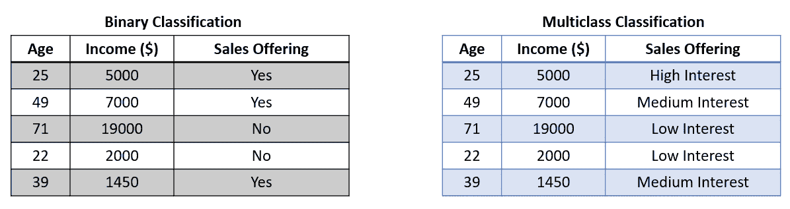
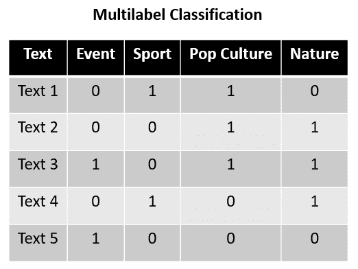
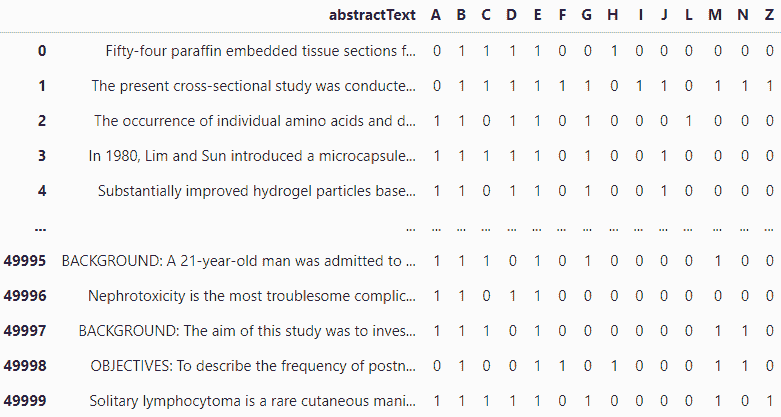
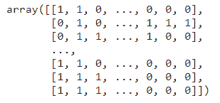
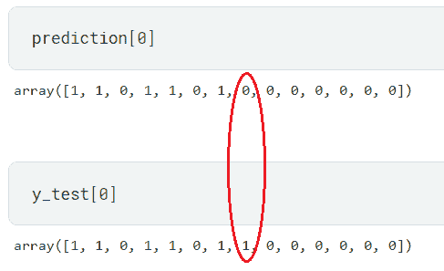

# 多标签分类：使用 Python 的 Scikit-Learn 入门

> 原文：[`www.kdnuggets.com/2023/08/multilabel-classification-introduction-python-scikitlearn.html`](https://www.kdnuggets.com/2023/08/multilabel-classification-introduction-python-scikitlearn.html)


图片来源：[Freepik](https://www.freepik.com/free-photo/top-view-hands-pizza-chart_25629308.htm#query=classification&position=4&from_view=search&track=sph)

在机器学习任务中，分类是一种监督学习方法，用于根据输入数据预测标签。例如，我们希望根据某人的历史特征预测他们是否对销售产品感兴趣。通过使用可用的训练数据训练机器学习模型，我们可以对传入的数据执行分类任务。

* * *

## 我们的前三大课程推荐

 1\. [Google 网络安全证书](https://www.kdnuggets.com/google-cybersecurity) - 快速进入网络安全职业生涯。

 2\. [Google 数据分析专业证书](https://www.kdnuggets.com/google-data-analytics) - 提升你的数据分析技能

 3\. [Google IT 支持专业证书](https://www.kdnuggets.com/google-itsupport) - 支持你的组织的 IT 工作

* * *

我们经常遇到经典的分类任务，例如二分类（两个标签）和多分类（多个标签）。在这种情况下，我们会训练分类器，模型将尝试从所有可用标签中预测一个标签。用于分类的数据集类似于下图所示的图像。



上图显示，目标（销售产品）在二分类中包含两个标签，而在多分类中包含三个标签。模型将从可用特征中进行训练，然后仅输出一个标签。

多标签分类不同于二分类或多分类。在多标签分类中，我们不会仅预测一个输出标签。相反，多标签分类会尝试预测尽可能多的适用于输入数据的标签。输出可以是没有标签到最大数量的可用标签。

多标签分类通常用于文本数据分类任务。例如，以下是多标签分类的示例数据集。



在上面的示例中，假设 Text 1 到 Text 5 是可以分类到四个类别中的句子：事件、体育、流行文化和自然。通过上面的训练数据，多标签分类任务预测哪个标签适用于给定的句子。每个类别彼此独立，因为它们不是互斥的；每个标签可以被视为独立的。

更详细的信息可以看到，Text 1 标记了体育和流行文化，而 Text 2 标记了流行文化和自然。这表明每个标签是相互独立的，多标签分类可以同时输出没有标签或所有标签的预测结果。

介绍完毕，让我们尝试用 Scikit-Learn 构建多分类器。

# 使用 Scikit-Learn 进行多标签分类

本教程将使用 Kaggle 上公开提供的[生物医学 PubMed 多标签分类数据集](https://www.kaggle.com/datasets/owaiskhan9654/pubmed-multilabel-text-classification)。数据集包含各种特征，但我们只使用 abstractText 特征及其 MeSH 分类（A: 解剖学，B: 生物体，C: 疾病等）。样本数据如下图所示。



上述数据集显示每篇论文可以被分类到多个类别中，这就是多标签分类的情况。利用这个数据集，我们可以用 Scikit-Learn 构建多标签分类器。在训练模型之前，让我们准备数据集。

```py
import pandas as pd
from sklearn.feature_extraction.text import TfidfVectorizer

df = pd.read_csv('PubMed Multi Label Text Classification Dataset Processed.csv')
df = df.drop(['Title', 'meshMajor', 'pmid', 'meshid', 'meshroot'], axis =1)

X = df["abstractText"]
y = np.asarray(df[df.columns[1:]])

vectorizer = TfidfVectorizer(max_features=2500, max_df=0.9)
vectorizer.fit(X)
```

在上面的代码中，我们将文本数据转换为[TF-IDF](https://en.wikipedia.org/wiki/Tf%E2%80%93idf)表示形式，以便我们的 Scikit-Learn 模型可以接受训练数据。此外，我跳过了预处理数据的步骤，如停用词去除，以简化教程。

数据转换后，我们将数据集拆分为训练数据集和测试数据集。

```py
from sklearn.model_selection import train_test_split
X_train, X_test, y_train, y_test = train_test_split(X, y, test_size=0.2, random_state=101)

X_train_tfidf = vectorizer.transform(X_train)
X_test_tfidf = vectorizer.transform(X_test)
```

在所有准备工作完成后，我们将开始训练我们的多标签分类器。在 Scikit-Learn 中，我们将使用[MultiOutputClassifier](https://scikit-learn.org/stable/modules/generated/sklearn.multioutput.MultiOutputClassifier.html#sklearn.multioutput.MultiOutputClassifier)对象来训练多标签分类器模型。该模型的策略是为每个标签训练一个分类器。基本上，每个标签都有其自己的分类器。

在这个示例中，我们将使用逻辑回归，而 MultiOutputClassifier 将它们扩展到所有标签。

```py
from sklearn.multioutput import MultiOutputClassifier
from sklearn.linear_model import LogisticRegression

clf = MultiOutputClassifier(LogisticRegression()).fit(X_train_tfidf, y_train)
```

我们可以更改模型并调整传递给 MultiOutputClassifier 的模型参数，因此根据您的需求进行管理。训练后，让我们使用模型来预测测试数据。

```py
prediction = clf.predict(X_test_tfidf)
prediction
```



预测结果是每个 MeSH 类别的标签数组。每一行代表一个句子，每一列代表一个标签。

最后，我们需要评估我们的多标签分类器。我们可以使用准确率指标来评估模型。

```py
from sklearn.metrics import accuracy_score
print('Accuracy Score: ', accuracy_score(y_test, prediction))
```

**准确率得分: 0.145**

准确率得分结果为 0.145，这表明模型仅能在不到 14.5% 的时间内预测正确的标签组合。然而，准确率得分在多标签预测评估中存在不足。准确率得分要求每个句子中所有标签都必须出现在准确的位置，否则将被视为错误。

例如，第一行预测与测试数据之间只差一个标签。



如果标签组合不同，则会被视为错误预测。因此，我们的模型得分较低。

为了缓解这个问题，我们必须评估标签预测而不是它们的标签组合。在这种情况下，我们可以依赖 [汉明损失](https://en.wikipedia.org/wiki/Multi-label_classification) 评估指标。汉明损失通过将错误预测的数量与标签总数的比例来计算。由于汉明损失是一个损失函数，分数越低越好（0 表示没有错误预测，1 表示所有预测都错误）。

```py
from sklearn.metrics import hamming_loss
print('Hamming Loss: ', round(hamming_loss(y_test, prediction),2))
```

**汉明损失: 0.13**

我们的多标签分类器汉明损失模型为 0.13，这意味着我们的模型在 13% 的时间内会有错误预测。这意味着每个标签预测可能有 13% 的错误。

# 结论

多标签分类是一种机器学习任务，其中输出可能没有标签或根据输入数据所有可能的标签。这与二分类或多分类不同，在二分类或多分类中，标签输出是互斥的。

使用 Scikit-Learn MultiOutputClassifier，我们可以开发多标签分类器，其中我们为每个标签训练一个分类器。对于模型评估，最好使用汉明损失指标，因为准确率可能不能完全准确地反映情况。

**[Cornellius Yudha Wijaya](https://www.linkedin.com/in/cornellius-yudha-wijaya/)** 是一名数据科学助理经理和数据撰稿人。他在全职工作于 Allianz Indonesia 的同时，喜欢通过社交媒体和写作媒体分享 Python 和数据技巧。

### 更多相关话题

+   [PyCaret 二分类介绍](https://www.kdnuggets.com/2021/12/introduction-binary-classification-pycaret.html)

+   [更多分类问题的性能评估指标](https://www.kdnuggets.com/2020/04/performance-evaluation-metrics-classification.html)

+   [使用 HuggingFace 微调 BERT 进行推文分类](https://www.kdnuggets.com/2022/01/finetuning-bert-tweets-classification-ft-hugging-face.html)

+   [分类的机器学习算法](https://www.kdnuggets.com/2022/03/machine-learning-algorithms-classification.html)

+   [分类的逻辑回归](https://www.kdnuggets.com/2022/04/logistic-regression-classification.html)

+   [分类的最近邻算法](https://www.kdnuggets.com/2022/04/nearest-neighbors-classification.html)
