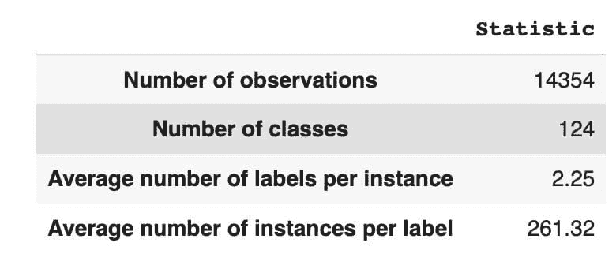
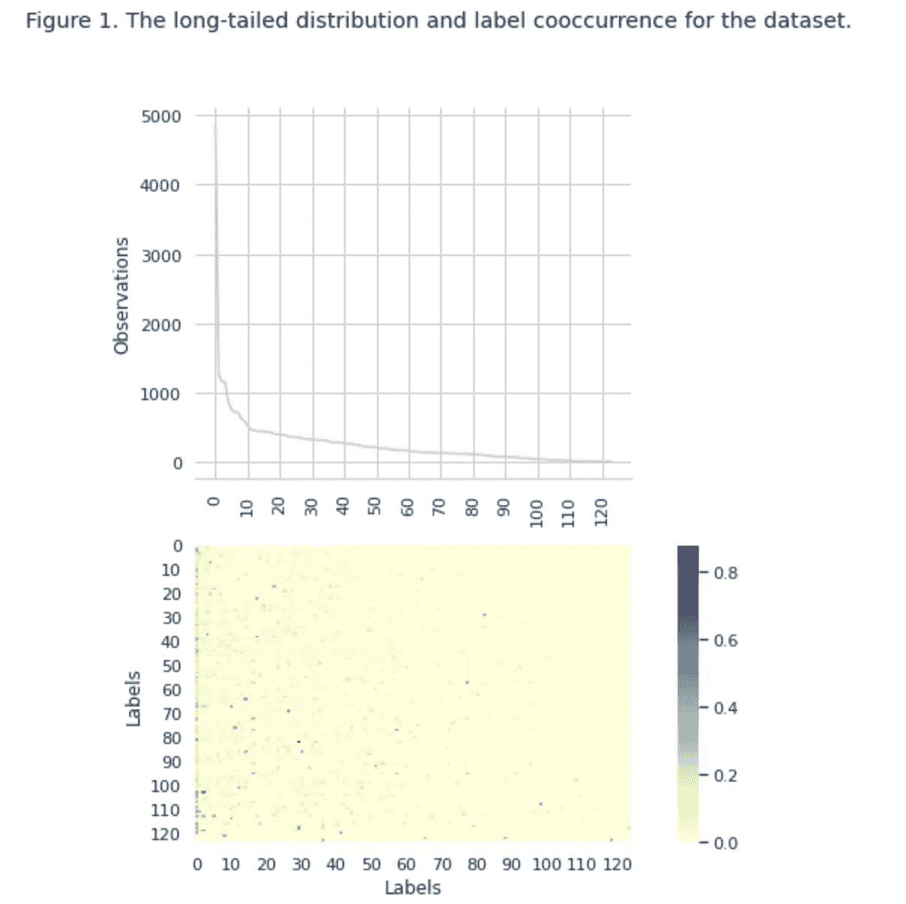
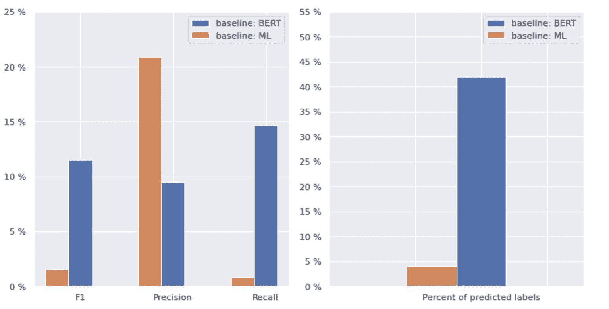
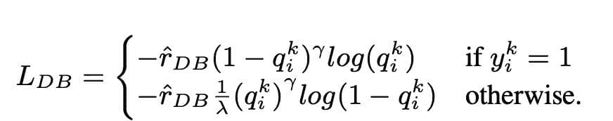
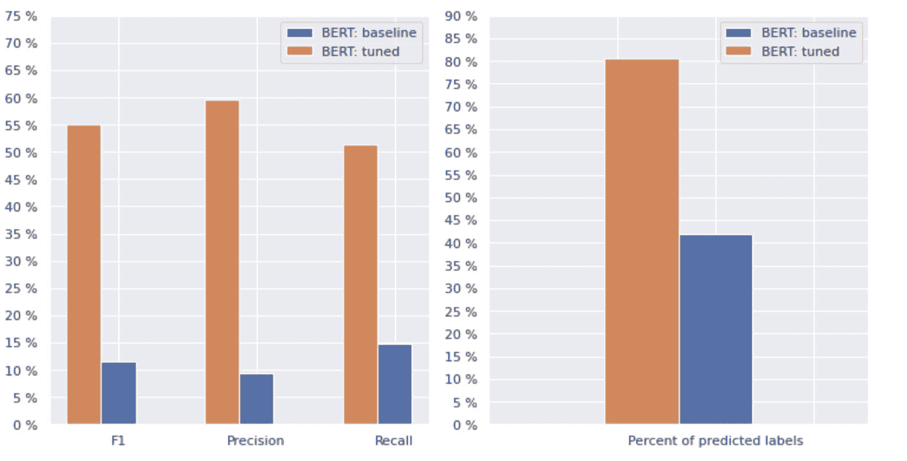
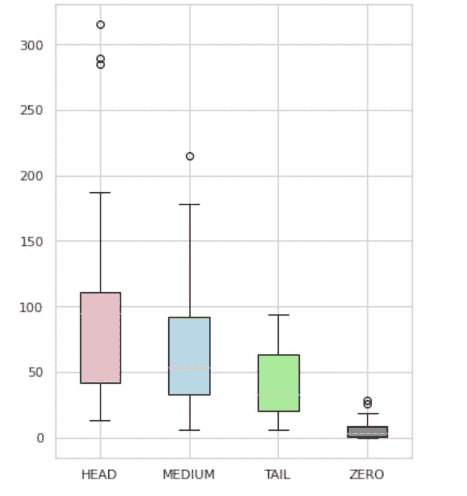
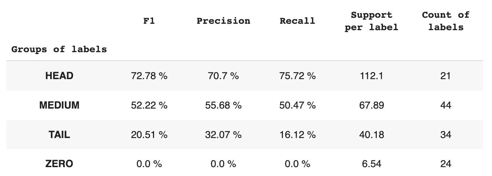
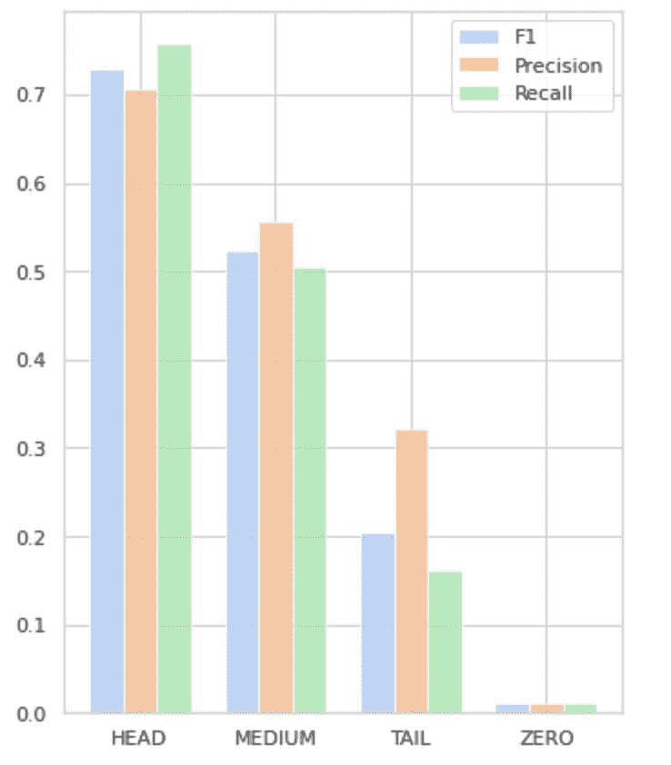

# 多标签自然语言处理：类别不平衡和损失函数方法的分析

> 原文：[`www.kdnuggets.com/2023/03/multilabel-nlp-analysis-class-imbalance-loss-function-approaches.html`](https://www.kdnuggets.com/2023/03/multilabel-nlp-analysis-class-imbalance-loss-function-approaches.html)

多标签自然语言处理（NLP）指的是将多个标签分配给给定的文本输入，而不仅仅是一个标签。在传统的 NLP 任务中，例如文本分类或情感分析，每个输入通常根据其内容分配一个标签。然而，在许多实际场景中，一段文本可能同时属于多个类别或表达多种情感。

多标签自然语言处理很重要，因为它允许我们从文本数据中捕捉更细致和复杂的信息。例如，在客户反馈分析领域，一条客户评论可能同时表达积极和消极的情感，或者可能涉及产品或服务的多个方面。通过为这些输入分配多个标签，我们可以更全面地理解客户的反馈，并采取更有针对性的措施来解决他们的关切。

* * *

## 我们的前三大课程推荐

 1\. [谷歌网络安全证书](https://www.kdnuggets.com/google-cybersecurity) - 快速进入网络安全职业生涯。

 2\. [谷歌数据分析专业证书](https://www.kdnuggets.com/google-data-analytics) - 提升您的数据分析能力

 3\. [谷歌 IT 支持专业证书](https://www.kdnuggets.com/google-itsupport) - 支持您的组织 IT

* * *

本文深入探讨了 Provectus 使用多标签 NLP 的一个值得注意的案例。

**背景：**

> 一位客户找到我们，请求帮助[自动标记某种类型的文档](https://provectus.com/case-studies/automating-document-processing-hcls-ai/)。乍一看，这个任务似乎简单易解。然而，当我们处理这个案例时，遇到了一个注释不一致的数据集。尽管我们的客户面临了类数变化和审查团队随时间变化的挑战，他们仍然投入了大量精力来创建一个具有多种注释的多样化数据集。虽然标签中存在一些不平衡和不确定性，但这个数据集为分析和进一步探索提供了宝贵的机会。

让我们更详细地查看数据集，探讨指标和我们的方法，并回顾 Provectus 如何解决多标签文本分类的问题。

# 数据集概述

数据集包含 14,354 个观测值，124 个独特的类别（标签）。我们的任务是为每个观测值分配一个或多个类别。

表 1 提供了数据集的描述统计信息。

平均而言，我们每个观察值大约有两个类别，每个类别有大约 261 个不同的文本描述。



表 1：数据集统计

在图 1 中，我们看到顶部图中的类别分布，我们在数据集中有一定数量的 HEAD 标签，其出现频率最高。还需注意，大多数类别的出现频率较低。



在底部图中，我们看到在数据集中，最佳表示的类别与低显著性类别之间存在频繁的重叠。

我们改变了将数据集拆分为训练/验证/测试集的过程。我们没有使用传统方法，而是采用了迭代分层抽样，以提供标签关系的良好平衡分布。为此，我们使用了 [Scikit Multi-learn](http://scikit.ml/api/skmultilearn.model_selection.iterative_stratification.html)。

```py
from skmultilearn.model_selection import iterative_train_test_split

mlb = MultiLabelBinarizer()

def balanced_split(df, mlb, test_size=0.5):
    ind = np.expand_dims(np.arange(len(df)), axis=1)
    mlb.fit_transform(df["tag"])
    labels = mlb.transform(df["tag"])
    ind_train, _, ind_test, _ = iterative_train_test_split(
        ind, labels, test_size
    )
    return df.iloc[ind_train[:, 0]], df.iloc[ind_test[:, 0]]

df_train, df_tmp = balanced_split(df, test_size=0.4)
df_val, df_test = balanced_split(df_tmp, test_size=0.5)
```

我们获得了以下分布：

1.  训练数据集包含 60% 的数据，并涵盖所有 124 个标签。

1.  验证数据集包含 20% 的数据，并涵盖所有 124 个标签。

1.  测试数据集包含 20% 的数据，并涵盖所有 124 个标签。

# 应用的指标

多标签分类是一种监督机器学习算法，它允许我们为单个数据样本分配多个标签。它不同于二分类，后者模型仅预测两个类别，也不同于多类别分类，后者模型仅预测一个样本的多个类别之一。

多标签分类性能的评估指标与多类别（或二分类）分类中的指标本质上不同，因为分类问题的固有差异。更多详细信息可以在维基百科上找到。

我们选择了最适合我们的指标：

1.  **精确度** 衡量模型所做的所有正预测中真实正预测的比例。

1.  **召回率** 衡量所有实际正样本中真实正预测的比例。

1.  **F1 分数** 是精确度和召回率的调和平均数，有助于恢复两者之间的平衡。

1.  **汉明损失** 是预测错误的标签的比例。

我们还跟踪**预测标签的数量**，在集合 {定义为标签的计数，F1 分数 > 0 的标签}。

# K. I. S. S. 方法

多标签分类是一种监督学习问题，其中单个实例或示例可以与多个标签或分类相关联，与传统的单标签分类不同，在单标签分类中，每个实例仅与单一类别标签相关联。

解决多标签分类问题的主要技术有两个类别：

1.  问题转换方法

1.  算法适应方法

问题转换方法使我们能够将多标签分类任务转化为多个单标签分类任务。例如，二进制相关（BR）基线方法将每个标签视为一个独立的二进制分类问题。在这种情况下，多标签问题被转化为多个单标签问题。

算法适应方法修改算法本身，以本地处理多标签数据，而不是将任务转化为多个单标签分类任务。这种方法的一个例子是[ BERT 模型](https://arxiv.org/abs/1810.04805)，它是一个预训练的基于变换器的语言模型，可以针对各种 NLP 任务进行微调，包括多标签文本分类。BERT 设计用来直接处理多标签数据，无需问题转换。

在使用 BERT 进行多标签文本分类的背景下，标准方法是使用二进制交叉熵（BCE）损失作为损失函数。BCE 损失是二进制分类问题中常用的损失函数，可以通过独立计算每个标签的损失，然后将损失总和来轻松扩展到处理多标签分类问题。在这种情况下，BCE 损失函数测量预测概率和真实标签之间的误差，其中预测概率来自 BERT 模型中的最终 sigmoid 激活层。

现在，让我们更深入地查看下图中的图 2。



图 2\. 基线模型指标

左侧图表展示了“基线：BERT”和“基线：ML”指标的对比。因此，可以看出，对于“基线：BERT”，F1 和召回率分数约高出 1.5 倍，而“基线：ML”的精准率是模型 1 的 2 倍。通过分析右侧显示的预测类别的整体百分比，我们看到“基线：BERT”预测的类别是“基线：ML”的 10 倍以上。

由于“基线：BERT”的最大结果不到所有类别的 50%，结果相当令人沮丧。让我们想办法改善这些结果。

# 方法的黄金比例

根据杰出文章[“具有长尾类别分布的多标签文本分类平衡方法”](https://arxiv.org/abs/2109.04712)，我们了解到分布平衡损失可能是最适合我们的方案。

## 分布平衡损失

分布平衡损失是一种用于多标签文本分类问题的技术，用于解决类别分布中的不平衡问题。在这些问题中，一些类别的出现频率远高于其他类别，导致模型偏向于这些更频繁的类别。

为了解决这个问题，分布平衡损失旨在平衡每个样本在损失函数中的贡献。这是通过根据样本在数据集中的出现频率的倒数重新加权每个样本的损失来实现的。通过这样做，较少出现类别的贡献增加，较多出现类别的贡献减少，从而平衡整体类别分布。

这种技术已被证明在改善长尾类别分布问题的模型性能方面有效。通过减少频繁类别的影响和增加不频繁类别的影响，模型能够更好地捕捉数据中的模式，并产生更平衡的预测。



重采样类的实现

```py
import torch
import torch.nn as nn
import torch.nn.functional as F
import numpy as np

class ResampleLoss(nn.Module):
    def __init__(
        self,
        use_sigmoid=True,
        partial=False,
        loss_weight=1.0,
        reduction="mean",
        reweight_func=None,
        weight_norm=None,
        focal=dict(focal=True, alpha=0.5, gamma=2),
        map_param=dict(alpha=10.0, beta=0.2, gamma=0.1),
        CB_loss=dict(CB_beta=0.9, CB_mode="average_w"),
        logit_reg=dict(neg_scale=5.0, init_bias=0.1),
        class_freq=None,
        train_num=None,
    ):
        super(ResampleLoss, self).__init__()
        assert (use_sigmoid is True) or (partial is False)
        self.use_sigmoid = use_sigmoid
        self.partial = partial
        self.loss_weight = loss_weight
        self.reduction = reduction
        if self.use_sigmoid:
            if self.partial:
                self.cls_criterion = partial_cross_entropy
            else:
                self.cls_criterion = binary_cross_entropy
        else:
            self.cls_criterion = cross_entropy
        # reweighting function
        self.reweight_func = reweight_func
        # normalization (optional)
        self.weight_norm = weight_norm
        # focal loss params
        self.focal = focal["focal"]
        self.gamma = focal["gamma"]
        self.alpha = focal["alpha"]
        # mapping function params
        self.map_alpha = map_param["alpha"]
        self.map_beta = map_param["beta"]
        self.map_gamma = map_param["gamma"]
        # CB loss params (optional)
        self.CB_beta = CB_loss["CB_beta"]
        self.CB_mode = CB_loss["CB_mode"]
        self.class_freq = (
            torch.from_numpy(np.asarray(class_freq)).float().cuda()
        )
        self.num_classes = self.class_freq.shape[0]
        self.train_num = train_num  # only used to be divided by class_freq
        # regularization params
        self.logit_reg = logit_reg
        self.neg_scale = (
            logit_reg["neg_scale"] if "neg_scale" in logit_reg else 1.0
        )
        init_bias = (
            logit_reg["init_bias"] if "init_bias" in logit_reg else 0.0
        )
        self.init_bias = (
            -torch.log(self.train_num / self.class_freq - 1) * init_bias
        )
        self.freq_inv = (
            torch.ones(self.class_freq.shape).cuda() / self.class_freq
        )
        self.propotion_inv = self.train_num / self.class_freq

    def forward(
        self,
        cls_score,
        label,
        weight=None,
        avg_factor=None,
        reduction_override=None,
        **kwargs
    ):
        assert reduction_override in (None, "none", "mean", "sum")
        reduction = (
            reduction_override if reduction_override else self.reduction
        )
        weight = self.reweight_functions(label)
        cls_score, weight = self.logit_reg_functions(
            label.float(), cls_score, weight
        )
        if self.focal:
            logpt = self.cls_criterion(
                cls_score.clone(),
                label,
                weight=None,
                reduction="none",
                avg_factor=avg_factor,
            )
            # pt is sigmoid(logit) for pos or sigmoid(-logit) for neg
            pt = torch.exp(-logpt)
            wtloss = self.cls_criterion(
                cls_score, label.float(), weight=weight, reduction="none"
            )
            alpha_t = torch.where(label == 1, self.alpha, 1 - self.alpha)
            loss = alpha_t * ((1 - pt) ** self.gamma) * wtloss
            loss = reduce_loss(loss, reduction)
        else:
            loss = self.cls_criterion(
                cls_score, label.float(), weight, reduction=reduction
            )
        loss = self.loss_weight * loss
        return loss

    def reweight_functions(self, label):
        if self.reweight_func is None:
            return None
        elif self.reweight_func in ["inv", "sqrt_inv"]:
            weight = self.RW_weight(label.float())
        elif self.reweight_func in "rebalance":
            weight = self.rebalance_weight(label.float())
        elif self.reweight_func in "CB":
            weight = self.CB_weight(label.float())
        else:
            return None
        if self.weight_norm is not None:
            if "by_instance" in self.weight_norm:
                max_by_instance, _ = torch.max(weight, dim=-1, keepdim=True)
                weight = weight / max_by_instance
            elif "by_batch" in self.weight_norm:
                weight = weight / torch.max(weight)
        return weight

    def logit_reg_functions(self, labels, logits, weight=None):
        if not self.logit_reg:
            return logits, weight
        if "init_bias" in self.logit_reg:
            logits += self.init_bias
        if "neg_scale" in self.logit_reg:
            logits = logits * (1 - labels) * self.neg_scale + logits * labels
            if weight is not None:
                weight = (
                    weight / self.neg_scale * (1 - labels) + weight * labels
                )
        return logits, weight

    def rebalance_weight(self, gt_labels):
        repeat_rate = torch.sum(
            gt_labels.float() * self.freq_inv, dim=1, keepdim=True
        )
        pos_weight = (
            self.freq_inv.clone().detach().unsqueeze(0) / repeat_rate
        )
        # pos and neg are equally treated
        weight = (
            torch.sigmoid(self.map_beta * (pos_weight - self.map_gamma))
            + self.map_alpha
        )
        return weight

    def CB_weight(self, gt_labels):
        if "by_class" in self.CB_mode:
            weight = (
                torch.tensor((1 - self.CB_beta)).cuda()
                / (1 - torch.pow(self.CB_beta, self.class_freq)).cuda()
            )
        elif "average_n" in self.CB_mode:
            avg_n = torch.sum(
                gt_labels * self.class_freq, dim=1, keepdim=True
            ) / torch.sum(gt_labels, dim=1, keepdim=True)
            weight = (
                torch.tensor((1 - self.CB_beta)).cuda()
                / (1 - torch.pow(self.CB_beta, avg_n)).cuda()
            )
        elif "average_w" in self.CB_mode:
            weight_ = (
                torch.tensor((1 - self.CB_beta)).cuda()
                / (1 - torch.pow(self.CB_beta, self.class_freq)).cuda()
            )
            weight = torch.sum(
                gt_labels * weight_, dim=1, keepdim=True
            ) / torch.sum(gt_labels, dim=1, keepdim=True)
        elif "min_n" in self.CB_mode:
            min_n, _ = torch.min(
                gt_labels * self.class_freq + (1 - gt_labels) * 100000,
                dim=1,
                keepdim=True,
            )
            weight = (
                torch.tensor((1 - self.CB_beta)).cuda()
                / (1 - torch.pow(self.CB_beta, min_n)).cuda()
            )
        else:
            raise NameError
        return weight

    def RW_weight(self, gt_labels, by_class=True):
        if "sqrt" in self.reweight_func:
            weight = torch.sqrt(self.propotion_inv)
        else:
            weight = self.propotion_inv
        if not by_class:
            sum_ = torch.sum(weight * gt_labels, dim=1, keepdim=True)
            weight = sum_ / torch.sum(gt_labels, dim=1, keepdim=True)
        return weight

def reduce_loss(loss, reduction):
    """Reduce loss as specified.
    Args:
        loss (Tensor): Elementwise loss tensor.
        reduction (str): Options are "none", "mean" and "sum".
    Return:
        Tensor: Reduced loss tensor.
    """
    reduction_enum = F._Reduction.get_enum(reduction)
    # none: 0, elementwise_mean:1, sum: 2
    if reduction_enum == 0:
        return loss
    elif reduction_enum == 1:
        return loss.mean()
    elif reduction_enum == 2:
        return loss.sum()

def weight_reduce_loss(loss, weight=None, reduction="mean", avg_factor=None):
    """Apply element-wise weight and reduce loss.
    Args:
        loss (Tensor): Element-wise loss.
        weight (Tensor): Element-wise weights.
        reduction (str): Same as built-in losses of PyTorch.
        avg_factor (float): Avarage factor when computing the mean of losses.
    Returns:
        Tensor: Processed loss values.
    """
    # if weight is specified, apply element-wise weight
    if weight is not None:
        loss = loss * weight
    # if avg_factor is not specified, just reduce the loss
    if avg_factor is None:
        loss = reduce_loss(loss, reduction)
    else:
        # if reduction is mean, then average the loss by avg_factor
        if reduction == "mean":
            loss = loss.sum() / avg_factor
        # if reduction is 'none', then do nothing, otherwise raise an error
        elif reduction != "none":
            raise ValueError(
                'avg_factor can not be used with reduction="sum"'
            )
    return loss

def binary_cross_entropy(
    pred, label, weight=None, reduction="mean", avg_factor=None
):
    # weighted element-wise losses
    if weight is not None:
        weight = weight.float()
    loss = F.binary_cross_entropy_with_logits(
        pred, label.float(), weight, reduction="none"
    )
    loss = weight_reduce_loss(
        loss, reduction=reduction, avg_factor=avg_factor
    )

    return loss 
```

DBLoss

```py
loss_func = ResampleLoss(
    reweight_func="rebalance",
    loss_weight=1.0,
    focal=dict(focal=True, alpha=0.5, gamma=2),
    logit_reg=dict(init_bias=0.05, neg_scale=2.0),
    map_param=dict(alpha=0.1, beta=10.0, gamma=0.405),
    class_freq=class_freq,
    train_num=train_num,
)
"""
class_freq - list of frequencies for each class,
train_num - size of train dataset
""" 
```

通过深入调查数据集，我们得出参数  = 0.405。

## 阈值调整

改进模型的另一个步骤是调整阈值的过程，包括在训练阶段、验证阶段和测试阶段。我们计算了诸如 F1 分数、精确度和召回率等指标对阈值水平的依赖关系，并根据最高的指标分数选择了阈值。下面可以看到这一过程的函数实现。

通过调整阈值优化 F1 分数：

```py
def optimise_f1_score(true_labels: np.ndarray, pred_labels: np.ndarray):
    best_med_th = 0.5
    true_bools = [tl == 1 for tl in true_labels]
    micro_thresholds = (np.array(range(-45, 15)) / 100) + best_med_th
    f1_results, pre_results, recall_results = [], [], []
    for th in micro_thresholds:
        pred_bools = [pl > th for pl in pred_labels]
        test_f1 = f1_score(true_bools, pred_bools, average="micro", zero_division=0)
        test_precision = precision_score(
            true_bools, pred_bools, average="micro", zero_division=0
        )
        test_recall = recall_score(
            true_bools, pred_bools, average="micro", zero_division=0
        )
        f1_results.append(test_f1)
        prec_results.append(test_precision)
        recall_results.append(test_recall)
        best_f1_idx = np.argmax(f1_results)
    return micro_thresholds[best_f1_idx]
```

## 基准线的评估和比较

这些方法使我们能够训练一个新模型，并获得以下结果，与基准线比较：下图中的 BERT。



图 3\. 基准线和新方法的比较指标。

通过比较与分类相关的指标，我们发现性能指标几乎提高了 5-6 倍：

F1 分数从 12% 提升至 55%，而精确度从 9% 提升至 59%，召回率从 15% 提升至 51%。

根据图 3 右侧图中的变化，我们现在可以预测 80% 的类别。

## 类别切片

我们将标签分为四组：HEAD、MEDIUM、TAIL 和 ZERO。每组包含具有相似数量的支持数据观测值的标签。

如图 4 所示，各组的分布是不同的。玫瑰盒（HEAD）具有负偏态分布，中间盒（MEDIUM）具有正偏态分布，绿色盒子（TAIL）似乎具有正态分布。

所有组中也有离群值，它们是箱形图中胡须外的点。HEAD 组对 MAJOR 类有重大影响。

此外，我们还识别出一个名为“ZERO”的单独组，其中包含模型无法学习且由于数据集中出现次数极少（少于 3% 的所有观察值）而无法识别的标签。



图 4\. 标签数量与组

表 2 提供了每个标签组在测试子集数据中的指标信息。



表 2\. 各组指标。

1.  HEAD 组包含 21 个标签，每个标签的平均支持观察值为 112。由于其在数据集中的高表示度，该组受到离群值的影响，其指标较高：F1 - 73%，精准度 - 71%，召回率 - 75%。

1.  MEDIUM 组由 44 个标签组成，每个标签的平均支持观察值为 67，大约是 HEAD 组的一半。该组的指标预计会下降 50%：F1 - 52%，精准度 - 56%，召回率 - 51%。

1.  TAIL 组拥有最多的类别，但所有类别在数据集中表现都很差，每个标签的平均支持观察值为 40。因此，指标显著下降：F1 - 21%，精准度 - 32%，召回率 - 16%。

1.  ZERO 组包括模型无法识别的类别，这可能是由于这些类别在数据集中出现频率较低。该组中的 24 个标签每个平均有 7 个支持观察值。

图 5 可视化了表 2 中的信息，提供了每个标签组指标的视觉表现。



图 5\. 指标与标签组。所有 ZERO 值 = 0。

# 结论

在这篇综合文章中，我们展示了在应用传统方法时，表面上看似简单的多标签文本分类任务可能具有挑战性。我们提出了使用分布平衡损失函数来解决类别不平衡问题。

我们将提出的方法与经典方法进行了比较，并使用实际业务指标进行了评估。结果表明，利用损失函数来解决类别不平衡和标签共现问题为多标签文本分类提供了一种可行的解决方案。

提出的使用案例突显了在处理多标签文本分类时考虑不同方法和技术的重要性，以及分布平衡损失函数在解决类别不平衡问题上的潜在好处。

*如果你面临类似问题并寻求* [*优化文档处理操作*](https://provectus.com/intelligent-document-processing/) *在你的组织中，请联系我或 Provectus 团队。我们将乐意帮助你寻找更高效的自动化方法。*

[**奥列克西·巴比奇**](https://www.linkedin.com/in/babycholeks/) 是 Provectus 的机器学习工程师。凭借物理学背景，他具备出色的分析和数学技能，并通过科学研究和国际会议演讲（包括 SPIE Photonics West）获得了宝贵的经验。奥列克西专注于为医疗保健和金融科技行业创建端到端的大规模 AI/ML 解决方案。他参与机器学习开发生命周期的每个阶段，从识别业务问题到部署和运行生产 ML 模型。

[**里纳特·阿赫梅托夫**](https://www.linkedin.com/in/rinat-akhmetov/) 是 Provectus 的机器学习解决方案架构师。凭借扎实的机器学习（尤其是计算机视觉）实践背景，里纳特是一个极客、数据爱好者、软件工程师和工作狂，他的第二大激情是编程。在 Provectus，里纳特负责发现和概念验证阶段，并领导复杂 AI 项目的执行。

### 更多相关话题

+   [多标签分类：使用 Python 的 Scikit-Learn 的介绍](https://www.kdnuggets.com/2023/08/multilabel-classification-introduction-python-scikitlearn.html)

+   [损失函数：解释](https://www.kdnuggets.com/2022/03/loss-functions-explainer.html)

+   [机器学习的甜蜜点：NLP 和文档分析中的纯粹方法](https://www.kdnuggets.com/2022/05/machine-learning-sweet-spot-pure-approaches-nlp-document-analysis.html)

+   [无监督解缠表示学习在类不平衡数据集中的应用](https://www.kdnuggets.com/2023/01/unsupervised-disentangled-representation-learning-class-imbalanced-dataset-elastic-infogan.html)

+   [通过 DataCamp 享受世界级数据科学学习，立享 25% 折扣](https://www.kdnuggets.com/2023/03/datacamp-world-class-data-science-learning.html)

+   [你需要了解的关于梯度下降和成本函数的 5 个概念](https://www.kdnuggets.com/2020/05/5-concepts-gradient-descent-cost-function.html)
