# 多模态模型解释

> 原文：[`www.kdnuggets.com/2023/03/multimodal-models-explained.html`](https://www.kdnuggets.com/2023/03/multimodal-models-explained.html)

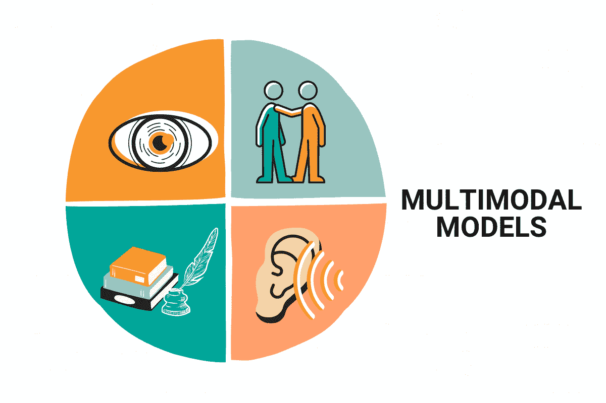

图片来源：作者

深度学习是一种智能类型，旨在模仿人脑中的系统和神经元，这些系统和神经元在人的思维过程中扮演了至关重要的角色。

* * *

## 我们的前三大课程推荐

 1\. [谷歌网络安全证书](https://www.kdnuggets.com/google-cybersecurity) - 快速入门网络安全职业。

 2\. [谷歌数据分析专业证书](https://www.kdnuggets.com/google-data-analytics) - 提升您的数据分析能力

 3\. [谷歌 IT 支持专业证书](https://www.kdnuggets.com/google-itsupport) - 支持您的组织在 IT 方面

* * *

这项技术利用深度神经网络，这些网络由多层人工神经元组成，可以分析和处理大量数据，使其能够随着时间的推移学习和改进。

我们人类依赖五感来解读周围的世界。我们利用视、听、触、味、嗅等感官来收集环境信息并理解这些信息。

同样，多模态学习是一个令人兴奋的人工智能新领域，试图通过结合来自多个模型的信息来复制这种能力。通过整合来自文本、图像、音频和视频等多种来源的信息，多模态模型可以建立对基础数据更丰富、更完整的理解，揭示新的洞察，并支持广泛的应用。

多模态学习中使用的技术包括基于融合的方法、基于对齐的方法以及后期融合。

在本文中，我们将探讨多模态学习的基本原理，包括融合不同来源信息的各种技术，以及其从语音识别到自动驾驶等众多令人兴奋的应用。

# 什么是多模态学习？

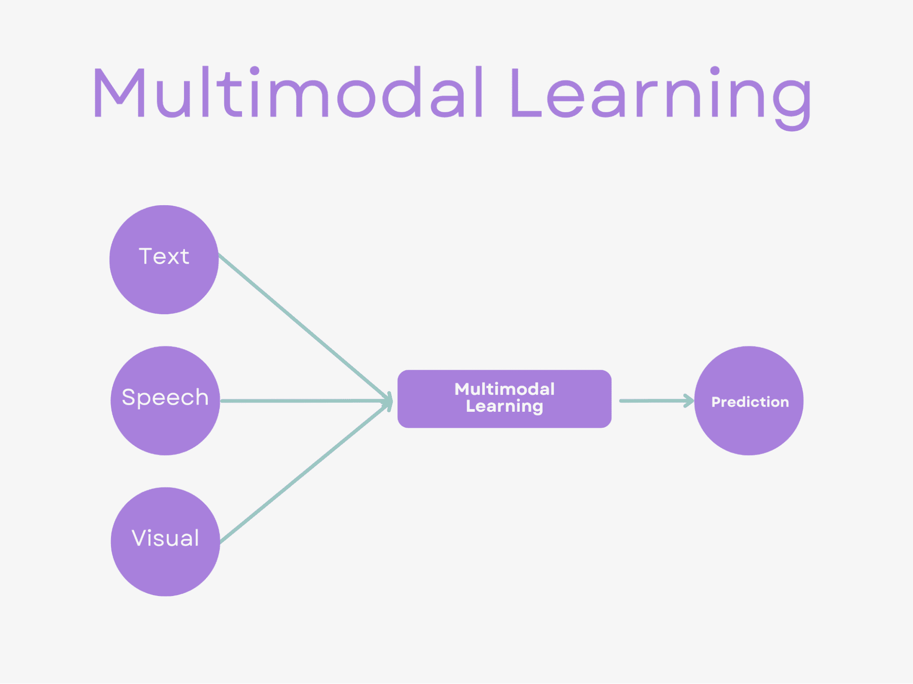

图片来源：作者

多模态学习是人工智能的一个子领域，旨在有效处理和分析来自多种模态的数据。

简单来说，这意味着将来自不同来源的信息如文本、图像、音频和视频结合起来，以建立对基础数据更完整、更准确的理解。

多模态学习的概念已经在包括语音识别、自动驾驶和情感识别等广泛领域找到了应用。我们将在接下来的部分中讨论这些内容。

多模态学习技术使模型能够有效地处理和分析来自多种模态的数据，从而提供对底层数据更全面和准确的理解。

在下一节中，我们将提到这些技术，但在此之前，让我们先讨论组合模型。

这两个概念可能看起来相似，但你很快会发现它们并不相同。

# 组合模型

组合模型是一种机器学习技术，涉及使用多个模型来提高单个模型的性能。

组合模型的理念在于，一个模型的优势可以弥补另一个模型的不足，从而产生更准确和更稳健的预测。集成模型、堆叠和装袋是用于组合模型的技术。

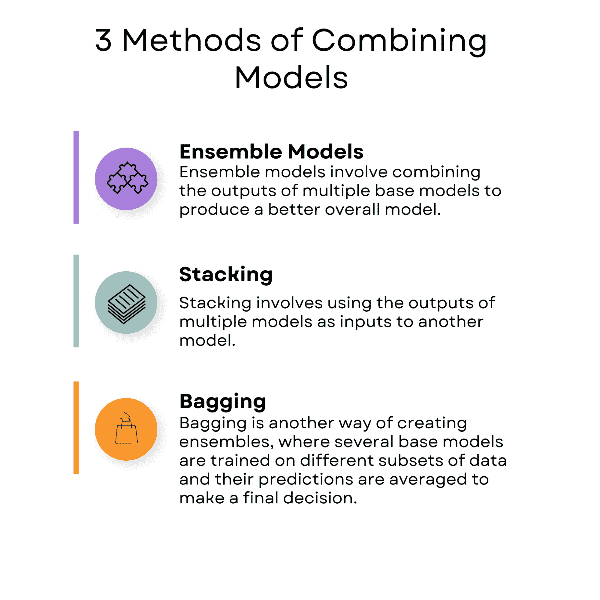

作者提供的图片

## 集成模型

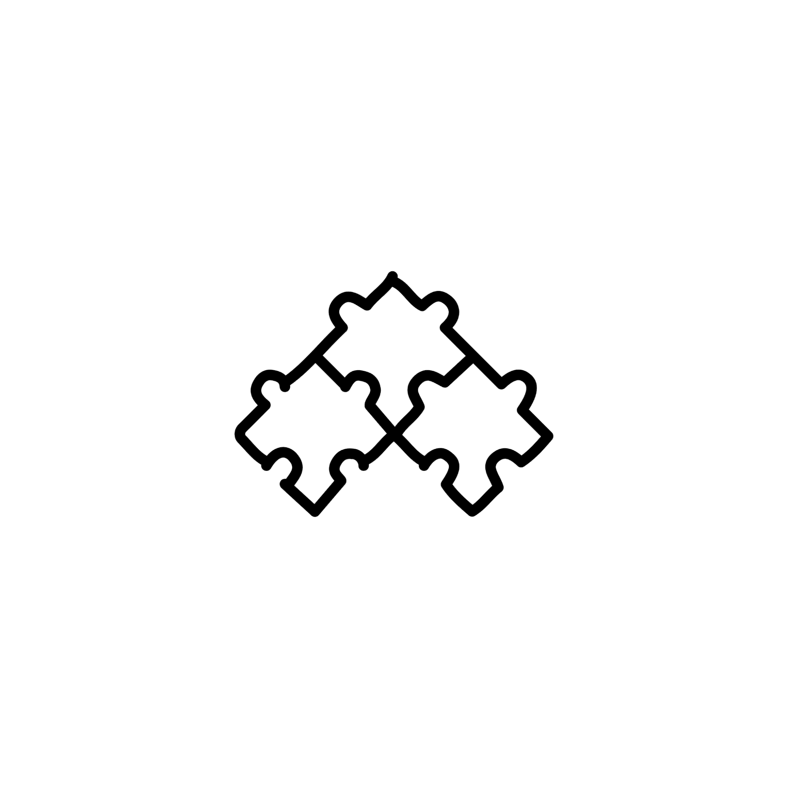

作者提供的图片

集成模型涉及将多个基础模型的输出进行组合，以产生一个更好的整体模型。

一个集成模型的例子是随机森林。随机森林是一种决策树算法，通过结合多棵决策树来提高模型的准确性。每棵决策树都在数据的不同子集上进行训练，最终的预测是通过对所有树的预测结果进行平均来得出的。

你可以在 [这里](https://scikit-learn.org/stable/modules/generated/sklearn.ensemble.RandomForestClassifier.html) 查看如何在 scikit-learn 库中使用随机森林算法。

## 堆叠

作者提供的图片

堆叠涉及将多个模型的输出作为另一个模型的输入。

堆叠的一个现实生活中的例子是自然语言处理中的情感分析。

例如，[斯坦福情感树库数据集](https://www.kaggle.com/datasets/atulanandjha/stanford-sentiment-treebank-v2-sst2)包含了情感标签从非常负面到非常正面的电影评论。在这种情况下，可以训练多个模型，如 [随机森林](https://www.stratascratch.com/blog/decision-tree-and-random-forest-algorithm-explained/?utm_source=blog&utm_medium=click&utm_campaign=kdn+multimodal+models)、[支持向量机（SVM）](https://www.stratascratch.com/blog/machine-learning-algorithms-explained-support-vector-machine/?utm_source=blog&utm_medium=click&utm_campaign=kdn+multimodal+models) 和朴素贝叶斯来预测评论的情感。

这些模型的预测结果可以通过使用元模型（如逻辑回归或神经网络）进行组合，该元模型在基础模型的输出上进行训练，以得出最终预测结果。

堆叠可以提高情感预测的准确性，并使情感分析更为稳健。

## 装袋

作者提供的图片

集成学习是另一种创建模型集成的方法，其中多个基础模型在不同的数据子集上进行训练，并将它们的预测结果平均以作出最终决策。

集成学习的一个例子是自助聚合方法，其中多个模型在训练数据的不同子集上进行训练。最终预测通过对所有模型的预测结果进行平均得出。

现实生活中的一个集成学习示例是金融领域。[S&P 500 数据集](https://www.kaggle.com/datasets/camnugent/sandp500)包含 2012 年至 2018 年间美国 500 家最大上市公司的股票价格历史数据。

可以通过在 scikit-learn 中训练多个模型（如 [随机森林](https://scikit-learn.org/stable/modules/generated/sklearn.ensemble.RandomForestClassifier.html) 和 [梯度提升](https://scikit-learn.org/stable/modules/generated/sklearn.ensemble.GradientBoostingClassifier.html)）来使用集成学习预测公司的股票价格。

每个模型在训练数据的不同子集上进行训练，然后将它们的预测结果平均，以得到最终预测。使用集成学习可以提高股票价格预测的准确性，使财务分析更具鲁棒性。

# 结合模型与多模态学习的区别

在结合模型中，模型是独立训练的，最终预测通过使用集成模型、堆叠或集成学习等技术将这些模型的输出结合起来。

当单个模型具有互补的优缺点时，结合模型特别有用，因为这种结合可以导致更准确和更稳健的预测。

在多模态学习中，目标是结合来自不同模态的信息以执行预测任务。这可能涉及使用融合方法、对齐方法或晚期融合等技术，创建捕捉每种模态数据语义信息的高维表示。

多模态学习在不同模态提供互补信息、能提高预测准确性时特别有用。

结合模型和多模态学习的主要区别在于，结合模型涉及使用多个模型来提高单个模型的性能。相比之下，多模态学习涉及从多个模态（如图像、文本和音频）中学习并结合信息，以进行预测测试。

现在，让我们深入了解多模态学习技术。

# 多模态学习技术

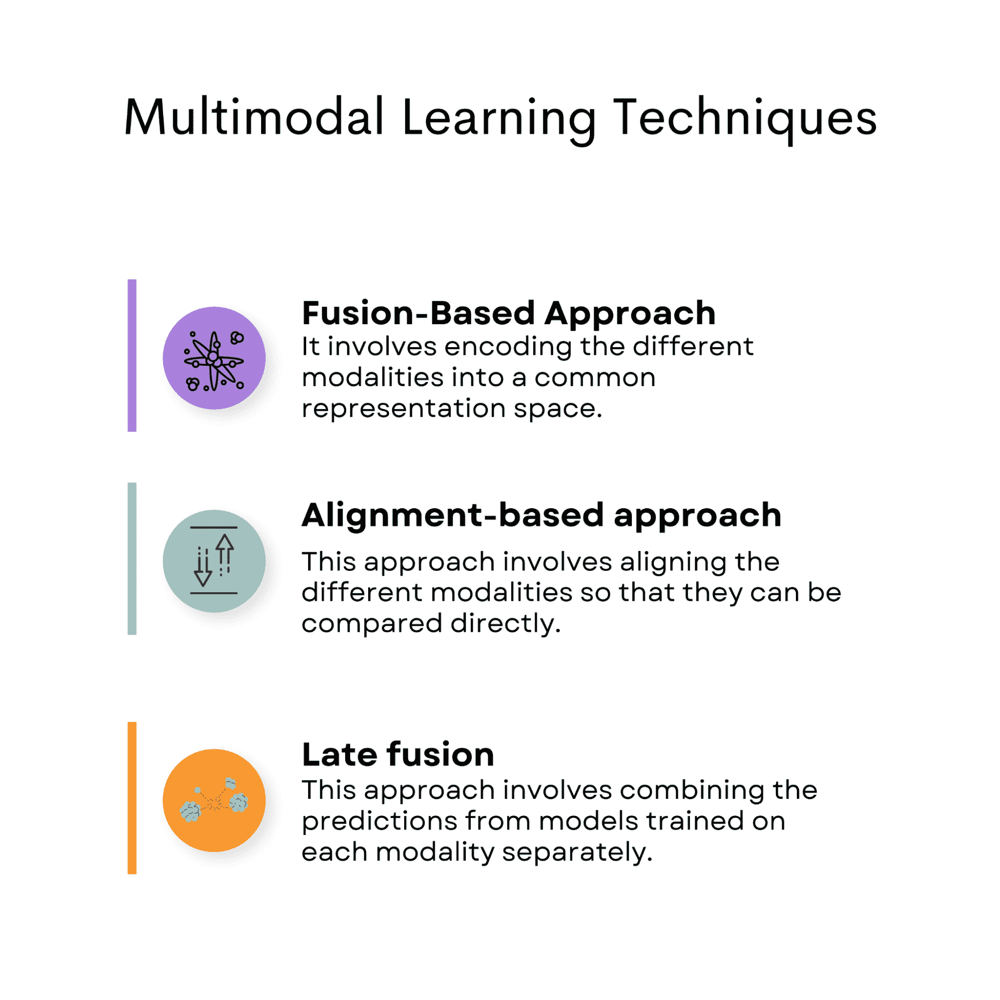

作者提供的图片

## 基于融合的方法

基于融合的方法涉及将不同的模态编码到一个共同的表示空间中，在这个空间中，这些表示被融合以创建一个单一的模态不变表示，捕捉来自所有模态的语义信息。

这种方法可以进一步分为早期融合和中期融合技术，具体取决于融合发生的时间。

### 文本标题生成

一个典型的基于融合的方法是图像和文本标题生成。

这是一种基于融合的方法，因为图像的视觉特征和文本的语义信息被编码到一个公共表示空间中，然后融合生成一个单一的模态不变表示，从而捕捉两个模态的语义信息。

具体来说，图像的视觉特征是通过卷积神经网络（CNN）提取的，而文本的语义信息则是通过递归神经网络（RNN）捕捉的。

这两种模态然后被编码到一个公共表示空间中。视觉和文本特征通过连接或逐元素乘法技术融合，以创建一个单一的模态不变表示。

这个最终表示可以用来为图像生成标题。

一个可以用于图像和文本标题生成的开源数据集是[Flickr30k 数据集](http://shannon.cs.illinois.edu/DenotationGraph/)，该数据集包含 31,000 张图像，每张图像配有五个标题。该数据集包含各种日常场景的图像，每张图像由多个标注者注释，以提供多样化的标题。

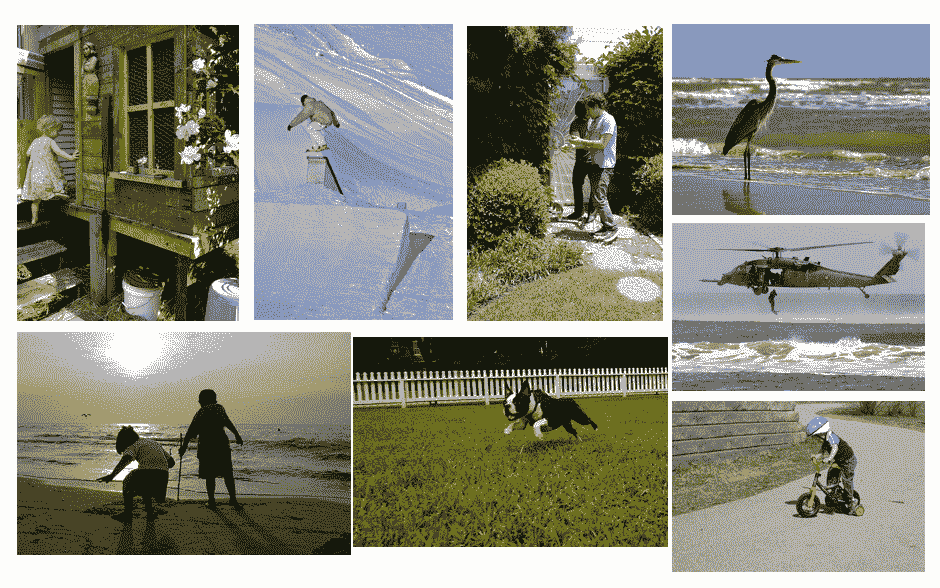

来源: [`paperswithcode.com/dataset/flickr30k-cna`](https://paperswithcode.com/dataset/flickr30k-cna)

Flickr30k 数据集可以通过从预训练 CNN 中提取视觉特征，并使用诸如词嵌入或词袋表示等技术来应用基于融合的方法进行图像和文本标题生成。生成的融合表示可以用来生成更准确和信息量更大的标题。

## 基于对齐的方法

这种方法涉及对齐不同的模态，以便它们可以直接进行比较。

目标是创建可以跨模态比较的模态不变表示。当模态之间有直接关系时，如音频-视觉语音识别，这种方法是有利的。

### 手语识别

作者提供的图像

对齐方法的一个例子是在手语识别任务中。

这种使用涉及基于对齐的方法，因为它要求模型对视觉（视频帧）和音频（音频波形）两种模态的时间信息进行对齐。

任务是让模型识别手语手势并将其翻译成文本。手势通过视频摄像机捕捉，音频和两种模态必须对齐，以准确识别手势。这涉及识别视频帧和音频波形之间的时间对齐，以识别手势和相应的语音。

一个用于手语识别的开源数据集是 [RWTH-PHOENIX-Weather 2014T 数据集](https://www-i6.informatik.rwth-aachen.de/~koller/RWTH-PHOENIX/)，它包含了各种手语使用者的德国语手语（DGS）视频录制。该数据集包括视觉和音频模态，适合需要对齐方法的多模态学习任务。

## 晚期融合

这种方法涉及结合分别在每种模态上训练的模型的预测结果。然后将各个预测结果结合以生成最终预测。这种方法在模态之间没有直接关系，或单个模态提供互补信息时特别有用。

### 情感识别

图片来源：作者

晚期融合的一个现实生活中的例子是音乐中的情感识别。在这个任务中，模型必须使用音频特征和歌词来识别一首音乐的情感内容。

在这个例子中应用了晚期融合方法，因为它结合了分别在不同模态（音频特征和歌词）上训练的模型的预测结果，以创建最终预测。

各个模型分别在每种模态上训练，预测结果随后被结合。因此，使用晚期融合。

音频特征可以使用梅尔频率倒谱系数（MFCCs）等技术提取，而歌词可以使用词袋模型或词嵌入技术进行编码。可以在每种模态上分别训练模型，然后通过晚期融合将预测结果结合起来生成最终预测。

[DEAM 数据集](https://cvml.unige.ch/databases/DEAM/)旨在支持音乐情感识别和分析的研究，它包括了超过 2000 首歌曲的音频特征和歌词。音频特征包括 MFCCs、谱对比度和节奏特征等各种描述符，而歌词则使用词袋模型和词嵌入技术表示。

通过将分别在每种模态（音频和歌词）上训练的模型的预测结果结合起来，可以将晚期融合方法应用于 DEAM 数据集。

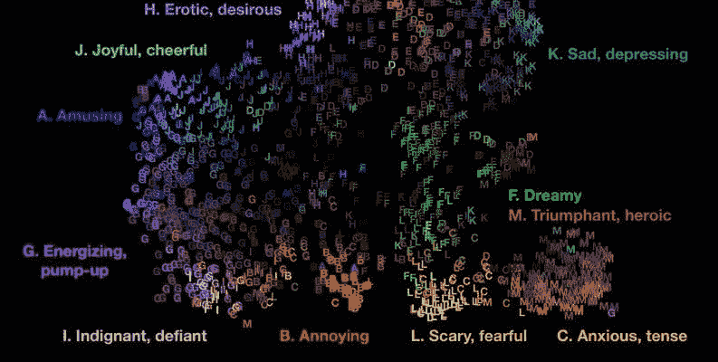

来源：[DEAM 数据集 - 音乐中的情感分析](https://www.kaggle.com/datasets/imsparsh/deam-mediaeval-dataset-emotional-analysis-in-music)

例如，你可以训练一个单独的机器学习模型，使用音频特征，如 MFCCs 和谱对比度，来预测每首歌的情感内容。

另一个模型可以使用歌词来预测每首歌的情感内容，歌词通过词袋模型或词嵌入等技术表示。

训练各个单独模型后，可以使用后期融合方法将每个模型的预测结果结合起来，以生成最终预测。

# 多模态学习挑战

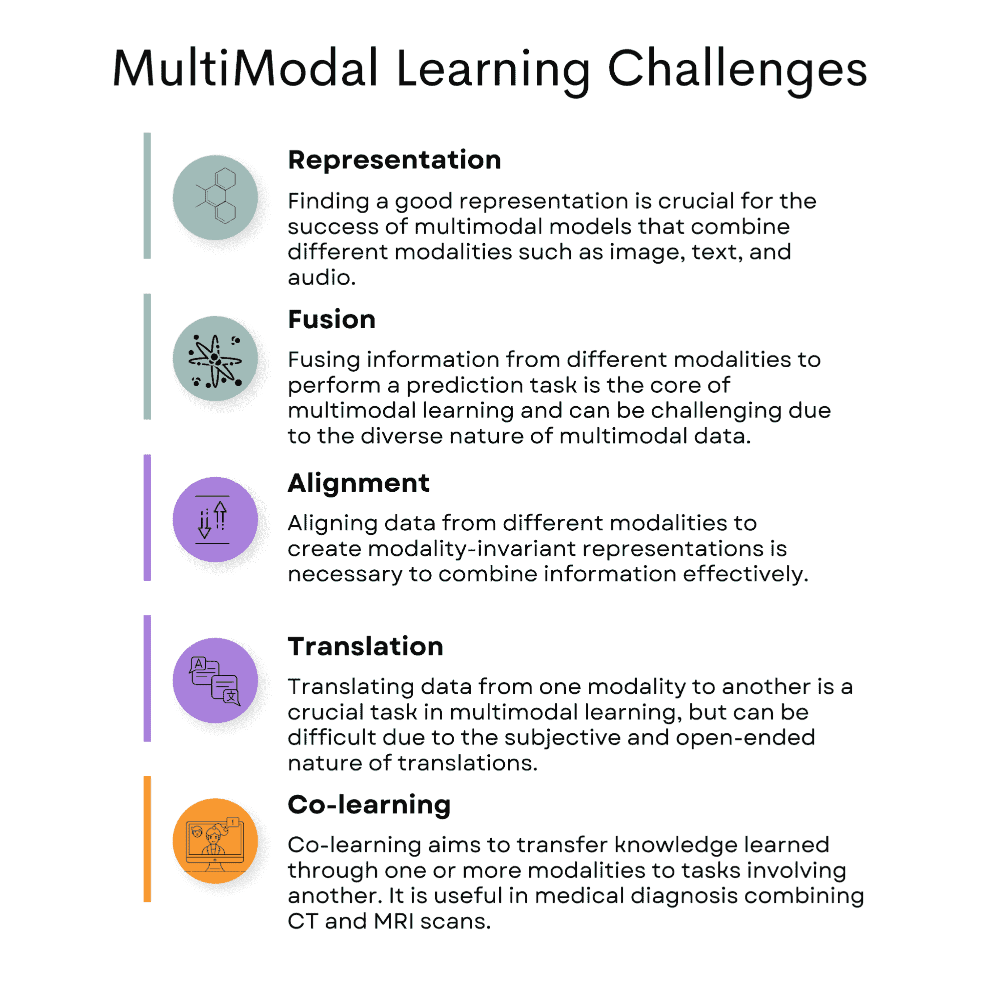

图片由作者提供

## 表示

多模态数据可以来自不同的模态，如文本和音频。将它们以保留其个性特征同时捕捉它们之间关系的方式结合起来是具有挑战性的。

这可能导致模型无法很好地泛化、对某一模态有偏见，或者不能有效地捕捉联合信息等问题。

为了解决多模态学习中的表示问题，可以采用几种策略：

**联合表示**：如前所述，这种方法涉及将两个模态编码到一个共享的高维空间中。可以使用基于深度学习的融合方法来学习最佳的联合表示。

**协调表示**：这种方法不是直接融合模态，而是保持每个模态的独立编码，但确保它们的表示是相关的并传达相同的意义。可以使用对齐或注意力机制来实现这种协调。

### 图像-标题对

[MS COCO 数据集](https://cocodataset.org/)在计算机视觉和自然语言处理研究中被广泛使用，包含了许多具有各种背景的对象图像，以及描述图像内容的多个文本标题。

在处理 MS COCO 数据集时，处理表示挑战的两种主要策略是联合表示和协调表示。

**联合表示**：通过结合两个模态的信息，模型可以理解它们的综合意义。例如，你可以使用一个深度学习模型，设计处理和合并图像和文本数据特征的层。这会产生一个捕捉图像和标题之间关系的联合表示。

**协调表示**：在这种方法中，图像和标题是分开编码的，但它们的表示是相关的，并传达相同的意义。模型不直接融合模态，而是保持每个模态的独立编码，同时确保它们在意义上的关联。

在处理 MS COCO 数据集时，可以使用联合表示和协调表示策略，以有效应对多模态学习的挑战，并创建能够处理和理解视觉与文本信息之间关系的模型。

## 融合

融合是一种在多模态学习中使用的技术，用于将来自不同数据模态的信息（如文本、图像和音频）结合起来，以创建对特定情况或背景的更全面理解。融合过程帮助模型基于综合信息做出更好的预测和决策，而不是依赖单一模态。

多模态学习中的一个挑战是确定最佳的融合方式。不同的融合技术可能对特定任务或情况更有效，找到合适的方法可能会很困难。

### 电影评分

作者提供的图片

在多模态学习中的一个实际例子是电影推荐系统。在这种情况下，系统可能会使用文本数据（电影描述、评论或用户档案）、音频数据（原声带、对话）和视觉数据（电影海报、视频片段）来生成个性化的推荐。

融合过程将这些不同来源的信息结合起来，以创建对用户偏好和兴趣的更准确和有意义的理解，从而提供更好的电影推荐。

适合开发融合电影推荐系统的一个实际数据集是 [MovieLens 数据集](https://grouplens.org/datasets/movielens/)。MovieLens 是由明尼苏达大学 GroupLens 研究项目收集的一组电影评分和元数据，包括用户生成的标签。数据集中包含关于电影的信息，如标题、类型、用户评分和用户档案。

为了使用 MovieLens 数据集创建一个多模态电影推荐系统，你可以将文本信息（电影标题、类型和标签）与额外的视觉数据（电影海报）和音频数据（原声带、对话）结合起来。你可以从其他来源（如 IMDB 或 TMDB）获取电影海报和音频数据。

### 融合可能会面临什么挑战？

在将多模态学习应用于此数据集时，融合可能会面临挑战，因为你需要确定最有效的方式来结合不同的模态。

例如，你需要找到文本数据（类型、标签）、视觉数据（海报）和音频数据（原声带、对话）在推荐任务中的重要性之间的正确平衡。

此外，一些电影可能会缺少或不完整的数据，比如缺少海报或音频样本。

在这种情况下，推荐系统应该足够强大，能够处理缺失的数据，并且根据可用的信息提供准确的推荐。

总结来说，使用 MovieLens 数据集，以及额外的视觉和音频数据，你可以开发一个多模态电影推荐系统，利用融合技术。

然而，在确定最有效的融合方法和处理缺失或不完整的数据时可能会遇到挑战。

## 对齐

对齐在如视听语音识别等应用中是一个关键任务。在这个任务中，音频和视觉模态必须对齐，以准确识别语音。

研究人员使用隐马尔可夫模型和动态时间规整等对齐方法来实现这一同步。

例如，隐马尔可夫模型可以用来建模音频和视觉模态之间的关系，并估计音频波形与视频帧之间的对齐。动态时间规整可以通过在时间上拉伸或压缩数据序列来对齐它们，从而使它们更紧密地匹配。

### 视听语音识别

图片来源：作者

通过对齐 GRID Corpus 数据集中的音频和视觉数据，研究人员可以创建协调的表示，这些表示捕捉了模态之间的关系，然后使用这些表示来准确地使用这两种模态识别语音。

[GRID Corpus 数据集](https://spandh.dcs.shef.ac.uk//gridcorpus/)包含了讲英语的说话者发音句子的视听录音。每个录音包括音频波形和说话者面部的视频，这些视频捕捉了嘴唇和其他面部特征的运动。该数据集在视听语音识别研究中被广泛使用，其目标是利用音频和视觉模态准确识别语音。

## 翻译

翻译是一个常见的多模态挑战，其中不同的数据模态，如文本和图像，必须对齐以创建一致的表示。例如，图像描述任务就是这样一个挑战，其中需要用自然语言描述图像。

在这个任务中，模型需要能够识别图像中的对象和背景，并生成准确传达图像意义的自然语言描述。

这需要对齐视觉和文本模态，以创建协调的表示，捕捉它们之间的关系。

### Dall-E

一幅油画，画中熊猫在西藏冥想

参考：Dall-E

最近的一个多模态翻译模型的例子是 DALL-E2。DALL-E2 是由 OpenAI 开发的神经网络模型，它可以根据文本描述生成高质量的图像。它也可以根据图像生成文本描述，从而有效地在视觉和文本模态之间进行翻译。

DALL-E2 通过学习一个联合表示空间来实现这一点，该空间捕捉了视觉模态和文本模态之间的关系。

模型在一个大规模的图像-标题对数据集上进行训练，学习将图像与其对应的标题关联。然后，它可以通过从学习的表示空间中采样来生成图像，也可以通过解码学习的表示从图像生成文本描述。

总体而言，多模态翻译是一个重大挑战，需要对不同的数据模态进行对齐以创建协调的表示。像 DALL-E2 这样的模型可以通过学习联合表示空间来捕捉视觉和文本模态之间的关系，并应用于图像描述和视觉问答等任务。

## 共学习

多模态共学习旨在将通过一个或多个模态学到的知识转移到涉及其他任务中。

共学习在低资源目标任务中，完全/部分缺失或噪声模态尤其重要。

然而，找到有效的知识转移方法以保持语义含义是在多模态学习中的一个重大挑战。

在医学诊断中，不同的医学成像模态，如 CT 扫描和 MRI 扫描，提供了对诊断的互补信息。多模态共学习可以用来结合这些模态，以提高诊断的准确性。

### 多模态肿瘤分割

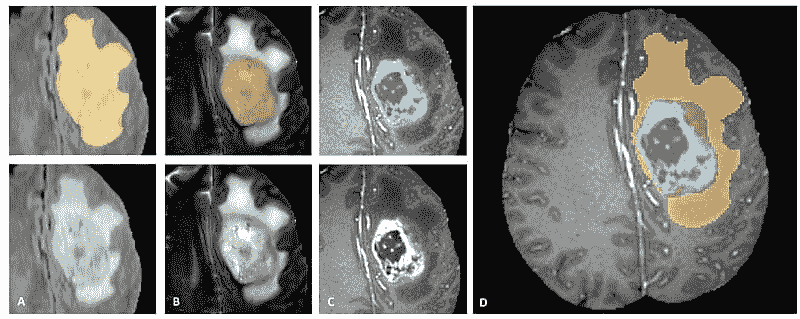

来源：[`www.med.upenn.edu/sbia/brats2018.html`](https://www.med.upenn.edu/sbia/brats2018.html)

例如，在脑肿瘤的情况下，MRI 扫描提供了高分辨率的软组织图像，而 CT 扫描提供了骨结构的详细图像。结合这些模态可以提供患者病情的完整图像，并指导治疗决策。

包括脑肿瘤的 MRI 和 CT 扫描的多模态[脑肿瘤分割（BraTS）数据集](https://www.kaggle.com/datasets/sanglequang/brats2018)用于多模态共学习。该数据集包含脑肿瘤的 MRI 和 CT 扫描以及肿瘤区域分割的注释。

为了实施包含脑肿瘤的 MRI 和 CT 扫描的共学习，我们需要开发一种将两种模态的信息结合起来以提高诊断准确性的方式。一种可能的方法是使用在 MRI 和 CT 扫描上训练的多模态深度学习模型。

# 多模态学习的流行应用

我们将提到多模态学习的其他几个应用，如语音识别和自动驾驶汽车。

## 语音识别

图片来源：作者

多模态学习可以通过结合音频和视觉数据来提高语音识别的准确性。

例如，多模态模型可以同时分析语音的音频信号和对应的唇部运动，以提高语音识别的准确性。通过结合音频和视觉模态，多模态模型可以减少噪音和语音信号变异的影响，从而提高语音识别性能。

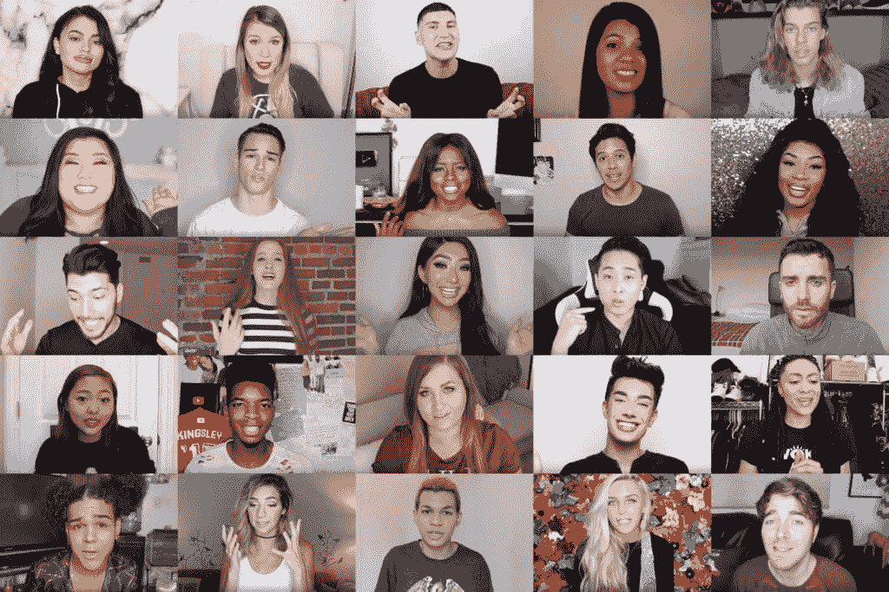

来源: [CMU-MOSEI 数据集](http://multicomp.cs.cmu.edu/resources/cmu-mosei-dataset/)

一个可以用于语音识别的多模态数据集例子是[CMU-MOSEI 数据集](http://multicomp.cs.cmu.edu/resources/cmu-mosei-dataset/)。这个数据集包含了 1,000 名 YouTube 讲者发音的 23,500 个句子，并包括讲者的音频和视觉数据。

该数据集可以用于开发用于情感识别、情绪分析和说话人识别的多模态模型。

通过将语音的音频信号与说话者的视觉特征结合起来，多模态模型可以提高语音识别和其他相关任务的准确性。

## 自动驾驶汽车

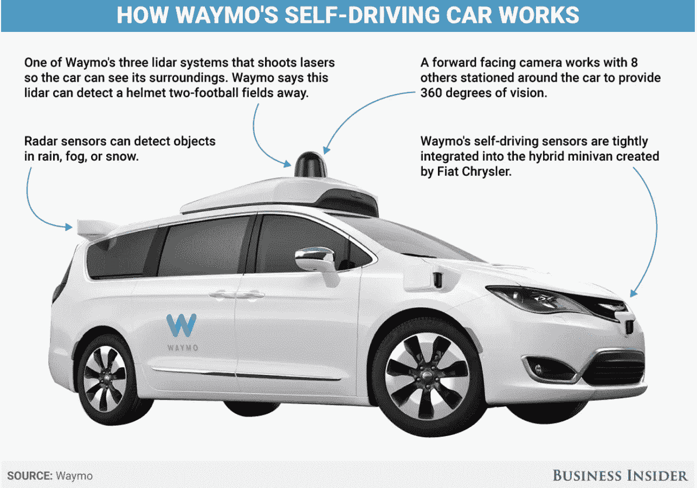

来源: [Waymo; Business Insider](https://www.businessinsider.in/transportation/heres-how-waymos-brand-new-self-driving-cars-see-the-world/articleshow/56648715.cms)

多模态学习可以通过整合来自多个传感器的信息来增强机器人的能力。

例如，在开发自动驾驶汽车时，这一点至关重要，因为这些汽车依赖于来自多个传感器的信息，如摄像头、激光雷达和雷达，以进行导航和决策。

多模态学习可以帮助整合这些传感器的信息，使汽车能够更准确、高效地感知和反应环境。

一个自动驾驶汽车数据集的例子是[Waymo 开放数据集](https://waymo.com/open/)，它包括 Waymo 自动驾驶汽车的高分辨率传感器数据，以及车辆、行人和骑自行车者等物体的标签。Waymo 是谷歌的自动驾驶汽车公司。

该数据集可以用于开发和评估用于自动驾驶汽车相关任务的多模态模型，如物体检测、跟踪和预测。

## 语音录音分析

作者提供的图片

[语音录音分析项目](https://platform.stratascratch.com/data-projects/voice-recordings-analysis?utm_source=blog&utm_medium=click&utm_campaign=kdn+multimodal+models)是在 Sandvik 的数据科学职位面试过程中提出的。它是多模态学习应用的一个优秀例子，因为它试图基于音频数据中的语音特征预测一个人的性别。

在这种情况下，问题涉及分析和处理来自两个不同模态的信息：音频信号和文本特征。这些模态提供了宝贵的信息，可以提高预测模型的准确性和有效性。

扩展该项目的多模态特性：

### 音频信号

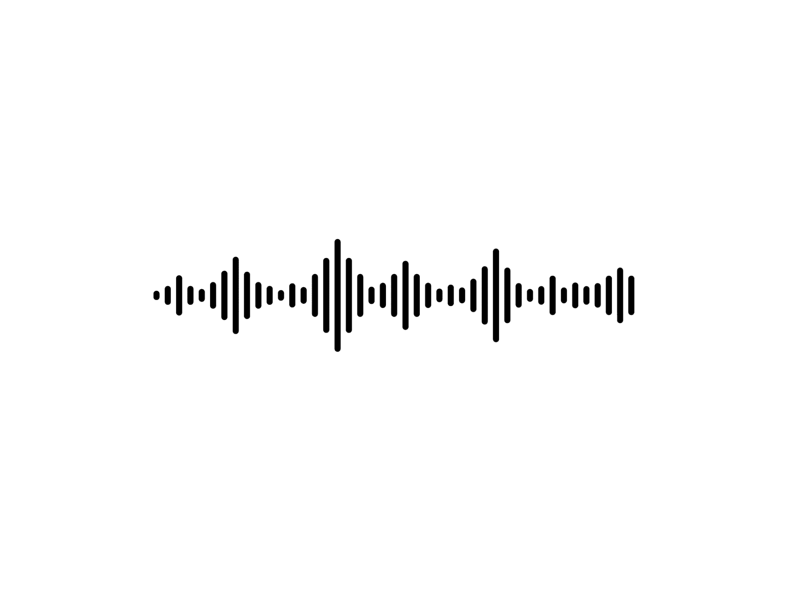

作者提供的图像

本项目的主要数据来源是英语男性和女性声音的音频录音。这些音频信号包含了关于说话者声音特征的丰富而复杂的信息。通过提取这些音频信号中的相关特征，如音高、频率和谱熵，模型可以识别与性别特定声音属性相关的模式和趋势。

### 文本特征

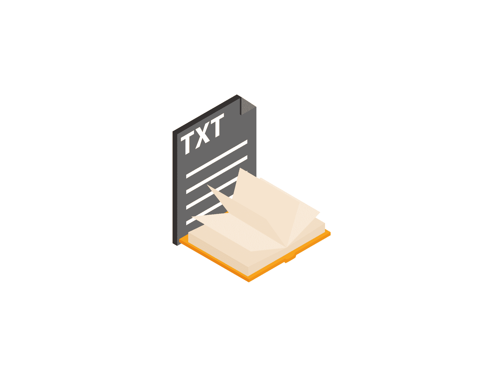

作者提供的图像

每个音频录音都附带一个文本文件，该文件提供有关样本的重要信息，如说话者的性别、所说语言以及说话者所说的短语。这个文本文件不仅为训练和评估机器学习模型提供了真实标签（性别标签），还可以与音频数据结合创建额外的特征。通过利用文本文件中的信息，模型可以更好地理解每个音频样本的上下文和内容，从而可能提高其整体预测性能。

因此，语音录音分析项目通过利用来自多种模态的数据、音频信号和文本特征来预测一个人的性别，从而体现了多模态学习应用的实例。

这种方法强调在开发机器学习模型时考虑不同数据类型的重要性，因为这有助于发现隐藏的模式和关系，这些模式和关系在单独分析每种模态时可能不会显现出来。

# 结论

总之，多模态学习已成为整合多样数据以提高[机器学习算法](https://www.stratascratch.com/blog/machine-learning-algorithms-you-should-know-for-data-science/?utm_source=blog&utm_medium=click&utm_campaign=kdn+multimodal+models)精度的强大工具。结合不同的数据类型，包括文本、音频和视觉信息，可以产生更稳健和准确的预测。这在语音识别、文本与图像融合以及自动驾驶汽车行业尤为重要。

然而，多模态学习确实存在若干挑战，如表示、融合、对齐、翻译和共同学习等问题。这需要谨慎考虑和关注。

尽管如此，随着机器学习技术和计算能力的不断发展，我们可以预见未来几年会出现更先进的多模态技术。

**[内特·罗西迪](https://www.stratascratch.com)** 是一名数据科学家，专注于产品战略。他还是一名兼职教授，教授分析学，并且是 [StrataScratch](https://www.stratascratch.com/) 的创始人，这个平台帮助数据科学家准备来自顶级公司的真实面试问题。可以在 [Twitter: StrataScratch](https://twitter.com/StrataScratch) 或 [LinkedIn](https://www.linkedin.com/in/nathanrosidi/) 上与他联系。

### 更多相关主题

+   [基于视觉和语言的多模态基础学习](https://www.kdnuggets.com/2022/11/multimodal-grounded-learning-vision-language.html)

+   [NExT-GPT 介绍：任意到任意的多模态大型语言模型](https://www.kdnuggets.com/introduction-to-nextgpt-anytoany-multimodal-large-language-model)

+   [三种难度等级解释的大型语言模型](https://www.kdnuggets.com/large-language-models-explained-in-3-levels-of-difficulty)

+   [5 分钟解释 5 种机器学习模型](https://www.kdnuggets.com/5-machine-learning-models-explained-in-5-minutes)

+   [决策树算法解释](https://www.kdnuggets.com/2020/01/decision-tree-algorithm-explained.html)

+   [键值数据库解释](https://www.kdnuggets.com/2021/04/nosql-explained-understanding-key-value-databases.html)
