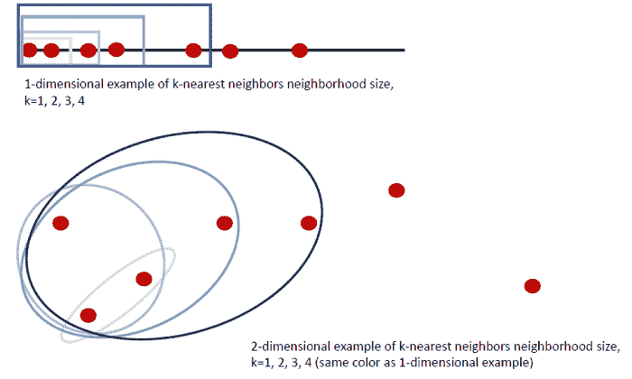
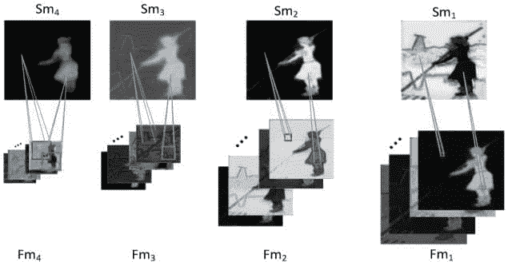

# 多尺度方法与机器学习

> 原文：[`www.kdnuggets.com/2018/03/multiscale-methods-machine-learning.html`](https://www.kdnuggets.com/2018/03/multiscale-methods-machine-learning.html)

 评论

多尺度方法，即在不同尺度下查看和分析数据集，近年来在机器学习中变得越来越普遍，并且被证明是有价值的工具。它们的核心是捕捉由一系列点之间的距离或最近邻的集合定义的邻域的局部几何形状。这有点像通过一系列显微镜分辨率来观察幻灯片的一部分。在高分辨率下，非常小的特征会在样本的一个小空间内被捕捉。在低分辨率下，更多的幻灯片区域可见，人们可以研究更大的特征。多尺度方法的主要优点包括相对于最先进的方法性能的提升，以及实现这些结果所需样本量的显著减少。

举一个简单的例子，考虑在数轴或二维空间中取最近邻的均值。当 k 增加时，数轴上点集的均值变得更加分散，较远的邻居对均值的影响大于较近的邻居。在数轴示例中，假设点位于 1、2、4、5、9、11 和 14。考虑最左边点（在 1）及其 3 个最近邻：2、4 和 5。该集合的均值是 3，其中有 2 个点的值较高，2 个点的值较低。当 9 作为点 1 的第 4 个最近邻加入集合时，均值跳到 4.2，这个均值偏向于点 9，而不是那 4 个值接近的点。检查点 1 的 3 个最近邻的均值揭示了一个具有相似值和方差的点集。然而，检查点 1 的 4 个最近邻则捕捉到了一个离群点。具有单一 k 值的 KNN 均值函数无法捕捉这些在不同尺度下出现的重要局部属性，从而导致重要信息的丢失。

* * *

## 我们的前三大课程推荐

 1\. [Google 网络安全证书](https://www.kdnuggets.com/google-cybersecurity) - 快速进入网络安全职业轨道

 2\. [Google 数据分析专业证书](https://www.kdnuggets.com/google-data-analytics) - 提升你的数据分析水平

 3\. [Google IT 支持专业证书](https://www.kdnuggets.com/google-itsupport) - 为你的组织提供 IT 支持

* * *

并非所有的多尺度方法都依赖于 KNN 定义的尺度，但它们确实使用了类似的原理，使得方法可以在数据集中学习多尺度特征。将点在一系列距离内分组、提供不同尺度的卷积序列以及采用集群层次结构是多尺度方法中的常见选择。Pelt 和 Sethian（2017）的一篇基于多尺度方法的深度学习论文能够在多达 6 张图像的小训练集上以高精度（>90%）进行图像分割和图像分类；该算法显著减少了深度学习框架的调参需求。另一篇深度学习论文（Xiao 等，2018）将全局图像特征与一系列局部提取（在卷积层中，见下图）结合起来，以捕捉单一深度学习框架中的多种图像特征尺度。该算法在多个基准数据集上 consistently 优于最新的深度学习算法，表明多尺度方法可以进一步改进最先进的卷积网络。

最近关于 k-近邻（KNN）回归和分类集成方法在使用不同邻域大小时显示出了显著的改进，不仅比单一 k 值的 KNN 算法表现更好，还超越了其他机器学习方法。拓扑数据分析（TDA）的多尺度工具，包括持久同调，帮助分析了小型数据集、图像、视频和其他类型的数据，为数据科学家和机器学习研究人员提供了一个强大且通用的无监督学习工具。最近添加的 TDA 工具 Mapper 上的多尺度组件改善了算法的理论稳定性，并产生了一致的结果。

存在多尺度方法的替代方案，但它们通常伴随一定的成本。与使用小样本训练样本来提高性能和计算时间相比，许多方法要么提供了改进的性能，要么减少了所需的样本量。贝叶斯方法，近年来多尺度方法的主要竞争者，已减少了深度学习算法良好性能所需的样本量，但其计算成本很高，这可能不适合在线算法使用或在工业中快速分析。这些方法还需要高水平的统计专业知识，而许多实践者可能没有。近年来，深度学习已成为一种普遍的通用工具，但其力量似乎在于渐近性质。深度学习算法在样本量足够大时不会停滞不前，而是随着样本量的进一步增加而不断提高。这在数据量充足时是令人期望的，但许多工业用例和研究问题涉及的是小数据集或有限的类别样本。

看起来局部几何结构很重要。对一个邻域而言相关和重要的内容，可能对围绕原始邻域的更大邻域来说并不相关或重要，检查多个尺度可以帮助捕捉所有重要特征，而不是仅仅依赖于邻域所提供的最佳特征子集。鉴于多尺度方法在各种学习任务中的成功及其对多种算法的增强，预计未来几年机器学习将会出现更多结合多尺度子集的算法。

参考文献

Dey, T. K., Mémoli, F., & Wang, Y. (2016). 多尺度映射器：通过余域覆盖的拓扑总结。在*第二十七届 ACM-SIAM 离散算法年会论文集*（第 997-1013 页）。工业与应用数学学会。

Farrelly, C. M. (2017). KNN 集成方法用于 Tweedie 回归：多尺度邻域的力量。*arXiv 预印本 arXiv:1708.02122*。

Pelt, D. M., & Sethian, J. A. (2017). 一种用于图像分析的混合尺度密集卷积神经网络。*美国国家科学院院刊*, 201715832。

Xia, K., & Wei, G. W. (2014). 蛋白质结构、灵活性和折叠的持久同调分析。*生物医学工程数值方法国际期刊*, *30*(8), 814-844。

Xiao, F., Deng, W., Peng, L., Cao, C., Hu, K., & Gao, X. (2018). MSDNN：用于显著目标检测的多尺度深度神经网络。*arXiv 预印本 arXiv:1801.04187*。

**简介：[Colleen M. Farrelly](https://www.linkedin.com/in/colleenmfarrelly)** 是一位数据科学家，拥有涉及医疗保健、教育、生物技术、营销和金融的行业经验。她的研究领域包括拓扑/拓扑数据分析、集成学习、非参数统计、流形学习以及向普通观众解释数学（https://www.quora.com/profile/Colleen-Farrelly-1）。当她不从事数据科学时，她是一位诗人和作者（https://www.amazon.com/Colleen-Farrelly/e/B07832WQG7）。

**相关内容：**

+   [机器学习新手的十大算法巡礼](https://www.kdnuggets.com/2018/02/tour-top-10-algorithms-machine-learning-newbies.html)

+   [关于深度学习的深层误解](https://www.kdnuggets.com/2018/03/deep-misconceptions-about-deep-learning.html)

+   [如何高效进行机器学习](https://www.kdnuggets.com/2018/03/machine-learning-efficiently.html)

### 更多相关话题

+   [机器学习中的替代特征选择方法](https://www.kdnuggets.com/2021/12/alternative-feature-selection-methods-machine-learning.html)

+   [理解 Python 的迭代和成员资格：__contains__ 和 __iter__ 魔法方法指南](https://www.kdnuggets.com/understanding-pythons-iteration-and-membership-a-guide-to-__contains__-and-__iter__-magic-methods)

+   [k-means 聚类的质心初始化方法](https://www.kdnuggets.com/2020/06/centroid-initialization-k-means-clustering.html)

+   [Python 字符串方法](https://www.kdnuggets.com/2022/12/python-string-methods.html)

+   [数据科学方法推动业务成功](https://www.kdnuggets.com/2023/10/nwu-data-science-methods-drive-business-success)

+   [每个程序员都应该知道的 11 个 Python 魔法方法](https://www.kdnuggets.com/11-python-magic-methods-every-programmer-should-know)
