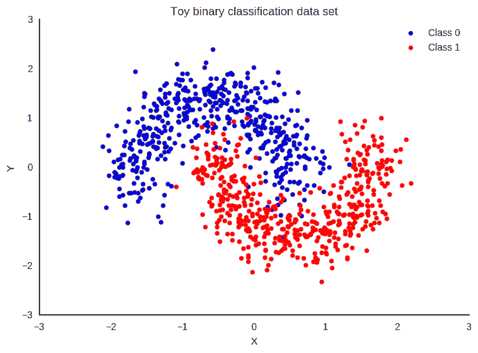

# 必知：如何评估二分类器

> 原文：[`www.kdnuggets.com/2017/04/must-know-evaluate-binary-classifier.html`](https://www.kdnuggets.com/2017/04/must-know-evaluate-binary-classifier.html)
> 
> **编辑注释：** 本文最初作为我们 17 个必须知道的数据科学面试问题及答案系列中的一个问题的回答进行发布。由于答案足够详尽，故认为应有独立的帖子。

二分类涉及将数据分为两组，例如，基于性别、年龄、位置等独立变量，判断客户是否购买特定产品（是/否）。

* * *

## 我们的前三个课程推荐

 1\. [Google 网络安全证书](https://www.kdnuggets.com/google-cybersecurity) - 快速进入网络安全职业

 2\. [Google 数据分析专业证书](https://www.kdnuggets.com/google-data-analytics) - 提升你的数据分析技能

 3\. [Google IT 支持专业证书](https://www.kdnuggets.com/google-itsupport) - 支持你的组织在 IT 方面

* * *



玩具二分类数据集 ([source](http://pymc-devs.github.io/pymc3/notebooks/bayesian_neural_network_advi.html))。

由于目标变量不是连续的，二分类模型预测目标变量为是/否的概率。为了评估这样的模型，使用一种叫做混淆矩阵的指标，也称为分类矩阵或偶然矩阵。借助混淆矩阵，我们可以计算重要的性能指标。

1.  真阳性率（TPR）或命中率或召回率或灵敏度 = TP / (TP + FN)

1.  假阳性率 (FPR) 或假警报率 = 1 - 特异性 = 1 - (TN / (TN + FP))

1.  准确率 = (TP + TN) / (TP + TN + FP + FN)

1.  错误率 = 1 – 准确率 或 (FP + FN) / (TP + TN + FP + FN)

1.  精确度 = TP / (TP + FP)

1.  F-measure: 2 / ( (1 / 精确度) + (1 / 召回率) )

1.  ROC（接收者操作特征）= FPR 与 TPR 的图示

1.  AUC（曲线下面积）

1.  Kappa 统计量

你可以在这里找到关于这些指标的更多细节：衡量分类模型准确性的最佳指标。

所有这些指标都应结合领域技能和综合考虑，例如，如果你仅在预测没有癌症的患者时获得更高的 TPR，这对癌症诊断毫无帮助。

在癌症诊断数据的相同示例中，如果只有 2%或更少的患者有癌症，那么这就是一个类别不平衡的情况，因为癌症患者的比例相比其他人群非常小。处理这一问题主要有两种方法：

1.  **使用成本函数**：在这种方法中，通过成本矩阵（类似于混淆矩阵，但更关注假阳性和假阴性）评估与数据分类错误相关的成本。主要目的是减少分类错误的成本。假阴性的成本总是高于假阳性的成本。例如，将癌症患者错误预测为无癌症比将无癌症患者错误预测为癌症更危险。

```py
   Total Cost = Cost of FN * Count of FN + Cost of FP * Count of FP

```

1.  **使用不同的采样方法**：在这种方法中，你可以使用过采样、欠采样或混合采样。在过采样中，通过复制少数类观测值来平衡数据。观测值的复制会导致过拟合，从而在训练中表现良好但在未见数据中的准确性较低。在欠采样中，删除多数类观测值会导致信息丢失。这有助于减少处理时间和存储，但仅在你拥有大量数据集时才有用。

有关类别不平衡的更多信息，请点击这里。

如果目标变量中有多个类别，则会形成一个维度等于类别数的混淆矩阵，并可以为每个类别计算所有性能指标。这称为多类别混淆矩阵。例如，如果响应变量中有 3 个类别 X、Y、Z，则每个类别的召回率将按以下方式计算：

```py
   Recall_X = TP_X/(TP_X+FN_X)

   Recall_Y = TP_Y/(TP_Y+FN_Y)

   Recall_Z = TP_Z/(TP_Z+FN_Z)

```

**相关：**

+   17 个必须知道的数据科学面试问题及答案

+   21 个必须知道的数据科学面试问题及答案

+   必须知道：为什么在机器学习模型中使用更少的预测变量可能更好？

### 更多相关话题

+   [使用 PyCaret 进行二分类的介绍](https://www.kdnuggets.com/2021/12/introduction-binary-classification-pycaret.html)

+   [评估你的机器学习模型的（更好）方法](https://www.kdnuggets.com/2022/01/much-better-approach-evaluate-machine-learning-model.html)

+   [评估 LLMs 的更好方法](https://www.kdnuggets.com/a-better-way-to-evaluate-llms)

+   [从理论到实践：构建 k 最近邻分类器](https://www.kdnuggets.com/2023/06/theory-practice-building-knearest-neighbors-classifier.html)
