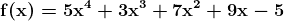

# MXNet 张量基础和简单自动微分的速成课程

> 原文：[`www.kdnuggets.com/2018/08/mxnet-tensor-basics-simple-derivatives.html`](https://www.kdnuggets.com/2018/08/mxnet-tensor-basics-simple-derivatives.html)

 评论

我原本打算很早之前就玩弄 MXNet，大约在 Gluon 公共发布的时候。事情变得忙碌了，我被分散了注意力。

我最近终于开始使用 MXNet。为了了解我的工作方式，我认为覆盖一些基础知识，比如张量和导数的处理，可能是一个好的开始（就像我在 这里 和 这里与 PyTorch 所做的那样）。

这不会一步步重复之前的 PyTorch 文章中的内容，所以如果你想要进一步的背景，可以查看那些文章。下面的内容应该相对简单明了。


[MXNet](https://mxnet.apache.org/) 是一个开源神经网络框架，一个“灵活且高效的深度学习库。” [Gluon](https://gluon-crash-course.mxnet.io/) 是 MXNet 的命令式高级 API，它提供了额外的灵活性和易用性。你可以把 MXNet 和 Gluon 之间的关系看作类似于 TensorFlow 和 Keras。我们在这里不会进一步介绍 Gluon，但会在未来的文章中探索它。

MXNet 的张量实现以 `[ndarray](https://mxnet.apache.org/api/python/ndarray/ndarray.html)` 包的形式存在。在这里，你将找到构建多维（*n*维）数组所需的内容，并执行一些实现神经网络所需的操作，以及 [`autograd`](http://mxnet.apache.org/api/python/autograd/autograd.html) 包。我们将在下面利用这个包。

**`ndarray`（非常）基础**

首先，让我们从库中导入我们需要的内容，以简化 API 调用：

```py
import mxnet as mx
from mxnet import autograd as ag
from mxnet import nd

```

现在，让我们在 CPU 上创建一个基本的 `ndarray`：

```py
# Create CPU array
a = nd.ones((3, 2))
print(a)

```

```py

[[1\. 1.]
 [1\. 1.]
 [1\. 1.]]
<NDArray 3x2 @cpu(0)>
```

注意，打印 `ndarray` 也会打印出对象的类型（再次是 `NDArray`），以及其大小和附加的设备（在这个例子中是 CPU）。

如果我们想用 GPU 创建一个 `ndarray` 对象 [上下文](https://mxnet-test.readthedocs.io/en/latest/api/context.html)（注意上下文是指用于在对象上执行操作的设备类型和 ID）怎么办？首先，让我们确定是否有 [GPU 可供 MXNet 使用](https://stackoverflow.com/questions/49076092/is-there-a-way-to-check-if-mxnet-uses-my-gpu)：

```py
# Test if GPU is recognized
def gpu_device(gpu_number=0):
    try:
        _ = mx.nd.array([1, 2, 3], ctx=mx.gpu(gpu_number))
    except mx.MXNetError:
        return None
    return mx.gpu(gpu_number)

gpu_device()

```

```py
gpu(0)
```

这个响应表示存在一个 GPU 设备，其 ID 为 0。

让我们在这个设备上创建一个 `ndarray`：

```py
# Create GPU array
b = nd.zeros((2, 2), ctx=mx.gpu(0))
print(b)

```

```py
[[0\. 0.]
 [0\. 0.]]
<NDArray 2 x 2 @gpu(0)>
```

这里的输出确认创建了一个大小为 2 x 2 的全零 `ndarray`，并且上下文为 GPU。

要获取一个返回的转置`ndarray`（而不仅仅是原始的转置视图）：

```py
# Transpose
T = c.T
print(T)

```

```py
[[1\. 2\. 3.]
 [4\. 5\. 6.]]
<NDArray 2x3 @cpu(0)>
```

重新塑造一个`ndarray`为视图，而不改变原始数据：

```py
# Reshape
r = T.reshape(3,2)
print(r)

```

```py

[[1\. 2.]
 [3\. 4.]
 [5\. 6.]]
<NDArray 3x2 @cpu(0)>
```

一些 ndarray 信息：

```py
# ndarray info
print('ndarray shape:', r.shape)
print('Number of dimensions:', r.ndim)
print('ndarray type:', r.dtype)

```

```py
ndarray shape: (3, 2)
Number of dimensions: 2
ndarray type: <class 'numpy.float32'>
```

[了解更多关于`ndarray`基础知识，请点击这里](https://gluon.mxnet.io/chapter01_crashcourse/ndarray.html)。

**MXNet `ndarray`与 Numpy `ndarray`之间的转换**

从 Numpy `ndarrays`到 MXNet `ndarrays`以及反向的转换很简单。

```py
import numpy as np

# To numpy ndarray
n = c.asnumpy()
print(n)
print(type(n))

```

```py
[[1\. 4.]
 [2\. 5.]
 [3\. 6.]]
<class 'numpy.ndarray'>
```

```py
# From numpy ndarray
a = np.array([[1, 10], [2, 20], [3, 30]])
b = nd.array(a)
print(b)
print(type(b))

```

```py
[[ 1\. 10.]
 [ 2\. 20.]
 [ 3\. 30.]]
 <class 'mxnet.ndarray.ndarray.NDArray'>
```

**矩阵-矩阵乘法**

这是计算矩阵-矩阵点积的方法：

```py
# Compute dot product
t1 = nd.random.normal(-1, 1, shape=(3, 2))
t2 = nd.random.normal(-1, 1, shape=(2, 3))
t3 = nd.dot(t1, t2)
print(t3)

```

```py
[[1.8671514 2.0258508 1.1915313]
 [9.009048  8.481084  6.7323728]
 [5.0241795 4.346245  4.0459785]]
<NDArray 3x3 @cpu(0)>
```

[了解更多关于`ndarray`的线性代数操作，请点击这里](https://gluon.mxnet.io/chapter01_crashcourse/linear-algebra.html)。

**使用 autograd 查找和解决导数**

继续使用 MXNet 的`[autograd](http://mxnet.apache.org/api/python/autograd/autograd.html)`包来解决导数的自动微分。

首先，我们需要一个用于计算导数的函数。随意选择这个：



要查看我们如何手动计算这个函数的一阶导数，并找到给定*x*值的导数函数的值，请参阅这篇文章。

出于显而易见的原因，我们必须以这样的方式在 Python 中表示我们的函数：

```py

y = 5*x**4 + 3*x**3 + 7*x**2 + 9*x - 5
```

现在让我们为给定的*x*值找到导数函数的值。我们随意使用 2：

```py
x = nd.array([2])
x.attach_grad()

with ag.record():
  y = 5*x**4 + 3*x**3 + 7*x**2 + 9*x - 5

y.backward()
x.grad

```

一行一行地，以上代码：

+   将我们想要计算导数的值（2）定义为一个 MXNet ndarray 对象

+   使用`**attach_grad()**`来为计算梯度分配空间

+   用`**ag.record()**`标记的代码块包含了计算和跟踪梯度所需执行的计算

+   定义我们想要计算导数的函数

+   使用 autograd 的**backward()**来计算梯度的总和，使用链式法则

+   输出存储在*x* `ndarray`的**grad**属性中的值，如下所示

```py

tensor([ 233.])
```

这个值 233 与我们手动计算的结果相匹配，请参见这篇文章。

[了解更多关于`autograd`的自动微分，请点击这里](https://gluon.mxnet.io/chapter01_crashcourse/autograd.html)。

这只是对 MXNet 中简单`ndarray`操作和导数的一个非常基础的概述。由于这些是构建神经网络的两个基本要素，这应该能让你对库的这些基本构建块有一些熟悉，并为深入研究更复杂的代码做好准备。下次我们将使用 MXNet 和 Gluon 创建一些简单的神经网络，进一步探索这些库。

要了解更多（现在！）关于 MXNet、Gluon 以及深度学习的内容，那本由这些库的开发和推广人员编写的免费书籍[**深度学习 - 直接真相**](https://gluon.mxnet.io)绝对值得一看。

**相关**：

+   PyTorch 张量基础

+   用 PyTorch 做简单导数

+   Tensor 究竟是什么?!?

* * *

## 我们的三大课程推荐

 1\. [谷歌网络安全证书](https://www.kdnuggets.com/google-cybersecurity) - 快速进入网络安全职业生涯。

 2\. [谷歌数据分析专业证书](https://www.kdnuggets.com/google-data-analytics) - 提升你的数据分析技能

 3\. [谷歌 IT 支持专业证书](https://www.kdnuggets.com/google-itsupport) - 支持你的组织进行 IT 服务

* * *

### 更多相关主题

+   [免费人工智能与深度学习速成课程](https://www.kdnuggets.com/2022/07/free-artificial-intelligence-deep-learning-crash-course.html)

+   [免费 Python 速成课程](https://www.kdnuggets.com/2022/07/free-python-crash-course.html)

+   [免费初学者 MLOps 速成课程](https://www.kdnuggets.com/2022/08/free-mlops-crash-course.html)

+   [免费中级 Python 编程速成课程](https://www.kdnuggets.com/2022/12/free-intermediate-python-programming-crash-course.html)

+   [通过这个免费的 DevOps 速成课程释放你的潜力](https://www.kdnuggets.com/2023/03/corise-unlock-potential-with-this-free-devops-crash-course.html)

+   [什么是张量?!?](https://www.kdnuggets.com/2018/05/wtf-tensor.html)
