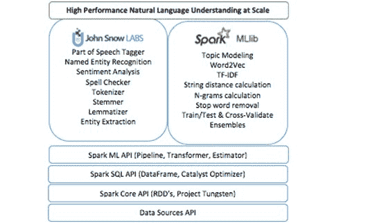
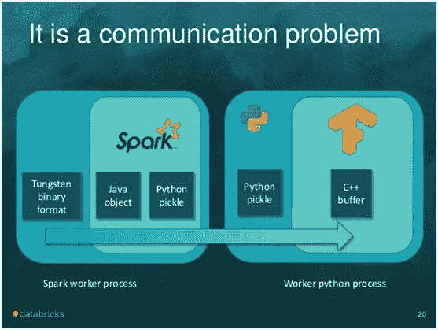
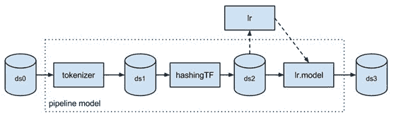

# Apache Spark 的自然语言处理库 – 免费使用

> 原文：[`www.kdnuggets.com/2017/11/natural-language-processing-library-apache-spark.html`](https://www.kdnuggets.com/2017/11/natural-language-processing-library-apache-spark.html)

 评论

**由 [David Talby](https://twitter.com/davidtalby?lang=en)，Usermind 首席技术官**。

Apache Spark 是一个通用集群计算框架，原生支持分布式 SQL、流处理、图处理和机器学习。现在，Spark 生态系统还拥有一个 [Spark 自然语言处理库](https://nlp.johnsnowlabs.com/)。

在 [GitHub](https://github.com/johnsnowlabs/spark-nlp) 上获取或从 [快速入门教程](https://nlp.johnsnowlabs.com/quickstart.html) 开始。

John Snow Labs NLP 库遵循 Apache 2.0 许可，使用 Scala 编写，不依赖其他 NLP 或 ML 库。它本地扩展了 [Spark ML Pipeline API](https://blog.insightdatascience.com/spark-pipelines-elegant-yet-powerful-7be93afcdd42)。你将受益于：

1.  无与伦比的运行时性能，因为处理直接在 Spark DataFrames 上完成，无需任何复制，并充分利用 Spark 的缓存、执行计划和优化的二进制数据格式。

1.  无摩擦地重用现有的 Spark 库，包括分布式主题建模、词嵌入、n-gram 计算、字符串距离计算等。

1.  通过在数据科学管道的自然语言理解、机器学习和深度学习部分使用统一的 API 提高生产力。

“通过 John Snow Labs NLP，我们兑现了使客户能够利用最新开源技术和数据科学中的学术突破的承诺，所有这些都在高性能的企业级代码库中。”，创始团队表示。此外，“John Snow Labs NLP 包含了一系列高效的自然语言理解工具，用于文本挖掘、问答、聊天机器人、事实提取、主题建模或搜索，运行规模和性能在现有技术中尚未出现。”

框架提供了标注器的概念，并且开箱即用：

+   分词器

+   归一化器

+   词干提取器

+   词形还原器

+   实体提取器

+   日期提取器

+   词性标注器

+   命名实体识别

+   句子边界检测

+   情感分析

+   拼写检查器

此外，考虑到与 Spark ML 的紧密集成，在构建 NLP 管道时你可以立即使用更多功能。这包括词嵌入、主题建模、停用词移除、各种特征工程函数（tf-idf、n-grams、相似度度量等）以及将 NLP 注释作为机器学习工作流中的特征。如果你不熟悉这些术语，这个 [理解 NLP 任务的指南](https://www.analyticsvidhya.com/blog/2017/01/ultimate-guide-to-understand-implement-natural-language-processing-codes-in-python/) 是一个好的起点。



我们的虚拟团队已经在构建严重依赖自然语言理解的商业软件多年。因此，我们对 [spaCy](https://spacy.io/)、 [CoreNLP](https://stanfordnlp.github.io/CoreNLP/)、 [OpenNLP](https://opennlp.apache.org/)、 [Mallet](https://mallet.cs.umass.edu/)、 [GATE](https://gate.ac.uk/)、 [Weka](https://www.cs.waikato.ac.nz/ml/weka/)、 [UIMA](https://uima.apache.org/)、 [nltk](https://www.nltk.org/)、 [gensim](https://radimrehurek.com/gensim/)、 [Negex](https://blulab.chpc.utah.edu/content/contextnegex)、 [word2vec](https://code.google.com/archive/p/word2vec/)、 [GloVe](https://nlp.stanford.edu/projects/glove/) 和一些其他工具有实际的经验。

我们是这些库的大粉丝，我们模仿它们的许多地方旨在表达我们诚挚的赞美之情。然而，当我们需要交付可扩展、高性能、高准确度的实际生产软件时，我们也多次撞上了它们的限制。

**性能**

我们解决的三个顶级需求中的第一个是运行时性能。你会认为随着 [spaCy 及其公共基准](https://spacy.io/docs/api/) 的出现，这个问题已经基本解决，它们反映了一个经过深思熟虑和精心实现的权衡集合。然而，在其基础上构建 Spark 应用程序时，你仍会遇到不合理的低吞吐量。

要理解原因，可以考虑 NLP 管道总是数据处理管道的一部分：例如，问题回答涉及加载训练数据、转换数据、应用 NLP 注释器、构建特征、训练价值提取模型、评估结果（训练/测试拆分或交叉验证）和超参数估计。

将数据处理框架（Spark）与 NLP 框架分开意味着你大部分的处理时间都会花在序列化和复制字符串上。

一个很好的类比是 [TensorFrames](https://github.com/databricks/tensorframes)——它显著提高了在 Spark 数据框上运行 TensorFlow 工作流的性能。此图像归功于 [Tim Hunter 的优秀 TensorFrames 概述](https://www.slideshare.net/databricks/tensorframes-google-tensorflow-on-apache-spark)：



Spark 和 TensorFlow 都在性能和规模上进行了极致优化。然而，由于 DataFrames 存在于 JVM 中，而 TensorFlow 运行在 Python 进程中，因此两个框架之间的任何集成都意味着每个对象都必须序列化，经过双向的进程间通信 (!) 并在内存中至少复制两次。TensorFrames 的公开基准报告显示，仅通过在 JVM 进程中复制数据就能获得 4 倍的加速（使用 GPU 时效果更显著）。

当将 spaCy 与 Spark 一起使用时，我们遇到相同的问题：Spark 在加载和转换数据方面高度优化，但运行 NLP 管道需要将所有数据从 Tungsten 优化格式外部复制，序列化，推送到 Python 进程中，运行 NLP 管道（这一部分非常快速），然后将结果重新序列化回 JVM 进程。这自然会消耗你从 Spark 的缓存或执行计划中获得的任何性能收益，需要至少两倍的内存，并且在扩展时没有改善。使用 CoreNLP 消除了复制到另一个进程的需求，但仍然需要将所有文本从数据框中复制并将结果重新复制回来。

所以我们首先的任务是直接对优化后的数据框进行分析，就像 Spark ML 已经做的那样（来源：[Databricks 的 ML Pipelines 介绍文章](https://databricks.com/blog/2015/01/07/ml-pipelines-a-new-high-level-api-for-mllib.html)）：



**生态系统**

我们的第二个核心要求是无摩擦地重用现有的 Spark 库。其中一部分是我们自己的痛点——为什么所有的 NLP 库都必须构建自己的主题建模和词嵌入实现？另一部分是务实的——我们是一个小团队，时间紧迫，需要充分利用现有资源。

当我们开始考虑一个 Spark NLP 库时，我们首先询问了 Databricks，指引我们找出已经在构建这个库的人。当得到的回答是没有这样一个库时，我们的下一个要求是帮助我们确保这个库的设计和 API 完全符合 Spark ML 的 API 指南。这次合作的结果是这个库无缝扩展了 Spark ML，例如你可以构建这种管道：

```py
val pipeline = new mllib.Pipeline().setStages(
Array(docAssembler,tokenizer,stemmer,stopWordRemover,hasher,idf,dtree,labelDeIndex))
```

在这段代码中，文档汇编器、分词器和词干提取器来自 Spark NLP 库——com.jsl.nlp.* 包。TF 哈希器、IDF 和 labelDeIndex 都来自 MLlib 的 org.apache.spark.ml.feature.* 包。dtree 阶段是 spark.ml.classification.DecisionTreeClassifier。

所有这些阶段都在一个管道内运行，该管道是可配置的、可序列化的和可测试的，并且以完全相同的方式进行。它们还在数据框上运行，而无需复制数据（与 [spark-corenlp](https://spark-packages.org/package/databricks/spark-corenlp) 不同），享受 Spark 的标志性内存优化、并行性和分布式扩展。

这意味着 John Snow Labs NLP 库附带了完全分布式、经过严格测试和优化的 [主题建模](https://medium.com/zero-gravity-labs/lda-topic-modeling-in-spark-mllib-febe84b9432)、[词嵌入](https://spark.apache.org/docs/latest/mllib-feature-extraction.html#word2vec)、n-gram 生成和余弦相似度功能。我们不需要自己构建这些功能——它们是与 Spark 一起提供的。

最重要的是，这意味着你的 NLP 和 ML 管道现在是统一的。上述代码示例是典型的，因为它不仅仅是一个 NLP 管道——NLP 用于生成特征，然后用这些特征训练决策树。这在问答任务中很常见。一个更复杂的例子还会应用命名实体识别，按 POS 标签和共指解析过滤；训练随机森林，考虑 NLP 基于的特征和其他来源的结构化特征；并使用网格搜索进行超参数优化。能够使用统一的 API 在需要测试、重现、序列化或发布这样的管道时非常有利——甚至超出了性能和重用的好处。

**企业级**

我们的第三个核心要求是提供一个任务关键型、企业级的 NLP 库。我们的工作是构建生产软件。许多当前最受欢迎的 NLP 包具有学术背景——这在设计权衡中表现出来，例如优先考虑原型设计的简便性而非运行时性能，选项的广度而非简单的简约 API，以及对可扩展性、错误处理、节省内存和代码重用的轻视。

John Snow Labs NLP 库是用 Scala 编写的。它包括用于 Spark 的 Scala 和 Python API。它不依赖于任何其他 NLP 或 ML 库。对于每种类型的注释器，我们会进行学术文献综述以找出最先进的技术，进行团队讨论并决定要实现哪些算法。实现根据三个标准进行评估：

+   **准确性** – 如果框架有低于标准的算法或模型，那么再好的框架也没有意义。

+   **性能** – 运行时应该与任何公共基准相当或更好。没有人应该因为注释器的速度不够快以处理流式用例，或在集群设置中扩展性不好而牺牲准确性。

+   **可训练性或可配置性** – NLP 是一个固有的领域特定问题。社交媒体帖子、学术论文、SEC 文件、电子病历和报纸文章使用了不同的语法和词汇。

该库已经在企业项目中使用，这意味着第一层次的错误、重构、意外瓶颈和序列化问题已得到解决。单元测试覆盖率和 [参考文档](https://nlp.johnsnowlabs.com/components.html) 已经达到让我们放心将代码开源的水平。

[John Snow Labs](https://www.johnsnowlabs.com/) 是领导和资助 Spark NLP 库开发的公司。该公司为该库提供商业支持、赔偿和咨询服务。这为库提供了长期的财务支持、资助的活跃开发团队以及不断增长的现实世界项目流，推动了库的稳定性和路线图优先级。

**参与方式**

如果你需要 NLP 用于当前项目，请访问 [John Snow Labs NLP for Apache Spark 主页](https://nlp.johnsnowlabs.com/) 或快速入门指南进行尝试。提供预构建的 maven central (Scala) 和 pip 安装 (Python) 版本。通过 nlp@johnsnowlabs.com 或 [Twitter](https://twitter.com/johnsnowlabs)、[LinkedIn](https://www.linkedin.com/company/10349856/) 或 [Facebook](https://www.facebook.com/JohnSnowLabsInc) 发送问题或反馈。

[告诉我们](https://ida-johnsnowlabs.youcanbook.me) 你下一步需要什么功能。

以下是我们收到的一些请求，我们期待更多反馈以设计和优先考虑：

+   提供一个 SparkR 客户端

+   提供“无 Spark”版本的 Java 和 Scala

+   添加最先进的共指消解标注器

+   添加最先进的极性检测标注器

+   添加最先进的时间推理标注器

+   发布适用于常见用例的示例应用程序，如问答、文本摘要或信息检索

+   为新领域或语言训练和发布模型

+   发布可重复、同行评审的准确性和性能基准

如果你想扩展或贡献于该库，可以从克隆 [John Snow Labs NLP for Spark GitHub](https://www.github.com/johnsnowlabs/spark-nlp) 仓库开始。我们使用拉取请求和 GitHub 的问题跟踪器来管理代码更改、错误和功能。该库仍处于初期阶段，我们非常欢迎各种形式的贡献和反馈。

**简历: [David Talby](https://www.linkedin.com/in/davidtalby/)** 是 Usermind 的首席技术顾问，专注于在医疗保健领域应用大数据和数据科学。

**相关**

+   [**[电子书] Apache Spark(tm) 轻松入门**](https://www.kdnuggets.com/2017/11/databricks-ebook-gentle-introduction-apache-spark.html)

+   [**为自然语言处理构建维基百科文本语料库**](https://www.kdnuggets.com/2017/11/building-wikipedia-text-corpus-nlp.html)

+   [**瞬间搜索数百万份文档中的数千个关键词**](https://www.kdnuggets.com/2017/09/search-millions-documents-thousands-keywords.html)

* * *

## 我们的前三名课程推荐

 1\. [Google 网络安全证书](https://www.kdnuggets.com/google-cybersecurity) - 快速进入网络安全职业生涯

 2\. [Google 数据分析专业证书](https://www.kdnuggets.com/google-data-analytics) - 提升你的数据分析技能

 3\. [Google IT 支持专业证书](https://www.kdnuggets.com/google-itsupport) - 支持你的组织进行 IT 支持

* * *

### 相关话题

+   [介绍自然语言处理的测试库](https://www.kdnuggets.com/2023/04/introducing-testing-library-natural-language-processing.html)

+   [自然语言处理中的 N-gram 语言建模](https://www.kdnuggets.com/2022/06/ngram-language-modeling-natural-language-processing.html)

+   [2023 年值得阅读的 5 本自然语言处理免费书籍](https://www.kdnuggets.com/2023/06/5-free-books-natural-language-processing-read-2023.html)

+   [掌握 SQL、Python、数据科学、机器学习和自然语言处理的 25 本免费书籍](https://www.kdnuggets.com/25-free-books-to-master-sql-python-data-science-machine-learning-and-natural-language-processing)

+   [掌握自然语言处理的 5 个免费课程](https://www.kdnuggets.com/5-free-courses-to-master-natural-language-processing)

+   [图像识别和自然语言处理的迁移学习](https://www.kdnuggets.com/2022/01/transfer-learning-image-recognition-natural-language-processing.html)
