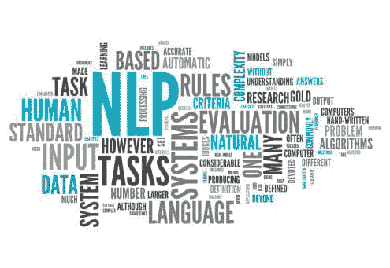
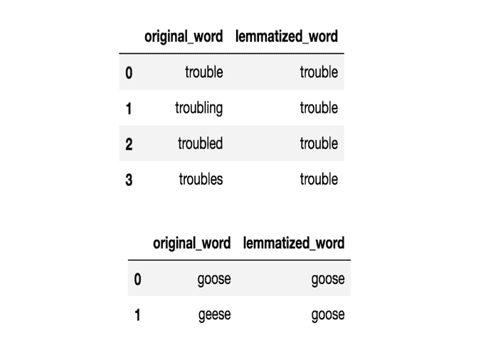

# 自然语言处理管道，详细解释

> 原文：[`www.kdnuggets.com/2021/03/natural-language-processing-pipelines-explained.html`](https://www.kdnuggets.com/2021/03/natural-language-processing-pipelines-explained.html)

评论

**由 [Ram Tavva](https://www.linkedin.com/in/ram-tavva/)，高级数据科学家，ExcelR Solutions 董事**



### 介绍

* * *

## 我们的三大课程推荐

 1\. [谷歌网络安全证书](https://www.kdnuggets.com/google-cybersecurity) - 快速进入网络安全职业生涯。

 2\. [谷歌数据分析专业证书](https://www.kdnuggets.com/google-data-analytics) - 提升你的数据分析能力

 3\. [谷歌 IT 支持专业证书](https://www.kdnuggets.com/google-itsupport) - 支持你所在组织的 IT 工作

* * *

计算机最擅长处理结构化数据集，如电子表格和数据库表格。但我们人类几乎不会以这种方式进行沟通，我们的大多数沟通都是以未结构化的格式——句子、单词、语音等，这些对计算机来说是无关的。

这很不幸，数据库中存在大量未结构化的数据。但你是否曾考虑过计算机如何处理这些未结构化数据？

是的，虽然有许多解决方案，但 NLP 始终是改变游戏规则的技术。

让我们详细了解 NLP…

### 什么是 NLP？

NLP 代表[**自然语言处理**](https://www.excelr.com/blog/data-science/natural-language-processing/implementation-of-bag-of-words-using-python)，它自动操作自然语言，例如应用程序和软件中的语音和文本。

语音可以是算法接收的任何文本，算法测量准确性，运行自我和半监督模型，然后在输入数据后以语音或文本的形式给我们期望的输出。

NLP 是最受欢迎的技术之一，它使人与计算机之间的沟通变得更加容易。如果你使用 Windows 系统，可以使用微软 Cortana；如果你使用 macOS 系统，Siri 就是你的虚拟助手。

最棒的是，即使是搜索引擎也配备了虚拟助手。例如：谷歌搜索引擎。

使用 NLP，你可以输入任何你想搜索的内容，或者点击麦克风选项说出来，你就能获得想要的结果。看看 NLP 如何使人与计算机之间的沟通变得更容易。当你看到这一点时，难道不是很惊奇吗？

无论你是想了解天气情况还是互联网的最新消息，或是周末目的地的路线，NLP 都能满足你的所有需求。

### 自然语言处理管道（NLP 管道）

当你在文本或语音上调用 NLP 时，它将整个数据转换成字符串，然后主字符串经过多个步骤（称为处理管道的过程）。它使用训练好的管道来监督你的输入数据，并根据语音语调或句子长度重构整个字符串。

对于每个管道，组件返回到主字符串，然后传递给下一个组件。功能和效率依赖于组件、它们的模型和训练。

### NLP 如何使人与计算机之间的沟通变得简单

NLP 使用语言处理管道来读取、解码和理解人类语言。这些管道由六个主要过程组成。这些过程将整个语音或文本拆分成小块，重构、分析并处理，以从搜索引擎结果页面中获取最相关的数据。

### 这是帮助计算机理解人类语言的 6 个 NLP 管道内部步骤

### 句子分割

当你有段落需要处理时，最佳的方式是逐句进行。这降低了复杂性，简化了过程，甚至能获得最准确的结果。计算机不会像人类那样理解语言，但如果你以正确的方式对待它们，它们总能做很多事情。

例如，考虑上面的段落。然后，你的下一步是将段落拆分成单个句子。

1.  当你有段落需要处理时，最佳的方式是逐句进行。

1.  这降低了复杂性，简化了过程，甚至能获得最准确的结果。

1.  计算机不会像人类那样理解语言，但如果你以正确的方式对待它们，它们总能做很多事情。

```py
# Import the nltk library for NLP processes
import nltk

# Variable that stores the whole paragraph
text = "..."

# Tokenize paragraph into sentences
sentences = nltk.sent_tokenize(text)

# Print out sentences
for sentence in sentences:
	print(sentence)
```

当你有段落需要处理时，最佳的方式是逐句进行。

这降低了复杂性，简化了过程，甚至能获得最准确的结果。

计算机不会像人类那样理解语言，但如果你以正确的方式对待它们，它们总能做很多事情。

### 单词标记化

标记化是将短语、句子、段落或整个文档拆分成最小单元（如单独的单词或术语）的过程。每个小单元称为标记。

这些标记可以是单词、数字或标点符号。基于单词的边界——单词的结束点，或下一个单词的开始。这也是词干提取和词形还原的第一步。

这个过程至关重要，因为通过分析文本中的单词，词义容易被解释。

让我们来看一个例子：

那只狗是一只哈士奇犬。

当你标记化整个句子时，你得到的答案是`[‘That’, ‘dog’, ‘is’, ‘a’, ‘husky’, ‘breed’]`。

你可以用多种方式做到这一点，但我们可以使用这种标记化的形式来：

+   计算句子中的单词数。

+   你还可以测量重复单词的频率。

自然语言工具包（NLTK）是一个用于符号和统计 NLP 的 Python 库。

```py
import nltk

sentence_data = "That dog is a husky breed. They are intelligent and independent."
nltk_tokens = nltk.sent_tokenize(sentence_data)
print (nltk_tokens)
```

输出：

`[‘那只狗是哈士奇品种。’, ‘它们既聪明又独立。’]`

### 每个标记的词性预测

在词性分析中，我们必须考虑每个标记。然后，尝试弄清楚不同的词性——标记是否属于名词、代词、动词、形容词等等。

所有这些都有助于了解我们在谈论哪个句子。

让我们快速了解一些词汇：

**语料库：** 单数形式的文本主体。其复数形式为 corpora。

**词汇表：** 词汇及其含义。

**标记：** 基于规则分割后的每个“实体”。

```py
import nltk 
from nltk.corpus import stopwords 
from nltk.tokenize import word_tokenize, sent_tokenize 

stop_words = set(stopwords.words('english')) 

// Dummy text 
txt = Everything is all about money.\

# sent_tokenize is one of the instances of 
# PunktSentenceTokenizer from the nltk.tokenize.punkt module 
tokenized = sent_tokenize(txt) 

for i in tokenized: 
	# Word tokenizers is used to find the words 
	# and punctuation in a string 
	wordsList = nltk.word_tokenize(i) 
	# removing stop words from wordList 
	wordsList = [w for w in wordsList if not w in stop_words] 
	# Using a Tagger. Which is part-of-speech 
	# tagger or POS-tagger. 
	tagged = nltk.pos_tag(wordsList) 
	print(tagged) 

```

输出：

`[('一切', 'NN'), ('是', 'VBZ'), ('所有', 'DT'),('关于', 'IN'), ('钱', 'NN'), ('.', '.')]`

### 文本词形还原

英语也是一种可以使用各种基本词形式的语言。当在计算机上工作时，它能够理解这些词用于相同概念，即使句子中存在多个具有相同基本词的词汇。这一过程就是我们在 NLP 中称之为词形还原。

这一步骤会进入词汇的根本层面，找出所有可用词汇的基本形式。它们有普通的规则来处理这些词汇，而大多数人对此并不知晓。



### 识别停用词

当你完成词形还原后，下一步是识别句子中的每个词。英语中有很多填充词，它们没有实际意义，但会削弱句子的效果。通常最好省略这些词，因为它们在句子中出现的频率较高。

大多数数据科学家在进行进一步分析之前会删除这些词汇。基本算法通过检查已知的停用词列表来识别停用词，因为没有标准的停用词规则。

一个有助于你更好地理解识别停用词的例子是：

```py
# importing NLTK library stopwords
import nltk
from nltk.corpus import stopwords
nltk.download('stopwords')
nltk.download('punkt')
from nltk.tokenize import word_tokenize

## print(stopwords.words('english'))

# random sentence with lot of stop words
sample_text = "Oh man, this is pretty cool. We will do more such things."

text_tokens = word_tokenize(sample_text)
tokens_without_sw = [word for word in text_tokens if not word in stopwords.words('english')]

print(text_tokens)
print(tokens_without_sw)
```

输出：

带停用词的文本分词：

`[‘哦’, ‘人’, ’,’ ‘这’, ‘是’, ‘挺’, ‘酷’, ‘.’, ‘我们’, ‘将’, ‘做’, ‘更多’, ‘这样的’, ’事情’, ‘.’]`

不带停用词的文本分词：

`[‘哦’, ‘人’, ’,’ ‘挺’, ‘酷’, ‘.’, ‘我们’, ’事情’, ‘.’]`

### 依存句法分析

解析进一步分为三个主要类别。每一类都不同于其他类别。它们是词性标注、依存句法分析和构成短语。

词性标注（POS）主要用于分配不同的标签。这就是我们所说的 POS 标签。这些标签指示了句子中词汇的词性。而在依存短语的情况下：分析句子的语法结构。基于句子中词汇的依赖关系。

而在构成分析中：句子被拆分为子短语。这些子短语属于特定的类别，如名词短语（NP）和动词短语（VP）。

### 结论

在这个博客中，你简要了解了 NLP 流水线如何通过各种 NLP 过程帮助计算机理解人类语言。

从自然语言处理开始，语言处理流程是什么？自然语言处理如何使人类之间的沟通更轻松？以及 NLP 流程中的六个内幕。

自然语言处理流程涉及的六个步骤是 - 句子分割、词汇标记、每个标记的词性。文本词形还原、识别停用词和依赖解析。

**简介: [Ram Tavva](https://www.linkedin.com/in/ram-tavva/)** 是 ExcelR Solutions 的高级数据科学家和总监。

**相关:**

+   每个数据科学家都应该知道的 6 种 NLP 技术

+   使用 NLP 改进你的简历

+   Hugging Face Transformers 包 – 这是什么以及如何使用它

### 相关主题

+   [自然语言处理的关键术语解释](https://www.kdnuggets.com/2017/02/natural-language-processing-key-terms-explained.html)

+   [自然语言处理中的 N-gram 语言建模](https://www.kdnuggets.com/2022/06/ngram-language-modeling-natural-language-processing.html)

+   [自然语言处理任务的数据表示](https://www.kdnuggets.com/2018/11/data-representation-natural-language-processing.html)

+   [用于图像识别和自然语言处理的迁移学习](https://www.kdnuggets.com/2022/01/transfer-learning-image-recognition-natural-language-processing.html)

+   [如何使用 PyTorch 开始自然语言处理](https://www.kdnuggets.com/2022/04/start-natural-language-processing-pytorch.html)

+   [自然语言处理的温和介绍](https://www.kdnuggets.com/2022/06/gentle-introduction-natural-language-processing.html)
