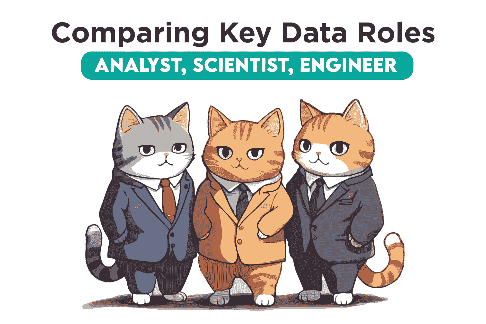
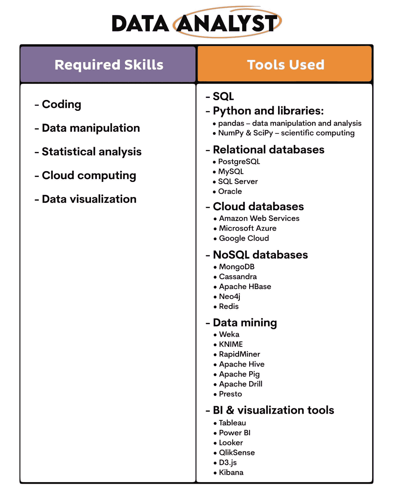
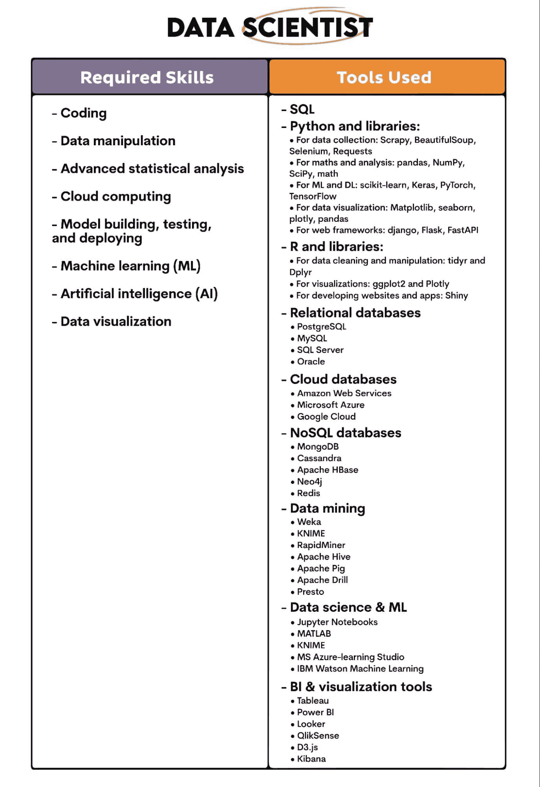
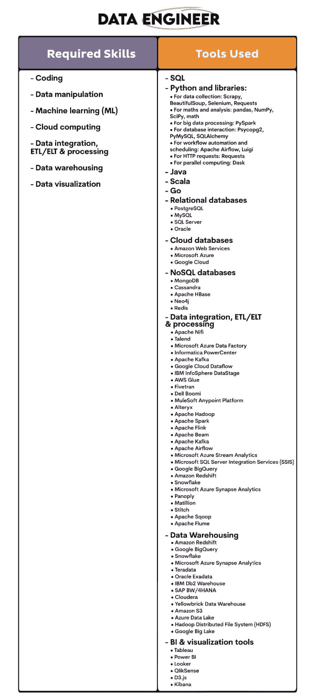
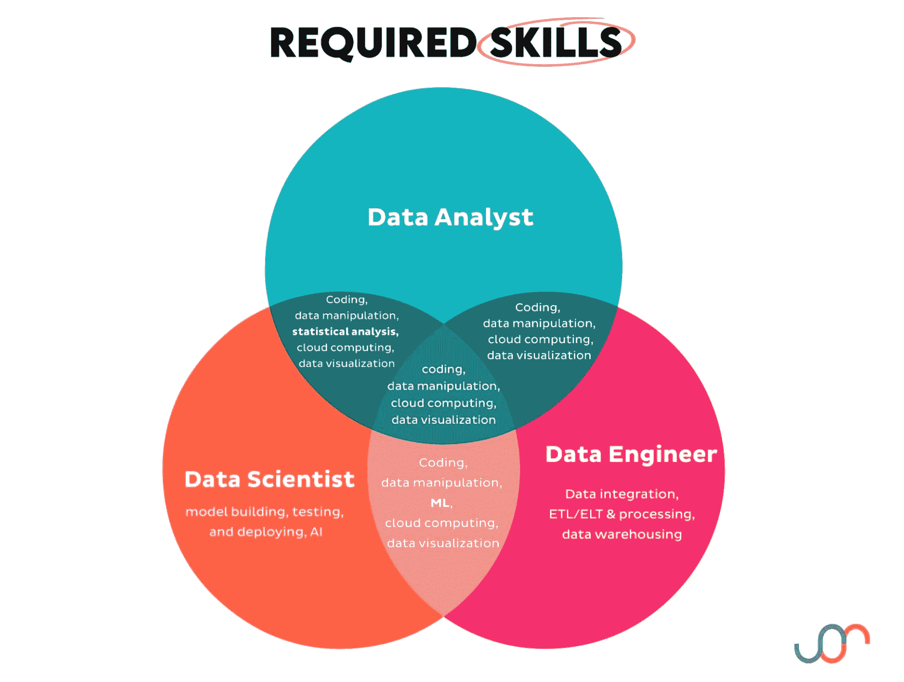
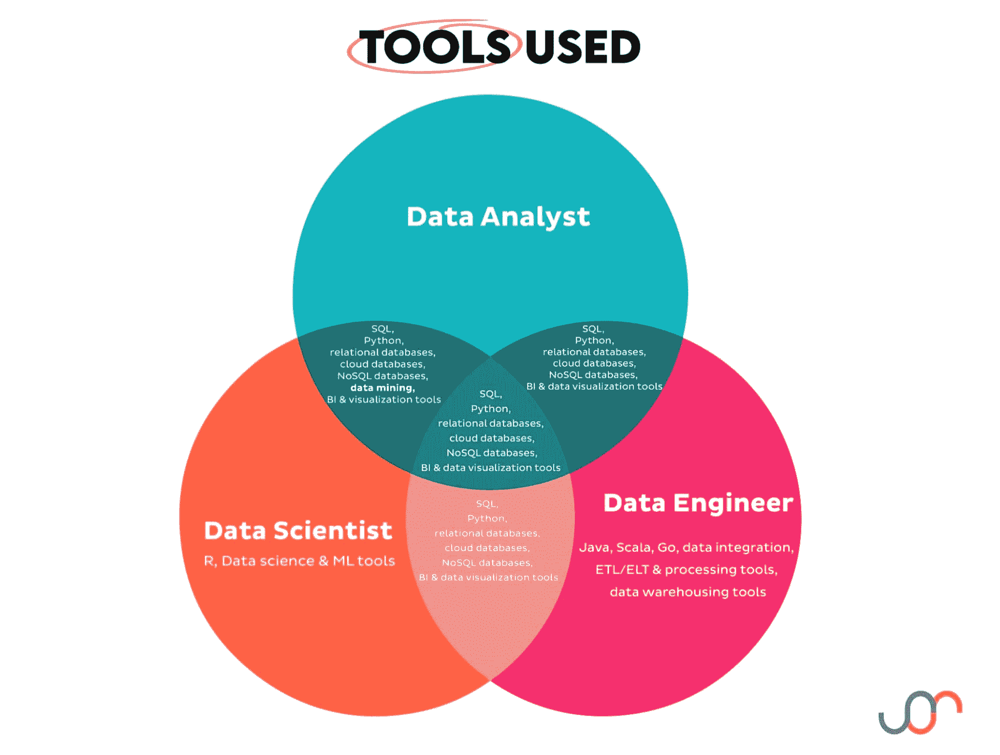

# 导航数据科学职位标题：数据分析师 vs. 数据科学家 vs. 数据工程师

> 原文：[`www.kdnuggets.com/navigating-data-science-job-titles-data-analyst-vs-data-scientist-vs-data-engineer`](https://www.kdnuggets.com/navigating-data-science-job-titles-data-analyst-vs-data-scientist-vs-data-engineer)

“导航”似乎是合适的词汇。数据科学有时可能像一片狂野的海洋，每隔几分钟就会出现一个新的职位名称或专业化方向。谢谢你，数据科学。我们感激你充满活力和狂野，但我们该如何应对呢？

* * *

## 我们的三大课程推荐

 1\. [谷歌网络安全证书](https://www.kdnuggets.com/google-cybersecurity) - 快速开启网络安全职业之路。

 2\. [谷歌数据分析专业证书](https://www.kdnuggets.com/google-data-analytics) - 提升你的数据分析技能

 3\. [谷歌 IT 支持专业证书](https://www.kdnuggets.com/google-itsupport) - 支持你的组织的 IT 需求

* * *

首先，让我们先搞清楚基础。当我说数据科学职位时，我指的是更广泛的数据科学，包括所有的数据相关职位。对我来说，所有这些都是[数据科学职位标题](https://www.stratascratch.com/blog/14-different-data-science-job-titles/?utm_source=Blog&utm_medium=click&utm_campaign=kdn+data+science+job+titles)。

其次，数据分析师、数据科学家和数据工程师不再是新兴职位了。但它们仍然会引起一些关于谁做什么的困惑。这些职位之间有一些轻微的重叠，这并没有帮助。

许多公司在只有一个数据团队成员时甚至会让情况更糟。是的，初创公司，我在看着你们呢！

不，数据分析师、数据科学家和数据工程师并不是相同的工作！谁会想到呢？

虽然这些职位有不同的专业领域和重点，但它们都朝着同一个目标努力，作为公司内部数据团队的一部分。

# 为什么数据角色至关重要

每家公司都看到数据的价值，并利用数据团队来提取这些价值。通常，大多数公司都尝试实现五个常见的目标。

## 1\. 明智决策

数据使公司不再盲目决策，依赖决策者的商业直觉（即：运气）。随着技术的进步，数据的多样性和使用可能性增加了。

数据科学利用数据提供洞见，以指导战略和决策。

## 2\. 改善客户体验

公司必须以客户为导向，因为这就是它们的资金来源。数据科学使公司能够分析客户行为和反馈。这使企业能够根据客户的需求量身定制其产品和服务，并预测客户的需求。

## 3\. 操作效率

虽然他们希望从客户那里赚取尽可能多的钱，但企业也希望以最有效的方式做到这一点。阅读：以最低成本完成。数据科学可以帮助实现这一目标。它可以自动化和加速任务，优化它们，并发现瓶颈。简而言之，就是处理业务的成本问题。

## 4\. 创新与竞争力

数据科学通过识别和预测客户需求、行业趋势、经济变化等来推动创新。这里的创新可以指现有或新产品、市场营销和销售策略以及制造过程，但不限于此。

## 5\. 风险管理

商业是一项有风险的，呃，业务。数据科学帮助识别、评估和管理公司的潜在风险。

# 数据科学职位名称

除非我们对每个职位有清晰的定义，否则无法分析职位名称之间的差异。让我们从这里开始，然后再讨论它们的职责、技能、使用的工具和职业发展路径。

## 数据分析师

**角色总结：** 数据分析师显而易见地分析数据。他们这样做是为了识别模式并提出可行的洞察。这些模式和洞察会以报告和仪表盘的形式呈现，使决策者能够做出明智的决策。

数据分析师主要负责描述性（发生了什么？）和诊断性（为什么发生？）的数据分析。

**主要职责：**

+   **数据清洗：** 通过标准化数据、改变数据格式以及处理重复项、缺失值和数据不一致性，使数据准备好进行分析。

+   **数据分析：** 使用统计方法来理解数据中的趋势、模式和洞察。

+   **数据可视化和报告：** 通过报告、数据可视化和仪表盘传达数据分析结果。

**关键技能和工具：** 主要技能和工具可以从角色描述中得出。

**职业发展路径：** 数据分析师可以晋升到更高级的分析师角色。随着经验的增加和额外教育的完成，他们可以转型为专业角色，如统计师、业务分析师，甚至数据科学家。

## 数据科学家

**角色总结：** 数据科学家也分析数据，但在更高级的层面。他们使用统计模型和机器学习算法来确定未来事件的可能性。这告诉我们，他们与数据分析师不同，关注预测性（会发生什么？）和规范性（应该做什么？）数据分析。

**主要职责：**

+   **高级分析：** 使用先进的统计技术从数据中提取洞见。

+   **机器学习：** 实施机器学习算法，从现有数据中学习。

+   **预测建模：** 构建和部署模型以预测实际和新数据中的未来事件。

这些主要职责建立在数据分析师所做的相同工作基础上。数据科学家也不能离开**数据清理**和**数据可视化**。

**关键技能和工具：** 以下是成为数据科学家所需的技能和工具。你会看到它们与数据分析师有一些重叠。

**职业发展路径：** 数据科学家从初级数据科学家开始，可以晋升为高级数据科学家、首席数据科学家和数据科学总监。他们还可以朝其他方向发展，如成为人工智能专家、机器学习工程师或计算机与信息研究科学家。

## 数据工程师

**角色概述：** 数据工程师构建数据系统，以便收集、存储和传输数据。他们确保数据的可用性、质量和可分析性（这是个词吗？）对所有数据用户而言。

**主要职责：**

+   **数据架构：** 根据数据架构师设想的设计构建数据系统。

+   **数据管道：** 构建系统，使数据能够从多个数据源流向数据库、数据仓库和数据湖，并为其他数据用户使用做好准备。

+   **确保数据质量：** 识别数据中的错误和不一致，删除它们，并提高数据的准确性和可靠性。

是的，数据工程师专注于这些任务。但他们也无法避免**数据清理**和**数据可视化**。

**关键技能和工具：** 这是数据工程师所使用的技能和工具。

**职业发展路径：** 数据工程师的职业可以晋升为高级数据工程师或数据架构师。他们也可以专注于大数据、机器学习或商业智能等领域。

# 数据分析师、数据科学家和数据工程师的维恩图

我们已经看到了这三个职位之间的区别。在这个过程中，我们还注意到这些职位之间在所需技能方面有一些重叠。

为了快速了解，这些可以通过维恩图进行展示。

你可以看到这三个职位共享的技能有：

1.  编程

1.  数据处理

1.  云计算

1.  数据可视化

额外的技能在两个职位之间共享，并加以突出显示。

数据分析师没有任何独特的技能；其他职位在某种程度上也需要这些技能。

数据科学家独有的技能有：

1.  模型构建、测试和部署

1.  AI

数据工程师特有的技能有：

1.  数据集成、ETL/ELT 和处理

1.  数据仓储

现在让我们使用相同的可视化工具展示这些职位使用的工具。

图像显示所有三个职位共享这些工具：

1.  SQL

1.  Python

1.  关系数据库

1.  云数据库

1.  NoSQL 数据库

1.  BI 和数据可视化工具

除此之外，两个职位之间共享的附加工具已被突出显示。

数据分析师使用的工具类型至少被另一个职位使用。虽然职位可能共享相同的工具类型，但工具的使用程度可能不同，或者同一类别中的具体工具可能有所不同。

数据科学家特有的工具有：

1.  R

1.  数据科学和机器学习工具

数据工程师特有的工具有：

1.  Java

1.  Scala

1.  Go

1.  数据集成、ETL/ELT 和处理工具

1.  数据仓储工具

# 弥合差距：合作是关键

我们看到每个角色都有其独特的职责和使用的工具。三者之间也有一些重叠。这表明这些职位并不是完全不同的世界，数据分析师、数据科学家和数据工程师在数据团队中的合作至关重要。

数据分析师和数据科学家都依赖于基础设施和高质量的干净、组织良好的数据。另一方面，数据工程师在构建数据架构和提供数据时必须与数据分析师和数据科学家合作——因为他们是数据用户。

数据科学家通常需要与数据分析师合作，以更好地理解业务背景。

# 结论：选择你的路径

数据分析师、数据科学家和数据工程师之间的差异和相似性现在应该更加清晰。

总结：

+   如果你喜欢从数据中获取见解并传达它们，数据分析可能是你的路径。

+   如果构建预测模型和使用机器学习算法让你兴奋，考虑数据科学。

+   如果你觉得构建数据架构和确保数据流的规律性会让你感到愉悦，那么数据工程可能是正确的选择。

如果你想了解更多，请参考有关[数据工程师和数据科学家](https://www.stratascratch.com/blog/data-engineer-vs-data-scientist-similarities-and-differences/?utm_source=Blog&utm_medium=click&utm_campaign=kdn+data+science+job+titles)以及[数据分析师和数据科学家](https://www.stratascratch.com/blog/7-differences-between-a-data-analyst-vs-a-data-scientist/?utm_source=Blog&utm_medium=click&utm_campaign=kdn+data+science+job+titles)的更多细节。

****[内特·罗西迪](https://twitter.com/StrataScratch)****是一名数据科学家，专注于产品战略。他还是一名兼职教授，教授分析课程，并且是 StrataScratch 的创始人，这是一个帮助数据科学家通过真实的面试问题准备面试的平台。内特撰写有关职业市场的最新趋势，提供面试建议，分享数据科学项目，并覆盖所有 SQL 相关内容。

### 更多相关内容

+   [成功应对初级数据科学职位面试的技巧](https://www.kdnuggets.com/tips-for-successfully-navigating-beginner-data-science-job-interviews)

+   [更多成功应对初级数据科学职位面试的技巧](https://www.kdnuggets.com/more-tips-for-successfully-navigating-beginner-data-science-job-interviews)

+   [数据科学家与数据分析师与数据工程师](https://www.kdnuggets.com/2022/01/data-scientist-data-analyst-data-engineer.html)

+   [数据革命的导航：探索蓬勃发展的数据科学和机器学习趋势](https://www.kdnuggets.com/navigating-the-data-revolution-exploring-the-booming-trends-in-data-science-and-machine-learning)

+   [导航你的数据科学职业：从学习到赚钱](https://www.kdnuggets.com/navigating-your-data-science-career-from-learning-to-earning)

+   [数据分析中的职位趋势：用于职位趋势分析的自然语言处理](https://www.kdnuggets.com/job-trends-in-data-analytics-nlp-for-job-trend-analysis)
