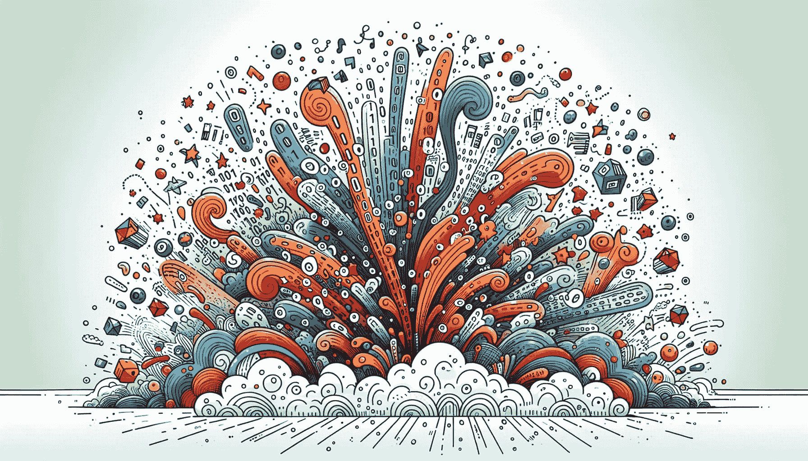
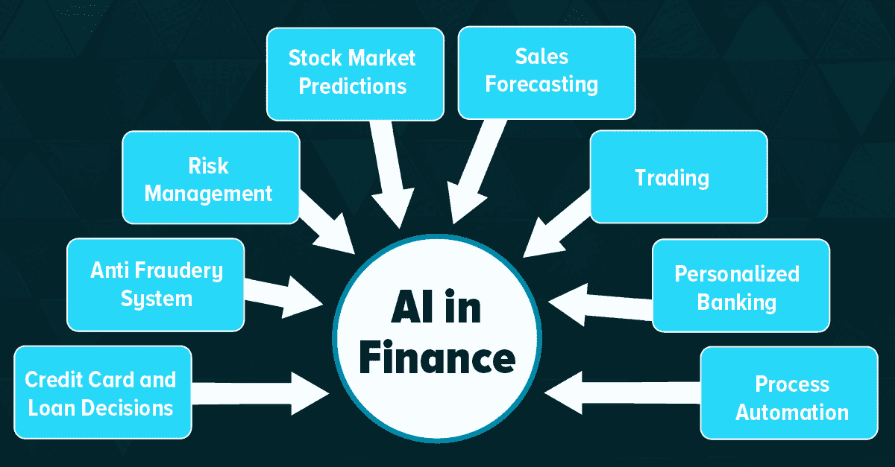
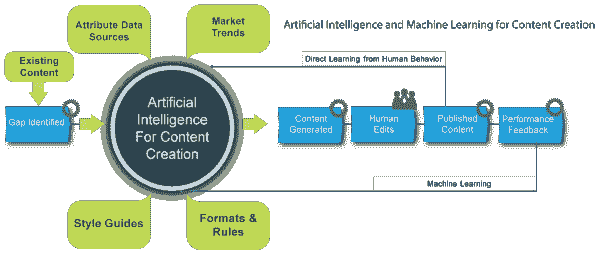
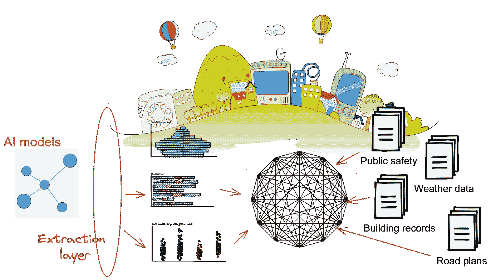

# 数据革命的导航：探索数据科学和机器学习中的蓬勃趋势

> 原文：[`www.kdnuggets.com/navigating-the-data-revolution-exploring-the-booming-trends-in-data-science-and-machine-learning`](https://www.kdnuggets.com/navigating-the-data-revolution-exploring-the-booming-trends-in-data-science-and-machine-learning)

图片由 DALLE-3 生成

在不断发展的技术领域，数据革命作为一种强大的力量，重新塑造了行业、经济和社会规范。数据科学和机器学习是这一变革浪潮的核心，作为创新的关键催化剂。它们推动我们进入一个问题解决超越单纯人类认知的时代，成为人类智慧与智能机器之间的协作舞蹈。本文将进行全面的探索，深入挖掘数据科学和机器学习中的新兴趋势，揭示那些引领我们走向数据驱动未来的关键发展。

* * *

## 我们的前三大课程推荐

 1\. [谷歌网络安全证书](https://www.kdnuggets.com/google-cybersecurity) - 快速进入网络安全职业生涯

 2\. [谷歌数据分析专业证书](https://www.kdnuggets.com/google-data-analytics) - 提升你的数据分析技能

 3\. [谷歌 IT 支持专业证书](https://www.kdnuggets.com/google-itsupport) - 支持你的组织 IT

* * *

# AI 驱动的自动化：用智能系统改造行业

数据科学和机器学习中的一个重要趋势是将人工智能（AI）融入自动化。各行各业都在利用机器学习算法来简化日常任务、优化流程并提高效率。无论是在制造业、医疗保健、金融还是物流行业，AI 驱动的自动化浪潮正在根本改变企业的运营格局。这一转变降低了成本，提高了整体生产力，标志着企业在日常运作中迈出了革命性的一步。

## 使用案例

1.  **金融：**

在金融领域，自动交易系统已成为中心，利用机器学习的力量来分析市场趋势并实时执行交易。这是将技术深度融合到动态的金融市场中，开启了一个效率和数据驱动决策的新纪元。

图片来自 [AISmartz](https://www.aismartz.com/blog/use-cases-of-ai-in-the-finance-sector/)

1.  **医疗保健：**

在医疗保健领域，机器学习算法的惊人能力正逐步进入关键角色。这些算法在诊断中提供帮助，提供关于患者结果的预测分析见解，甚至有助于机器人手术的精准度。这是技术与医学的**卓越融合**，正在重新塑造患者护理的格局。

# 自然语言处理（NLP）的指数增长

自然语言处理（NLP）在机器学习的广阔领域中占据了中心位置。得益于深度学习模型如 GPT-3 的进步，机器正在快速进化，展现出解码和生成模仿人类表达的语言的非凡能力。这一变革趋势正在重新塑造我们与技术的互动方式，从聊天机器人和虚拟助手的直观回应，到语言翻译和内容创作的无缝复杂性。机器理解和响应自然语言的新能力不仅重新定义了我们的沟通格局，还开辟了各种领域的全新通道，以提升可及性。

## 用例

1.  **内容生成：**

像 GPT-3 这样的模型通过生成类似人类语言的文本，改变了内容创作和写作行业的格局。他们的影响力显著，引领了人工智能与作者合作，共同创作引人入胜且连贯的内容的新时代。

图片来自 [AnalyticsVidhya](https://www.analyticsvidhya.com/blog/2023/03/ai-content-creation/)

1.  **聊天机器人和虚拟助手：**

自然语言处理（NLP）在 Siri 和虚拟助手如 Alexa 的功能中扮演了关键角色。这是它们理解和响应我们日常语言查询的神奇之处，使互动更加人性化和直观。

1.  **语言翻译：**

在语言翻译中，Google 翻译依赖于自然语言处理（NLP）的精妙之处，以提供准确无误的多语言翻译。这种高超的技术应用使跨语言沟通成为可能。

# 伦理 AI 和负责任的数据科学实践

在不断发展的决策制定领域中，数据的关键作用不容低估。越来越受到关注的是人工智能和数据科学中的伦理考量需求。在机器学习模型的开发和部署阶段，伦理原则作为核心要素的认识显著上升。诸如偏见、公平、透明度和问责制等问题已成为讨论的重点，塑造了负责任的数据科学实践的叙述。组织正在积极拥抱这一伦理转变，采纳寻求在创新与伦理考量之间取得微妙平衡的框架和指南，引导数据世界迈向一个更具良知的时代。

## 使用案例

1.  **面部识别：**

与面部识别技术相关的伦理环境十分复杂，主要因为系统中潜在的偏见。这促使了对负责任和谨慎部署的迫切需求，因为偏见面部识别的后果可能对隐私、安全和社会公正产生深远影响。

1.  **信用评分：**

在信用评分中运用机器学习需要细致考虑，因为所涉及的模型必须精心构建，以减少任何潜在的歧视性做法。这种审慎的做法对于确保贷款实践中的公平和公正至关重要，认识到这些模型对个人财务机会的重大影响。

# 边缘计算和去中心化机器学习

物联网（IoT）设备的广泛采用引发了网络边缘数据生成的显著增长。一种获得显著关注的趋势是将边缘计算与去中心化机器学习相结合，旨在处理靠近数据源的数据。这一战略举措有望减少延迟并优化带宽使用。其相关性在自动驾驶汽车、智慧城市和工业物联网等领域尤为突出，这些领域中瞬间决策至关重要。将机器学习模型集成到边缘设备中对于推动智能且高度响应实时需求的系统具有重要意义。

## 使用案例

1.  **自动驾驶汽车：**

在自动驾驶汽车领域，边缘计算已被证明具有变革性。通过直接处理来自传感器的数据，使这些车辆能够快速做出决策，增强了它们在道路上灵活导航的能力，并确保了对其安全和高效操作至关重要的响应水平。

1.  **智慧城市：**

将去中心化的机器学习融入智慧城市应用标志着一个重要的进步。这一创新通过来自各种传感器的实时数据分析，提供及时的洞察，帮助城市提高整体效率，优化决策和资源分配。这展示了技术无缝集成以创建更智能、更响应的城市环境。

图片来源于[TowardsDataScience](https://towardsdatascience.com/how-ai-can-help-smart-city-initiatives-f83484891343)

# 跨学科合作与混合技能组合

数据科学和机器学习的领域正在超越传统界限，发展成为一个跨学科的领域。专家们来自不同背景，能够无缝合作，解决复杂问题的趋势越来越明显。对混合技能组合的需求不断增加，这些技能组合融合了数据科学的能力、领域特定知识和有效沟通。在这个互联的数据生态系统中，能够弥合技术复杂性与非技术利益相关者之间差距的专业人士正变得越来越宝贵。

## 用例

1.  **医疗分析：**

在复杂的医疗领域，数据科学家与医疗专业人士之间展开了动态合作。他们共同筛选大量的患者数据，运用综合专业知识获得宝贵的洞察，提升治疗效果，迎来个性化和有效医疗解决方案的新纪元。

1.  **金融和数据分析：**

在金融与数据科学的交汇点，具有双重专业知识的专业人士联合合作。他们将自己的知识应用于构建预测模型，深入分析市场趋势的复杂图景，体现了金融敏锐性与数据驱动洞察的和谐融合。

# 总结

在数据科学和机器学习的推动下，正在进行的数据革命从根本上重塑我们的日常生活和职业领域。无论是人工智能驱动的自动化的出现，还是对伦理考量的日益重视，或是跨学科方法的协作，这些趋势都为这些领域动态而不断发展的本质提供了细致的视角。成功应对这场革命需要坚守不变的承诺，跟上发展步伐，拥抱负责任的实践，并培养持续学习的文化。展望未来，数据科学与机器学习的融合有望揭示新的可能性，持续推动各行各业的创新。

**[Aryan Garg](https://www.linkedin.com/in/aryan-garg-1bbb791a3/)** 是一名 B.Tech.电气工程学生，目前处于本科最后一年。他的兴趣在于网页开发和机器学习。他已经追随这一兴趣，并渴望在这些方向上进一步发展。

### 相关阅读

+   [探索最新的人工智能/深度学习趋势：从元宇宙到量子计算](https://www.kdnuggets.com/2023/07/exploring-latest-trends-aidl-metaverse-quantum-computing.html)

+   [5 个关键的数据科学趋势与分析趋势](https://www.kdnuggets.com/2022/08/5-key-data-science-trends-analytics-trends.html)

+   [AIoT 革命：人工智能与物联网如何改变我们的世界](https://www.kdnuggets.com/2022/07/aiot-revolution-ai-iot-transforming-world.html)

+   [KDnuggets 新闻，7 月 27 日：AIoT 革命：人工智能与物联网如何…](https://www.kdnuggets.com/2022/n30.html)

+   [导航数据科学职业生涯：从学习到赚钱](https://www.kdnuggets.com/navigating-your-data-science-career-from-learning-to-earning)

+   [导航数据科学职位头衔：数据分析师与数据科学家…](https://www.kdnuggets.com/navigating-data-science-job-titles-data-analyst-vs-data-scientist-vs-data-engineer)
