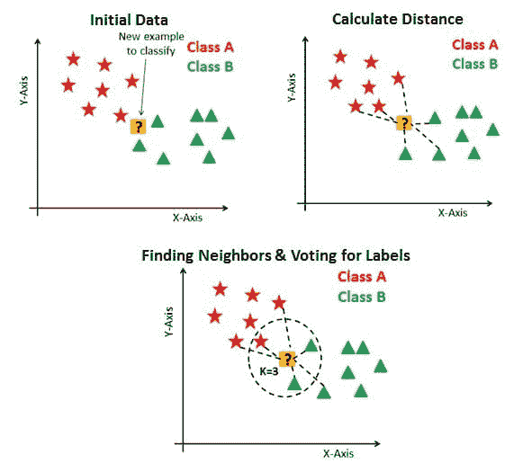
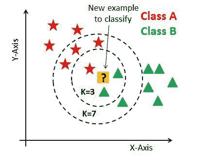
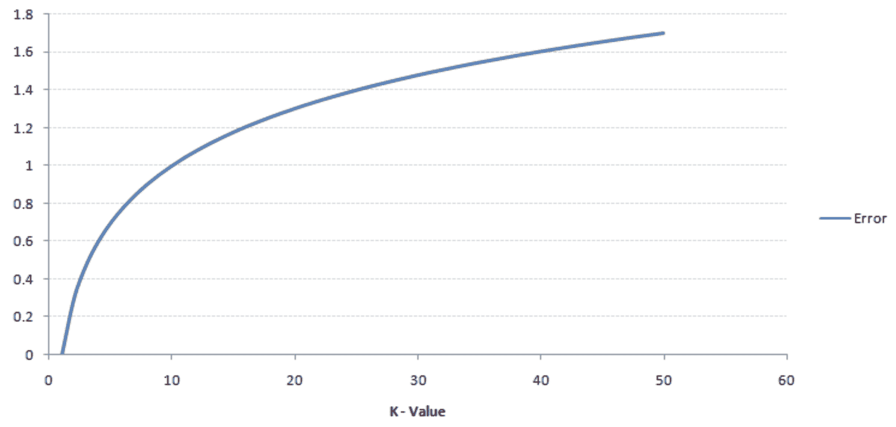
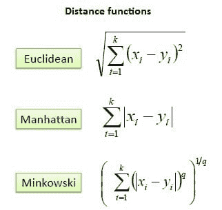
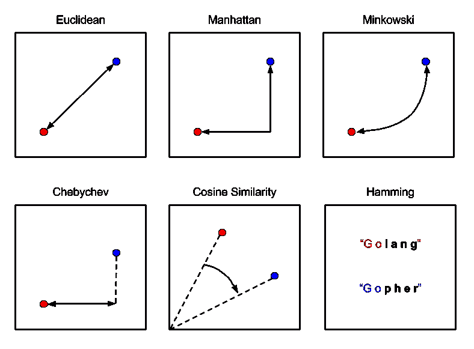
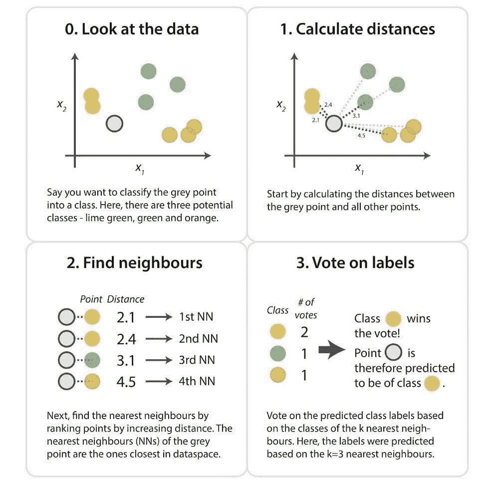
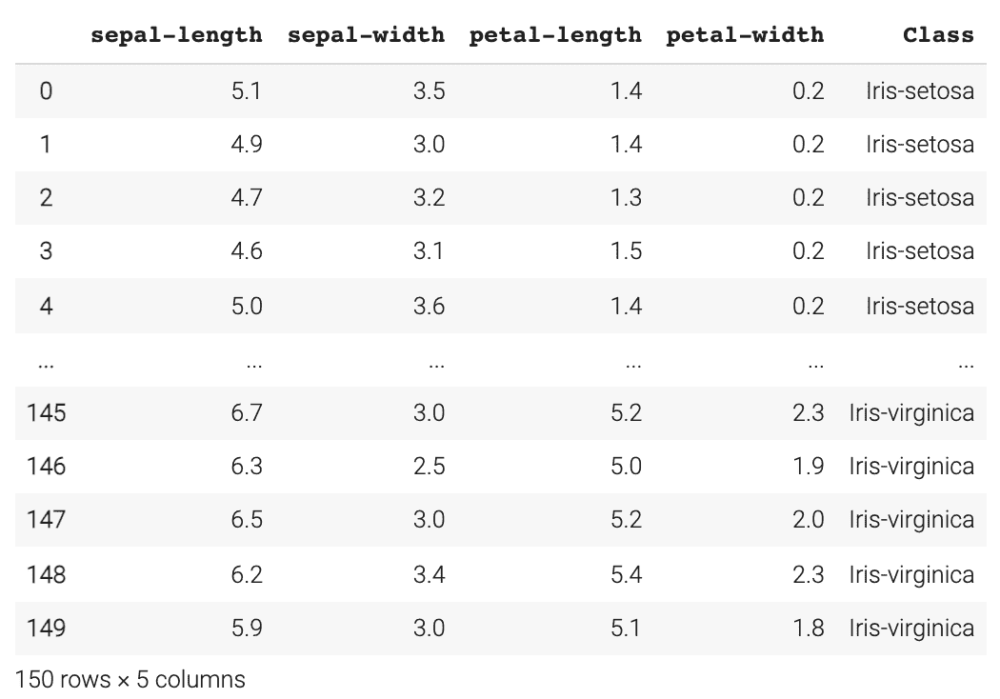
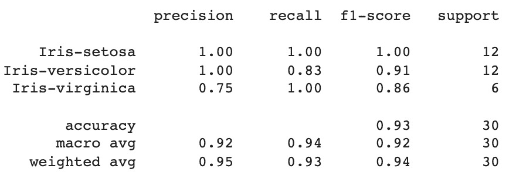
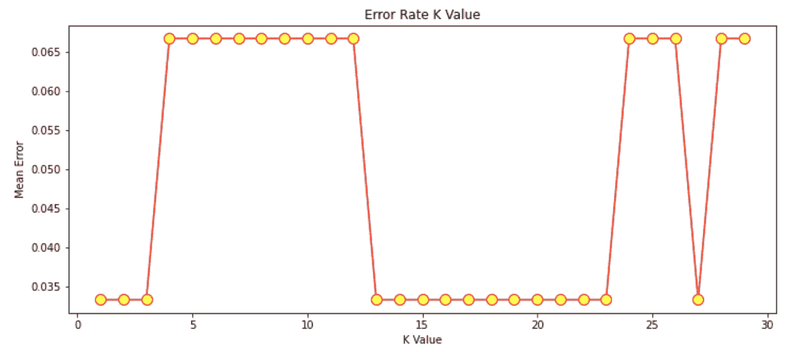

# 分类的最近邻

> 原文：[`www.kdnuggets.com/2022/04/nearest-neighbors-classification.html`](https://www.kdnuggets.com/2022/04/nearest-neighbors-classification.html)

# K-最近邻

**K-最近邻**（KNN）是一种监督学习机器学习算法，用于回归和分类任务。

* * *

## 我们的前 3 个课程推荐

 1\. [谷歌网络安全证书](https://www.kdnuggets.com/google-cybersecurity) - 快速进入网络安全职业生涯。

 2\. [谷歌数据分析专业证书](https://www.kdnuggets.com/google-data-analytics) - 提升你的数据分析技能

 3\. [谷歌 IT 支持专业证书](https://www.kdnuggets.com/google-itsupport) - 支持你的组织的 IT 需求

* * *

KNN 用于基于当前训练数据点的特征对测试数据集进行预测。这是通过计算测试数据与训练数据之间的距离来完成的，假设相似的事物在较近的距离内存在。

该算法将存储学习到的数据，使其在预测和分类新数据点时更为有效。当输入一个新数据点时，KNN 算法将学习其特征。然后，它会将新数据点放置在与具有相同特征或特征的当前训练数据点更接近的位置。

# KNN 中的 ‘k’ 是什么？

KNN 中的 ‘K’ 是一个参数，表示最近邻居的数量。K 是一个正整数，通常值较小，建议为奇数。

通俗地说，K 值为数据点创建了一个环境。这使得分配数据点所属的类别变得更加容易。

以下示例显示了 3 个图表。第一个图表，“初始数据”是一个将数据点绘制并分类到各个类别中的图表，并且有一个新的示例需要分类。在“计算距离”图表中，计算了新示例数据点到最近训练数据点的距离。然而，这仍然不能对新示例数据点进行分类。因此，使用 k 值，本质上创建了一个邻域，我们可以在其中对新示例数据点进行分类。

我们会说 k=3，新数据点将属于 B 类，因为与 A 类相比，更多的训练过的 B 类数据点具有与新数据点相似的特征。



来源：[datacamp.com](https://www.datacamp.com/community/tutorials/k-nearest-neighbor-classification-scikit-learn)

如果我们将 k 值增加到 7，我们将看到新数据点将属于 A 类，因为与 B 类相比，更多的训练过的 A 类数据点具有与新数据点相似的特征。



来源: [datacamp.com](https://www.datacamp.com/community/tutorials/k-nearest-neighbor-classification-scikit-learn)

k 值通常是一个较小的数字，因为随着 k 值的增加，误差率也会增加。下图展示了这一点：



来源: [analyticsvidhya](https://www.analyticsvidhya.com/wp-content/uploads/2014/10/training-error.png)

然而，如果 k 值较小，则会导致低偏差但高方差，导致模型过拟合。

还建议 k 值是奇数。这是因为如果我们尝试对一个新数据点进行分类，而类别/类的数量只有偶数（例如，A 类和 B 类），可能会产生不准确的结果。因此，强烈建议选择一个奇数的 K 值以避免平局。

# 计算距离

KNN 通过计算数据点之间的距离来对新数据点进行分类。在 KNN 中，计算这种距离的最常见方法是欧几里得距离、曼哈顿距离和闵可夫斯基距离。

**欧几里得距离**是使用两点之间的线段长度来表示的距离。欧几里得距离的公式是新数据点（x）与现有已训练数据点（y）之间差异平方和的平方根。

**曼哈顿距离**是两点之间的距离，是它们的笛卡尔坐标的绝对差值的总和。曼哈顿距离的公式是新数据点（x）与现有已训练数据点（y）之间的长度总和，使用坐标轴上的线段。

**闵可夫斯基距离**是规范化向量空间中两点之间的距离，是欧几里得距离和曼哈顿距离的一般化。在闵可夫斯基距离的公式中，当 p=2 时，我们得到欧几里得距离，也称为 L2 距离。当 p=1 时，我们得到曼哈顿距离，也称为 L1 距离、城市街区距离和 LASSO。

下图是公式：



下图解释了三者之间的区别：



来源: [Packt 订阅](https://subscription.packtpub.com/book/big_data_and_business_intelligence/9781785882104/6/ch06lvl1sec40/measuring-distance-or-similarity)

# KNN 算法如何工作？

以下是 KNN 算法工作的步骤：

1.  加载你的数据集

1.  选择一个 k 值。建议选择奇数以避免平局。

1.  计算新数据点与邻近的已训练数据点之间的距离。

1.  找到与新数据点最近的 K 个邻居

以下是一个概述这些步骤的图像：



来源: kdnuggets.com

# KNN 算法分类实现

我将通过一个使用鸢尾花数据集进行分类任务的 KNN 算法示例来演示。

## 导入库

```py
import numpy as np
import matplotlib.pyplot as plt
import pandas as pd
```

## 载入鸢尾花数据集

```py
url = "https://archive.ics.uci.edu/ml/machine-learning-databases/iris/iris.data"

# Assign the column namesnames = ['sepal-length', 'sepal-width', 'petal-length', 'petal-width', 'Class']

# Read the dataset in
dataset = pd.read_csv(url, names=names)
dataset
```



## 数据预处理

我们需要将数据集分成属性和标签。变量 X 将包含数据集的前四列，我们称之为属性；变量 y 将包含最后一列，我们称之为标签。

```py
X = dataset.iloc[:, :-1].values
y = dataset.iloc[:, 4].values
```

## 训练测试分离

在这一步中，我们将数据集分为训练集和测试集。这让我们了解算法在训练数据上的学习效果以及在测试数据上的表现。

```py
from sklearn.model_selection import train_test_split
X_train, X_test, y_train, y_test = train_test_split(X, y, test_size=0.20)
```

## 特征缩放

特征缩放是在进行预测之前对数据进行预处理的重要步骤。这种方法用于归一化数据的特征范围。

```py
from sklearn.preprocessing import StandardScaler
scaler = StandardScaler()
scaler.fit(X_train)

X_train = scaler.transform(X_train)
X_test = scaler.transform(X_test)
```

## 使用 KNN 进行预测

首先，我们需要从 sklearn.neighbors 库中导入 KNeighborsClassifier 类。然后选择我们的 k 值，在这个例子中，我选择了 7。请记住，强烈建议选择一个奇数值以避免出现平局。

```py
from sklearn.neighbors import KNeighborsClassifier
classifier = KNeighborsClassifier(n_neighbors=7)
classifier.fit(X_train, y_train)
```

然后我们开始对测试数据集进行预测。

```py
y_pred = classifier.predict(X_test)
```

**算法的准确率**

使用 sklearn.metrics，我们可以使用 classification_report 评估算法的准确性，查看精确率、召回率和 F1 分数。

```py
from sklearn.metrics import classification_report
print(classification_report(y_test, y_pred))
```

这是输出的样子：



从这里我们可以看到 KNN 算法对 30 个数据点进行了分类，精确率平均达到了 95%，召回率为 93%，F1 分数为 94%。

## 寻找合适的 k 值

在这个例子中，我选择了 k 值为 7。然而，如果我们想要检查最佳的 k 值是多少，我们可以生成一个显示不同 k 值和其产生的误差率的图表。

我将查看 k 值在 1 到 30 之间的情况。在每次迭代中，计算平均误差并将其添加到误差列表中。

```py
error = []
# Calculating the error rate for K-values between 1 and 30
for i in range(1, 30):
    knn = KNeighborsClassifier(n_neighbors=i)
    knn.fit(X_train, y_train)
    pred_i = knn.predict(X_test)
    error.append(np.mean(pred_i != y_test))
```

绘制 k 值与错误率图：

```py
plt.figure(figsize=(12, 5))
plt.plot(range(1, 30), error, color='red', marker='o',
        markerfacecolor='yellow', markersize=10)
plt.title('Error Rate K Value')
plt.xlabel('K Value')
plt.ylabel('Mean Error')
```

图的输出：



来源：作者图片

从这个图表中，我们可以看到产生平均误差为 0 的 k 值主要在 k 值为 13 到 23 之间。

# 摘要

KNN 是一个简单易用的算法，可用于回归和分类任务。K 值是一个参数，表示最近邻的数量。建议选择一个奇数作为 k 值。有不同的距离度量标准可用，但最常见的是欧氏距离、曼哈顿距离和闵可夫斯基距离。

**[尼莎·阿利亚](https://www.linkedin.com/in/nisha-arya-ahmed/)** 是一位数据科学家和自由职业技术作家。她特别感兴趣于提供数据科学职业建议或教程，以及围绕数据科学的理论知识。她还希望探索人工智能在延长人类寿命方面的不同方式。作为一个热衷学习者，她寻求拓宽自己的技术知识和写作技能，同时帮助引导他人。

### 相关话题

+   [从理论到实践：构建一个 k-最近邻分类器](https://www.kdnuggets.com/2023/06/theory-practice-building-knearest-neighbors-classifier.html)

+   [Scikit-learn 中的 K 最近邻](https://www.kdnuggets.com/2022/07/knearest-neighbors-scikitlearn.html)

+   [分类问题的更多性能评估指标](https://www.kdnuggets.com/2020/04/performance-evaluation-metrics-classification.html)

+   [使用 PyCaret 进行二分类介绍](https://www.kdnuggets.com/2021/12/introduction-binary-classification-pycaret.html)

+   [使用 HuggingFace 对 BERT 进行微调以进行推文分类](https://www.kdnuggets.com/2022/01/finetuning-bert-tweets-classification-ft-hugging-face.html)

+   [分类的机器学习算法](https://www.kdnuggets.com/2022/03/machine-learning-algorithms-classification.html)
