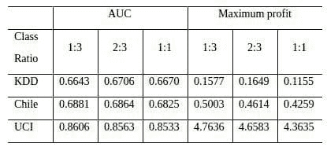

# 我们是否需要平衡采样？

> 原文：[`www.kdnuggets.com/2017/05/need-balanced-sampling.html`](https://www.kdnuggets.com/2017/05/need-balanced-sampling.html)

**作者：朱炳（四川大学）、巴特·贝森斯（鲁汶大学）& 塞佩·范登·布鲁克（鲁汶大学）。**

在许多实际分类任务中，如流失预测和欺诈检测，我们经常遇到类别不平衡问题，即一个类别的样本显著少于另一个类别。类别不平衡问题给标准分类学习算法带来了很大的挑战。大多数算法在不平衡数据集上往往更容易将少数类样本误分类为多数类样本。例如，当模型在一个少数类样本占比 1%的数据集上训练时，通过将所有样本都分类为多数类，可以简单地实现 99%的准确率。确实，学习不平衡数据集的问题被认为是数据挖掘研究中的十大挑战性问题之一。

* * *

## 我们的前三大课程推荐

 1\. [Google 网络安全证书](https://www.kdnuggets.com/google-cybersecurity) - 快速进入网络安全职业道路。

 2\. [Google 数据分析专业证书](https://www.kdnuggets.com/google-data-analytics) - 提升你的数据分析技能。

 3\. [Google IT 支持专业证书](https://www.kdnuggets.com/google-itsupport) - 为你的组织提供 IT 支持。

* * *

为了解决从不平衡数据集中学习的问题，近年来提出了许多解决方案。重采样方法试图通过重采样数据来解决问题，并作为预处理阶段。它们的使用假设与分类器无关，并且可以应用于任何学习算法。因此，重采样解决方案在实际应用中非常受欢迎。使用重采样时，一个重要的问题是我们是否真的需要一个完全平衡的数据集。我们的流失预测研究表明，平衡采样并非必要。

我们在实验中使用了来自电信行业的 11 个真实数据集。考虑了七种采样方法，包括随机过采样、随机欠采样、SMOTE 采样等。我们考虑了三种不同的类别比例设置：1:3、2:3 和 1:1（少数类与多数类）。实验中使用了四种基准分类器：逻辑回归、C4.5 决策树、支持向量机（SVM）和随机森林（RF），这些在流失预测中被广泛使用。下表显示了部分结果，使用了 5 × 2 交叉验证实验设置，其中每个条目表示不同分类器和采样方法下每个采样比例的平均性能。除了 AUC 衡量标准外，我们还考虑了最大利润衡量标准，它测量了保留活动产生的利润（Verbraken et al., 2013）。

表 1：来自电信行业的不平衡数据集的实验结果

正如表格所示，在两个数据集上，1:3 的比例效果最好，而 2:3 的比例在两个数据集上排名第一。平衡类别比例从未达到最佳位置。结果明确显示，采样后没有必要生成平衡的数据集，推荐使用不太平衡的策略（1:3），因为它的表现相对较好。完整的结果和更多讨论可以在我们最近发表的论文《不平衡学习中采样技术的基准测试》中找到，该论文发表于 JORS。

**参考文献：**

+   H. He, E. Garcia, “从不平衡数据中学习”，《IEEE 知识与数据工程学报》，2009，21(9)：1263-1284。

+   W. Verbeke, K. Dejaeger, D. Martens, J. Hur, B. Baesens, “电信行业流失预测的新见解：一种以利润驱动的数据挖掘方法”，《欧洲运筹学杂志》，2012，218(1)：211-229。

+   T. Verbraken, W. Verbeke, B. Baesens, “一种新颖的利润最大化度量用于衡量客户流失预测模型的分类性能”，《IEEE 知识与数据工程学报》，2013，25(5)，961-973，2013。

+   B. Zhu, B. Baesens, A. Backiel, S. vanden Broucke，“流失预测中不平衡学习的采样技术基准测试”，《运筹学学会杂志》，2017。

**[朱冰](http://www.datahoe.com)** 是中国四川大学商学院的副教授。他的主要研究兴趣包括流失预测和欺诈检测。

**[巴特·贝森斯](http://www.dataminingapps.com/dma_staff/bart-baesens/)** 是比利时鲁汶大学（KU Leuven）的大数据与分析学教授。他在大数据和分析方面进行了广泛的研究。他的研究成果已发表在知名国际期刊上，并在国际顶级会议上进行过展示。

**[塞佩·范登·布鲁克](http://www.dataminingapps.com/dma_staff/seppe-vanden-broucke/)** 现任比利时鲁汶大学（KU Leuven）决策科学与信息管理系助理教授。塞佩的研究兴趣包括商业数据挖掘与分析、机器学习、过程管理和过程挖掘。

**相关文章：**

+   构建预测流失模型的挑战

+   初学者指南：客户分群

+   在 CRISP-DM 中修复部署和迭代问题

### 更多关于此主题的内容

+   [如何为数据项目创建抽样计划](https://www.kdnuggets.com/2022/11/create-sampling-plan-data-project.html)

+   [我们不需要数据科学家，我们需要数据工程师](https://www.kdnuggets.com/2021/02/dont-need-data-scientists-need-data-engineers.html)

+   [朴素贝叶斯算法：您需要了解的一切](https://www.kdnuggets.com/2020/06/naive-bayes-algorithm-everything.html)

+   [在数据科学中需要多少数学知识？](https://www.kdnuggets.com/2020/06/math-data-science.html)

+   [数据科学最低要求：您需要了解的 10 个必要技能，以便开始…](https://www.kdnuggets.com/2020/10/data-science-minimum-10-essential-skills.html)

+   [成为数据工程师所需的 9 种技能](https://www.kdnuggets.com/2021/03/9-skills-become-data-engineer.html)
